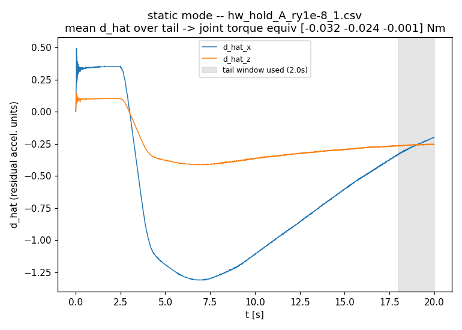
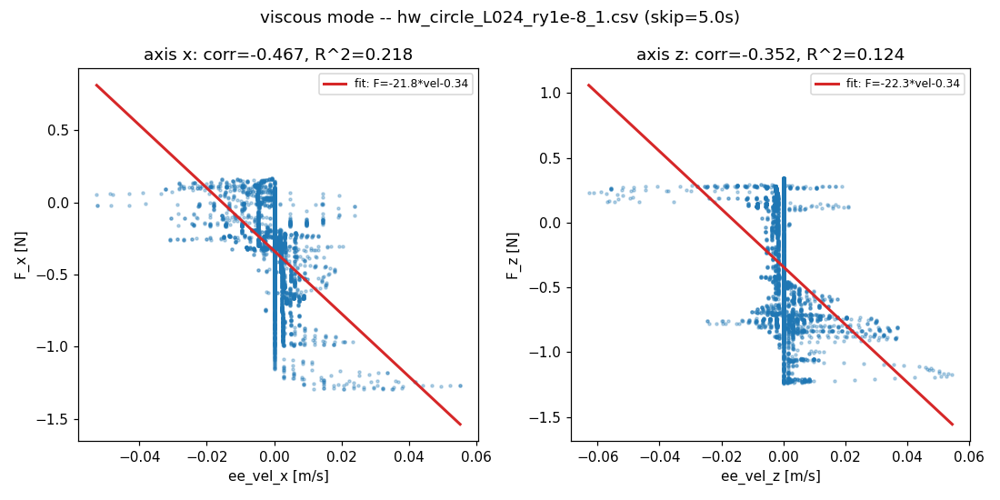
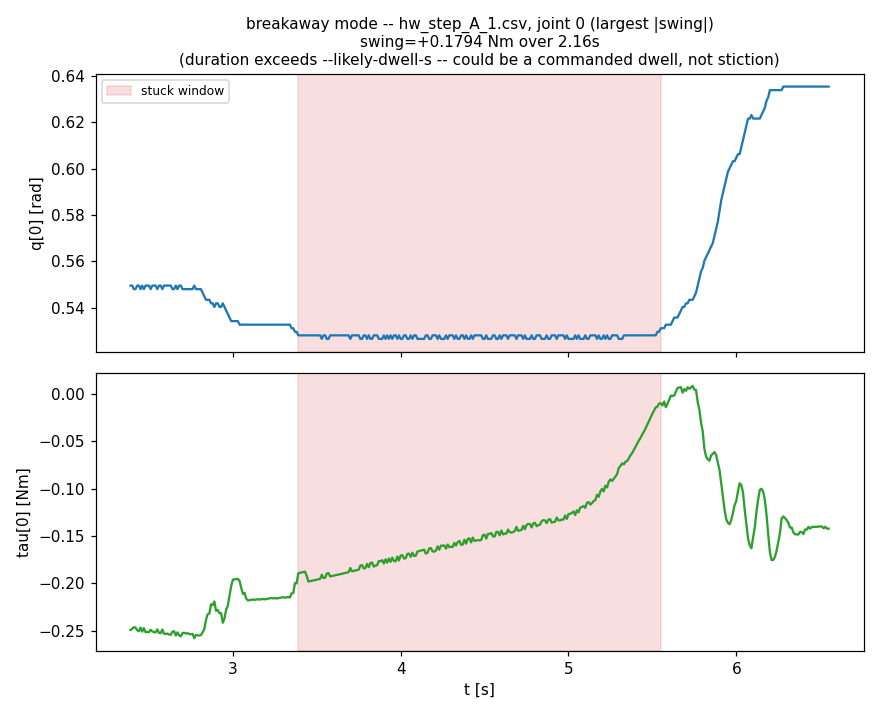
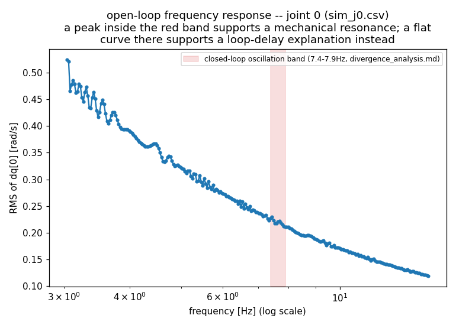
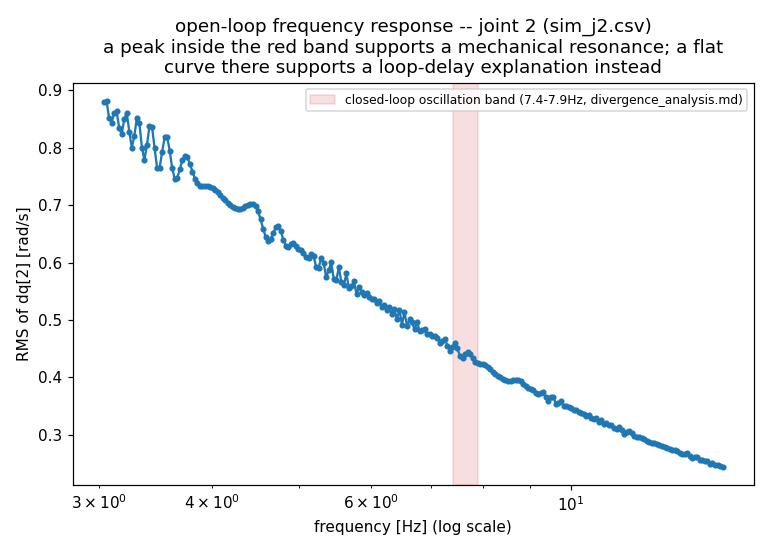
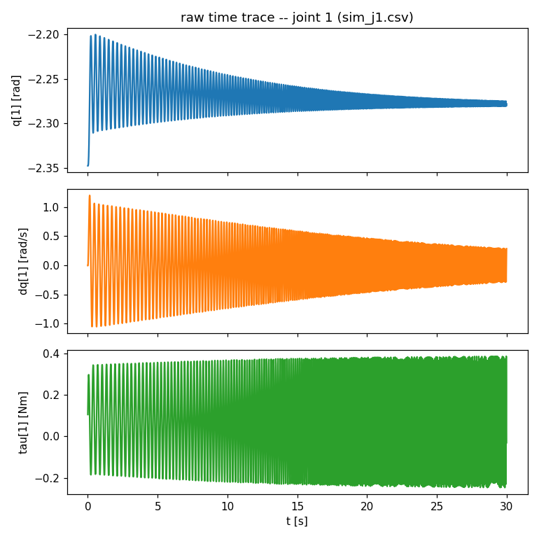

# Friction and chirp analysis

Two related, independently-run diagnostics on the real OpenManipulator-X, written up together because both exist to characterize what this project's dynamics model does NOT capture (`docs/01_concepts.md`: "the simulator has no friction model... the friction part of the story needs real hardware"), from two different angles:

- **Part 1 (friction, `tools/estimate_friction.py`)**: three PROXY friction estimates read off EXISTING closed-loop logs -- cheap, available now, but each filtered through the controller's own disturbance observer, not a clean measurement.
- **Part 2 (chirp, `tools/chirp_response.py`)**: an open-loop (no feedback at all) swept-sine torque diagnostic -- the one approach that COULD give a clean, joint-space, closed-loop-free measurement, including of friction, but whose real purpose here is distinguishing a genuine mechanical resonance from a closed-loop-delay effect.

Treat everything below as "here's what's been learned so far," not a friction model ready to drop into `lib/dynamics.py`, and not yet an answer to Part 2's resonance question.

---

# Part 1: Friction analysis

## 1.0 Principle and method: the friction model these estimates target, and how `d_hat` connects to it

The standard robotics friction model this project's dynamics has no term for (Coulomb + viscous, with a separate static/breakaway threshold $\tau_s$ while the joint isn't moving):

$$
\tau_{friction}(\dot q) = \tau_c \cdot \mathrm{sign}(\dot q) + b\,\dot q \quad \text{for } |\dot q| > 0
$$

$$
|\tau_{friction}| \le \tau_s \quad \text{for } \dot q = 0 \ \text{(stiction)}
$$

- $\tau_c$ -- Coulomb (kinetic) friction torque, opposes motion, roughly constant once moving.
- $b$ -- viscous friction coefficient, friction grows linearly with speed.
- $\tau_s$ -- static friction (stiction): while at rest, friction exactly cancels whatever torque is applied, UP TO this limit -- it's a constraint on what the joint can resist, not a fixed value. Motion begins only once the applied torque exceeds it. Usually $\tau_s \ge \tau_c$ (breakaway takes more torque than keeping something already moving).

None of $\tau_c$, $b$, $\tau_s$ appear anywhere in `lib/dynamics.py`. What this controller DOES have is a disturbance observer that estimates everything its own rigid-body model doesn't capture -- `lib/interaction_mpc.py`'s own docstring names friction explicitly as one of the things $\hat d$ is designed to lump together, with the controller's equilibrium condition being $u = -\hat d$ (`docs/01_concepts.md` section 3). $\hat d$ is a task-space RESIDUAL ACCELERATION (2D, x-z), not a torque, so every estimate below first converts it:

$$
F = \Lambda(q)\,\hat d \qquad \text{(task-space force [N])}
$$

$$
\tau_{eq} = J_{xz}(q)^T F \qquad \text{(joint-space torque equivalent [Nm])}
$$

$$
\Lambda(q) = \left(J_{xz}(q)\,M(q)^{-1} J_{xz}(q)^T + \lambda_{damp} I\right)^{-1}
$$

- $\Lambda(q)$ -- the operational-space (task-space) mass matrix, same quantity `run_hardware.py` computes every tick.
- $M(q)$ is the joint-space mass matrix INCLUDING the reflected-rotor armature correction (`dyn_armature_kg_m2`, see `docs/implementation_fix.md`'s Finding-4 entry) -- using the same $M(q)$ the controller itself uses is what makes $\tau_{eq}$ a fair read of what the controller's own observer believed, not a recomputation with a different model.
- $J_{xz}(q)$ is the 2x3 task-space (x-z rows only) Jacobian.

Each section below is a different way of asking what $\tau_{eq}$ (or, for breakaway, the raw logged $\tau$) says about $\tau_c$/$b$/$\tau_s$ -- none of them isolate friction cleanly from "everything else $\hat d$ is also carrying," which is the recurring caveat throughout Part 1.

## 1.1 Static (holding-residual) estimate

Hold-task steady-state $\hat d$, mapped through $\Lambda(q)$/$J^T$ into joint-torque units (§1.0's $F$/$\tau_{eq}$ equations). At $\dot q = 0$ and settled ($\ddot q = 0$ too), the friction model's stiction regime applies -- the controller's own residual IS (approximately) the friction torque it had to supply to stay put:

$$
\bar{\hat d} = \mathrm{mean}\big(\hat d \text{ over the last } t_{tail} \text{ seconds}\big)
\qquad\Longrightarrow\qquad
\tau_{eq} \approx \tau_{friction}(\dot q = 0)
$$

This is the torque the controller needed on top of its own gravity/Coriolis/mass-matrix model to hold position at zero velocity -- NOT the breakaway/stiction threshold $\tau_s$ itself (that needs motion to actually be attempted against it, see §1.3), and only "approximately" $\tau_c$ since $\hat d$ also carries any small gravity-model residual error, not friction alone.

| run | q_pos | mean d_hat (x, z) | \|F\| [N] | joint torque equiv [Nm] |
|---|---|---|---|---|
| `hw_hold_A_ry1e-8_1` | 124371 | (-0.26, -0.26) | 0.197 | [-0.032, -0.024, -0.001] |
| `hw_hold_A_ry1e-8_2` | 124371 | (-0.77, -0.40) | 0.537 | [-0.090, -0.054, +0.011] |
| `hw_hold_A_ry1e-8_3` | 124371 | (-0.91, -0.16) | 0.616 | [-0.100, -0.043, +0.033] |
| `hw_hold_re_1` | 11293.6 | (-0.35, -1.78) | 0.796 | [-0.083, -0.115, -0.054] |
| `hw_hold_re_2` | 11293.6 | (-0.56, +0.32) | 0.381 | [-0.049, -0.003, +0.038] |

All five land in the same **0.01-0.1 Nm per joint** range -- noisy and run-to-run variable (nearly 3x spread across repeats of the *same* config, `hw_hold_A_ry1e-8_1` vs `_3`), not a single clean number. That variability is itself informative: whatever this residual is capturing (friction, small gravity-model error, or both) is NOT simply "the same stiction constant every time" -- it depends on exactly where the arm settled and along what path.



`hw_hold_A_ry1e-8_1` plotted above: `d_hat_x` has clearly NOT reached a flat equilibrium even by the end of this 20s run -- it's still drifting through the shaded 2s tail window used for the estimate. This run's own number (and by extension, how much to trust any of the five above) is somewhat tail-window-dependent; a longer hold would likely give a cleaner read.

## 1.2 Viscous (velocity-correlated) estimate

Moving-task $\hat d$ converted to task-space force via $\Lambda(q)$ (computed per sample, not one fixed posture, via §1.0's $F$ equation) and correlated against $\dot x_{ee}$ (`ee_vel`), by axis. Kept in task space on purpose -- these logs don't record joint velocity, only $\dot x_{ee}$, and a pseudo-inverse projection into joint space would introduce a null-space ambiguity this controller's own posture term uses. Tests the viscous term of §1.0's model directly, in task space rather than joint space:

$$
F(t) \approx -b_{visc}\,\dot x_{ee}(t) + c
$$

$$
(b, c) = \mathrm{polyfit}\big(\dot x_{ee},\, F,\ \text{degree}=1\big)
\qquad
R^2 = \mathrm{corr}\big(F,\, \dot x_{ee}\big)^2
$$

$c$ absorbs everything velocity-independent (bias, stiction residue, model error -- it is NOT part of the viscous-friction model itself); $b$ should come out negative if this is really viscous friction ($b_{visc} = -b > 0$); $R^2$ is how much of $F$'s variance velocity actually explains.

| axis | corr(F, ee_vel) | R² | fit |
|---|---|---|---|
| x | -0.467 | 0.218 | F ≈ -21.8·vel - 0.34 N |
| z | -0.352 | 0.124 | F ≈ -22.3·vel - 0.34 N |



Both axes: the right **sign** (force opposes velocity, consistent with viscous friction) and a clearly nonzero slope -- but R² of 0.12-0.22 means velocity explains at most ~22% of `F`'s variance. The scatter plot shows why directly: there's a real downward trend, but also a wide, nearly-vertical band of points right around `vel≈0` with a large spread in `F` -- plausibly the circle's own curvature/direction-reversal points, not a friction effect at all (see the script's docstring). **This supports "there's probably a viscous-like term," not "here is its coefficient."**

## 1.3 Breakaway (stiction) events

Scans logged $q$ for a joint pinned within ~1 encoder tick (XM430-W350: $2\pi/4096$ rad, i.e. genuinely not moving, not sensor noise) for a sustained run, immediately followed by real motion. This is the most direct, least-filtered evidence of the three -- a real physical event (the actual $\tau$ commanded to the servo, not a controller-internal residual), and the only one of the three that directly tests §1.0's stiction regime rather than approximating it:

$$
\text{stuck:}\quad |q(t) - q(t_{start})| \le 1.5\,\delta_{tick}
\quad \text{for } t \in [t_{start}, t_{break})
$$

$$
\text{breakaway:}\quad |q(t_{break}) - q(t_{start})| > 3\,\delta_{tick}
\quad \text{(real motion resumes)}
$$

$$
\Delta\tau = \tau(t_{break}) - \tau(t_{start})
$$

$\Delta\tau$ is a proxy for $\tau_s$, NOT $\tau_s$ itself -- it only equals it if
$\tau(t_{start}) = 0$, which it generally isn't (gravity compensation and other joints'
coupling are already baked into $\tau(t_{start})$).



The largest event found in `hw_step_A_1.csv`: **joint 0 stuck for 2.16s (t=3.39-5.55s) while commanded torque ramped smoothly from -0.19 Nm to -0.01 Nm (a 0.179 Nm swing) before the joint broke free** and moved 0.1 rad in well under a second. The torque trace (bottom panel) shows no discontinuity anywhere in this window -- it's one continuous ramp from before the window starts to after it ends, which is exactly why this event is flagged `likely_dwell` (its total stuck duration exceeds `--likely-dwell-s`, matching the task's own `step_dwell_s=5.0`): the data genuinely cannot distinguish "the joint was commanded to hold still and then commanded to move, and happened to need 0.18 Nm of torque change to actually start moving" from "friction was holding it, and 0.18 Nm is roughly the breakaway threshold." Both descriptions fit the same trace.

Across the whole log (all 3 joints, `--likely-dwell-s 2.0`): 13 events on joint 0, 12 on joint 1, 17 on joint 2 -- most flagged `likely_dwell` (duration exceeds the task's own 5s dwell, so almost certainly just commanded holds, not stiction) or very short with a small swing (most likely measurement/control noise rather than a real stuck-then-broke-free event). A handful of short (<1s), larger-swing (0.02-0.04 Nm), *un*flagged events are the more credible stiction candidates, e.g. joint 2 at t=39.58-40.38s (swing +0.0154 Nm) -- an order of magnitude smaller than the flagged joint-0 event above, consistent with that one being mostly (or entirely) a commanded-dwell artifact rather than real stiction.

Running the same scan against `--backend sim` data (`configs/step.yaml`, 15s) finds **zero events on all three joints** -- expected, since sim has no stiction model at all, and a useful sanity check that this detector isn't just pattern-matching ordinary noise.

## Part 1 summary: what it does and does not establish

**Does establish**: real friction-like effects are present and roughly the sizes these three methods report (holding residual ~0.01-0.1 Nm/joint, a weak-but-real velocity-opposing term, and stiction-consistent torque swings up to ~0.15-0.18 Nm on short, un-flagged events) -- broadly consistent with the ~0.5 Nm breakaway figure `docs/01_concepts.md` already cites from an earlier, dedicated measurement (different joint, different test, same order of magnitude).

**Does NOT establish**: a trustworthy per-joint Coulomb/viscous friction MODEL. Every number above is a proxy filtered through this controller's own observer and its own assumptions -- none of it isolates friction from "everything else the model doesn't capture." The genuinely clean version needs Part 2's tool run for real, which is where this picks up.

---

# Part 2: Chirp analysis

## 2.0 Principle and method

### Why an open-loop test at all

Part 1's numbers are all filtered through the closed-loop controller and its disturbance observer -- useful, but nothing in Part 1 can separate "this is friction" from "this is whatever else $\hat d$ is also carrying." `tools/chirp_response.py` removes the controller from the picture entirely. It commands ONLY (same design as `tools/test_gravity_compensation.py`):

$$
\tau(t) = g_{scale}\, G(q) \;-\; b_{safety}\,\dot q \;+\; \tau_{chirp}(t) \quad \text{(one chosen joint only)}
$$

-- gravity compensation plus a small, KNOWN safety damping term plus the chirp itself. No position/velocity error feedback of any kind. Whatever shows up in the measured response is therefore a property of the physical plant (arm + servo + transmission), not of this project's control code -- which is exactly what's needed to settle a question Part 1 cannot: is the ~7.4-7.9Hz self-excited closed-loop oscillation (`divergence_analysis.md`) a genuine mechanical resonance, or a closed-loop critical frequency produced by total loop delay?

### The open-loop plant model, and what distinguishes the two hypotheses

Approximating one joint's own dynamics near its operating point as linear, with effective inertia $I$ and the known safety damping $b_{safety}$:

$$
I\,\ddot q + b_{safety}\,\dot q = \tau_{chirp}(t) \qquad \text{(no resonance -- the model this project's software assumes)}
$$

$$
I\,\ddot q + b_{safety}\,\dot q + k_s\,q = \tau_{chirp}(t) \qquad \text{(WITH a resonance -- e.g. gearbox/transmission compliance } k_s\text{, not in the software model at all)}
$$

Taking the frequency response of each ($\tau_{chirp}(t)=A\sin(\omega t)$, steady state), for the velocity $\dot q$ specifically (what `--plot` actually measures):

$$
\left|\frac{\dot q}{\tau_{chirp}}\right|(\omega) = \frac{1}{\sqrt{(I\omega)^2 + b_{safety}^2}}
\qquad \text{(no resonance -- MONOTONICALLY DECREASING, no peak, any } k_s)
$$

$$
\left|\frac{\dot q}{\tau_{chirp}}\right|(\omega) = \frac{\omega}{\sqrt{(k_s - I\omega^2)^2 + (b_{safety}\omega)^2}}
\qquad \text{(WITH resonance -- PEAKS near } \omega_n = \sqrt{k_s/I} \text{ if lightly damped)}
$$

This is the whole principle in one line: **a real amplitude peak near 7.4-7.9Hz on the open-loop plant supports the mechanical-resonance hypothesis (there is a real $k_s$); a smooth, monotonically decreasing curve through that band, with the closed-loop oscillation still real, supports the loop-delay hypothesis instead** (the $k_s$-free model is correct, and the closed-loop resonance is instead an artifact of control-loop delay interacting with gain -- a stability/phase-margin effect this open-loop test cannot see at all, since there is no loop here to have delay in).

### Why `--f0` can't go too low (same no-resonance model, $k_s=0$, undamped limit)

$$
\begin{aligned}
I\,\ddot q &= \tau_{chirp}(t) \\
&= A\sin(\omega t)
\end{aligned}
\quad\Longrightarrow\quad
q(t) = -\frac{A}{I\omega^2}\sin(\omega t)
$$

Position amplitude scales as $1/\omega^2$ for a FIXED torque amplitude $A$ -- a low-frequency chirp component acts like a slowly-varying bias torque with nothing to center the joint against it (no feedback at all, by design). This is why the script's `--f0 0.5` default was tried, tripped the safety abort in well under half a second (`docs/implementation_fix_20261001.md`), and was moved to `--f0 3` -- not a bug, a direct consequence of the equation above.

### The chirp signal and the response extraction itself

Logarithmic (exponential) swept sine from `--f0` to `--f1` over `--duration` seconds, amplitude `--amplitude-nm`:

$$
f(t) = f_0\,k^{t}, \qquad k = \left(\frac{f_1}{f_0}\right)^{1/T}
$$

$$
\phi(t) = \frac{2\pi f_0\,(k^{t}-1)}{\ln k}
\qquad\Longrightarrow\qquad
\tau_{chirp}(t) = A\,\sin\big(\phi(t)\big)
$$

A log sweep spends roughly equal time per OCTAVE rather than per Hz -- the default `--f0 3 --f1 15` is a ~2.3-octave band straddling the 7.4-7.9Hz band of interest on both sides. The instantaneous frequency $f(t)$ above is KNOWN analytically (it's what was commanded, not estimated), so `--plot` extracts the response-vs-frequency curve as a sliding-window RMS of the measured $\dot q$, each window mapped to $f(t)$ at its center:

$$
\mathrm{Response}(f) = \mathrm{RMS}\big(\dot q(t)\ \text{over a window centered where } f(t)=f\big)
$$

This is deliberately simpler than a full FFT-based transfer-function/phase estimate -- enough to see whether there IS a peak, which is the actual question; a real Bode-style magnitude+phase estimate would be the right next step only if this finds something worth characterizing more precisely.

## 2.1 Results (sim only, 2026-10-02)

**Status: run on all 3 joints in `--backend sim` so far. The real-hardware run -- the one that actually distinguishes the two hypotheses in §2.0 -- has not been done; this session has no hardware access (confirmed: no USB-serial/Dynamixel adapter present).**

```bash
python3 tools/chirp_response.py --backend sim --config configs/hold.yaml \
    --joint {0,1,2} --duration 30 --output results/chirp/sim_j{0,1,2}.csv
python3 tools/chirp_response.py --plot results/chirp/sim_j{0,1,2}.csv \
    --plot-output figures/chirp/sim_j{0,1,2}.png
```

All three joints: 3000/3000 samples, no auto-stop. Max deviation from the starting angle
(verified against the raw logs, not eyeballed from the printed progress line): joint 0
0.122 rad, joint 1 0.146 rad, joint 2 0.158 rad -- all comfortably under the 0.3 rad default
`--max-dev-rad`.





All three: a smooth, monotonically decreasing response with no peak anywhere, including inside the red 7.4-7.9Hz reference band -- matching §2.0's "no resonance" equation almost exactly (sim's rigid-body model has no $k_s$ term at all, by construction). This is NOT evidence against the resonance hypothesis for the REAL arm -- it only confirms the collection/analysis pipeline itself works correctly end to end (chirp injection, the safety abort, logging, and `--plot`'s response-vs-frequency extraction) before ever risking it on the real arm:



The joint-1 raw trace above (q/dq/tau) shows the expected shape independent of any resonance question: a clean 3-15Hz sweep, response amplitude rolling off roughly as $1/\omega$ once $I\omega \gg b_{safety}$ (matching §2.0's no-resonance equation's high-frequency limit), torque staying well inside `tau_max_Nm`.

## Part 2 summary: what it does and does not establish

**Does establish**: the tool and its analysis pipeline work correctly, and the sim result is consistent with §2.0's no-resonance model to the extent sim can confirm anything (it has no $k_s$ to test against).

**Does NOT establish**: which hypothesis is correct for the real arm. That is the ONE measurement in this entire file that would actually be conclusive, and it's also the one still missing -- **next step, unchanged from `next_steps_test_plan.md` item 3**: the same three commands with `--backend dynamixel --port <port>` on the real arm, then the same `--plot` comparison against the 7.4-7.9Hz band.
