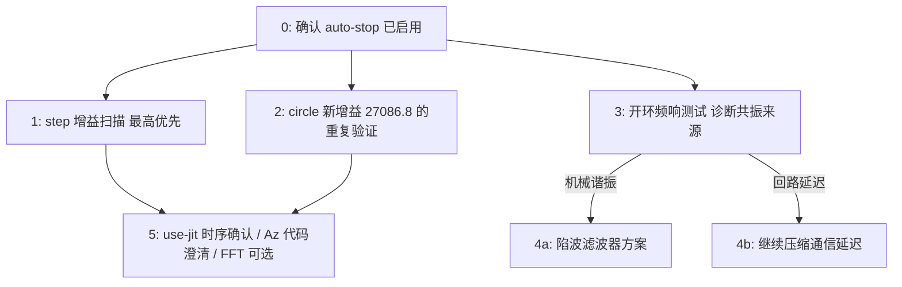

# 下一步测试方案 与 共振规避策略

承接 `MPC_s_Hardware_results_2026-09-29/hardware_results_review.md` 和 `divergence_analysis.md` 的真实硬件结果，以及 `implementation_fix.md` 最新一条修复（自动发散停止 + `circle.yaml` 增益回调）。本文件只是**方案草案**，排好优先级，实际测试前请逐条确认，不要一次性全跑。

## 0. 每次上手测试前的硬性前提

- **全部使用新加入的 `--max-err-mm`/`--max-err-consecutive` 自动停止**（默认已开启，阈值 25mm/5 个连续采样点）。这不是可选项——下面每一条涉及"往不稳定边界逼近"的测试，都依赖它来把发散的尾部变成确定性的，而不是依赖操作员反应时间。
- 任 何新 `q_pos` 一律先在 `--backend sim` 跑过、确认不发散，再上真实硬件（`docs/02_tuning_guide.md` 第 3 节的流程，这里不重复）。
- 调增益时每次只改一个旋钮、小步进——尤其是在逼近边界的扫描里，一次跳得太大会把"刚好越界"和"远远越界"混在一起，边界会测得不准。

## 1. 最高优先级：`step` 任务专属增益扫描

**为什么优先**：`circle` 已经有 `L024/L0255/L027` 三点扫描把边界夹出来了，`step` 还没有——现在已知 `q_pos=11293.6` 会发散、`q_pos=124371` 处于临界（3 次里 2 次成功），中间完全是空的。`step.yaml` 现在没有一个"确认安全"的推荐值，这是当前最大的空白。

**进展（2026-10-01，详见 `implementation_fix.md` "Prepared: `step` trajectory type + a
controlled step-task gain sweep"）**：

- 发现并修复了一个更底层的缺口——`lib/trajectory.py` 之前根本不支持 `step` 轨迹类型
  （只有 `hold`/`circle`），`configs/` 目录也从来没有 `step.yaml`。两者现已补上
  （轨迹类型按真机配置的注释 + 字段逆向实现；`configs/step.yaml` 内容照搬硬件结果
  目录里的版本，`q_pos=124371` 标注为"未验证，待扫描"）。
- 用 `tools/solve_task_space_gain.py --config configs/step.yaml --target-l ...`（固定
  `step.yaml` 自己的 `r=8.77`，只变 `q_pos`，做成真正单变量的扫描，原因见下）生成了
  5 个扫描点：`configs/step_L15.yaml` ~ `step_L35.yaml`，对应 `|L|=0.15/0.20/0.25/
  0.30/0.35`（`q_pos=7568.0/24339.4/60339.0/126787.2/237551.6`）。
- 全部 6 个文件（base + 5 个扫描点）已经在 `--backend sim` 跑过 60 秒完整验证：无发散、
  无报错，瞬态误差 0.85-0.97mm，最终都收敛回 0.000mm，`|u|` 峰值远低于
  `u_max=100`——**可以放心拿到真实硬件上试**，这是 sim 能告诉我们的全部信息了。
- **意外发现**：用正确方式算出来，`hw_step_re_1`（发散，`q_pos=11293.6`）的
  `|L|=0.166`，比"A"（大部分稳定，`q_pos=124371`）的 `|L|=0.299` 还低——跟 `circle`
  "增益越高越不稳"的规律正好相反。这不是说 `|L|` 对 `step` 失效了，而是说这两条真机
  数据根本不是一个干净的单变量对比：`hw_step_re_1` 用的是 `hold`/`push` 的默认
  `r`/观测器参数，不是 `step.yaml` 自己的——`q_pos` 不是唯一变化的量。**现有真机数据
  实际上从未真正验证过"仅改 `q_pos`"对 `step` 稳定性的影响**，这正是上面 5 点扫描要
  补上的空白。

**还差什么（无法在本机完成，需要你/学生在真实硬件上跑）**：

1. 真实硬件上每个点（`step.yaml` 本身 + 5 个 `step_L*.yaml`）至少重复 2 次——`step`
   的"A"在 124371 这个点上 7 次里出现过 2 次发散，单次测试不足以判断"稳定"还是
   "运气好"；
2. 把结果和 `circle` 的边界（`|L|=0.409-0.435`）放一张表比较，看 `|L|` 在两个任务间
   差多少——如果差很大（目前的单点线索——0.166 发散/0.299 大致稳定——暗示 `step`
   的边界可能明显低于 `circle`，但这只是基于混杂了其他变量的旧数据的猜测，扫描结果出来
   前不能当结论用）；
3. 找到边界后，照 `circle.yaml` 的方式回调（目标 `|L|` 比测得的"完成"边界再低
   0.05-0.10 左右），写入 `configs/step.yaml`，并在 `implementation_fix.md` 补一条
   记录，同时把 `step.yaml` 注释里的"PROVISIONAL"去掉。

## 2. `circle.yaml` 新增益（27086.8）的重复验证

目前 `|L|=0.35` 这个新值只在 sim 里跑过一次（65s，无发散）。真实硬件上还没有重复验证过。建议：

- 真实硬件上跑 2-3 次完整一圈（60s 周期，`circle_period_s=60.0`，建议每次至少跑够一整圈，不要提前停），确认稳态误差和此前 `L024`（`q_pos=51101`）量级相近；
- 如果 2-3 次都干净，可以认为这个值是一个可靠的出货配置，不需要再进一步回调；
- 如果出现任何一次发散或明显的大幅瞬态，说明 0.35 这个目标留的裕度还不够，需要再往下退一步（比如 `|L|=0.30`），而不是直接认为上一次的测试是偶然。

## 3. 诊断性测试：这到底是"机械谐振"还是"回路延迟谐振"

**这是整份方案里最重要、也最容易被跳过的一步。** 目前所有证据（7.4–7.9Hz 在从11293.6 到 877980 几乎两个数量级的增益范围内完全不变）只说明了"存在一个固定频率的东西",但没有说明这个固定频率的物理来源是什么——这两种可能对应的"规避方法"完全不同：

- **如果是机械结构谐振**（齿轮/减速箱间隙、连杆挠性、支座刚性不足、线缆拖拽），那无论怎么调控制器增益、怎么降低计算延迟，这个频率本身不会变——只能通过限制增益避开它，或者用陷波滤波器（见第 4 节）主动压制它，根源问题需要靠硬件检修解决。
- **如果是闭环回路延迟导致的临界频率**（采样周期 dt=0.01s + 计算耗时 + 通信延迟，在某个频率上相位滞后恰好到 180°），那降低总回路延迟（继续推进 `--use-jit`、调研 `Return_Delay_Time`/USB latency timer，见 `implementation_fix.md` 里已经做过的测量）会把这个临界频率本身往上推，直接扩大可用增益范围，而不只是在固定频率上打补丁。

**怎么区分**：做一次**开环**频率响应测试——不跑闭环控制器，直接在某个关节上注入一个已知的扫频/chirp 力矩指令（比如 0.5Hz 到 15Hz，幅值远低于 `tau_max_Nm`），用编码器读回的角度/角速度测输出幅值和相位，画出频率响应曲线：

- 如果在 7.4–7.9Hz 附近有一个明显的幅值峰值（哪怕只是局部峰），且峰值频率跟闭环测得的振荡频率吻合——支持"机械谐振"假设；
- 如果开环频响在这个频段很平（没有明显峰），说明振荡来自闭环回路本身（延迟/增益），不是结构谐振。

这个测试不需要新写太多代码——`run_hardware.py` 里已经有 `send_torque()` 接口，加一个`--chirp` 或独立的小脚本（类似 `tools/benchmark_io.py` 的结构）直接注入正弦扫频指令、记录响应即可，工作量不大，但结果会直接决定第 4 节该往哪个方向投入。

## 4. 如果确认是机械谐振：陷波滤波器（notch filter）方案

假设第 3 步确认 7.4–7.9Hz 是一个真实的结构谐振峰，推荐的工程规避手段：

- 在 `ee_vel`（任务空间速度反馈）或者 `u`（控制器输出，送入 `F_task` 之前）上加一个二阶 IIR 陷波滤波器，中心频率设在测得的谐振频率（比如 7.6Hz），带宽窄一些（比如 ±1Hz），只压制这一小段频率，不影响低频跟踪性能和整体相位裕度。
- 实现位置建议：`run_hardware.py` 主循环里，在 `ee_vel_xz` 算出来之后、喂给 `x_state`/`mpc.solve()` 之前插入滤波——对称地，`lib/` 下可以加一个小的`NotchFilter` 类（标准 biquad 实现，`dt=0.01` 下离散化），作为可选项（类似 `--use-jit` 的加法式开关，不影响默认行为）。
- 加滤波器之后必须重新做一遍第 1、2 节的扫描——陷波滤波器本身会引入新的相位滞后，理论上应该能把允许的增益范围往上推，但具体推多少只能靠重新测，不能靠假设。

**如果第 3 步反而支持"回路延迟"假设**，就不需要做陷波滤波器——应该把精力放在继续压缩总回路延迟上（`tools/benchmark_io.py --backend dynamixel` 配合`check_current_interface.py` 的 `Return_Delay_Time`/`Status_Return_Level` 调整，这是 `implementation_fix.md` 里已经搭好但还没在真机上验证过的那一条）。

## 5. 优先级较低，但建议补上

- **确认 `--use-jit` 时序谜题**：`hw_hold_re_1`（15.9ms/tick）和 `hw_hold_re_2`（4.2ms/tick）用的是完全相同的增益，推测是因为开关了 `--use-jit`。成本很低（单次 10 秒级的 hold 任务，开/关各跑一次），建议顺手做掉，不需要单独安排时间。
- **各轴独立增益（`step_Az`/`step_Az55`）的代码澄清**：在决定是否要把这个能力移植回仓库之前，不要再跑新的 `Az` 系列实验——先确认那部分代码到底是小范围扩展还是独立分支。
- **对发散窗口做一次 FFT**：比现在用过零点估算频率更精确，能确认 7.4–7.9Hz 是单一主导模态还是几个相近频率混在一起。如果做了第 3 步的开环频响测试，这一步可以省掉（开环测试给出的频率分辨率通常更高）。

## 一张图看优先级

