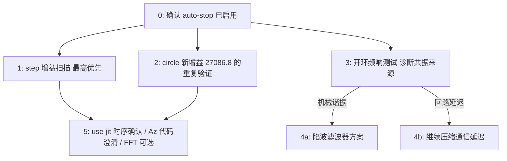

# 下一步测试方案 与 共振规避策略

承接 `hardware_results_review.md` 和 `divergence_analysis.md` 的真实硬件结果，以及 `implementation_fix_20261001.md`（2026-09-29 起的修复记录，与覆盖 2026-09-27 的 `implementation_fix.md` 分开）最新一条修复（自动发散停止 + `circle.yaml` 增益回调）。本文件只是**方案草案**，排好优先级，实际测试前请逐条确认，不要一次性全跑。

## 0. 每次上手测试前的硬性前提

- **全部使用新加入的 `--max-err-mm`/`--max-err-consecutive` 自动停止**（默认已开启，阈值 25mm/5 个连续采样点）。这不是可选项——下面每一条涉及"往不稳定边界逼近"的测试，都依赖它来把发散的尾部变成确定性的，而不是依赖操作员反应时间。
- 任 何新 `q_pos` 一律先在 `--backend sim` 跑过、确认不发散，再上真实硬件（`docs/02_tuning_guide.md` 第 3 节的流程，这里不重复）。
- 调增益时每次只改一个旋钮、小步进——尤其是在逼近边界的扫描里，一次跳得太大会把"刚好越界"和"远远越界"混在一起，边界会测得不准。

## 1. 最高优先级：`step` 任务专属增益扫描

**为什么优先**：`circle` 已经有 `L024/L0255/L027` 三点扫描把边界夹出来了，`step` 还没有——现在已知 `q_pos=11293.6` 会发散、`q_pos=124371` 处于临界（3 次里 2 次成功），中间完全是空的。`step.yaml` 现在没有一个"确认安全"的推荐值，这是当前最大的空白。

**进展（2026-10-01，详见 `implementation_fix_20261001.md` "Prepared: `step` trajectory type + a controlled step-task gain sweep"）**：

- 发现并修复了一个更底层的缺口——`lib/trajectory.py` 之前根本不支持 `step` 轨迹类型（只有 `hold`/`circle`），`configs/` 目录也从来没有 `step.yaml`。两者现已补上（轨迹类型按真机配置的注释 + 字段逆向实现；`configs/step.yaml` 内容照搬硬件结果目录里的版本，`q_pos=124371` 标注为"未验证，待扫描"）。
- 用 `tools/solve_task_space_gain.py --config configs/step.yaml --target-l ...`（固定 `step.yaml` 自己的 `r=8.77`，只变 `q_pos`，做成真正单变量的扫描，原因见下）生成了 5 个扫描点：`configs/step_L15.yaml` ~ `step_L35.yaml`，对应 `|L|=0.15/0.20/0.25/ 0.30/0.35`（`q_pos=7568.0/24339.4/60339.0/126787.2/237551.6`）。
- 全部 6 个文件（base + 5 个扫描点）已经在 `--backend sim` 跑过 60 秒完整验证：无发散、无报错，瞬态误差 0.85-0.97mm，最终都收敛回 0.000mm，`|u|` 峰值远低于 `u_max=100`——**可以放心拿到真实硬件上试**，这是 sim 能告诉我们的全部信息了。
- **意外发现**：用正确方式算出来，`hw_step_re_1`（发散，`q_pos=11293.6`）的 `|L|=0.166`，比"A"（大部分稳定，`q_pos=124371`）的 `|L|=0.299` 还低——跟 `circle` "增益越高越不稳"的规律正好相反。这不是说 `|L|` 对 `step` 失效了，而是说这两条真机数据根本不是一个干净的单变量对比：`hw_step_re_1` 用的是 `hold`/`push` 的默认 `r`/观测器参数，不是 `step.yaml` 自己的——`q_pos` 不是唯一变化的量。**现有真机数据实际上从未真正验证过"仅改 `q_pos`"对 `step` 稳定性的影响**，这正是上面 5 点扫描要补上的空白。

**还差什么（无法在本机完成，需要你/学生在真实硬件上跑）**：

1. 真实硬件上每个点（`step.yaml` 本身 + 5 个 `step_L*.yaml`）至少重复 2 次——`step`的"A"在 124371 这个点上 7 次里出现过 2 次发散，单次测试不足以判断"稳定"还是"运气好"；
2. 把结果和 `circle` 的边界（`|L|=0.409-0.435`）放一张表比较，看 `|L|` 在两个任务间差多少——如果差很大（目前的单点线索——0.166 发散/0.299 大致稳定——暗示 `step`的边界可能明显低于 `circle`，但这只是基于混杂了其他变量的旧数据的猜测，扫描结果出来前不能当结论用）；
3. 找到边界后，照 `circle.yaml` 的方式回调（目标 `|L|` 比测得的"完成"边界再低0.05-0.10 左右），写入 `configs/step.yaml`，并在 `implementation_fix_20261001.md` 补一条记录，同时把 `step.yaml` 注释里的"PROVISIONAL"去掉。

## 2. `circle.yaml` 新增益（27086.8）的重复验证

目前 `|L|=0.35` 这个新值只在 sim 里跑过一次（65s，无发散）。真实硬件上还没有重复验证过。建议：

- 真实硬件上跑 2-3 次完整一圈（60s 周期，`circle_period_s=60.0`，建议每次至少跑够一整圈，不要提前停），确认稳态误差和此前 `L024`（`q_pos=51101`）量级相近；
- 如果 2-3 次都干净，可以认为这个值是一个可靠的出货配置，不需要再进一步回调；
- 如果出现任何一次发散或明显的大幅瞬态，说明 0.35 这个目标留的裕度还不够，需要再往下退一步（比如 `|L|=0.30`），而不是直接认为上一次的测试是偶然。

## 3. 诊断性测试：这到底是"机械谐振"还是"回路延迟谐振"

**这是整份方案里最重要、也最容易被跳过的一步。** 目前所有证据（7.4–7.9Hz 在从11293.6 到 877980 几乎两个数量级的增益范围内完全不变）只说明了"存在一个固定频率的东西",但没有说明这个固定频率的物理来源是什么——这两种可能对应的"规避方法"完全不同：

- **如果是机械结构谐振**（齿轮/减速箱间隙、连杆挠性、支座刚性不足、线缆拖拽），那无论怎么调控制器增益、怎么降低计算延迟，这个频率本身不会变——只能通过限制增益避开它，或者用陷波滤波器（见第 4 节）主动压制它，根源问题需要靠硬件检修解决。
- **如果是闭环回路延迟导致的临界频率**（采样周期 dt=0.01s + 计算耗时 + 通信延迟，在某个频率上相位滞后恰好到 180°），那降低总回路延迟（继续推进 `--use-jit`、调研 `Return_Delay_Time`/USB latency timer，见 `implementation_fix.md` 里已经做过的测量）会把这个临界频率本身往上推，直接扩大可用增益范围，而不只是在固定频率上打补丁。

**怎么区分**：做一次**开环**频率响应测试——不跑闭环控制器，直接在某个关节上注入一个已知的扫频/chirp 力矩指令，用编码器读回的角度/角速度测输出幅值，画出频率响应曲线：

- 如果在 7.4–7.9Hz 附近有一个明显的幅值峰值（哪怕只是局部峰），且峰值频率跟闭环测得的振荡频率吻合——支持"机械谐振"假设；
- 如果开环频响在这个频段很平（没有明显峰），说明振荡来自闭环回路本身（延迟/增益），不是结构谐振。

**进展（2026-10-01）**：脚本已经写好并验证——`tools/chirp_response.py`，用法与安全机制见其文档字符串，要点：

- 只做"重力补偿 + 小阻尼 + 单关节注入的对数扫频力矩"，**完全没有位置/速度误差反馈**——跟 `tools/test_gravity_compensation.py` 是同一个思路，不存在闭环失稳的可能，测到的任何东西都是物理本体（机械臂+舵机+传动）的属性，而不是这个项目控制器的属性。
- 默认扫频范围从 3Hz 到 15Hz（不是最初设想的 0.5Hz）——在 sim 里实测发现：完全没有位置反馈的关节，对低频力矩的响应幅值按 1/f² 增长（纯双积分器的正常物理行为，不是 bug），0.5Hz 起扫几乎立刻就会撞上安全阈值；3Hz 起扫在 sim 里三个关节全部跑满 10 秒、偏移量稳定在安全阈值的三分之一左右，仍然稳稳地把 7.4–7.9Hz 关心的频段夹在扫频范围中间。
- 带一个独立于测量本身的安全阈值（`--max-dev-rad`，默认 0.3rad）：关节偏离起始角度太多就自动停止——跟 `run_hardware.py` 的 `--max-err-mm` 是同一个思路。
- `--plot` 模式输出两张图：响应幅值-频率曲线（标出了 7.4–7.9Hz 参考带）和原始时间轨迹，已经在 sim 上验证可以正常生成（sim 没有机械谐振，预期看到的是平滑曲线而非尖峰，这只是验证脚本本身能跑通，不代表真机的频响形状）。
- 在 `--backend sim` 下三个关节（0/1/2）都跑过 10 秒，全部干净完成，未触发自动停止。

**还差什么（需要在真实硬件上跑）**：对 `configs/hold.yaml`（或任意一个已验证稳定的配置）依次对三个关节各跑一次 `tools/chirp_response.py --backend dynamixel`，然后用 `--plot` 看三张响应曲线里有没有一个在 7.4–7.9Hz 附近出现尖峰。`--backend sim` 下三个关节的扫描已经跑过并写进了 `friction_chirp_analysis.md` Part 2（含原理推导/方程，不只是结果）——全部平滑无尖峰，符合预期（sim 没有机械谐振可找），只确认了采集/分析流程本身没问题，真机那条还是空的。

## 4. 如果确认是机械谐振：陷波滤波器（notch filter）方案

假设第 3 步确认 7.4–7.9Hz 是一个真实的结构谐振峰，推荐的工程规避手段：

- 在 `ee_vel`（任务空间速度反馈）或者 `u`（控制器输出，送入 `F_task` 之前）上加一个二阶 IIR 陷波滤波器，中心频率设在测得的谐振频率（比如 7.6Hz），带宽窄一些（比如 ±1Hz），只压制这一小段频率，不影响低频跟踪性能和整体相位裕度。
- 实现位置建议：`run_hardware.py` 主循环里，在 `ee_vel_xz` 算出来之后、喂给 `x_state`/`mpc.solve()` 之前插入滤波——对称地，`lib/` 下可以加一个小的`NotchFilter` 类（标准 biquad 实现，`dt=0.01` 下离散化），作为可选项（类似 `--use-jit` 的加法式开关，不影响默认行为）。
- 加滤波器之后必须重新做一遍第 1、2 节的扫描——陷波滤波器本身会引入新的相位滞后，理论上应该能把允许的增益范围往上推，但具体推多少只能靠重新测，不能靠假设。

**如果第 3 步反而支持"回路延迟"假设**，就不需要做陷波滤波器——应该把精力放在继续压缩总回路延迟上（`tools/benchmark_io.py --backend dynamixel` 配合`check_current_interface.py` 的 `Return_Delay_Time`/`Status_Return_Level` 调整，这是 `implementation_fix.md` 里已经搭好但还没在真机上验证过的那一条）。

## 5. 优先级较低，但建议补上

- **确认 `--use-jit` 时序谜题**：`hw_hold_re_1`（15.9ms/tick）和 `hw_hold_re_2`（4.2ms/tick）用的是完全相同的增益，推测是因为开关了 `--use-jit`。成本很低（单次 10 秒级的 hold 任务，开/关各跑一次），建议顺手做掉，不需要单独安排时间。
- **各轴独立增益（`step_Az`/`step_Az55`）的代码澄清**：在决定是否要把这个能力移植回仓库之前，不要再跑新的 `Az` 系列实验——先确认那部分代码到底是小范围扩展还是独立分支。
- **对发散窗口做一次 FFT**：比现在用过零点估算频率更精确，能确认 7.4–7.9Hz 是单一主导模态还是几个相近频率混在一起。如果做了第 3 步的开环频响测试，这一步可以省掉（开环测试给出的频率分辨率通常更高）。
- **波特率**：所有示例/文档现在用的是 1Mbps，XM430-W350 舵机理论上支持更高——具体上限还没对照固件确认过。更高波特率直接减少串口传输时间，是通信延迟那条路径上还没试过的一个旋钮。
- **`gc.disable()`**：实时循环里目前完全没用过。Python 的循环垃圾回收可能在某一拍中途暂停，是 `implementation_fix.md` 里那个一直没查实的 PID "max=37.57ms" 异常值的一个可能（但未证实）解释。成本很低，值得顺手试一下。
- **更短的 `horizon`**（目前 25，`payload` 是 50）：FISTA 的问题规模随 horizon 增长，缩短能进一步提速，但这会真正改变 MPC 的行为而不只是速度——需要和改增益一样的完整重新验证流程，不是一个"顺手做掉"级别的改动，这里单独列出而不是归进上面几条小改动。

## 一张图看优先级

## 代码改动汇总（截至 2026-10-01）

这份方案本身只是草案，但执行过程中已经有一批真实的代码/配置改动落地了（全部已在 sim
验证，细节见各自在 `implementation_fix_20261001.md` 里的条目）。汇总如下，方便直接对照"还差
什么"去跑，而不用在上面几节里逐条翻找：

| 文件 | 改动 | 状态 |
|---|---|---|
| `lib/trajectory.py` | 新增 `step` 轨迹类型（之前只有 `hold`/`circle`） | 已完成，sim 验证通过 |
| `run_hardware.py` | 新增 `--max-err-mm`/`--max-err-consecutive` 自动发散停止，默认开启 | 已完成，sim 验证通过（正常不误触发/能精确触发/可关闭三种情况都测过） |
| `configs/circle.yaml` | `q_pos: 75290.6 → 27086.8`（`\|L\|: 0.45 → 0.35`） | 已完成，sim 验证通过；**真机重复验证还没做**（见第 2 节） |
| `configs/step.yaml` | 新建（仓库里之前完全没有这个文件） | 已完成，sim 验证通过；`q_pos=124371` 标注为 PROVISIONAL |
| `configs/step_L15.yaml` ~ `step_L35.yaml`（5 个文件） | 新建，`step` 任务的单变量增益扫描点 | 已完成，sim 验证通过；**真机扫描还没做**（见第 1 节） |
| `tools/chirp_response.py` | 新建，开环 chirp 频率响应诊断脚本 | 已完成，sim 验证通过（3 个关节各跑过）；**真机扫描还没做**（见第 3 节） |
| `configs/*.yaml`（全部 10 个：`hold`/`push`/`payload`/`circle`/`step`/`step_L15`~`step_L35`） | `qp_iters: 200`（默认，未写进任何文件）→ 显式写入 `qp_iters: 50` | 已完成，sim 验证通过——三种方式交叉验证过 3.8-4.1x 提速，`circle`/`step` 全套闭环结果与改动前逐位匹配，无需真机即可确认 |

**一句话看当前状态**："能在本机（sim）做的准备工作"都做了，表里标了"真机还没做"的几行
（`circle.yaml` 重复验证、`step` 扫描、`chirp_response.py`）**需要在真实硬件上跑**才算完
——第 1、2、3 节各自的"还差什么"小节就是这几行要做的事。**`qp_iters` 这一行单独强调一下：
是表里唯一一个已经完整完成、不需要等真机确认的改动**——三种方式交叉验证过 3.8-4.1x 提速，
`circle`/`step` 全套闭环结果与改动前逐位匹配，已经直接生效在全部 10 个出货配置里，不是
"准备好了等真机测"，是已经落地的真实收益。
