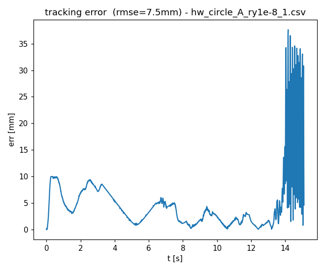
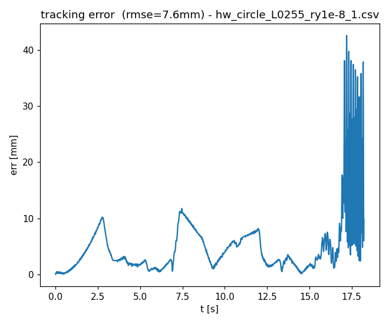
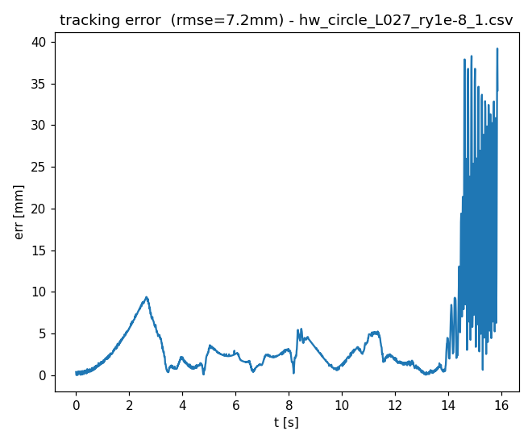
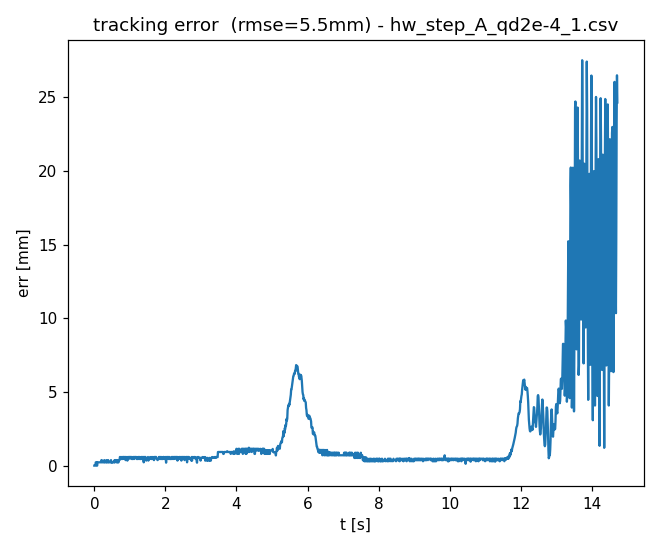
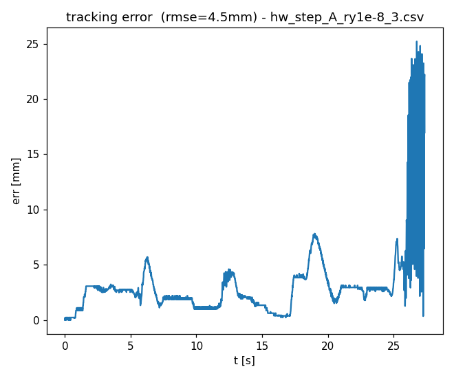
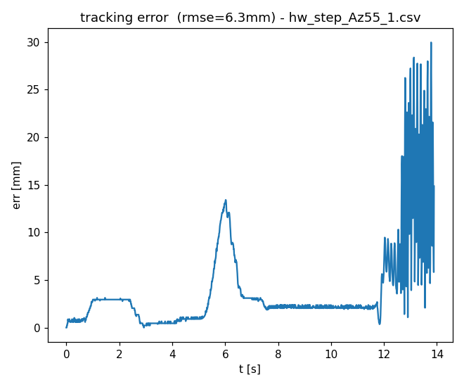
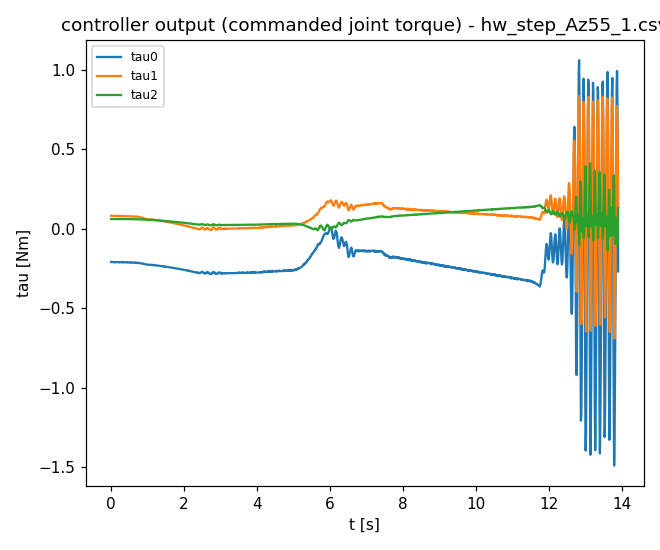
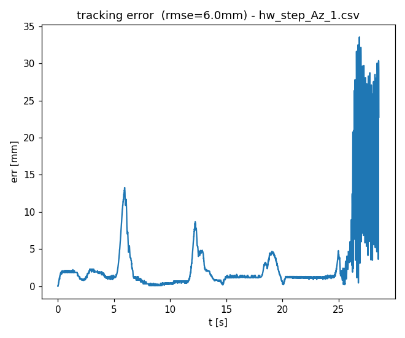
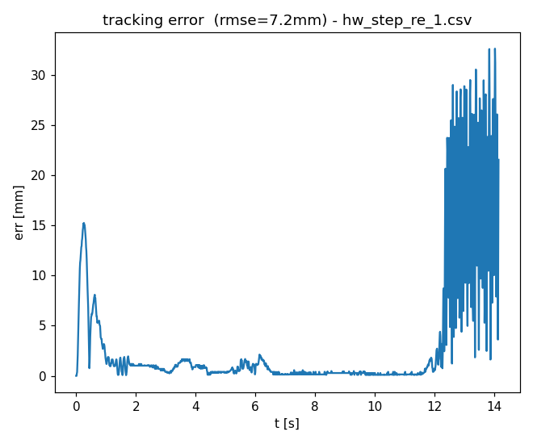

# Divergence analysis: all 8 diverged hardware runs

Companion to `hardware_results_review.md`. That file covers the full result set; this one
drills into every `diverged` run individually, with plots. All numbers here are freshly
computed from the raw CSVs (script logic described inline), not read off filenames.

Full 9-plot sets (`_path`, `_posref`, `_err`, `_q`, `_tau`, `_cur`, `_hz`, `_yhat`, `_dhat`)
for every diverged run were generated with the project's own `plot_traj.py` (they didn't
exist before this pass — only the 3 `completed` reference runs had pre-made figures) and live
under `figures/<task>/<run_name>/`. Each section below embeds the `_err` plot (the most
direct view of the divergence) plus, where it adds something the error plot alone doesn't, the
`_tau` or `_q` plot; the rest of each run's plots are one directory away for follow-up.

## Cross-run finding, before the per-run detail

Onset time (last moment the error was calmly tracking before it blows up and never comes back)
and the oscillation frequency during the blow-up (from zero-crossings of the signed x-axis
error in the final ~1.5-2s of each run) were computed the same way for all 8 runs:

| run | task | q_pos (x) | q_pos_z | onset t | run ends | time-to-stop after onset | osc. freq | err max |
|---|---|---|---|---|---|---|---|---|
| `hw_circle_A_ry1e-8_1` | circle | 124371 | – | 13.97s | 15.10s | 1.13s | **7.66Hz** | 37.7mm |
| `hw_circle_L0255_ry1e-8_1` | circle | 65405 | – | 16.92s | 18.22s | 1.30s | **7.37Hz** | 42.6mm |
| `hw_circle_L027_ry1e-8_1` | circle | 82547 | – | 14.47s | 15.85s | 1.38s | **7.72Hz** | 39.2mm |
| `hw_step_A_qd2e-4_1` | step | 124371 | – | 13.34s | 14.72s | 1.38s | **7.59Hz** | 27.5mm |
| `hw_step_A_ry1e-8_3` | step | 124371 | – | 26.11s | 27.36s | 1.25s | **7.64Hz** | 25.2mm |
| `hw_step_Az55_1` | step | 124371 | 221497 | 12.67s | 13.89s | 1.22s | **7.75Hz** | 30.0mm |
| `hw_step_Az_1` | step | 124371 | 877980 | 26.25s | 28.57s | 2.32s | **7.63Hz** | 33.6mm |
| `hw_step_re_1` | step | 11293.6 | – | 12.36s | 14.15s | 1.79s | **7.90Hz** | 32.6mm |

Two things stand out immediately, and both matter more than any single run:

1. **The oscillation frequency is essentially constant — 7.4 to 7.9Hz — across every task,
   every gain from 11293.6 to 877980, every observer variant, both the anisotropic and
   isotropic configs.** A gain-dependent instability (e.g. classic root-locus departure as a
   loop gain increases) would show the frequency drifting with gain; it doesn't. That's the
   signature of a fixed structural/control-loop resonance that a high enough loop gain
   *excites*, not one that the gain *tunes the frequency of*. It lines up almost exactly with
   the original report's own "~8Hz self-excited oscillation" hypothesis — this is that
   mechanism, now seen directly in the signed error, on 8 independent hardware runs.
2. **Every run stops 1.1–2.3s after onset, never longer.** Combined with `compute_ms`/
   `period_ms` staying flat and in-budget through the whole event (checked per-run below),
   this is consistent with a human operator watching the error and killing the run shortly
   after it visibly starts growing — not an automated divergence detector, and not the loop
   itself crashing. Worth adding a code-side auto-stop (e.g. `err_mm` exceeding a threshold for
   N consecutive samples) if these hardware sessions continue, both for repeatability and so
   the tail of each log isn't operator-timing-dependent.

None of the 8 show `|u|` anywhere near `u_max=100` beforehand (max seen: 24.2, and that one is
the softest-gain run) — every divergence here is a genuine dynamic instability, not the
old saturation failure mode from Finding 3.

## `circle` task (3 of 4 circle configs diverged)

### `hw_circle_A_ry1e-8_1` (q_pos=124371, `|L|≈0.62`)

Clean tracking (sub-2mm) for the first ~14s, then a 1.1s-long blow-up to 37.7mm at 7.66Hz
right at the end of the recorded window. This is the same escalated "A" gain that ran cleanly
3/3 times on `hold` — direct confirmation that this gain level is fine for `hold` but past the
`circle` task's stability margin (see `hardware_results_review.md` §3 for the full boundary
sweep).

### `hw_circle_L0255_ry1e-8_1` (q_pos=65405, `|L|≈0.26`)

Longer clean run (~17s) before onset, consistent with sitting closer to — but still just past —
the boundary than the `A` gain above. Peak error (42.6mm) is the highest of the three circle
divergences despite the lowest gain of the three, which is unsurprising once the mode is
excited: how far it runs before an operator stops it, not the gain itself, mostly sets the
peak amplitude of an exponentially-growing oscillation.

### `hw_circle_L027_ry1e-8_1` (q_pos=82547, `|L|≈0.27`)

The run examined in detail in the previous pass: sub-mm to ~1.5mm tracking through t≈13.9s,
then a sign-alternating, amplitude-doubling-per-swing oscillation at 7.72Hz. `q_pos=82547`
diverged, `q_pos=65405` (`L0255`, above) diverged, `q_pos=51101` (`L024`, in `completed/`)
did not — the boundary is bracketed between roughly 51101 and 65405, i.e. `|L|≈0.24–0.26`,
comfortably below the `|L|=0.45` the shipped `circle.yaml` currently targets.

*(`hw_circle_L024_ry1e-8_1`, `q_pos=51101`, completed cleanly — its plots were already
pre-generated under `figures/circle/hw_circle_L024_ry1e-8_1/` and aren't reproduced here since
this file is specifically about the divergences.)*

## `step` task (5 of 7 step configs diverged)

### `hw_step_A_qd2e-4_1` (q_pos=124371, `observer_q_d=2e-4`)

Same story as `circle_A`: clean step-and-settle behavior for ~13s, then a 1.4s 7.59Hz blow-up
to 27.5mm right at the recording's end. The `observer_q_d=2e-4` variant (vs. the baseline
`step_A`'s value) doesn't change the qualitative picture — same gain, same frequency, similar
onset time to the plain `A` step run — so this particular observer-tuning knob isn't what's
driving the instability.

### `hw_step_A_ry1e-8_3` (q_pos=124371, third repeat)

The other two repeats at this exact config (`hw_step_A_ry1e-8_1`, `_2`) are in `completed/` —
this is a **marginal case**: same gain, same everything, and 2 of 3 trials completed cleanly
while the 3rd ran ~26s before the same 7.64Hz mode appeared. That's consistent with sitting
right at the boundary, where trial-to-trial variation (small differences in initial pose,
disturbance timing, friction/backlash state) decides whether the run finishes or not — not
evidence of a flaky measurement. Worth flagging: **this specific gain is not reliably stable**,
even though 2/3 runs looked fine individually.

### `hw_step_Az55_1` (q_pos=[124371, 221497], anisotropic)

Onset at 12.67s, 7.75Hz, 30.0mm peak — same signature as the isotropic `A` runs even though
this config only pushes the z-axis gain up moderately (221497 vs the x-axis's 124371, a ~1.8x
ratio). The torque plot is included here because it's worth seeing directly: torque tracks the
error's oscillation once it starts (as expected — the controller is reacting to what it sees)
but never approaches `u_max`, reinforcing that this is a control-loop dynamics problem, not an
actuator limit being hit.

### `hw_step_Az_1` (q_pos=[124371, 877980], anisotropic, more aggressive)

The z-axis gain here (877980, a ~7x ratio over the x-axis's 124371) is the highest of any
config in this whole dataset. Longest clean run of the anisotropic pair (~26s vs Az55's
~13s) but also the longest post-onset tail before stopping (2.32s, the longest of all 8 runs)
and the highest `u_max` seen in any diverged run (16.2, still nowhere near `u_max=100`).
Same 7.63Hz frequency. The anisotropic z-boost buys a longer clean run but doesn't move the
frequency or change the qualitative failure mode — consistent with the resonance being a
property of the closed loop as a whole (bandwidth/delay-driven) rather than something tied to
one axis's gain specifically.

### `hw_step_re_1` (q_pos=11293.6, the committed-repo `hold`/`push` default)

The important control case: this is by far the *softest* gain of any diverged run (11293.6 vs.
124371+ for everything else above) and it still diverges — at the same ~7.9Hz. The first ~0.4s
spike to 15mm visible at the very start of the plot is the step task's own initial transient
(the arm slewing to the new target), not instability — it settles back to <2mm by t≈0.5s and
stays clean until the real onset at t≈12.4s. Two implications: (a) this gain, which is fine for
`hold`/`push` in the committed configs, is **not safe for the step task** as currently tuned;
(b) since 7.9Hz is consistent with every other run regardless of gain, low gain alone doesn't
prevent this mode from eventually appearing on `step` — something about the step task itself
(the large, repeated transients) excites it, similar to what circle's steady tracking does at
higher gain.

## What this changes vs. the previous review

`hardware_results_review.md` already concluded the divergences were real dynamic instability
(not timing, not saturation) at ~8-10Hz, and that the `circle` stability boundary sits near
`q_pos≈51101–65405`. This pass adds:

- **The ~8Hz frequency is not circle-specific or a rough estimate** — it's 7.4–7.9Hz on all 8
  runs across both tasks, tightly enough clustered that it looks like a genuine fixed
  resonance rather than per-run coincidence.
- **`step` has its own, previously-unflagged stability problem**: the committed-repo default
  gain (`q_pos=11293.6`) diverges on `step`, and even the marginal `A` gain (124371) is not
  reliably stable there either (2/3 vs 1/3). Nothing in `implementation_fix.md` currently
  covers a `step.yaml`-specific gain recommendation — this dataset suggests one is needed, the
  same way `circle.yaml`'s value needs pulling back.
- **The anisotropic (`Az`/`Az55`) experiments show the z-boost delays onset but doesn't cure
  it** — useful evidence if that capability gets ported back into the repo (see
  `hardware_results_review.md` §4): boosting one axis's gain is not, by itself, a fix for this
  resonance.

## Follow-ups (not yet done)

- A frequency-domain check (FFT of the signed error during the blow-up window) would pin the
  7.4–7.9Hz estimate down more precisely than the zero-crossing method used here, and could
  confirm it's a single dominant mode rather than several close frequencies bleeding together.
- No `step`-specific gain sweep exists yet (equivalent to the `circle_L024/L0255/L027` sweep) —
  the boundary for `step` is only bracketed as "above 11293.6, unreliable at 124371", not
  pinned down.
- Adding an automated divergence stop (e.g. `err_mm` over a threshold for N consecutive
  samples cuts the run) would remove the operator-reaction-time variability currently baked
  into every diverged run's tail.
