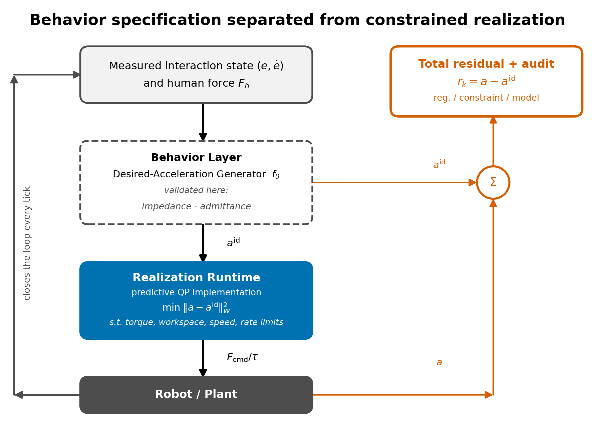
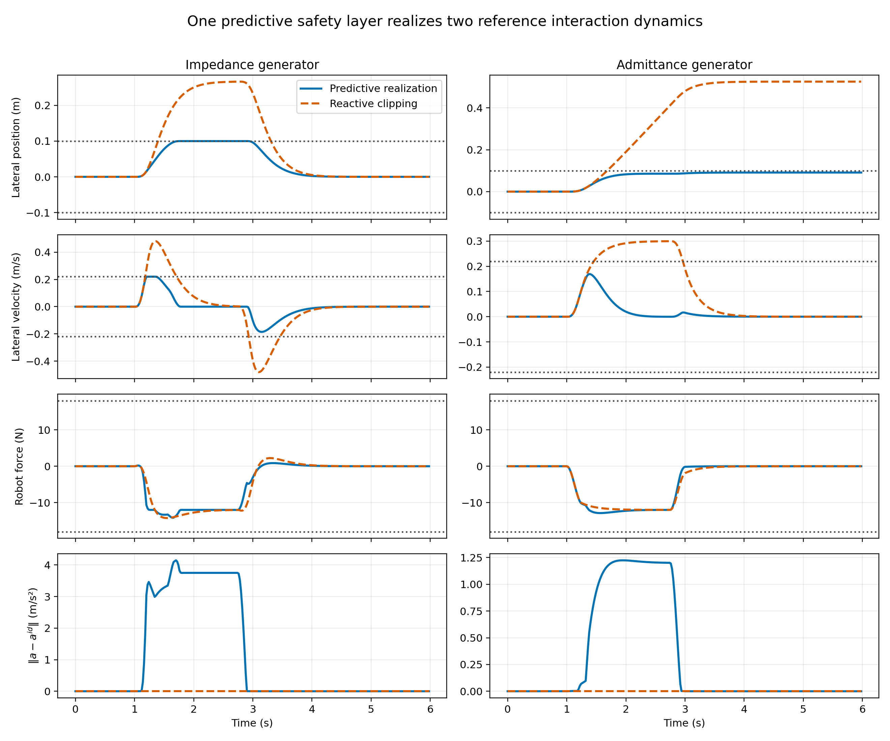
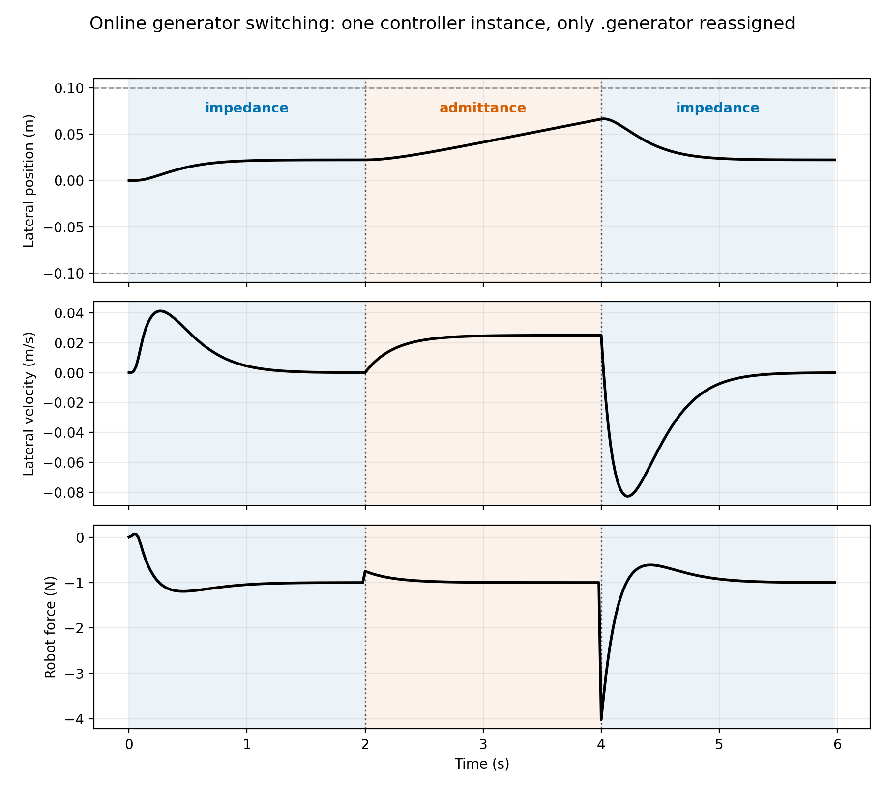
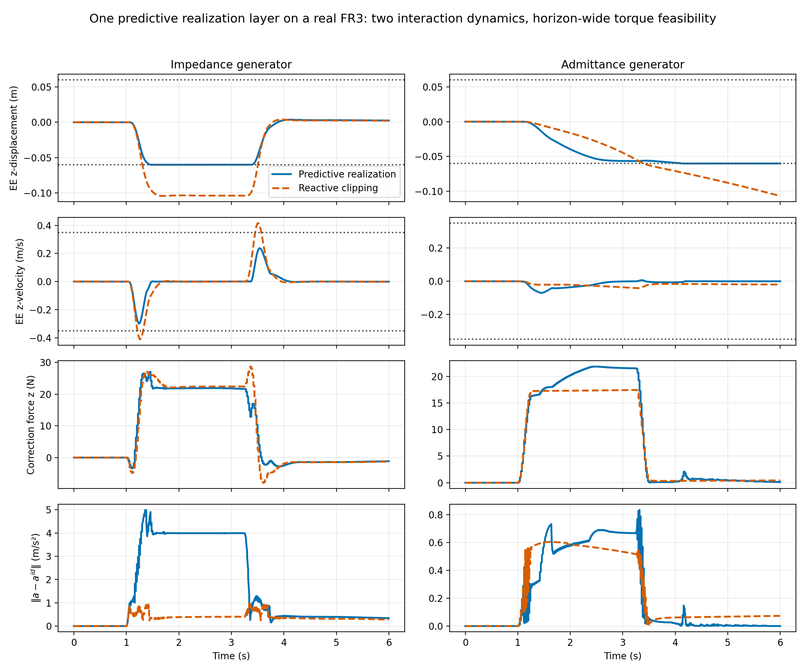
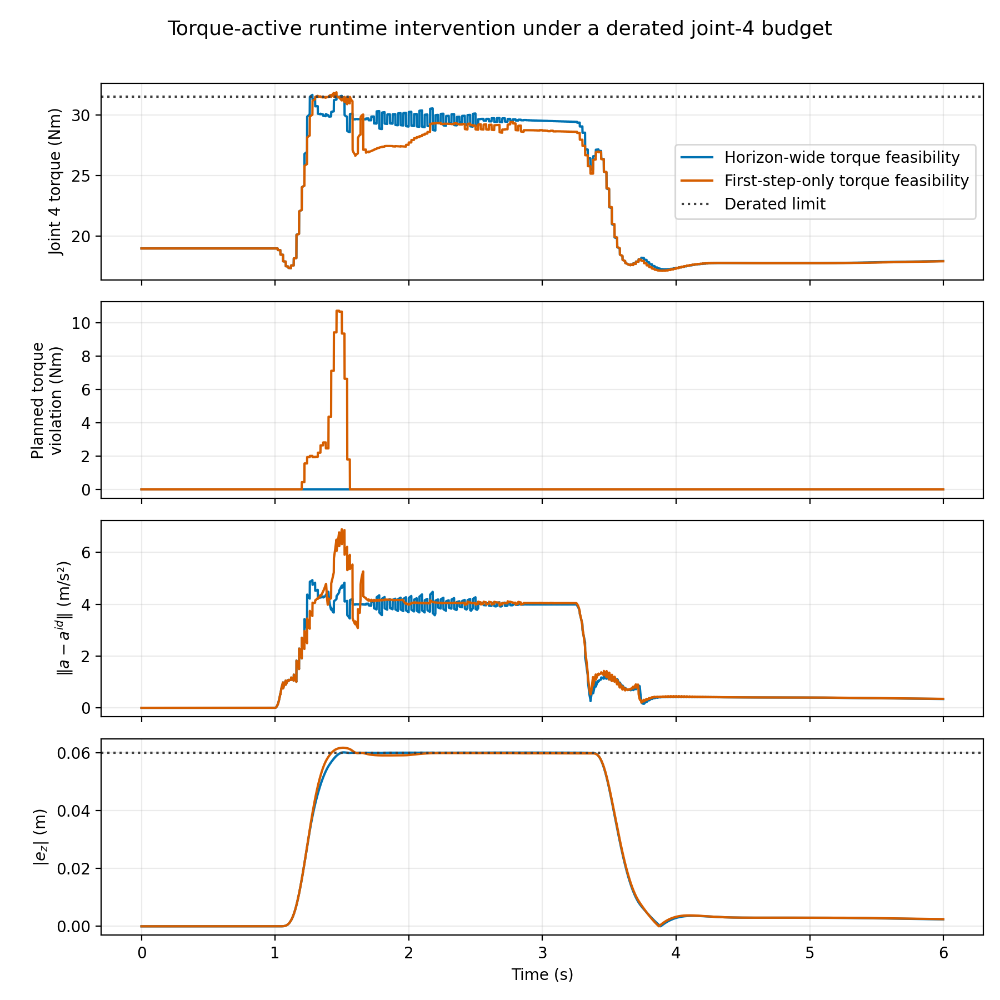

# Behavior–Realization Separation for Constrained Physical Human–Robot Interaction


## Abstract

Physical human–robot interaction software often couples desired-behavior specification with constrained realization; we treat these as separate layers. A *behavior layer* supplies a desired contact-port acceleration \(a_k^{\mathrm{id}}=f_\theta(e_k,\dot e_k,F_{h,k})\). A *realization layer* converts it into constrained robot commands and exposes constraint-induced deviation as a realization residual instead of hiding it in saturation. This paper implements a receding-horizon quadratic program realizing memoryless affine behaviors. Changing the behavior modifies objective coefficients through \((C_\theta,G_\theta)\) while the robot-command variable and feasible set remain unchanged. A planar study instantiates impedance and admittance; the same running layer accepts an impedance–admittance–impedance reassignment without reconstruction, under its existing rate limit. On a torque-controlled 7-DOF Franka FR3 in MuJoCo, the runtime freezes task-space dynamics per solve and enforces torque feasibility across its horizon. Under a sustained 20 N push, it holds a slack-relaxed workspace boundary to within approximately 0.1--0.2 mm, versus 4.4 cm (impedance) and 4.7 cm (admittance) overshoot from instantaneous clipping. A derated actuator budget then activates the torque constraint: horizon-wide enforcement keeps its frozen-model plan feasible to 0.003 Nm, whereas a first-step-only ablation plans up to 10.739 Nm beyond budget. These results are a focused proof of behavior–realization separation (scope in Section 6.5).

**Keywords:** physical human–robot interaction, behavior–realization separation, robot-control architecture, predictive realization, model predictive control, impedance control, admittance control.

## 1. Introduction

Interaction behavior should specify only desired interaction dynamics; physical feasibility should be realized independently by the robot.

A pHRI software stack has two conceptually different responsibilities:

1. specify the desired interaction behavior; and
2. realize that behavior through commands compatible with the physical robot.

**Architectural hypothesis.** We argue for a general software-engineering principle, stated above, and for a specific reason it should hold: desired interaction behavior is a statement in interaction-state space — position error, velocity error, and human force — while physical feasibility is a statement in robot-constraint space — joint torque, joint limits, and workspace geometry. These are different mathematical objects with different natural variables, so a representation that mixes them (as a fixed impedance or PD law does) couples two things that do not have to be coupled. Separating them into a behavior layer and a realization layer connected by an explicit interface is therefore not only a convenient software boundary but a decomposition along the actual variables each responsibility depends on. This is an architectural claim, not merely an empirical one: it also implies that a behavior specification can be authored, tested, and replaced independently of the robot, and that feasibility logic can be verified once and reused across every behavior that respects the interface (Section 7 argues this directly). This paper tests the principle with one executable desired-acceleration interface, developed and validated only for its memoryless affine subclass (Sections 3.2–6); that affine QP realization layer is one instance supporting the general claim, not the claim itself, and its success does not establish that every possible behavior representation can use the same runtime unchanged.

Conventional impedance control combines behavior specification and command realization in one mass–spring–damper feedback law. Variable-impedance methods add adaptation, and model-predictive variants can optimize impedance parameters or jointly plan motion and compliance. Those formulations are useful, but changing the behavior representation generally changes the controller that interprets it.

A concrete consequence of that coupling is actuator saturation. A conventional impedance or PD law computes joint torque directly from the interaction error, \(\tau=J^\top(-K_de-D_d\dot e)+\tau_{\mathrm{ff}}\), where \(\tau_{\mathrm{ff}}\) includes gravity/Coriolis compensation and, on a redundant arm, orientation-hold and null-space terms. Neither term reasons about the actuator limit. A stiff impedance, large interaction force, or unfavorable configuration can therefore drive the command past \(\tau_{\max}\), and clipping silently changes the delivered acceleration.

The architecture studied here assigns this conflict to a realization layer. Its current predictive implementation constrains the *total frozen-model torque* — feedforward, orientation, null-space, and interaction terms — at every prediction step (Section 6.1). Any necessary deviation from the behavior specification appears in the realization residual. Because the manipulator prediction is frozen at each solve, this remains a local-model mechanism rather than a global nonlinear-plant guarantee.

We study a different decomposition:



**Figure 1.** Behavior specification and robot realization are separate software responsibilities. In the present implementation, the behavior layer is a desired-acceleration generator (dashed border), validated with impedance and admittance only. The predictive realization runtime (blue) converts \(a^{\mathrm{id}}\) into a constrained robot command and reports \(r_k=a-a^{\mathrm{id}}\).

The behavior layer expresses intent without choosing a robot command. The realization runtime handles feasibility, constraint enforcement, and command optimization without deciding what stiffness, damping, or force-response semantics should mean. When physical limits prevent exact execution, the magnitude and timing of the intervention are explicit in the *realization residual*.

**The current executable instance.** For memoryless affine behavior models, the predictive runtime retains one decision variable, feasible set, and objective template; the desired behavioral acceleration enters through \((C_\theta,G_\theta)\). Section 4 states this limited structural property formally, and Section 3.2 implements impedance and admittance. Nonlinear or stateful specifications may require different prediction machinery and are not instances of the present QP by assertion.

This separation changes the scientific question. Instead of asking whether a particular MPC formulation produces compliant tracking, we ask:

> How should robot-control software separate desired interaction behavior from its constrained physical realization, and how should unavoidable intervention be exposed?

The contributions are:

- a behavior–realization architecture that assigns behavior semantics and physical command feasibility to separate software layers;
- a precise desired-acceleration interface and realization residual that make constraint-induced behavior modification observable;
- one predictive realization runtime for the memoryless affine subclass, with a fixed robot-command variable and feasible set across impedance and admittance behavior layers;
- reproducible planar and FR3 simulations showing online behavior-layer replacement, anticipatory state-constraint handling, and manipulator-level realization under command and torque limits.

We do **not** claim that architectural separation in the abstract, impedance behavior in MPC, or constrained interaction control is new. Reference governors and hierarchical robot controllers already separate related responsibilities, while model predictive impedance and interaction controllers provide important integrated formulations. The narrower claim is a behavior–realization interface at the interaction-acceleration level, an explicit residual for runtime intervention, and an executable predictive instance for two affine behaviors.

## 2. Related Work and Positioning

The closest literature is best distinguished by what the predictive or adaptive layer optimizes and by what quantity the robot-level controller is asked to reproduce.

| Class | Behavior representation | Optimized robot-level variable | Role of prediction |
|---|---|---|---|
| Predictive variable impedance | \(M_d,D_d,K_d\), often with a trajectory | Impedance parameters and/or trajectory | Select compliant behavior |
| Reference-model adaptive impedance | \(M_d\ddot e+D_d\dot e+K_de=F_h\) | Adaptive feedback parameters | Usually absent |
| Direct robot MPC | State or tracking-error dynamics | Force, torque, velocity, or acceleration | Optimize robot motion directly |
| Impedance/interaction MPC | Impedance, force, or coupled interaction model | Robot command and sometimes behavior parameters | Embed interaction objectives and constraints |
| Reference governor | A single reference/setpoint signal | Filtered reference fed to a fixed inner-loop controller | Supervise a non-predictive inner loop to enforce constraints |
| This work | \(a^{\mathrm{id}}=C_\theta x+G_\theta F_h\) | Robot command \(u\) | Minimize dynamics-realization error under constraints |

Several approaches use MPC to adapt impedance parameters or to plan impedance and motion together. Anand et al. place a learned predictive policy above a low-level variable-impedance controller [1]. Haninger et al. predict interaction and optimize trajectory and impedance online while incorporating safety constraints [2]. Recent predictive variable-impedance formulations continue this parameter-adaptation direction [3]. Their optimized behavior variables are stiffness, damping, or related trajectory parameters.

A related line of work is model-reference adaptive impedance control, which specifies desired impedance dynamics and designs an adaptive nonlinear controller so that the robot approaches them [4]. This establishes the value of separating a desired model from the physical robot, but it does not by itself provide horizon-wide handling of coupled state and input constraints.

A separate class applies MPC directly to the robot or to a feedback-linearized error model, with decision variables that are robot commands rather than impedance parameters. Such a controller can generate an effective closed-loop impedance, but unless a desired interaction model appears explicitly in the prediction objective, that impedance is an induced property of the optimizer rather than the behavior it is asked to realize. This distinction separates the present formulation from our earlier double-integrator tracking MPC: the earlier controller penalizes interaction error, whereas the present controller penalizes disagreement with an independently specified interaction dynamical system.

Closer still is model predictive impedance and interaction control. Bednarczyk et al. formulate impedance behavior through MPC and handle practical constraints such as velocity, energy, and jerk [5]. Gold et al. formulate model predictive interaction control using robot and interaction models in the optimal-control problem and express manipulation objectives through costs and constraints [6]. Minniti et al. combine whole-body MPC with online adaptation of robot–environment interaction models for constrained mobile manipulation [7]. These papers are close precedents and make a broad “first constrained interaction-dynamics MPC” claim untenable.

Reference governors are the closest architectural relative to this paper's separation, from a different literature than the parameter-adaptation and direct-MPC work described above. A reference governor sits upstream of a fixed, already-designed inner-loop controller and modifies the reference signal so that constraints on the resulting closed-loop trajectory are respected [8]. The parallel is direct: a reference governor also separates what is commanded from what is safe to execute. The difference is where prediction lives and what is exchanged. A reference governor typically supervises a fixed inner loop and manipulates a reference signal; the realization layer here is itself predictive, and the exchanged object is an affine desired-acceleration law evaluated over predicted interaction states. The realization residual additionally measures the difference between requested and delivered dynamics. This connection limits the novelty claim: the contribution is not separation in the abstract, but its formulation and measurement at the interaction-dynamics level.

| Architectural question | Reference governor | Behavior–realization architecture |
|---|---|---|
| Pipeline | Reference \(\rightarrow\) governor \(\rightarrow\) fixed controller \(\rightarrow\) robot | Interaction state \(\rightarrow\) behavior generator \(\rightarrow\) predictive realizer \(\rightarrow\) robot |
| Quantity passed downstream | Modified reference signal | Desired behavioral acceleration law |
| Location of prediction | Supervisory reference filter | Robot-command realization layer |
| Explicit discrepancy | Original versus governed reference | Desired versus realized acceleration, \(r=a-a^{\mathrm{id}}\) |

Every row above except the last two optimizes a quantity tied to one behavior representation: impedance parameters, adaptive impedance gains, or robot-level tracking against a specific interaction model. The reference-governor row is architecturally closest. Our narrower distinction is an interaction-level behavior contract whose desired acceleration is separate from robot feasibility, together with a residual that exposes runtime intervention. The executable and theoretical evidence is limited to memoryless affine impedance and admittance behaviors.

## 3. Behavior–Realization Formulation

### 3.1 Behavior–realization interface

Consider a rigid manipulator

\[
M(q)\ddot q+C(q,\dot q)\dot q+g(q)
=\tau+J(q)^\top F_h,
\]

where \(q\in\mathbb R^{n_q}\), \(\tau\in\mathbb R^{n_q}\), and \(F_h\) is the human wrench applied at the interaction port. For a task coordinate \(y=h(q)\in\mathbb R^{n_y}\),

\[
\dot y=J(q)\dot q,
\qquad
\ddot y=J(q)\ddot q+\dot J(q,\dot q)\dot q.
\]

Substitution of the joint dynamics gives the affine acceleration map

\[
\ddot y
=b_y(q,\dot q,F_h)+G_y(q)\tau,
\]

where

\[
\begin{aligned}
b_y(q,\dot q,F_h)
&=
J M^{-1}
\left(
-C\dot q-g+J^\top F_h
\right)
+\dot J\dot q,\\
G_y(q)&=JM^{-1}.
\end{aligned}
\]

Let \(y_d\) be a nominal interaction pose and define

\[
e=y-y_d,
\qquad
\dot e=\dot y-\dot y_d.
\]

**Definition 1 (behavior-layer interface).** In the present architecture, the behavior layer is a causal map

\[
\ddot e^{\mathrm{id}}
=f_\theta(e,\dot e,F_h,z),
\]

where \(z\) denotes optional internal behavior state and \(\theta\) denotes behavior parameters. Its output is a desired contact-port acceleration — termed the *desired behavioral acceleration* throughout this paper — not a robot command. The behavior layer is deliberately unaware of robot torque limits, joint limits, or workspace geometry; those belong to the realization layer. The general map defines the interface boundary; the theorem and experiments below cover only its memoryless affine specialization.

The architecture does not ask the behavior layer to compute \(\tau\). It supplies \(\ddot e^{\mathrm{id}}\), and the realization layer selects \(\tau\) so that the physical \(\ddot e\) approaches \(\ddot e^{\mathrm{id}}\) while satisfying robot constraints. The predictive QP developed below is one realization-layer implementation, not the definition of the layer itself.

The full manipulator formulation is the target architecture. The planar study below uses the following exactly discretized specialization so that behavior–realization separation can be isolated without kinematic or inverse-dynamics confounds: a planar point mass,

\[
m_r\ddot p(t)=u(t)+F_h(t),
\]

where \(p\in\mathbb R^2\) is displacement from a nominal interaction pose, \(u\in\mathbb R^2\) is commanded robot force, \(F_h\in\mathbb R^2\) is measured human force, and \(m_r>0\) is the realized robot mass. Define

\[
x=\begin{bmatrix}p^\top&v^\top\end{bmatrix}^\top,\qquad v=\dot p.
\]

Under zero-order hold with period \(\Delta t\),

\[
x_{k+1}=Ax_k+B(u_k+F_{h,k}),
\]

\[
A=
\begin{bmatrix}
I&\Delta tI\\0&I
\end{bmatrix},
\qquad
B=
\begin{bmatrix}
\frac{\Delta t^2}{2m_r}I\\
\frac{\Delta t}{m_r}I
\end{bmatrix}.
\]

The actual acceleration is

\[
a_k=\frac{u_k+F_{h,k}}{m_r}.
\]

For this planar plant, Definition 1 specializes with \(x_k=[p_k^\top\ v_k^\top]^\top\) in place of \((e,\dot e)\):

\[
a_k^{\mathrm{id}}
=f_\theta(x_k,F_{h,k},z_k).
\]

For the affine class considered throughout this paper,

\[
a_k^{\mathrm{id}}=C_\theta x_k+G_\theta F_{h,k}.
\]

The gap between what a behavior specifies and what the robot delivers is the realization residual,

\[
r_k=a_k-a_k^{\mathrm{id}}.
\]

If \(r_k=0\), the robot exactly realizes the desired behavioral acceleration at that sample. If \(r_k\ne0\), the robot executes the closest feasible dynamics selected by the optimizer. Reporting \(r_k\) distinguishes unavoidable safety intervention from failure to tune the reference model. \(r_k\) is deliberately a raw physical quantity, not a normalized tracking score: its role is to report exactly how much commanded acceleration was withheld, in the same units the actuator budget is spent in, which is what a downstream safety or logging consumer needs. A generator-relative or energy-normalized variant would serve a different purpose — ranking realization quality across generators of different characteristic scale — and is exactly the normalization gap Section 8 identifies as open, not a defect in \(r_k\) itself.

This definition is intentionally stronger than commanding a nominal impedance force and penalizing

\[
\left\|u_k-u_k^{\mathrm{imp}}\right\|_2^2.
\]

The latter is controller-output tracking: it penalizes deviation from a nominal force command. \(\|r_k\|_W^2\) is tracking too, but of a categorically different target — the *desired behavioral acceleration* the generator specifies, not a prior controller's output — so it compares two physical accelerations directly. In this paper that distinction is demonstrated for impedance and admittance, neither of which requires the QP to track a prior controller output.

### 3.2 Implemented behavior layers

The two behavior layers implemented below use the same QP template developed in Section 3.3 and differ only in \((C_\theta,G_\theta)\), as formalized by Theorem 1. The first is an impedance generator, whose desired impedance is

\[
M_d a^{\mathrm{id}}+D_dv+K_dp=F_h.
\]

For isotropic parameters,

\[
a^{\mathrm{id}} =-\frac{K_d}{M_d}p-\frac{D_d}{M_d}v+\frac{1}{M_d}F_h,
\]

so

\[
C_{\mathrm{imp}} =\begin{bmatrix} -K_dM_d^{-1}I&-D_dM_d^{-1}I \end{bmatrix}, \qquad G_{\mathrm{imp}}=M_d^{-1}I.
\]

Unlike variable-impedance MPC (Section 2), \(M_d,D_d,K_d\) are not decision variables in the present formulation; they describe the requested behavior.

The second is a force-guided admittance generator, which requests a force-dependent velocity:

\[
T_a a^{\mathrm{id}}+v=YF_h,
\]

or

\[
a^{\mathrm{id}}=-T_a^{-1}v+T_a^{-1}YF_h.
\]

It has no position-restoring term. After force release, velocity decays and the displaced position is retained. This provides a qualitatively different behavior through the same acceleration interface.

### 3.3 Predictive realization runtime

Section 3.2 supplies \(a^{\mathrm{id}}\). For a memoryless affine generator it is represented by \(C_\theta,G_\theta\), producing one condensed-QP template whose numerical cost coefficients change with the generator while its decision variable and feasible set do not. At time \(k\), let

\[
U_k= \begin{bmatrix} u_{0|k}^\top&\cdots&u_{N-1|k}^\top \end{bmatrix}^\top.
\]

The controller solves

\[
\begin{aligned} \min_{U_k}\quad& \sum_{i=0}^{N-1} \|a_{i|k}-a_{i|k}^{\mathrm{id}}\|_W^2 +\lambda_u\|u_{i|k}\|_2^2 +\lambda_{\Delta u} \|u_{i|k}-u_{i-1|k}\|_2^2\\
\text{s.t.}\quad&x_{i+1|k}=Ax_{i|k}+B(u_{i|k}+\hat F_{h,i|k}),\\
&a_{i|k}=(u_{i|k}+\hat F_{h,i|k})/m_r,\\
&a_{i|k}^{\mathrm{id}}
=C_\theta x_{i|k}+G_\theta\hat F_{h,i|k},\\
&|u_{i|k}|_\infty\le u_{\max},\\
&|u_{i|k}-u_{i-1|k}|_\infty
\le\dot u_{\max}\Delta t,\\
&|p_{i+1|k}|_\infty\le p_{\max},\\
&|v_{i+1|k}|_\infty\le v_{\max}.
\end{aligned}
\]

Only \(u_{0|k}^\star\) is executed. \(u_{-1|k}\) in the \(i=0\) rate penalty and rate constraint denotes the command actually applied at the previous solve, carried by the controller between calls (zero before the first solve), so both are well-defined from the very first call. The implementation uses the measured force held constant across the horizon, \(\hat F_{h,i|k}=F_{h,k}\), rather than oracle knowledge of the scripted force. A learned or physics-based force predictor can be substituted without changing the generator interface.

The objective \(\|a_{i|k}-a_{i|k}^{\mathrm{id}}\|_W^2\) is tracking — of a categorically different target than a position or velocity trajectory. No desired position trajectory is constructed; the optimizer instead compares two accelerations evaluated at the predicted interaction state: the acceleration the constrained robot will produce and the desired behavioral acceleration the generator specifies. Position and velocity enter as generator states and as safety-constrained quantities, never as tracked references in their own right.

The optimization variable is the robot command sequence \(U_k\), not the generator's parameters. The generator parameters \(\theta\) are fixed during each experiment. Switching from impedance to admittance changes \(C_\theta,G_\theta\), not the QP constraints or the command variable — stated formally as Theorem 1 (Section 4).

## 4. Properties of the Affine Runtime Instance

The architecture does not depend on the following QP property; rather, the property shows how cleanly the separation is realized for the present affine subclass. This section establishes template invariance, convexity, exact realization under idealized conditions, and one-step constraint inheritance, while Proposition 3 states explicitly what the runtime does not guarantee.

**Theorem 1 (Affine Generator Template Invariance).** Fix the plant \((A,B,m_r)\), horizon \(N\), weights \((W,\lambda_u,\lambda_{\Delta u})\), and bounds \((u_{\max},\dot u_{\max},p_{\max},v_{\max})\). There is a single map \((C,G)\mapsto Q(C,G)\) — a quadratic-program template depending only on the plant, horizon, weights, and bounds above, never on \(\theta\) — such that, for every generator \(\theta\) with affine law \((C_\theta,G_\theta)\), the realization QP of Section 3.3 is exactly \(Q(C_\theta,G_\theta)\). Consequently, for any two generators \(\theta_1,\theta_2\), the instances \(Q(C_{\theta_1},G_{\theta_1})\) and \(Q(C_{\theta_2},G_{\theta_2})\) share the same decision variable \(U_k\) and the same feasible set, and differ only in the numerical objective coefficients contributed by \((C_\theta,G_\theta)\), not in the decision-variable dimensions, constraint set, or objective template. Realizing a different affine generator therefore changes only the supplied \((C_\theta,G_\theta)\). A nonlinear generator can make \(a_{i|k}^{\mathrm{id}}\) nonlinear in \(U_k\), so the residual cost is no longer guaranteed convex quadratic and the template \(Q\) does not apply without linearization.

*Proof.* Every constraint in Section 3.3's QP — the dynamics recursion, the acceleration definition, and the four box constraints — is written in terms of \(A\), \(B\), \(m_r\), \(u_{\max}\), \(\dot u_{\max}\), \(p_{\max}\), \(v_{\max}\), \(U_k\), and the resulting state/acceleration sequence; none references \(\theta\), \(C_\theta\), or \(G_\theta\). The feasible set is therefore a fixed polyhedron, identical for every generator. The only appearance of \((C_\theta,G_\theta)\) anywhere in the problem is the term \(a_{i|k}^{\mathrm{id}}=C_\theta x_{i|k}+G_\theta\hat F_{h,i|k}\) inside the primary cost, entering exactly once per horizon step as an affine substitution into \(r_{i|k}=a_{i|k}-a_{i|k}^{\mathrm{id}}\). Because \(x_{i|k}\) is itself independent of \((C_\theta,G_\theta)\) and affine in \(U_k\) (established in Proposition 1's proof below), \(a_{i|k}^{\mathrm{id}}\) is affine in \(U_k\) with \((C_\theta,G_\theta)\)-dependent coefficients only, so \(\|r_{i|k}\|_W^2\) is a convex quadratic in \(U_k\) whose Hessian and gradient contributions are determined entirely by \((C_\theta,G_\theta)\); the secondary terms \(\lambda_u\|u_{i|k}\|_2^2\) and \(\lambda_{\Delta u}\|u_{i|k}-u_{i-1|k}\|_2^2\) do not involve \((C_\theta,G_\theta)\) at all. Collecting these pieces defines \(Q(C,G)\) as a function of \((C,G)\) alone — the plant, horizon, weights, and bounds enter \(Q\) as fixed parameters, not arguments — and by construction \(Q(C_\theta,G_\theta)\) is exactly the QP Section 3.3 poses for generator \(\theta\). \(\blacksquare\)

This is why Section 3.2's two implemented generators are checkable rather than aspirational: each supplies a different \((C_\theta,G_\theta)\) to the same template \(Q\). Without linearization, a nonlinear or stateful \(f_\theta\) does not factor through a fixed \((C,G)\) pair and lies outside the theorem.

**Proposition 1 (convexity for affine generators).** If \(W\succeq0\), \(\lambda_u\ge0\), and \(\lambda_{\Delta u}\ge0\), then the finite-horizon problem in Section 3.3 is a convex quadratic program. It is strictly convex if the assembled Hessian is positive definite, including the common case \(\lambda_u>0\).

*Proof.* The lifted state \(x_{i|k}\) is affine in \(U_k\) by the recursion \(x_{i+1|k}=Ax_{i|k}+B(u_{i|k}+\hat F_{h,i|k})\) unrolled from \(x_{0|k}\). Hence \(a_{i|k}=(u_{i|k}+\hat F_{h,i|k})/m_r\) and \(a_{i|k}^{\mathrm{id}}=C_\theta x_{i|k}+G_\theta\hat F_{h,i|k}\) are affine in \(U_k\), so \(r_{i|k}=a_{i|k}-a_{i|k}^{\mathrm{id}}\) is affine in \(U_k\) and \(\|r_{i|k}\|_W^2\) is convex quadratic since \(W\succeq0\). The regularization terms \(\lambda_u\|u_{i|k}\|_2^2\) and \(\lambda_{\Delta u}\|u_{i|k}-u_{i-1|k}\|_2^2\) are convex quadratic in \(U_k\) for \(\lambda_u,\lambda_{\Delta u}\ge0\), and a sum of convex functions is convex. Every listed constraint bounds an affine function of \(U_k\) in absolute value, so the feasible set is an intersection of half-spaces, hence a convex polyhedron. \(\blacksquare\)

**Proposition 2 (exact unconstrained realization).** Assume additionally that \(W\succ0\) (strictly positive definite — a stronger hypothesis than Proposition 1's \(W\succeq0\)). Suppose an input sequence exists for which \(r_{i|k}=0\) over the horizon and no constraint is active. If the realization residual is optimized lexicographically before secondary effort objectives—or equivalently the secondary weights are zero—then every optimal primary solution realizes the reference dynamics exactly.

*Proof.* The primary objective \(\sum_i\|r_{i|k}\|_W^2\) is nonnegative and attains the value zero at the assumed feasible sequence, so its minimum over the horizon is zero. Under lexicographic priority (or zero secondary weights), any optimal solution must attain this minimum, so \(\sum_i\|r_{i|k}\|_W^2=0\), and since each term is nonnegative, \(\|r_{i|k}\|_W^2=0\) for every \(i\). Because \(W\succ0\), a quadratic form \(\|r\|_W^2\) vanishes only at \(r=0\); if \(W\) were only positive semi-definite, this step would give \(r_{i|k}\in\ker W\) rather than \(r_{i|k}=0\), which is why the stronger hypothesis is needed here but not in Proposition 1. \(\blacksquare\)

With finite (not zero) secondary weights, predictive realization's measured residual is not exactly zero even during unconstrained intervals (Table 1), consistent with Proposition 2's zero-weight idealization. The reactive comparator instead solves a different, unconstrained algebraic inversion of the generator's instantaneous law, so its residual sits at numerical-solver tolerance — a check that the underlying generator and dynamics model are implemented correctly, not itself an instance of Proposition 2.

**Proposition 3 (one-step constraint inheritance).** Assume the model and current human force are exact over the executed sample and the QP is feasible. Then \(u_{0|k}^\star\), \(p_{1|k}\), and \(v_{1|k}\) satisfy their corresponding QP bounds. Re-solving at every sample yields constraint satisfaction by induction while feasibility is retained.

This proposition is not a recursive-feasibility theorem. A deployable version requires a terminal invariant set, soft constraints with a quantified fallback, or a backup safe controller. Sudden force changes inside one sample and model error must also be covered by robust constraint tightening.

## 5. Planar Architecture Validation

Section 4 establishes what the QP guarantees in principle — convexity, exact realization when unconstrained, one-step constraint satisfaction, and what it does not guarantee (recursive feasibility). This section tests those properties empirically on the planar plant of Section 3.1, comparing predictive realization against the reactive comparator under identical command and rate limits.

### 5.1 Reproducible setup

The simulation uses a 2.5 kg planar point mass, \(\Delta t=0.02\) s, and a 20-step (0.4 s) horizon. A smooth 12 N force is applied along \(+y\) from 1 s to 3 s. Limits are

\[
|u_j|\le18\text{ N},\qquad
|v_j|\le0.22\text{ m/s},\qquad
|p_j|\le0.10\text{ m},
\]

with \(|\dot u_j|\le180\) N/s. The realization, force, and force-rate weights are \(1\), \(2\times10^{-4}\), and \(10^{-3}\), respectively.

The impedance generator (Section 3.2) uses

\[
M_d=2.0\text{ kg},\quad
D_d=18\text{ Ns/m},\quad
K_d=45\text{ N/m}.
\]

The admittance generator (Section 3.2) uses \(T_a=0.25\) s and \(Y=0.025\) m/(Ns).

The comparator computes the instantaneous reference acceleration, converts it to robot force, and applies the same 18 N force and 180 N/s slew limits. It has no prediction of position or speed constraints. This comparator is intentionally minimal: it isolates what horizon-wide state constraints change; it is not presented as a survey-complete baseline.

### 5.2 Results



**Figure 2.** The same predictive realization layer is used with impedance (left) and force-guided admittance (right). Dotted lines are component-wise limits. Reactive clipping follows the desired behavioral acceleration almost exactly but does not anticipate state-limit violations. Predictive realization departs from the generator when necessary, visible in the final row.

| Generator | Controller | Realization RMSE, componentwise (m/s²) | Peak \(\lvert p_j\rvert\) (m) | Peak speed (m/s) | Peak \(\lvert u_j\rvert\) (N) | State-limit violation |
|---|---:|---:|---:|---:|---:|---:|
| Impedance | Predictive realization | 1.351 | 0.100002 | 0.220 | 14.16 | 0.000002 m numerical tolerance |
| Impedance | Reactive clipping | < \(10^{-6}\) | 0.2663 | 0.480 | 14.24 | 0.1663 m, 0.260 m/s |
| Admittance | Predictive realization | 0.405 | 0.0912 | 0.169 | 12.88 | none |
| Admittance | Reactive clipping | < \(10^{-6}\) | 0.5250 | 0.300 | 12.00 | 0.4250 m, 0.080 m/s |

**Table 1.** State-limit violation reports the amount by which the 0.10 m / 0.22 m/s workspace/speed bound is exceeded. Realization RMSE for the reactive comparator is at numerical-solver tolerance because it directly inverts the generator's instantaneous law; predictive realization's nonzero residual reflects finite secondary weights and constraint-driven deviation, aggregated over the whole run (Proposition 2, Section 4). As in Table 2, RMSE is *component-wise*: all residual components and time samples are pooled into one mean before the square root.

The impedance reference has a static displacement \(F_h/K_d=12/45=0.267\) m, matching the 0.266 m simulated peak after the smooth force ramp. Because this behavior is incompatible with the 0.10 m workspace, the predictive controller increases the realization residual while the bound is active. After release, it returns to the impedance equilibrium at the origin.

The admittance reference requests approximately 0.30 m/s under 12 N and has no restoring spring. Reactive realization therefore accumulates 0.525 m displacement and retains it after release. The constrained controller begins departing from the requested velocity dynamics before reaching the workspace boundary and settles at 0.091 m. The generator remains unchanged; the behavior modification is entirely attributable to the realization layer.

### 5.3 Online generator switching

Sections 5.1–5.2 validate the generator interface by running two separate simulations, one per generator — informative, but not yet a demonstration that a single running controller accepts a different generator without redesign. This section tests that directly. One `InteractionDynamicsMPC` instance is constructed once, with the impedance generator; a small constant lateral force (1 N, well inside every bound) is applied for the entire 6 s run, with no release. At \(t=2\) s and \(t=4\) s, exactly one attribute is reassigned on the live controller — `controller.generator` — switching impedance → admittance → impedance; nothing else (the QP weights, constraints, decision variable, or the `previous_command` state carried between solves) is touched or reconstructed.



**Figure 3.** One controller instance; only `.generator` is reassigned at \(t=2\) s and \(t=4\) s (dotted lines). Position converges to the impedance equilibrium \(F_h/K_d\approx0.022\) m during both impedance segments, drifts at the admittance generator's steady-state velocity \(YF_h=0.025\) m/s with no restoring term during the middle segment, and re-converges to the same equilibrium after re-entering impedance from a different state (nonzero position and velocity) at \(t=4\) s.

Both switches are rate-bounded: the largest command-force jump at a switch instant is 3.02 N at \(t=4\) s, 84% of the QP's 3.6 N per-tick limit. This is a material command change, not evidence of mathematical smoothness; it simply satisfies the same discrete rate constraint that bounds every other step. Position and speed stay within 0.067 m and 0.083 m of the origin throughout, well inside the 0.10 m / 0.22 m/s bounds. The experiment therefore validates the software-level generator interface and feasibility of an online swap under the existing rate constraint; it does not establish optimal switching, hybrid stability, or continuity of the generator law. The second impedance segment additionally shows re-convergence from the different position and nonzero velocity left by the admittance segment without special-casing on re-entry.

### 5.4 What the experiments establish

The results support four limited claims:

1. two qualitatively different affine interaction models use the same constrained predictive implementation;
2. an explicit realization residual identifies when safety requires deviation from the desired behavioral acceleration;
3. horizon-wide state constraints prevent violations that command clipping alone cannot prevent in this deterministic model;
4. a single controller instance accepts a different generator online, mid-run, by reassigning one attribute, with its command change bounded by the existing rate constraint.

They do not establish manipulator-level feasibility, coupled human–robot stability, passivity, robustness to force-estimation delay, or real-time performance on embedded hardware.

## 6. FR3 Runtime Validation

Section 5 isolates behavior–realization separation from kinematic and inverse-dynamics confounds by using a point mass. This section deploys the same interface on a torque-controlled 7-DOF Franka FR3 simulated in MuJoCo, replacing the exact double-integrator plant with the nonlinear, configuration-dependent manipulator dynamics of Section 3.1.

### 6.1 Architecture

At each solve, let \(J_v(q)\in\mathbb R^{3\times7}\) be the translational Jacobian and \(\Lambda(q)^{-1}=J_vM(q)^{-1}J_v^\top\) the (regularized) inverse operational-space inertia for the position coordinate.

**Full closed-loop law.** Let \(R_d\) be the held reference orientation, \(e_R(q)\in\mathbb R^3\) the corresponding orientation error, \(J_w(q)\in\mathbb R^{3\times7}\) the rotational Jacobian, and \(q_0\) a fixed neutral configuration. The commanded joint torque is assembled from four terms:

\[
\begin{aligned}
\tau_{\mathrm{ff}}(q,\dot q)&=C(q,\dot q)\dot q+g(q) &&\text{(feedforward)}\\
\tau_{\mathrm{orient}}(q,\dot q)&=J_w(q)^\top\bigl(-K_{\mathrm{rot}}e_R(q)-D_{\mathrm{rot}}\omega\bigr) &&\text{(orientation hold, raw)}\\
\tau_{\mathrm{null}}(q,\dot q)&=-k_{\mathrm{null}}(q-q_0)-d_{\mathrm{null}}\dot q &&\text{(null-space centering, raw)}\\
\bar N_v(q)&=I_7-M(q)^{-1}J_v(q)^\top\Lambda(q)\,J_v(q) &&\text{(position-consistent null-space projector)}\\
\tau_{\mathrm{aux}}(q,\dot q)&=\bar N_v(q)^\top\bigl[\tau_{\mathrm{orient}}(q,\dot q)+\tau_{\mathrm{null}}(q,\dot q)\bigr] &&\text{(projected, see below)}\\
\tau_{\mathrm{base}}(q,\dot q)&=\tau_{\mathrm{ff}}(q,\dot q)+\tau_{\mathrm{aux}}(q,\dot q)
\end{aligned}
\]

and the executed torque is

\[
\tau=\tau_{\mathrm{base}}(q,\dot q)+J_v(q)^\top F_{\mathrm{cmd}}.
\]

Task acceleration obeys \(\ddot y=J_v\ddot q+\dot J_v\dot q\). Consequently, define

\[
d_{\mathrm{known}}(q,\dot q)
=J_v(q)M(q)^{-1}\tau_{\mathrm{aux}}(q,\dot q)
+\dot J_v(q,\dot q)\dot q,
\]

which contains both the projected auxiliary-torque contribution and the task-kinematic term. The residual translational dynamics used by the QP are

\[
\ddot e=\Lambda(q)^{-1}\bigl(F_{\mathrm{cmd}}+F_h\bigr)+d_{\mathrm{known}},
\]

where the realized acceleration is *positive* in the commanded force, matching the point-mass convention of Section 3.1. \(F_{\mathrm{cmd}}\in\mathbb R^3\), the QP's Cartesian correction force, is supplied by whichever controller is active. The predictive controller sets \(F_{\mathrm{cmd}}=F_{0|k}^\star\), the first element of the receding-horizon solution (Section 3.3, condensed later in this section). The reactive comparator instead sets

\[
F_{\mathrm{cmd}}=\operatorname{clip}\Bigl(\Lambda(q)\bigl[a^{\mathrm{id}}(x,F_h)-d_{\mathrm{known}}\bigr]-F_h\Bigr),
\]

rate- and magnitude-limited to the same bounds as the predictive controller, with \(a^{\mathrm{id}}=C_\theta x+G_\theta F_h\) the instantaneous desired behavioral acceleration (Section 3.2). Both controllers share the identical \(\tau_{\mathrm{base}}\) and torque-assembly step; they differ only in how \(F_{\mathrm{cmd}}\) is chosen. Thus the manipulator realization map changes, but the generator interface does not.

\(\bar N_v(q)\) is a dynamically consistent projector for the translation task [9]. Projecting both the orientation and null-space auxiliary torques through \(\bar N_v(q)\), rather than leaving either unprojected, prevents them from leaking into \(\ddot e\) and inflating joint drift and the compensating Cartesian command. Because \(\Lambda\) uses Tikhonov regularization, \(J_vM^{-1}\bar N_v^\top=0\) holds only approximately; the remaining leakage and \(\dot J_v\dot q\) are therefore retained in \(d_{\mathrm{known}}\).

A six-second gain sweep over all four conditions (`simulation/sweep_null_space_gains.py`, `results/null_space_gain_sweep.json`) exposed the remaining slow drift. With \(k_{\mathrm{null}}=10,d_{\mathrm{null}}=2\), configuration deviation reaches 1.32–1.85 rad and the reactive impedance condition exceeds a joint limit by about 1.6 Nm. Gains 40/8 are the gentlest tested values that remove this violation and keep deviation below 0.29 rad; they are used in the benchmark. They also alter reactive task-space peaks (admittance 0.474 m to 0.107 m; impedance 0.158 m to 0.104 m), whereas predictive peaks stay near the 0.06 m workspace bound. Gains 100/20 reduce drift below 0.19 rad but suppress admittance further, including its predictive peak to 0.044 m. The selected gains therefore control drift but are not claimed to leave task-space behavior unchanged.

The realization QP freezes \(\Lambda(q)^{-1}\), \(d_{\mathrm{known}}(q,\dot q)\), \(\tau_{\mathrm{base}}(q,\dot q)\), and \(J_v(q)\) at the current solve and holds them across the horizon. In compact form, its decision vector contains the Cartesian command sequence and nonnegative state slacks,

\[
\min_{\{F_i,s^p_i,s^v_i\}_{i=0}^{N-1}}
\sum_{i=0}^{N-1}
\left(
\|\ddot e_i-a_i^{\mathrm{id}}\|_W^2
+\lambda_F\|F_i\|_2^2
+\lambda_{\Delta F}\|F_i-F_{i-1}\|_2^2
+\rho\bigl((s^p_i)^2+(s^v_i)^2\bigr)
\right),
\]

\[
\begin{aligned}
\ddot e_i&=\Lambda_k^{-1}(F_i+\hat F_{h,i})+d_{\mathrm{known},k},\\
|F_i|&\le F_{\max},\qquad |F_i-F_{i-1}|\le\Delta F_{\max},\\
|\tau_{\mathrm{base},k}+J_{v,k}^{\top}F_i|&\le\tau_{\max},\\
|e_i|&\le e_{\max}+s^p_i,\qquad
|\dot e_i|\le v_{\max}+s^v_i,\qquad s^p_i,s^v_i\ge0.
\end{aligned}
\]

This per-solve model is a convex QP but only a local predictor of the nonlinear MuJoCo plant. The hard torque constraint is imposed at every predicted step, rather than only \(i=0\). It guarantees feasibility of the frozen-model command sequence returned by a successful solve; it is not a horizon-wide guarantee for the future nonlinear trajectory. Executed torque is therefore recomputed and monitored at 1 kHz.

The torque bound applies to the *total frozen-model torque* \(\tau_{\mathrm{base}}+J_v^\top F_i\), because the base term can consume actuator budget before the interaction correction is added. A successful solve therefore satisfies the frozen-model limit by construction. If the desired behavioral acceleration requires more torque, the QP returns the closest feasible command and exposes the trade-off through \(r_k\).

The workspace and speed boxes use nonnegative slacks with \(\rho=10^8\), because the frozen-Jacobian model cannot guarantee recursive feasibility for the nonlinear plant. Nontrivial slack occurs in 110 impedance and 203 admittance solves, with peak position slack of 0.053 mm (impedance) and 0.026 mm (admittance) and peak speed slack below \(10^{-6}\) m/s in both conditions (`run_fr3_experiments.py`). The separate reactive fallback for solver infeasibility is implemented but is not exercised: every reported solve is feasible.

The fast control loop recomputes \(\tau_{\mathrm{base}}\), the orientation term, and the null-space term from the current \((q,\dot q)\) at 1 kHz; the QP is re-solved only every 20 ms (a 50 Hz outer loop), holding \(F_{\mathrm{cmd}}\) between solves. Caching the full joint torque at the outer-loop rate, rather than only the slow correction term, would confound any comparison of predictive against reactive control at a common inner-loop rate.

### 6.2 Benchmark scenario

Mirroring the planar prototype's own story rather than a separate benchmark design: the EE holds a fixed nominal pose and orientation while a sustained human push toward a workspace/speed boundary is applied, and predictive realization is compared against reactive clipping under an identical command/rate box. Neither controller has oracle knowledge of the scripted force; both receive a zero-order-hold forecast of the currently measured force, as in Section 5.

The push is a 20 N force along \(-z\) with a raised-cosine ramp from \(t=1.0\) s to \(1.25\) s, a hold to \(t=3.25\) s, and a symmetric ramp-down to \(t=3.5\) s. It is applied physically to the MuJoCo end-effector body, not only supplied to the controller's model.

The 2 s hold gives the admittance velocity time to approach steady state (\(T_a=0.3\) s), which is needed for the reactive comparator to approach the workspace bound and so yield a predictive-versus-reactive contrast for admittance. The impedance peak, determined by its equilibrium, is reached within 0.5 s regardless of hold length.

The workspace/speed bound is

\[
|e_z|\le0.06\text{ m},\qquad
|v|\le0.35\text{ m/s},
\]

the QP horizon is 15 steps (0.3 s) at \(\Delta t=0.02\) s, and per-joint torque limits match the FR3 (\(\pm87\) Nm for joints 1–4, \(\pm12\) Nm for joints 5–7).

The impedance generator (Section 3.2) uses \(M_d=2.0\) kg, \(D_d=28\) Ns/m, \(K_d=200\) N/m. The admittance generator (Section 3.2) uses \(T_a=0.3\) s and \(Y=0.01\) m/(Ns). Each condition runs for 6 s of simulated time.

### 6.3 Results



**Figure 4.** The same predictive realization layer on a simulated FR3 model, impedance (left) and admittance (right) generators, predictive realization (solid) against reactive clipping (dashed). Dotted lines are the workspace/speed bounds, and the bottom row shows the empirical realization residual computed from the MuJoCo end-effector motion. Predictive realization tracks the bound closely for the duration of the push; reactive clipping overshoots substantially, and for the admittance generator does not recover the displacement after force release.

<div style="page-break-before: always;"></div>

| Generator | Controller | Residual RMSE, empirical / predicted (m/s²) | Peak \(\lvert e_z\rvert\) (m) | Peak speed (m/s) | Peak torque utilization | State-limit violation |
|---|---:|---:|---:|---:|---:|---:|
| Impedance | Predictive realization | 1.39 / 1.45 | 0.0602 | 0.300 | 37.0% | 0.0002 m |
| Impedance | Reactive clipping | 0.223 / 0.062 | 0.1044 | 0.415 | 37.2% | 0.0444 m, 0.065 m/s |
| Admittance | Predictive realization | 0.212 / 0.290 | 0.0601 | 0.070 | 34.4% | 0.0001 m |
| Admittance | Reactive clipping | 0.200 / 0.034 | 0.1066 | 0.041 | 31.7% | 0.0466 m |

**Table 2.** The *predicted* residual uses the frozen local model in Section 6.1. The *empirical* residual instead finite-differences the 1 kHz MuJoCo end-effector velocity and compares that acceleration with the generator request; it is the appropriate measure of behavior delivered by the simulated nonlinear plant. Their gap measures local-model and differentiation error, so the predicted residual must not be interpreted as an exact plant residual. As in Table 1, both use component-wise RMSE: all three residual components and all time samples are pooled into one mean before the square root. This harmonizes the aggregation convention but does not make cross-plant values direct performance rankings. Speed is reported component-wise to match the box constraint. Maximum torque utilization is the largest ratio \(\lvert\tau_j\rvert/\tau_{\max,j}\), which avoids comparing unlike 87 Nm and 12 Nm joint limits. Predictive solve times are reported in the text below because the reactive comparator does not solve a QP.

No condition violates a per-joint torque limit at the executed sample, no solve is reported infeasible, and the torque constraint never binds in this primary benchmark: maximum utilization stays below 38%. This benchmark therefore evaluates behavior realization at a workspace boundary, not torque intervention. Section 6.4 introduces a deliberately derated torque-budget stress case in which the constraint activates.

Correct horizon-wide enforcement is also protected by `test_horizon_wide_torque_feasibility_binding` in `simulation/test_fr3_interaction_dynamics_mpc.py`, which tightens one joint limit until the constraint activates.

The impedance reference has an unconstrained static displacement \(F_h/K_d=20/200=0.10\) m, which by itself already exceeds the 0.06 m bound. Reactive clipping tracks toward that equilibrium and peaks at 0.104 m (slightly above the static value, from the same ramp-overshoot effect as the planar case in Section 5.2), overshooting the bound by 4.4 cm. Predictive realization instead departs from the desired behavioral acceleration while the bound is active, holding displacement to 0.0602 m.

The admittance reference has no equilibrium displacement to compare against, only a steady-state velocity \(Y F_h=0.01\times20=0.2\) m/s while the force is held, with no restoring term to pull it back after release. Reactive clipping accumulates displacement through the hold and continues briefly after force release before the velocity decays (time constant \(T_a=0.3\) s), peaking at 0.1066 m — a 4.7 cm overshoot — and never recovers it, since the generator itself has no position-restoring term (Section 3.2) and the reactive comparator has no lookahead to anticipate the boundary. Predictive realization begins departing from the requested velocity before the bound is reached and stays within 0.0601 m.

In the saved benchmark run (`results/fr3_metrics.json`), the admittance QP's worst solve exceeds the nominal 20 ms outer-loop period, whereas the impedance QP remains faster. Both have identical dimensions and constraints but different objective coefficients.

A dedicated timing study (`simulation/run_fr3_timing_study.py`, 5 full 6 s benchmark repetitions per condition, 1500 solves each) isolates this gap along two independent axes rather than reporting one run's mean and max. Warm-starting OSQP from the previous solve's primal/dual solution — off by default (`FR3MPCConfig.warm_start`) so no other reported number is affected by its existence — cuts the admittance mean solve time by 47% (11.7 ms to 6.2 ms) and its 99th percentile by 43% (65.0 ms to 37.1 ms); the impedance improvement is smaller (4.4 ms to 3.8 ms mean). The condensed QP's cost Hessian condition number, computed independently of any solve trajectory, is nearly identical between generators (4.3\(\times10^9\) impedance vs. 3.8\(\times10^9\) admittance) and rules out static Hessian conditioning as the dominant cause; both are severely ill-conditioned in absolute terms. The remaining generator-dependent gap after warm-starting is consistent with how often each condition's constraints are actively engaged: the admittance condition's workspace/speed box binds in 4140 of the main benchmark's logged ticks against impedance's 2240, and active-set changes are known to slow ADMM convergence independent of Hessian conditioning.

These wall-clock measurements are solver effort on the development machine, not a real-time guarantee or an exactly reproducible hardware-independent value.

### 6.4 Torque-active runtime intervention

The primary benchmark uses the nominal FR3 torque limits and does not activate them. To exercise runtime intervention without changing the behavior layer, we repeat the impedance condition with joint 4's available budget deliberately derated from its nominal 87 Nm to 31.5 Nm. This is an artificial actuator-budget stress test, not a claim about the FR3's physical rating. The 20 N force profile, impedance behavior, 0.3 s prediction horizon, QP weights, workspace/speed bounds, and 50 Hz solve rate remain unchanged.

Two predictive runtimes are compared. The proposed runtime constrains total frozen-model torque at all 15 predicted steps. The ablation constrains the same torque only at \(i=0\); its QP dimensions, behavior objective, state constraints, and command/rate bounds are otherwise identical.



**Figure 5.** Torque-active runtime intervention under a derated joint-4 budget. Horizon-wide enforcement (blue) keeps the frozen-model plan feasible and modifies the desired behavior as recorded by the realization residual. The first-step-only ablation (orange) satisfies the current predicted torque row but constructs an infeasible future plan during the force ramp. Dotted lines denote the derated torque budget and workspace bound.

| Torque enforcement | Maximum planned violation (Nm) | Executed-sample violation (Nm) | Empirical residual RMSE (m/s²) | Peak \(\lvert e_z\rvert\) (m) |
|---|---:|---:|---:|---:|
| All 15 predicted steps | 0.003 | 0.164 | 1.399 | 0.0602 |
| First predicted step only | 10.739 | 0.383 | 1.465 | 0.0618 |

**Table 3.** The planned violation is evaluated against the frozen model used by each QP. The all-step value is numerical solver tolerance, whereas the first-step-only runtime plans future torque up to 10.739 Nm beyond the derated budget. Executed-sample torque is recomputed from the nonlinear MuJoCo state at 1 kHz; its smaller nonzero excess in both cases quantifies the local-model gap rather than a claimed hard nonlinear-plant guarantee. Horizon-wide enforcement reduces, but does not eliminate, that mismatch. The residual uses the component-wise convention of Tables 1 and 2.

This experiment is not offered as another controller comparison. It tests the architectural responsibility assigned to the realization runtime: when a fixed behavior specification conflicts with an actuator budget, the runtime changes the command, exposes the resulting behavioral deviation, and avoids relying on an actuator-infeasible internal plan. The behavior layer itself is unchanged.

### 6.5 Scope and what remains

This is a focused architecture validation, not a complete manipulator evaluation. The implemented behavior layers are impedance and admittance only; the scenario is a sustained push rather than a sweep over delay, sensor noise, or mass mismatch; and there is no collision constraint. Reactive clipping is a mechanism ablation, not a survey-complete baseline. The online behavior-layer switching demonstration (Section 5.3) is planar only; an FR3 counterpart remains future work.

Human-participant and hardware validation remain future work, as do a matched comparison with the closest alternative architecture and closing the admittance solve-time gap identified in Section 6.3.

## 7. Why Behavior–Realization Separation?

Interaction behavior should specify only desired interaction dynamics; physical feasibility should be realized independently by the robot. Section 1 argued this from the different variables each side depends on; Sections 3.2–6 tested it through one affine executable instance. This section defends the separation directly, against three natural alternatives.

One alternative is to optimize behavior and robot commands jointly. Joint optimization is appropriate when behavior parameters are themselves task decisions, but separation instead makes a specification independently testable and replaceable while assigning feasibility to a stable downstream contract, at the cost that a fixed behavior layer may be suboptimal compared with a fully coupled design. This is an argument for a useful boundary, not a universal dominance claim.

A second alternative is direct robot MPC or trajectory tracking, which chooses commands to minimize a task objective or evaluates success against a position/velocity reference. The runtime here instead receives a law evaluated at the predicted interaction state and measures whether the robot reproduces the requested response to contact, with no trajectory generated; MPC is only the current mechanism, while the architectural choice is what the optimizer receives and what discrepancy it reports.

A third alternative is a reference governor, which modifies a reference upstream of an already-designed fixed controller. The realization layer here is instead itself the command optimizer, and its input is a desired-acceleration law rather than a setpoint for a separate inner loop. Both separate intent from constraint handling, so separation alone is not the novelty; the distinction is the interface boundary and the explicit measurement of desired-versus-realized acceleration.

What separation buys, concretely, is controlled substitutability: Section 5.3 changes the behavior layer while preserving the realization object and its carried state, and Section 6.4 changes the actuator budget while preserving the behavior — complementary tests of the same boundary, in which semantics can change without rebuilding feasibility logic, and feasibility can intervene without rewriting parameters.

The same separation could in principle host an upstream learned behavior proposal, provided it exposes a compatible realization contract; this paper validates only the affine, memoryless case.

## 8. Limitations and Open Theory

The results above establish the architectural distinction on two plants, not everything a mature behavior-realization framework needs. Five gaps are worth stating plainly.

First, the implemented behavior class is affine and memoryless; a stateful or learned model would need augmented prediction and explicit treatment of model uncertainty.

Second, the realization cost does not itself imply passivity — a passive reference generator can be rendered non-passive by constraint-induced deviation or secondary optimization. A dissipativity constraint on the realized port variables, paired with an energy tank or passivity observer, is a natural extension.

Third, hard state constraints can become infeasible after an unpredicted impulse (Proposition 3 flags this as a gap, not a guarantee). The FR3 study handles it operationally with slack-relaxed workspace/speed boxes and a reactive fallback on solver infeasibility; only the slack relaxation is exercised, and it stays small in the tested scenario. This does not establish a terminal invariant set, quantify soft-constraint risk, or validate the untriggered fallback — a deployable system would need all three.

Fourth, the realization residual has physical units and depends on the chosen output coordinates. The FR3 study exercises translation only; orientation is held by a fixed PD law, not a generator, so extending the interface needs a principled or energy-weighted normalization across coordinates. Raw RMSE across generators with different scales is not a direct performance ranking, and Table 2's empirical and frozen-model residuals differ materially in several conditions — evidence of model-adequacy and estimation gaps, not a violation of Theorem 1.

Finally, the architectural novelty must be assessed against the full literature of Section 2, not only its closest precedents. The strongest eventual claim rests on implemented behavior-layer substitutability, formal residual guarantees, and matched experiments, not terminology alone.

## 9. Conclusion

This paper's contribution is architectural, not another interaction controller: desired-behavior specification and constrained robot realization are different responsibilities of robot-control software, made executable through a desired-acceleration interface and one predictive realization runtime for its memoryless affine subclass. The planar study swaps impedance for admittance and back while preserving the running realization object and its command state. The FR3 study instead changes the actuator budget while preserving the behavior layer: horizon-wide torque enforcement modifies the command, exposes the intervention through the residual, and avoids the infeasible future plan a first-step-only ablation produces. Together these test both directions of the software boundary. The evidence is a reproducible proof of concept, scoped in Sections 6.5 and 8; future behavior layers may be physics-based, optimization-based, or learned only once they expose a compatible realization contract. Interaction behavior should specify only desired interaction dynamics; physical feasibility should be realized independently by the robot.

## References

1. A. Anand et al., “Deep Model Predictive Variable Impedance Control,” 2022. [arXiv:2209.09614](https://arxiv.org/abs/2209.09614).
2. K. Haninger, C. Hegeler, and L. Peternel, “Model Predictive Impedance Control with Gaussian Processes for Human and Environment Interaction,” *Robotics and Autonomous Systems*, vol. 165, 104431, 2023. [DOI: 10.1016/j.robot.2023.104431](https://doi.org/10.1016/j.robot.2023.104431).
3. S. Xue et al., “Model predictive variable impedance control towards safe robotic interaction in unknown disturbance-rich environments,” *Robotics and Autonomous Systems*, 2025. [Publisher page](https://www.sciencedirect.com/science/article/pii/S0921889025000478).
4. M. Sharifi, S. Behzadipour, and G. Vossoughi, “Nonlinear model reference adaptive impedance control for human–robot interactions,” *Control Engineering Practice*, 2014. [Publisher page](https://www.sciencedirect.com/science/article/pii/S0967066114001713).
5. M. Bednarczyk et al., “Model Predictive Impedance Control,” *IEEE International Conference on Robotics and Automation*, 2020. [DOI: 10.1109/ICRA40945.2020.9196969](https://doi.org/10.1109/ICRA40945.2020.9196969).
6. T. Gold, A. Völz, and K. Graichen, “Model Predictive Interaction Control for Robotic Manipulation Tasks,” *IEEE Transactions on Robotics*, 2023. [DOI: 10.1109/TRO.2022.3196607](https://doi.org/10.1109/TRO.2022.3196607).
7. M. V. Minniti, R. Grandia, K. Fäh, F. Farshidian, and M. Hutter, “Model Predictive Robot-Environment Interaction Control for Mobile Manipulation Tasks,” in *Proceedings of the IEEE International Conference on Robotics and Automation*, 2021. [arXiv:2106.04202](https://arxiv.org/abs/2106.04202).
8. E. Garone, S. Di Cairano, and I. Kolmanovsky, “Reference and command governors for systems with constraints: A survey on theory and applications,” *Automatica*, vol. 75, pp. 306–328, 2017. [DOI: 10.1016/j.automatica.2016.08.013](https://doi.org/10.1016/j.automatica.2016.08.013).
9. O. Khatib, “A Unified Approach for Motion and Force Control of Robot Manipulators: The Operational Space Formulation,” *IEEE Journal on Robotics and Automation*, vol. 3, no. 1, pp. 43–53, 1987. [DOI: 10.1109/JRA.1987.1087068](https://doi.org/10.1109/JRA.1987.1087068).

## Reproducibility

Run from `pHRI/imp_reference`:

```bash
# Architecture schematic (Figure 1)
python3 simulation/make_architecture_diagram.py

# Planar point-mass study (Section 5, Figure 2)
python3 simulation/run_experiments.py
python3 -m pytest simulation/test_interaction_dynamics_mpc.py simulation/test_benchmark_verification.py -q

# Online generator-switching demonstration (Section 5.3, Figure 3)
python3 simulation/run_generator_switching_experiment.py
python3 -m pytest simulation/test_generator_switching.py -q

# FR3/MuJoCo manipulator study (Section 6, Figure 4)
python3 simulation/run_fr3_experiments.py
python3 -m pytest simulation/test_fr3_interaction_dynamics_mpc.py simulation/test_fr3_benchmark_verification.py -q

# Torque-active runtime ablation (Section 6.4, Figure 5)
python3 simulation/run_torque_activation_experiment.py
python3 -m pytest simulation/test_torque_activation_experiment.py -q

# Null-space centering gain sweep backing the drift claim in Section 6.1
python3 simulation/sweep_null_space_gains.py

# FR3 QP solve-time study (warm-start on/off, Hessian conditioning; Section 6.3)
python3 simulation/run_fr3_timing_study.py

# Rebuild this manuscript as a PDF using local files only
python3 simulation/build_paper_pdf.py paper.md
```

The driver scripts use fixed deterministic scenarios and record their parameters and metrics in `results/metrics.json`, `results/fr3_metrics.json`, and `results/torque_activation_metrics.json`. The QP unit tests check individual hand-picked states, while the benchmark-verification suites run the scripted scenarios end to end. In particular, `test_torque_activation_experiment.py` verifies that the horizon-wide runtime produces a feasible frozen-model torque plan, that the first-step-only ablation does not, and that the former reduces executed-model mismatch and displacement in the reported stress case. Solve-time claims are bounded rather than reproduced exactly because they are wall-clock quantities; physical metrics should still be regenerated after dependency or model changes. The FR3 studies import shared MuJoCo/operational-space infrastructure from `pHRI/simulation` rather than duplicating it. `sweep_null_space_gains.py` produces `results/null_space_gain_sweep.json`, the saved artifact behind Section 6.1's null-space drift claims. `run_fr3_timing_study.py` produces `results/fr3_timing_study.json`, the saved artifact behind Section 6.3's warm-start and Hessian-conditioning solve-time diagnosis; `test_fr3_interaction_dynamics_mpc.py` separately checks that warm-starting (`FR3MPCConfig.warm_start`, off by default) converges to the same command as a cold solve and that `reset()` clears the carried warm-start state.
