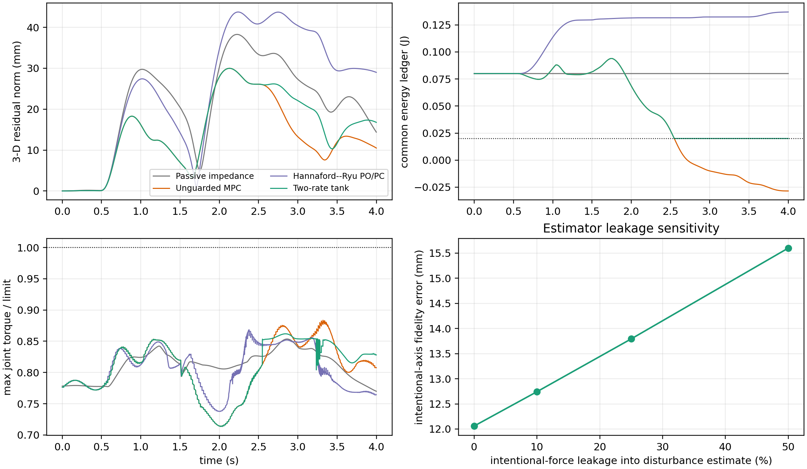

---
header-includes:
  - \usepackage{placeins}
---

# 面向阻抗因果物理交互的双速率能量授权残差 MPC

## 摘要

残差模型预测控制（residual MPC）可以抑制柔顺机器人受到的扰动，但其修正力旋量同时也构成了一个主动的交互端口。仅在 MPC 更新时刻检查无源性，会使两次更新之间被保持的力旋量得不到检查；而严格的时域无源性控制则会抑制掉大部分预测修正量。本文考虑一种双速率架构：一个运动到力旋量的阻抗作为名义物理控制器，一个 100 Hz 的 MPC 提出一个平移方向的残差力旋量，一个 1 kHz 的投影则同时强制执行一个残差能量预算与完整的关节力矩包络。新颖之处并不在于阻抗、MPC 与无源性三者的组合——被动式模型预测阻抗控制、预测式变阻抗/导纳控制，以及能量 tank 控制都已是成熟方法。本文关注的，是在两次 MPC 更新之间对残差端口进行授权。一个连续时间的组合命题与一个快采样能量下限引理支撑了这一设计，本文将其与 Hannaford–Ryu 时域无源性观测器/控制器的一个平移方向推广版本进行对比。在一个力矩控制的 7 自由度 Franka FR3 上进行的 20 组匹配 MuJoCo 试验中，所提方法未产生 tank 下限违反、名义力矩不可行，或 QP 求解失败。它相对被动阻抗将残差位置 RMS 降低 23.7%，相对严格时域无源性控制降低 35.4%，尽管仍比不加能量约束的 MPC 差 19.5%。快速投影的重要性，体现在一个 manager-rate guard 上：它使用相同的授权规则，但只每 10 ms（而非每 1 ms）检查一次。它的跟踪表现与所提控制器在统计上无法区分（\(p=0.656\)），但它在全部 20 组试验中都击穿了 tank 下限；而每个快采样点都授权的方案则没有任何违反。一项独立的力分解检验暴露了另一个局限：由于墙壁反作用力被并入了扰动估计，控制器会推入接触而不激活能量 tank。因此，即便力被错误分类，能量与力矩检查仍然保持有效。

**关键词：** 阻抗控制，残差模型预测控制，无源性，能量 tank，多速率控制，物理人机交互

## 1. 引言

阻抗控制在机器人的物理交互端口上暴露出一个期望的"运动到力旋量"关系 [1]。预测控制则提供了互补的优势：扰动预见、有限时域内的资源分配，以及显式的执行器约束。困难在于能量层面：一个附加的预测力旋量即便在名义阻抗本身是无源的情况下，也可能注入能量；而一个在慢速优化器节拍上做出的决策，在其被保持（held）的这段时间内，随着速度与执行器裕度的演化，未必仍然是可行的。

本文的架构包含三个组成部分：

1. 一个 1 kHz 的笛卡尔阻抗控制器，产生完整的名义关节力矩；
2. 一个 100 Hz 的 MPC，提出一个附加的平移残差力旋量；以及
3. 一个 1 kHz 的实现（realization）层，依据测量到的速度、tank 能量和完整关节力矩裕度，对被保持的提案（proposal）进行缩放。

第 2 节给出该回路的一个非形式化概览。第 4 节与第 5 节随后建立机器人模型、名义阻抗、分析用的导纳参考、残差动力学、MPC，以及授权层。

本文的贡献包括：

- 一种因果与能量上的分解，将名义阻抗、意图响应参考（intentional-response reference）与残差力旋量授权三者分开；
- 一个连续时间的组合结果与一个离散快采样不变量（invariant），二者都包含"实际被实现的（realized）"而非仅仅"被请求的（requested）"残差力旋量；
- 一个力矩控制的 7 自由度 FR3 基准测试，具备完整质量矩阵、雅可比矩阵、重力/科氏偏置、姿态保持、零空间控制与逐关节力矩限制；
- 一个与原始公式忠实对应的 Hannaford–Ryu 无源性观测器/控制器（PO/PC）基线，共享同一个名义控制器与同一个原始 MPC 提案；以及
- 一项直接的力分离泄漏（leakage）研究，用以量化意图交互响应的退化程度。

本文的目标是一个可复用的实现接口，以及支持更新间授权的证据，而不是一个全新的无源性或 MPC 原理。

## 2. 双速率回路的工作方式

控制器把预测与实现分配给了一个慢速 manager 和机器人的快速伺服回路。

**快循环（1 kHz）。** 名义阻抗根据当前的位置与速度误差计算出一个力旋量，很像一个弹簧阻尼器。这个力旋量被转换为关节力矩。该循环还会按机器人当前构型，把慢速 manager 最近发布的*残差*力旋量转换为力矩。在残差被加入之前，会先对其进行缩放，以满足瞬时的力矩裕度与当前可用的 tank 能量。这一授权在每一个伺服节拍都会运行。

**慢循环（100 Hz）。** 每 10 ms，manager 在一个 0.20 s 的时域上预测阻抗误差，并在关节力矩包络的约束下选择一个附加的残差力旋量。它每个周期都计算一个跟踪修正量，而不是等到出现失效条件才行动。该优化不包含 tank 预算；这个预算是由快循环在实现被提出的力旋量时强制执行的。

**为什么要两个速率？** 时域预测与优化的开销太大，无法在每个伺服节拍都重复进行。然而，在被提出的力旋量被保持期间，速度、tank 能量与执行器裕度都可能发生变化。因此，快速层在每个节拍都会重新计算力矩转换、能量账本与执行器裕度，并在必要时把被保持的修正量向下（绝不会向上）缩放。第 4 节与第 5 节将这两个回路加以形式化，第 6 节则描述了去掉快速授权后的消融结果。

## 3. 与已有工作的关系

阻抗、MPC 与无源性三者的广泛组合已属成熟做法。Cao、Cheng 与 Li 采用底层变阻抗控制器加上层 MPC 的结构，在一个储能约束下计算互补力矩；他们证明了无源性与可行性，并在 Franka Panda 上进行了验证 [2]。这是与本文架构最接近的先例，也排除了仅凭"叠加一个阻抗回路与一个预测修正"就能主张新颖性的空间。

预测式阻抗自适应同样已经相当成熟。Haninger、Hegeler 与 Peternel 利用学习到的交互模型对轨迹与阻抗进行优化 [3]。Xue 等人将预测式变阻抗、环境估计、鲁棒性与无源切换结合在一起 [4]。Shen 等人在一个用于液压机械臂的预测式变阻抗控制器中嵌入了无源性指标 [5]。Mahfouz 等人在无源性约束下优化导纳参数，并用七名受试者进行了验证 [6]。这些方法优化或调度的是被渲染出来的柔顺特性本身；本文方法则固定物理层面的名义阻抗，转而对一个独立的残差力旋量进行授权。

能量监督（energy supervision）的历史比上述所有预测式控制器都更早。Hannaford 与 Ryu 的时域 PO/PC 测量采样端口能量，并恰好加入足以消除所产生能量的阻尼 [7]。Ferraguti、Secchi 与 Fantuzzi 利用能量 tank 以无源方式渲染时变刚度 [8]，相关的分层能量 tank 架构也已在机器人手术中得到验证 [9]。Guo 等人提出"终极无源性（ultimate passivity）"，在性能模式与保守模式之间切换，同时保持一个终极能量界 [10]。

在阻抗/无源性文献之外，也反复出现一种结构上相似的模式：在请求到达被控对象之前，由一个慢速监督层对一个快速名义控制器的请求进行检查或修正——这正是参考与指令调节器（reference and command governors）[12]、控制屏障函数（CBF）安全滤波器 [13]，以及面向学习型控制器的预测安全认证 [14] 所共享的架构。这些方法通常是针对状态或执行器约束，对一个通用的名义控制器进行监督；本文方法则是针对一个显式的能量预算，专门监督一个残差力旋量端口，其名义控制器本身就是物理阻抗律，而非任意或学习得到的策略。第 2 节中的双速率划分——一个始终在线、每个伺服节拍都重新检查慢速提案的快速实现层——正是把这种"慢检查/快守护"模式应用到了残差能量授权上，而不是状态或执行器约束上；第 7.1 节中 B4 的结果（一个只在慢速率上重新检查的守护方案）在这个残差能量的具体场景下，提供了一个具体例子，说明为何一个与安全相关的慢速率提案可能需要在更快的实现速率上被重新验证。

这些最接近的架构在同样的三个维度上存在差异：被优化或被监督的是什么量、依靠什么机制来保证能量安全，以及方法是如何被验证的。Hannaford 与 Ryu 的 PO/PC [7] 以零参考阻尼监督一个任意的采样端口，在触觉硬件上得到验证。基于 tank 的阻抗方法 [8]、[9] 则通过储能来监督时变的交互行为，在机器人样机上得到验证。被动式模型预测阻抗 [2] 在一个预测的储能约束下优化互补力矩，在 Franka 实验中得到验证。预测式阻抗/变阻抗方法 [3]--[5] 在任务相关约束或无源性约束下优化轨迹和/或阻抗本身，均在机器人实验中得到验证。预测式导纳 [6] 在一个嵌入式无源性约束下优化导纳参数，用 Jaco-2 与七名受试者进行了验证。终极无源性 [10] 则通过切换控制器模式来保持一个终极能量界，在阻抗/导纳机器人上得到验证。本文则通过一个 100 Hz 的提案与一个 1 kHz 的能量/力矩投影来优化一个附加的残差力旋量，在 7 自由度刚体仿真中进行了验证。

由此留下一个聚焦的问题：一个预测式残差力旋量能否从一个有限、可补充的能量预算中支取，并以更快的速率被实现，同时不改变名义阻抗、也不违反力矩接口？

## 4. 机器人动力学与控制架构

我们现在定义机器人动力学、物理阻抗控制器、分析用的导纳参考，以及 MPC 所使用的误差模型。记号汇总如下。

**记号。**

- \(q,\dot q\) —— 关节位置、速度（rad, rad/s）
- \(M(q),h(q,\dot q)\) —— 关节质量矩阵、重力/科氏偏置（kg·m², N·m）
- \(J_v(q),J_\omega(q)\) —— 平移、旋转任务雅可比矩阵
- \(\tau\) —— 指令关节力矩（N·m）
- \(F=F_h+d+F_e\) —— 任务空间总力：意图力、可抑制力、环境力（N）
- \(\Lambda\) —— 平移方向的操作空间（任务空间）惯量（kg）
- \(p,v=J_v\dot q\) —— 任务空间位置、速度（m, m/s）
- \(e=p-p_0\) —— 相对固定名义位姿 \(p_0\) 的位置误差（m）
- \(K_I,D_I\) —— 渲染出的阻抗刚度、阻尼（N/m, N·s/m）
- \(F_I\) —— 阻抗律力旋量，即物理名义控制量（N）
- \(\tau_I\) —— 完整名义关节力矩：阻抗 + 姿态 + 姿势保持（N·m）
- \(x_I\) —— 导纳律参考轨迹，仅用于分析，从不被指令执行（m）
- \(z=e-x_I\) —— 残差：真实误差与导纳参考之间的差距（m）
- \(F_r\) —— MPC 提出的残差力旋量（N）
- \(H\) —— 阻抗储能，一个类能量的 Lyapunov 函数（J）
- \(E\) —— 残差能量 tank 账本（J）

### 4.A 关节与任务空间动力学

对于该 7 自由度机械臂，

\[
M(q)\ddot q+h(q,\dot q)=\tau+J_v(q)^\top F,
\qquad F=F_h+d+F_e.
\tag{1}
\]

其中，\(h\) 是完整的重力/科氏偏置，\(F_h\) 是意图人类作用力，\(d\) 是可抑制的力分量，\(F_e\) 是被动环境力旋量。平移方向的操作空间惯量为

\[
\Lambda=(J_vM^{-1}J_v^\top)^{-1}.
\tag{2}
\]

矩阵 \(\Lambda\) 是末端执行器处所呈现的任务空间质量，并随构型变化。MuJoCo 实现在每一个 1 kHz 采样点，都从当前非线性状态出发计算出 \(M,h,J_v\) 以及旋转雅可比矩阵 \(J_\omega\)。

### 4.B 阻抗控制：物理名义控制器

阻抗控制直接根据测得的运动误差指令一个力旋量——它是*误差到力*因果的。对于固定的名义位置 \(p_0\) 与姿态 \(R_0\)，定义 \(e=p-p_0\)，\(v=J_v\dot q\)，则有

\[
F_I=-K_Ie-D_Iv.
\tag{3}
\]

这一控制律的作用就像一个安装在末端执行器与固定名义位姿之间的虚拟弹簧阻尼器。它是以 1 kHz 执行的物理控制器。完整的名义力矩为

\[
\tau_I=h+J_v^\top F_I+J_\omega^\top F_R+N_v^\top\tau_0,
\tag{4}
\]

其中 \(F_R\) 保持姿态，动力学一致的平移零空间投影算子 \(N_v\) 中包含姿势调节。MPC（第 5 节）提出的残差力旋量是通过同一条物理通道加入的，而不是另辟一条通道：

\[
\tau=\tau_I+J_v^\top F_r.
\tag{5}
\]

忽略已披露的辅助任务泄漏，平移方向的储能为

\[
H=\tfrac12v^\top\Lambda v+\tfrac12e^\top K_Ie.
\tag{6}
\]

储能 \(H\) 由任务空间动能与虚拟弹簧的势能共同组成。其局部功率平衡为

\[
\dot H\le F^\top v-v^\top D_Iv+F_r^\top v.
\tag{7}
\]

外部做功 \(F^\top v\) 增大储能，名义阻尼 \(-v^\top D_Iv\) 使其耗散，\(F_r^\top v\) 则是残差力旋量注入或抽走的功率。第 5.2 节的 tank 对这一残差端口进行授权。式(7)在 Proposition 1 所使用的常数-\(\Lambda\) 近似下是精确成立的。当 \(\Lambda\) 随构型变化时，对式(6)求导会加入一个 \(\tfrac12v^\top\dot\Lambda v\) 项。因此，对于已实现的非线性被控对象，我们依赖的是引理 1 的快采样账本与力矩不变量，而不是把式(7)当作一个精确的储能恒等式。

### 4.C 导纳控制与分析用的意图响应参考

构造柔顺控制器的另一种、在该文献中也非常常见的方式是*导纳*控制：不再把误差映射为力，而是把一个力到运动的关系向前积分得到一条参考轨迹，再用一个内环去跟踪该轨迹。具体地，

\[
M_I\ddot x_I+D_I\dot x_I+K_Ix_I=F_h.
\tag{8}
\]

状态 \(x_I\) 是一个由测得的人类作用力 \(F_h\) 驱动的虚拟质量-弹簧-阻尼系统的轨迹。它是通过对式(8)积分得到的，而不是通过指令一个力旋量得到的。一个在补偿了机器人动力学之后调节 \(p-x_I\) 的内环，可以得到一个便利的双积分器残差模型。这一构造仍然是*导纳因果*的：力驱动一条运动参考。

式(8)不是物理控制器。第 4.B 节的阻抗律提供了被指令的力旋量，以及式(7)中的端口功率分解，而式(8)仅作为一个**分析用的意图响应参考**。由于物理控制器是阻抗因果的，残差模型依赖于所渲染出的刚度、阻尼与操作空间惯量。与一个真正的导纳控制器的残差模型不同，它不是一个与增益无关的双积分器，QP 矩阵也无法独立于这些增益被复用。

### 4.D 基于误差的残差动力学

式(8)引入了一个通用的导纳质量 \(M_I\)。此处我们设 \(M_I\equiv\Lambda(q)\)，使用与物理阻抗律相同的、随构型变化的操作空间惯量，而不是把导纳质量当作一个自由参数。这是一次刻意的替换，而不是式(8)的一个一般性质：它使得分析参考与实测的阻抗误差满足相同的二阶结构。二者的差随后即可得到式(10)，而不需要额外的 \(M_I^{-1}\) 项。用任务坐标写出，

\[
\ddot x_I=\Lambda^{-1}(F_h-D_I\dot x_I-K_Ix_I).
\tag{9}
\]

这一分析参考在每个快循环节拍都使用当前的 \(\Lambda(q)\)，与机器人状态一起被积分；\(x_I\) 从不会被指令给机器人。将 \(z=e-x_I\) 定义为实测的阻抗误差与导纳参考之间的差，即可得到每次 manager 更新所使用的冻结局部模型：

\[
\ddot z=\Lambda^{-1}(-K_Iz-D_I\dot z+F_r+\hat d).
\tag{10}
\]

因此，\(z\) 在名义刚度与阻尼、MPC 残差力旋量，以及估计的扰动 \(\hat d\) 的作用下演化。它对 \(K_I,D_I\) 以及 \(\Lambda(q)\) 的显式依赖，正是保留一个阻抗因果物理控制器所付出的计算代价。

## 5. 预测提案与两种快速授权器

### 5.1 残差 MPC

在 \(T_m=10\) ms 处，式(10)按零阶保持（zero-order hold）离散化为

\[
\xi_{k+1}=A_k\xi_k+B_k(F_{r,k}+\hat d_k),
\qquad \xi=[z^\top,\dot z^\top]^\top.
\tag{11}
\]

时域长度为 \(N\) 的提案求解

\[
\min_{F_{r,0:N-1}}
\frac12\sum_{i=1}^{N}\xi_i^\top Q\xi_i
+\frac12\sum_{i=0}^{N-1}F_{r,i}^\top RF_{r,i}
\tag{12}
\]

约束条件为一个笛卡尔力旋量盒约束，以及当前模型下的力矩包络约束：

\[
|\tau_I+J_v^\top F_{r,i}|\le\rho\tau_{\max},
\qquad \rho=0.28.
\tag{13}
\]

这个 28% 的包络代表一个刻意降额（derated）的连续预算，在正式实验开始前就已选定，目的是在保持名义力矩可行的同时，为残差保留裕度压力；它并不是厂商给出的连续工作制规格，无论如何，绝对的 FR3 限制始终是 MuJoCo 的安全兜底。本基准测试会剔除任何 \(\tau_I\) 本身就不可行的试验。由于式(13)冻结了 \(J_v\) 和 \(\tau_I\)，只有快速层才对实际实现的非线性采样点进行认证。

### 5.2 所提出的有限能量授权方案

设 tank 在未触及其上限时满足

\[
\dot E=v^\top D_Iv-F_r^\top v,
\qquad E\ge E_{\min}>0.
\tag{14}
\]

**命题 1（理想组合）。** 若式(7)成立，实际被实现的残差力旋量与式(14)中所用的 \(F_r\) 相同，并且存在某种授权机制维持 \(E\ge E_{\min}\)，则

\[
\dot H+\dot E\le F^\top v.
\tag{15}
\]

*证明。* 将式(7)与式(14)相加。残差功率项与名义阻尼项相互抵消。在 tank 上限处被丢弃的能量只会额外增加非负的耗散。\(\square\)

命题 1 完全继承了式(7)自身的适用范围：式(7)是一个针对常数 \(\Lambda\) 的控制器构造不等式，而不是针对 FR3 这种随构型变化的 \(\Lambda(q)\)（见第 4.B 节）的精确储能恒等式。因此，引理 1 在快采样点上所认证的 tank 下限 \(E\ge E_{\min}\)，是对实际被实现账本的一个能量记账不变量，而不是针对变惯量被控对象的一个独立无源性认证；表 1 中"最小账本"一列应据此解读。

在快采样点 \(\ell\) 处，力矩可行的缩放系数 \(\alpha_{\tau,\ell}\) 是满足下式的、\([0,1]\) 内最大的值：

\[
|\tau_{I,\ell}+J_{v,\ell}^\top
(\alpha_{\tau,\ell}F^{\rm raw}_{r,k})|
\le\rho\tau_{\max}.
\tag{16}
\]

令 \(\bar F_{r,\ell}=\alpha_{\tau,\ell}F^{\rm raw}_{r,k}\)。能量缩放系数为

\[
\alpha_{E,\ell}=
\begin{cases}
1,&\bar F_{r,\ell}^\top v_\ell\le0,\\
\min\!\left(1,
\dfrac{E_\ell-E_{\min}+h v_\ell^\top D_Iv_\ell}
{h\bar F_{r,\ell}^\top v_\ell}\right),&\text{否则}.
\end{cases}
\tag{17}
\]

实际施加的力旋量与账本更新为

\[
F_{r,\ell}=\alpha_{E,\ell}\bar F_{r,\ell},
\tag{18}
\]

\[
E_{\ell+1}=\min\{E_{\max},E_\ell+h(v_\ell^\top D_Iv_\ell-F_{r,\ell}^\top v_\ell)\}.
\tag{19}
\]

**引理 1（快采样接口不变量）。** 若 \(E_0\ge E_{\min}\)，且名义力矩满足 \(|\tau_I|\le\rho\tau_{\max}\)，则式(16)–(19)保证在每一个快采样点都有 \(E_\ell\ge E_{\min}\) 以及 \(|\tau_{I,\ell}+J_{v,\ell}^\top F_{r,\ell}| \le\rho\tau_{\max}\)。

*证明。* 式(16)从可行的名义力矩出发构造出一条可行的线段。再乘以 \(\alpha_E\in[0,1]\) 进行缩放，仍然停留在该线段上。当残差功率非正时，式(19)不可能使账本减少。当残差功率为正时，式(17)将可抽取的能量限制在 \(E_{\min}\) 之上的可用能量，再加上当前的阻尼贡献之内。\(\square\)

### 5.3 外部 Hannaford–Ryu PO/PC 基线

该外部基线共享同一个 \(F_r^{\rm raw}\)、同一个名义力矩、同一套力矩缩放、同一个估计器与同一个采样率。依照 [7] 中给出的阻抗因果串联 PO/PC，将其从标量端口推广到 3 维平移端口，定义

\[
W_{\ell+1}^{\rm pred}=W_\ell-h\bar F_{r,\ell}^\top v_\ell.
\tag{20}
\]

若该预测值为负，控制器加入恰好足够的最小各向同性阻尼：

\[
\gamma_\ell=
\frac{-W_{\ell+1}^{\rm pred}}{h\|v_\ell\|^2},
\qquad
F_{r,\ell}=\bar F_{r,\ell}-\gamma_\ell v_\ell;
\tag{21}
\]

否则 \(\gamma_\ell=0\)。最后再施加一个力矩可行的标量缩放，观测器则根据实际施加的力旋量进行更新。这是对 [7] 的一个与原始公式忠实对应的平移方向推广，其中包含两处已披露的改动：原公式的标量端口被推广到 \(\|v\|^2\)，且所有输出都经过同一个 FR3 力矩接口。该基线的初始能量参考为零，而所提出的 tank 允许有限的储能以及对名义阻尼的收获（harvesting）。这正是本文所要进行的科学对比。

式(21)的增益满足 \(\gamma_\ell\propto\|v_\ell\|^{-2}\)，与已发表公式保持一致、未做任何修改：当端口速度趋近于零时，\(\gamma_\ell\) 会结构性地发散，这与底层无源性亏空 \(W_{\ell+1}^{\rm pred}\) 的大小无关。第 7.1 节报告了在本基准测试的实际运行速度下，这一结构被触发的频率与严重程度。

## 6. 基准测试设计

### 6.1 被控对象、控制器与信号

被控对象是来自 MuJoCo Menagerie 的力矩控制 Franka FR3 模型，以 1 kHz 积分。内置的位置执行器被禁用；本基准测试直接施加关节力矩。五个控制器分别为：

- **B1 被动阻抗：** 式(3)–(4)，\(F_r=0\)；
- **B2 无约束 MPC（Unguarded MPC）：** 式(11)–(13)，具备快速力矩缩放，但不加任何残差能量限制；
- **B3 Hannaford–Ryu PO/PC：** 同样的原始 MPC，再加上式(20)–(21)；
- **B4 Manager 速率守护（Manager-rate guard）：** 同样的原始 MPC 与式(17)的能量缩放系数 \(\alpha_E\)，但 \(\alpha_E\) 只在每个 manager 节拍计算一次，并在其所跨越的十个快循环节拍内保持不变，而不像 B5 那样每个快循环节拍都重新计算；用于分离出"授权是否必须运行在快速率上"这一问题，而不仅仅是"是否存在某种能量授权"；
- **B5 双速率 tank：** 同样的原始 MPC，再加上式(16)–(19)，每个快循环节拍都重新计算 \(\alpha_E\)。

所有控制器均使用 \(K_I=180\) N/m，\(D_I=28\) N·s/m，100 Hz 的 manager，1 kHz 的力矩回路，\(N=20\)（即 0.20 s），\(E_0=0.08\) J，\(E_{\min}=0.02\) J，以及 \(E_{\max}=0.30\) J。意图力沿 \(x\) 方向包含一个 8 N 的推力，沿 \(z\) 方向包含一个 -5 N 的推力。可抑制力包含三个正弦分量，以及一个从 1.507 s 开始、幅值 12 N、持续 7 ms 的脉冲，出现在两个 manager 节拍之间。一堵单侧被动墙壁位于距名义位姿 35 mm 处。

### 6.2 匹配随机化协议

二十组匹配试验随机化以下量：

- 被动墙壁刚度：500–1500 N/m；
- 被动墙壁阻尼：8–20 N·s/m；
- 可抑制力幅值系数：0.8–1.2；以及
- 三个正弦分量的相位。

每个控制器在每个随机种子下都接收完全相同的实现参数。主要指标包括三维残差位置的 RMS/峰值、最小能量账本、PO 能量、授权激活情况、降额后关节力矩包络的峰值占比、名义不可行次数，以及 QP 求解失败次数。配对统计量是在各随机种子上计算得到的。求解器耗时仅统计 `OSQP.solve` [11]，不包含模型构建、感知或力矩通信。

### 6.3 力分离泄漏测试

主基准测试假定对各力分量有精确的访问权限，而默认的抑制通道则是刻意地把环境反作用力 \(F_e\) 并入 \(\hat d\)（第 7.2 节量化了这一后果）。泄漏测试放宽的是"精确访问"这一假设：

\[
\hat d=d+F_e+\lambda F_h+n_F,
\qquad \lambda\in\{0,0.1,0.25,0.5\}.
\tag{22}
\]

为了把泄漏效应从扰动抑制中分离出来，该测试关闭了 \(d\) 和墙壁，保留 0.05 N 的估计器噪声，并对每个等级各运行五组匹配试验。它报告沿意图力方向的 RMS 误差，以及在持续推力期间实际位移均值与参考位移均值之比。

第二组附属扫描在一个固定的中等泄漏水平（\(\lambda=0.25\)）上，叠加了三种上面主扫描中都设为最简单设置的感知不完美因素：一个 manager 节拍（10 ms）的估计器延迟、AR(1) 型有色噪声（\(\phi=0.9\)，与白噪声基线相同的平稳标准差，因此只有时间相关结构发生变化），以及沿意图力方向、恒定 5 mm/s 的速度估计偏置，且该偏置只作用于反馈给残差 MPC 的状态（力矩回路本身仍使用真实测得的速度）。这三个因素分别单独开启，再全部一起开启，每个条件各五组匹配试验。

第三项检验分离出式(22)中的另一项：在其默认值 \(\lambda=0\) 下，只要发生接触，\(F_e\) 本身——即墙壁自身的反作用力——就会以全权重被并入 \(\hat d\)，因此扰动抑制目标在结构上就包含了抵消合法的接触阻力，而不仅仅是像上面的泄漏测试那样未能抑制真实扰动。二十组匹配试验（墙壁刚度/阻尼按第 6.2 节的方式随机化，周期性扰动被关闭，使得任何墙壁接触都可归因于意图力本身）比较了被动阻抗与所提出的控制器在墙壁穿透量、接触期间指令的修正冲量，以及接触期间授权激活情况上的表现。

## 7. 结果



### 7.1 匹配 FR3 基准测试

**表 1. 二十组匹配 FR3 试验，均值 ± 样本标准差。力矩比是相对于降额后 28% 连续包络的比值。**

| 控制器 | 残差 RMS (mm) | 残差峰值 (mm) | 最小账本/PO (J) | 授权激活比例 | 峰值力矩比 |
|---|---:|---:|---:|---:|---:|
| 被动阻抗 (B1) | 25.42 ± 0.76 | 37.07 ± 1.44 | 0.0800 ± 0.0000 | 0% | 0.853 ± 0.002 |
| 无约束 MPC (B2) | **16.23 ± 0.92** | **28.42 ± 1.68** | -0.0424 ± 0.0137 | 0% | 0.875 ± 0.005 |
| Hannaford–Ryu PO/PC (B3) | 30.00 ± 0.92 | 43.62 ± 1.79 | \(-1.3\times10^{-19}\) PO | 83.36 ± 1.79% | 0.867 ± 0.006 |
| Manager 速率守护 (B4) | 19.40 ± 0.58 | 31.01 ± 1.59 | 0.0184 ± 0.0004 | 25.34 ± 3.91% | 0.910 ± 0.017 |
| **双速率 tank (B5)** | 19.39 ± 0.61 | 31.21 ± 1.80 | **0.0200 ± 0.0000** | 29.79 ± 4.46% | 0.865 ± 0.010 |

无约束控制器的反事实公共账本在 20/20 组试验中都击穿了 0.02 J 的下限。这并不意味着某个物理 tank 变成了负值；它衡量的是控制器在没有授权的情况下"本应"提取出的能量。PO/PC 观测器在每一组试验中都保持非负（在数值精度范围内），所提出的 tank 也从未击穿其下限。

**PO/PC 中的速度奇异增益并不能完全解释其更大的 RMS。** 在一项包含六个随机种子的插桩检验中，式(21)中的 \(\gamma_\ell\) 与端口速度高度相关：各随机种子上 \(1/\|v_\ell\|\) 与 \(\gamma_\ell\) 之间的相关系数为 0.94–0.98。当 \(\|v_\ell\|<5\) mm/s 时，\(\gamma_\ell\) 的均值比其他情形大 40–60 倍，个别增益可达 \(10^4\)–\(10^5\)。机器人在每组试验中有 38–53% 的时间处于这一低速区间。这一行为直接源于式(21)中继承自 [7] 的速度平方分母结构。一个实用变体 \(\texttt{tdpc\_regularized}\) 把 5 mm/s 以下的 \(\gamma_\ell\) 置零。在十组匹配随机种子上，它将 RMS 从 30.05 ± 1.04 mm 降到 29.16 ± 1.11 mm，改善约 3.0%。tank 控制器仍然达到 19.18 ± 0.66 mm（配对差 +9.98 mm，95% 置信区间 [9.36, 10.60]，\(p=4.3\times10^{-11}\)）。正则化还使 PO 观测器降到 \(-1.7\times10^{-3}\) J，因为修正在死区内被推迟了。因此，这一奇异增益是可测量的，但主要的性能差距来自零参考阻尼的频繁激活，而不仅仅是低速增益本身的量级。

**Manager 速率守护分离出了授权频率这一因素本身的影响。** B4 与 B5 使用相同的 MPC 提案与授权规则。B5 在每个快循环节拍都重新计算 \(\alpha_E\)，而 B4 每个 manager 周期只计算一次，并在随后九个快循环节拍内保持不变。二者的跟踪表现在统计上无法区分（配对差 +0.008 mm，95% 置信区间 [-0.029, 0.045]，\(p=0.656\)）。尽管如此，B4 在全部 20 组试验中都击穿了 tank 下限，平均违反量为 0.0016 J（范围 0.0010–0.0022 J），而 B5 没有任何违反。在这一动力学条件下，即便 \(\alpha_E\) 在被计算出的那一刻是正确的，最多 10 ms 的过期也足以打破下限保证。这一结果依赖的是在两次 manager 更新之间检查授权，而不仅仅是周期性地检查它。

B4 更高的峰值力矩比（0.910，相对于 B5 的 0.865）是同一个过期问题的一个表现，而不是另一个独立的问题。力矩可行性（式16）是按快采样点 \(\ell\) 索引的，对每一个控制器（包括 B4）每个节拍都会重新计算——它从不会被保持不变——因此 \(|\tau_{I,\ell}+J_{v,\ell}^\top F_{r,\ell}|\le\rho\tau_{\max}\) 无论运行的是哪个控制器都会被同等地强制满足，B4 在全部 20 组试验中观测到的最大比值为 0.941，仍然落在包络之内。真正不同的只有能量缩放系数（式17）：B4 过期的 \(\alpha_E\) 对已经力矩可行的候选力旋量的缩减幅度，比 B5 在同一时刻重新计算出来的结果要小，因此平均而言，会有更大比例的力矩可行力旋量被实际施加出去——正是这种授权上的"少花"，既使得 tank 跌破下限，也表现为更高的实际力矩利用率。力矩认证在整个过程中始终得到满足；能量下限认证则没有——这两个现象都源于同一个过期的能量缩放，一个是良性的，另一个才是本文所关心的核心失效模式。

过期扫描给出了相同的图景。以 \(\{1,2,5,10\}\) ms 的重新检查周期在十组匹配随机种子上进行测试，2 ms 处所有随机种子的 tank 下限就已经被击穿。平均违反量从 2 ms 处的 \(5.9\times10^{-5}\) J，增长到 5 ms 处的 \(7.4\times10^{-4}\) J，再到 10 ms 处的 \(1.6\times10^{-3}\) J。残差 RMS 在整个范围内基本持平，为 19.18–19.20 mm。一旦 \(\alpha_E\) 被保持超过一个快采样点，引理 1 就不再适用；实验表明，在被测试的最短过期周期就已出现违反，且没有相应的跟踪收益。

所提出的控制器相对于被动阻抗，将残差 RMS 降低了 23.7%（配对差 -6.024 mm，95% 置信区间 [-6.500, -5.549]，\(p=1.80\times10^{-16}\)）。相对于严格 PO/PC，降低了 35.4%（差值 -10.605 mm，95% 置信区间 [-10.985, -10.225]，\(p=6.61\times10^{-23}\)）。无约束 MPC 仍然比所提方法好 19.5%（所提方法减无约束 MPC 为 +3.166 mm，95% 置信区间 [2.637, 3.695]，\(p=1.25\times10^{-10}\)）。由此可见，有限的储能恢复了严格零参考 PO/PC 所抹去的大部分性能，但并未消除面向无源性的授权所带来的能量代价。

**表 1 中"比无约束差 19.5%"这个数字，只是一条可调的授权-性能曲线上的一个点，而不是该方法的性能上限。** \(E_0=0.08\) J 是一个刻意保守的默认值，选择它是为了让授权在所报告的试验中始终保持明显的激活状态，而不是为了展示控制器能达到的最佳跟踪表现。将初始预算在固定下限之上进行扫描，\(E_0-E_{\min}\in\{0,0.02,0.06,0.12,0.25\}\) J（十组匹配试验，主协议），会使所提出的控制器在 PO/PC 式的保守与无约束式的激进之间连续移动，同时 tank 下限在每一个被测预算值下都始终保持：残差 RMS 从零预算时的 \(21.49\pm2.24\) mm 单调下降到最大预算时的 \(15.98\pm0.72\) mm——在最大预算下，这一数值已经追平、甚至在采样噪声范围内略微超过表 1 中无约束 MPC 自身的 \(16.23\pm0.92\) mm，同时授权激活比例从 68.9% 降到恰好 0%。初始 tank 预算 \(E_0-E_{\min}\) 是本架构中一个显式的标量调节参数，在授权激活程度与残差跟踪性能之间连续权衡，同时 tank 下限在每一个被测值下都保持不变。这与那些把无源性或阻抗自适应直接嵌入预测控制器本身的方法（例如被动式模型预测阻抗 [2] 或终极无源性 [10]）在结构上是不同的。墙壁接触相关指标则讲述了一个更尖锐的故事：随着预算从 0 增长到 0.06 J，最大穿透量从 5.46 mm 升到 7.70 mm，朝墙内的冲量从 0.86 N·s 升到 1.71 N·s，此后**恰好在本文自身默认预算处达到饱和**，即便 RMS 在更大预算下仍在持续改善，这两个量也不再进一步移动——tank 对上文墙壁误分类失效模式的这一附带缓解效果，比它对整体跟踪的效果更早耗尽。因此，更大的预算并不是一个免费的改进：它以更激进、且未经修正地朝一个被误分类的接触推入为代价，换取更低的 RMS，而这种耦合是本基准测试仅使用单一固定 \(E_0\) 所无法揭示的。

每一组被接受的试验都实现了零名义力矩不可行与零 QP 求解失败。所提出控制器的最大力矩比低于 0.889。平均求解器核心耗时为 0.157 ms；每次运行内 95 分位数的均值为 0.164 ms，记录到的最大求解耗时为 0.276 ms。这个数字仅仅是 `OSQP.solve` 本身，并不包含完整的 manager 节拍计算：在一次代表性试验上进行的分阶段计时（状态获取、通过 `nominal_torque` 计算雅可比/惯量、扰动估计组装、完整的 `ResidualMPC3D.control` 调用——包括时域矩阵构建——以及快速投影）测得，完整的预测提案调用——每个 manager 节拍都要根据当前的 \(\Lambda^{-1}(q)\) 重新构建时域矩阵，而不只是调用一次 OSQP——平均耗时 2.40 ms（95 分位数 2.56 ms），相比之下状态获取为 237 \(\mu\)s，雅可比/惯量阶段为 31.6 \(\mu\)s，快速投影为 16.1 \(\mu\)s，其中每一项都是每 1 ms 节拍就运行一次，而不仅仅是每个 manager 节拍。在一个 manager 节拍上把这些加总，仍然舒适地落在 10 ms 预算之内（约 2.7 ms / 10 ms），在一个纯快循环节拍上也舒适地落在 1 ms 之内（约 0.28 ms）；因此在这台开发机器的软件栈上，100 Hz 的截止时限是由完整计算而不仅仅是求解器核心来满足的——但这仍然只是仿真环境下的软件计时测量，而不是包含感知、通信与真实硬件接口上实时操作系统调度在内的端到端认证。

### 7.2 力分离泄漏

**表 2. 意图力泄漏，每个等级五组匹配噪声随机种子。**

| 泄漏系数 \(\lambda\) | 意图轴向误差 RMS (mm) | 实际/参考响应比 | 最小 tank (J) |
|---:|---:|---:|---:|
| 0 | 11.759 ± 0.007 | 0.741 | 0.020 |
| 0.10 | 12.399 ± 0.007 | 0.724 | 0.020 |
| 0.25 | 13.383 ± 0.007 | 0.698 | 0.020 |
| 0.50 | 15.073 ± 0.006 | 0.655 | 0.020 |

在 50% 泄漏水平下，保真度误差比零泄漏时高 28.2%，平均响应比下降了 8.6 个百分点。tank 与力矩不变量依然保持，因为问题并不是数值上的：部分意图人类输入被标记成了扰动。因此，力的分解是一项核心接口需求，而不是一个次要的实现细节。

**表 3. 在固定 \(\lambda=0.25\) 泄漏水平下的感知真实性扫描，每个条件五组匹配随机种子。**

| 条件 | 意图轴向误差 RMS (mm) | 响应比 | 最小 tank (J) |
|---|---:|---:|---:|
| 基线（\(\lambda=0.25\)，未加入额外真实性因素） | 13.384 ± 0.008 | 0.698 | 0.020 |
| 仅延迟（10 ms） | 13.368 ± 0.008 | 0.699 | 0.020 |
| 仅有色噪声 | 13.374 ± 0.039 | 0.699 | 0.020 |
| 仅速度偏置（5 mm/s） | 13.730 ± 0.008 | 0.690 | 0.020 |
| 全部组合 | 13.704 ± 0.039 | 0.690 | 0.020 |

基线一行是本次扫描自身在 \(\lambda=0.25\) 下的抽样（随机种子与表 2 不同，但在统计上与表 2 的 13.383 mm 一致）。三个因素单独作用时，没有一个使保真度误差相对基线恶化超过 2.6%，且 tank 下限与力矩包络在每个条件下都保持——这些安全认证机制对当前水平下的这些具体感知不完美因素并不敏感。单节拍估计器延迟与有色噪声的相关结构，都几乎不改变均值；有色噪声反而使跨随机种子的标准差扩大了约五倍（从 0.008 mm 到 0.039 mm），因为时间上相关的噪声抵抗了时域窗口自带的隐式平均效应。速度估计偏置是三者中影响最大的一个，使保真度误差恶化 2.6%，响应比下降 0.9 个百分点，因为它污染的是残差 MPC 自身用来反馈的状态，而不仅仅是扰动估计。组合条件的表现更接近仅速度偏置这一条件，而不是三者效应的简单叠加，这与泄漏扫描本身传达的信息是一致的：安全性（tank、力矩）在这些干扰下都能保持，但任务保真度会按被污染的通道成比例地退化；除了表中给出的数字之外，对于组合条件为何没有超过仅速度偏置条件这一点，本文不作进一步的因果主张。

**墙壁反作用力被误分类为可抑制扰动，而 tank 认证机制对此毫无察觉。** 在仅有意图力（周期性扰动被关闭）的情况下，被动阻抗在全部 20 组随机化墙壁的试验中都从未触及墙壁；所提出的控制器在每一组试验中都与墙壁发生接触（平均穿透量 7.24 ± 0.60 mm），并且在接触期间，平均指令了一个 1.87 ± 0.27 N·s、方向朝*墙内*的修正冲量——这与式(22)把墙壁自身的阻力 \(F_e\) 并入 \(\hat d\)、随后 MPC 试图抵消它的机制是一致的。在全部 20 组试验的整个接触窗口期间，能量 tank 授权始终处于未激活状态：这是一个力分类错误，而不是能量预算或力矩限制的违反，因此本文其他地方所报告的"零违反"认证，对这一失效模式没有提供任何保护。这是一种比上文泄漏结果更严重、也不同性质的失效模式——泄漏会导致控制器对真实人类输入反应不足，而这里则会导致控制器主动违背一个物理约束——而且这个问题在主基准测试自身的默认协议（第 6.1 节）中，以同等量级持续存在，并不只出现在这项孤立的检验中。

### 7.3 Manager 速率敏感性：不存在普遍最优速率

第 6–7 节将 manager 固定在 100 Hz。为了检验这一选择是否具有决定性影响，主匹配基准测试、泄漏扫描与感知真实性扫描又分别在 20 Hz 与 50 Hz 下重新运行了一遍，全程保持时域长度固定为 0.20 s——变化的只是重新检查的间隔（50、20 或 10 ms），而不是 manager 的前瞻时长。

**表 4. Manager 速率扫描，主匹配基准测试，仅双速率控制器（20 组随机种子）。**

| Manager 速率 | RMS (mm) | 峰值 (mm) | 授权激活比例 | 相对无约束 MPC | 求解最大耗时 / 周期 |
|---|---:|---:|---:|---:|---:|
| 20 Hz | 18.96 ± 0.53 | 30.71 | 17.2% | +5.1% | 0.140 ms / 50 ms |
| 50 Hz | 19.50 ± 0.70 | 31.58 | 27.4% | +16.3% | 0.169 ms / 20 ms |
| 100 Hz | 19.39 ± 0.61 | 31.21 | 29.8% | +19.5% | 0.285 ms / 10 ms |

在这种周期性墙壁接触加扰动的场景下，20 Hz 给出了最低的 RMS、最少的介入频率，以及（在本次运行中）相对其自身截止时限最小的计算负担；求解耗时的最大值是墙钟（wall-clock）时间，在固定速率下已观测到不同运行之间可有 2–3 倍的波动，因此 `rate_sweep.py` 自身的输出才是权威记录，而不是本表中这些具体数值。一次代表性试验的诊断数据，不仅描述了这一排序，还解释了它：在 20 Hz 下，所施加修正量的总变差为 12.9 N/s，每秒 0.75 次激活事件，而在 100 Hz 下则为 34.6 N/s、每秒 4.25 次激活事件——抖动（chatter）几乎多出三倍。更能说明问题的是，在 20 Hz 下，tank 处于激活状态时的跟踪表现反而*优于*空闲状态（15.2 对 18.3 mm RMS）；而在 100 Hz 下这一关系发生了反转（20.6 对 16.1 mm）。在这一场景中，较慢的 manager 会给出更少、更大、看起来更连贯的修正；较快的 manager 则会在前一次修正尚未来得及生效之前就重新求解，产生更频繁、也更不果断的调整——这与一种抖动机制是一致的，而不只是单一指标的偶然现象，不过总变差与激活次数这两项诊断本身只是相关关系，并不能排除其他随速率变化的因素（离散化误差、决策变量数目，或估计器行为随重新求解速率而变化）也在同时起作用。

**表 5. Manager 速率扫描，力分离泄漏（每个等级 5 组随机种子）。**

| Manager 速率 | \(\lambda=0\) (mm) | \(\lambda=0.5\) (mm) | 恶化百分比 |
|---|---:|---:|---:|
| 20 Hz | 13.01 ± 0.03 | 17.21 ± 0.03 | 32.3% |
| 50 Hz | 12.06 ± 0.01 | 15.60 ± 0.01 | 29.3% |
| 100 Hz | 11.76 ± 0.01 | 15.07 ± 0.01 | 28.2% |

在这个不同的场景下——一个持续的意图推力，没有墙壁或周期性扰动——排序**发生了反转**：100 Hz 在每一个泄漏等级下都给出最小误差，20 Hz 给出最大误差。跟踪一个阶跃式的持续推力，本质上是一个建立时间（settling-time）问题，而不是扰动抑制问题，因此一个较慢的监督回路很可能在锁定正确的稳态修正量上显得迟钝——这与上面周期性扰动场景中的失效模式正好相反。感知真实性扫描在三个速率下都呈现出相同的定性模式（速度偏置占主导，有色噪声扩大方差，延迟影响可忽略），只是各自相对自身基线发生了平移；这一平移与本表的排序是一致的，但不能作为独立于本表的证据。

**在两种被测场景中都不存在一个占主导地位的 manager 速率，而且没有任何一个速率会损害安全性。** 在本文所报告的每一个场景、每一个速率下，都实现了零 tank 违反、零 QP 求解失败与零名义不可行。第 6–7.2 节全程使用的 100 Hz 设计点，在本文其他地方更为强调的持续推力/泄漏场景下是更好的选择，但表 4 表明它并不是周期性墙壁接触场景下的最佳选择，在该场景中，较慢的 manager 能显著降低介入频率与跟踪误差。让 manager 速率匹配预期扰动自身的时间尺度，而不是想当然地认为"越快越安全"，是本基准测试所揭示、而非解决的一个真实设计问题。

本节扫描的是提案速率：即 MPC 计算一次新的原始残差力旋量的频率。在表 4 与表 5 的每一行中，B5 的快速能量与力矩授权始终固定在 1 kHz，正如第 6.1 节所定义的那样——发生变化的只是 manager 自身发出新提案的重新检查间隔，\(\alpha_E\) 针对快循环节拍状态被重新计算的频率从未改变。这与第 7.1 节的 B4/B5 实验是不同的：那里全程将提案速率固定在 100 Hz，转而改变同一个快循环节拍能量授权是每个节拍都刷新、还是被保持为过期状态。因此，提案速率是一个与性能相关的设计参数，如本节所示，可根据扰动自身的时间尺度进行调节；而快速授权速率则是第 7.1 节所研究的接口保证的一部分，本节并未对其进行改变。

### 7.4 预见式扰动预测：一个负面结果

一项独立的检验，把式(11)中对 \(\hat d_k\) 的冻结零阶保持，替换为一个按任务轴分别进行的卡尔曼滤波，对本基准测试已知扰动频率在整个时域上的预测。在四种、扰动中真正谐波成分占比各不相同的条件下，只有当扰动内容纯粹是谐波时，预测器才与冻结保持在统计上无法区分（\(p=0.90\)）；只要出现任何非谐波成分——本文通篇使用的那个脉冲、单独的那个脉冲，或者墙壁接触——就会导致可测量的跟踪精度下降，而且更长的时域会拉大而不是缩小这一差距。附录 A 给出了完整的协议、表 6 以及时域长度扫描的结果。

### 7.5 解读

三个发现值得强调。第一，有限、可补充的 tank 保留了远比零参考 PO/PC 更多的 MPC 跟踪收益：它既能支取初始能量，也能支取从名义阻尼中回收的能量，因此在扰动下更不保守。第二，残差授权必须在快速实现速率上被刷新：B4 的跟踪表现与 B5 相当，但只要 \(\alpha_E\) 被保持超过一个 manager 周期，它就会击穿 tank 下限，因此慢速周期性授权提供的是一个更弱的保证。第三，正确的能量与力矩核算并不能保证正确的交互行为：如果力分类器出错，快速层可以在满足两个接口的同时，抑制意图输入，或推向一堵被误标为扰动的墙壁。

这些次要研究还揭示了两个实际的局限。没有一个提案速率在所有场景中都是最优的：周期性扰动与持续阶跃分别偏好不同的 manager 速率。同样，谐波预测器只有在输入确实是谐波时才能追平冻结保持方案，一旦信号中出现非谐波成分，其精度就会下降，时域越长越明显。本文测试过的所有预测配置，都没有带来稳健的改进。

本文的对比并不主张优于被动式模型预测阻抗 [2]、预测式变阻抗方法 [3]--[5]，或预测式导纳 [6]。这些控制器优化的是不同的量，其中若干个还具有物理实验验证。第 3 节中的对比是架构层面的比较，而不是数值上的排名。

## 8. 适用范围与局限性

验证使用的是一个非线性 7 自由度刚体仿真，而不是真实硬件。接触发生在一堵虚拟的单侧墙壁上，而不是一个经过测量的真实材料表面，本研究也不包含人类受试者或接触力安全阈值。因此，我们不主张具备临床或工业上的可用性。

Proposition 1 是一个理想化的连续时间组合结果。引理 1 认证的是在快采样点上已实现的能量与力矩接口，但它不是针对整个机器人、姿态任务、零空间控制器、估计器与环境的一个全局采样数据无源性定理。MPC 的时域窗口还冻结了当前的雅可比矩阵、操作空间惯量与名义力矩。快速投影所保证的是已实现输入的可行性，但 MPC 的递归可行性与状态约束并未得到证明。Hannaford–Ryu 基线在平移端口方程上是忠实的，但它是从一个标量触觉接口推广而来，并经过 FR3 力矩投影处理；它并不是在原始 Excalibur 设备上的一次复现。

主基准测试假定对各力分量有精确的访问，尽管 \(F_e\) 是被刻意并入 \(\hat d\) 的。泄漏研究考察的是被 \(F_h\) 污染的情形，感知研究则在一个泄漏水平上加入了延迟、有色噪声与速度偏置。它没有实现一个学习型人类意图估计器，也没有在每一个泄漏值上联合扫描这些效应。墙壁分类检验使用的是一个意图力协议，墙壁刚度与阻尼被随机化。接触几何形状、接近角，以及诸如在接触被探测到后从 \(\hat d\) 中移除 \(F_e\) 之类的可能修复方案，都仍未被测试。

最后，预见式预测器假定扰动频率被精确已知；它不是一种在线频率辨识方法。其时域长度扫描只使用了八组随机种子，而附录 A 中配对研究使用的是二十组。B4 的过期扫描覆盖的是在仿真动力学条件下、1、2、5 与 10 ms 的保持区间。它表明，在超出 B5 自身 1 ms 之后所测试的最短区间处，下限保证就已经失效，但并未确立更长保持时长、或其他快慢速率比下会发生什么。

## 9. 结论

我们保留了一个阻抗因果的物理控制器，只把 MPC 用于提出一个附加的残差力旋量。这一选择放弃了与增益无关的残差矩阵，但换来的是把必须被授权的残差端口功率清楚地暴露出来。由此得到的架构，把一个 100 Hz 的预测提案，与一个基于已测量残差功率和当前关节力矩裕度的 1 kHz 投影配对使用。

FR3 仿真在此前的低阶验证之上，补充了一个时域无源性基线、一个 manager 速率守护方案，以及一项意图/扰动泄漏检验。在授权强度与跟踪性能上，有限 tank 都介于无约束 MPC 与严格零参考 PO/PC 之间。然而，墙壁接触实验说明了为什么一个有效的能量账本还不够：当控制器推向一堵反作用力被分类为扰动的墙壁时，tank 始终保持未激活。

Manager 速率对比为所提出的接口提供了最清晰的证据。B4 使用与 B5 相同的规则，跟踪表现也十分接近（\(p=0.656\)），但当授权只在每个 manager 周期刷新一次时，它在全部 20 组试验中都违反了 tank 下限。补充的扫描实验为 100 Hz 这一设计选择加上了限定条件：它在持续推力跟踪场景下表现良好，而周期性场景则更适合一个更慢的 manager。谐波预测同样是有条件的：它在谐波信号上能追平冻结保持方案，但一旦扰动中出现脉冲或接触就会退化。一个可能的后续方向，是让预测器与时域长度根据探测到的扰动类型自适应调整，尽管目前的结果并未证明这种切换会优于冻结保持方案。更重要的验证，是一次力矩控制的 FR3 或 Panda 接触实验，包含实测力旋量、速度噪声、延迟，以及端到端计时。

## 可复现性

在本目录下：

```bash
cd simulation

MPLCONFIGDIR=/tmp/phri_impedance_fr3_mpl \
XDG_CACHE_HOME=/tmp/phri_impedance_fr3_mpl \
python3 verify_fr3_two_rate_benchmark.py --seeds 20 --leakage-seeds 5 --realism-seeds 5

python3 rate_sweep.py --leakage-seeds 5 --realism-seeds 5

python3 anticipatory_disturbance_study.py --seeds 20

python3 horizon_sweep.py --seeds 8

python3 -m pytest -q \
  test_fr3_two_rate_benchmark.py \
  test_two_rate_passive_residual.py \
  test_residual_mpc.py \
  test_rate_sweep.py \
  test_harmonic_disturbance_predictor.py \
  test_horizon_sweep.py
```

所有仿真、验证与测试脚本都位于 `simulation/` 目录下。主脚本会写出 `simulation/fr3_two_rate_results.json` 与 `simulation/fr3_two_rate_results.png`；其中的 `wall_classification_check`（默认 20 组随机种子，`--wall-check-seeds`）是第 7.2 节墙壁误分类数字的来源，表 1 中 manager 速率守护（B4）一行，是 `run_benchmark` 所运行的五个控制器之一，输出在同一个文件中。同一脚本中的 `energy_budget_sweep`（10 组随机种子，`--energy-budget-seeds`）、`po_pc_regularization_check`（10 组随机种子，`--po-pc-regularization-seeds`）与 `authorization_period_sweep`（10 组随机种子，`--auth-period-seeds`），分别是能量预算权衡、PO/PC 死区对比，以及过期阈值发现的来源，均与第 7.1 节中的 B4/B5 与 PO/PC 讨论一并报告；那里引用的分阶段计时结果是一项进一步的探索性诊断，并非一个已固化提交的脚本。`rate_sweep.py` 产生 `simulation/rate_sweep_results.json`，是表 4/5 以及第 7.3 节 manager 速率诊断的来源。`anticipatory_disturbance_study.py` 产生 `simulation/anticipatory_disturbance_results.json`，是表 6（附录 A）全部四行数据的来源。`horizon_sweep.py` 产生 `simulation/horizon_sweep_results.json`，是附录 A 中时域长度相关数字的来源。此前的一维基准测试仍然保留可用，作为一个次要的代数与更新间隔审计手段。`state_of_art_search_log.md` 记录了文献检索范围与新颖性判断的依据。

## 参考文献

[1] N. Hogan, “Impedance Control: An Approach to Manipulation: Part I—Theory,” *Journal of Dynamic Systems, Measurement, and Control*, 107(1), 1--7, 1985. [doi:10.1115/1.3140702](https://doi.org/10.1115/1.3140702).

[2] R. Cao, L. Cheng, and H. Li, “Passive Model-Predictive Impedance Control for Safe Physical Human--Robot Interaction,” *IEEE Transactions on Cognitive and Developmental Systems*, 2023. [doi:10.1109/TCDS.2023.3275217](https://doi.org/10.1109/TCDS.2023.3275217).

[3] K. Haninger, C. Hegeler, and L. Peternel, “Model Predictive Impedance Control with Gaussian Processes for Human and Environment Interaction,” *Robotics and Autonomous Systems*, 165, 104431, 2023. [doi:10.1016/j.robot.2023.104431](https://doi.org/10.1016/j.robot.2023.104431).

[4] J. Xue, W. Liang, Y. Wu, and T. H. Lee, “Model Predictive Variable Impedance Control Towards Safe Robotic Interaction in Unknown Disturbance-Rich Environments,” *Robotics and Autonomous Systems*, 189, 104961, 2025. [doi:10.1016/j.robot.2025.104961](https://doi.org/10.1016/j.robot.2025.104961).

[5] J. Shen, L. Fang, K. Zhang, H. Zong, M. Cheng, R. Ding, J. Zhang, and B. Xu, “Passivity-Constrained Variable Impedance Control Based on Hierarchical Decoupling Controller for Hydraulic Manipulators,” *Mechatronics*, 109, 103340, 2025. [doi:10.1016/j.mechatronics.2025.103340](https://doi.org/10.1016/j.mechatronics.2025.103340).

[6] D. M. Mahfouz, P. Di Lillo, O. M. Shehata, E. I. Morgan, and F. Arrichiello, “Passivity-Constrained Model Predictive Variable Admittance Control for Safe and Adaptive Physical Human--Robot Interaction,” *IEEE Robotics and Automation Letters*, 11(4), 2026. [doi:10.1109/LRA.2026.3666354](https://doi.org/10.1109/LRA.2026.3666354).

[7] B. Hannaford and J. H. Ryu, “Time-Domain Passivity Control of Haptic Interfaces,” *IEEE Transactions on Robotics and Automation*, 18(1), 1--10, 2002. [doi:10.1109/70.988969](https://doi.org/10.1109/70.988969).

[8] F. Ferraguti, C. Secchi, and C. Fantuzzi, “A Tank-Based Approach to Impedance Control with Variable Stiffness,” in *IEEE ICRA*, pp. 4948--4953, 2013. [doi:10.1109/ICRA.2013.6631284](https://doi.org/10.1109/ICRA.2013.6631284).

[9] F. Ferraguti, N. Preda, A. Manurung, M. Bonfè, O. Lambercy, R. Gassert, R. Muradore, P. Fiorini, and C. Secchi, “An Energy Tank-Based Interactive Control Architecture for Autonomous and Teleoperated Robotic Surgery,” *IEEE Transactions on Robotics*, 31(5), 1073--1088, 2015. [doi:10.1109/TRO.2015.2455791](https://doi.org/10.1109/TRO.2015.2455791).

[10] X. Guo, Z. Liu, V. Crocher, Y. Tan, D. Oetomo, and A. H. A. Stienen, “Ultimate Passivity: Balancing Performance and Stability in Physical Human--Robot Interaction,” *IEEE Transactions on Robotics*, 41, 2050--2066, 2025. [doi:10.1109/TRO.2025.3546856](https://doi.org/10.1109/TRO.2025.3546856).

[11] B. Stellato, G. Banjac, P. Goulart, A. Bemporad, and S. Boyd, “OSQP: An Operator Splitting Solver for Quadratic Programs,” *Mathematical Programming Computation*, 12, 637--672, 2020. [doi:10.1007/s12532-020-00179-2](https://doi.org/10.1007/s12532-020-00179-2).

[12] E. Garone, S. Di Cairano, and I. Kolmanovsky, “Reference and Command Governors for Systems with Constraints: A Survey on Theory and Applications,” *Automatica*, 75, 306--328, 2017. [doi:10.1016/j.automatica.2016.08.013](https://doi.org/10.1016/j.automatica.2016.08.013).

[13] A. D. Ames, S. Coogan, M. Egerstedt, G. Notomista, K. Sreenath, and P. Tabuada, “Control Barrier Functions: Theory and Applications,” in *Proc. European Control Conference (ECC)*, 3420--3431, 2019. [doi:10.23919/ECC.2019.8796030](https://doi.org/10.23919/ECC.2019.8796030).

[14] K. P. Wabersich and M. N. Zeilinger, “Linear Model Predictive Safety Certification for Learning-Based Control,” in *Proc. IEEE Conference on Decision and Control (CDC)*, 2018. [doi:10.1109/CDC.2018.8619829](https://doi.org/10.1109/CDC.2018.8619829).

## 附录 A. 预见式扰动预测（补充材料）

第 7.4 节对这一检验做了概括；完整的协议与结果如下。

主基准测试的扰动项（第 6.1 节）包含三个已知、固定频率的正弦分量。一个**预见式（anticipatory）**变体，把式(11)中对 \(\hat d_k\) 的冻结零阶保持，替换为对该已知频率模型在整个时域上的、按任务轴分别进行的卡尔曼滤波预测，并在一组关闭墙壁、各二十组随机种子的条件下与冻结保持方案进行对比，这些条件中扰动内容真正谐波成分的占比各不相同：**纯谐波消融**（仅三个正弦分量，本文通常使用的 12 N 脉冲被关闭）、**周期性-only**（第 6–7 节所使用的场景，正弦分量加上该脉冲），以及**脉冲-only**（正弦分量被关闭，只保留脉冲——一个完全不含谐波成分的负对照）。第四个附属条件重新运行了完整的匹配基准测试（墙壁开启，一切都开启）。

**表 6. 预见式（谐波预测）与双速率（冻结保持）对比，二十组随机种子，按种子配对。**

| 条件 | 双速率 RMS (mm) | 预见式 RMS (mm) | 配对差 (mm) | 95% 置信区间 | \(p\) |
|---|---:|---:|---:|---:|---:|
| 纯谐波消融（去除脉冲） | 20.234 ± 1.684 | 20.239 ± 1.625 | +0.005 | [-0.087, 0.098] | \(9.04\times10^{-1}\) |
| 周期性-only（如第 6–7 节所测试） | **20.409 ± 1.679** | 20.737 ± 1.628 | +0.328 | [0.220, 0.436] | \(4.24\times10^{-6}\) |
| 脉冲-only\(^\dagger\) | **21.212 ± 0.026** | 21.583 ± 0.010 | +0.371 | [0.359, 0.383] | \(8.72\times10^{-24}\) |
| 完整匹配（附属条件） | 19.133 ± 0.634 | **18.773 ± 0.457** | -0.360 | [-0.541, -0.179] | \(5.23\times10^{-4}\) |

\(^\dagger\)在正弦分量被关闭之后，逐随机种子的随机相位不再对试验产生影响；该条件加入了与泄漏和感知真实性扫描（第 6.3 节）相同的 0.05 N 估计器噪声，作为其唯一的种子间变化来源。

预测器只在纯谐波消融这一条件下与冻结保持方案在统计上无法区分（\(p=0.90\)）；只要偏离完全谐波的内容——本文通篇存在的那个脉冲（+1.6%）、单独的那个脉冲（+1.75%，此时完全没有可拟合的谐波内容），或者墙壁接触（下文讨论的完整匹配一行）——都会带来可测量的跟踪精度损失。这一效应在非谐波内容上是单调的，而不是在扰动复杂度上单调：该模型并非在更难的信号上简单地变得不够准确，而是只要信号不属于它所假定的那一类，就会被主动地误导。

更长的预测时域并不能解决这个问题。一项八组随机种子的扫描（`horizon_sweep.py`，\(N=10\) 到 \(110\)，即 0.10–1.10 s，超过最慢正弦分量的一个完整周期）表明，在按论文原设置（含脉冲）测试时，差距从 0.10 s 处的 0.3%，扩大到 0.40 s 处的 3.9%，此后在接近 4% 处趋于平稳，而纯谐波消融条件下的差距在同一范围内增长得慢得多（0.4% 到 1.0%）——这是两个会叠加、但可分离的效应：一个较小、真实存在的代价，即便对于一个完全已知的正弦信号，优化一个按时域取平均的目标本身也有代价；以及一个更大的代价，来自更多地依赖一个被非谐波内容污染的预测。表 6 中"完整匹配"一行看似存在的优势，在这一检验下同样无法维持：当 \(N\ge40\) 时，它反而反转为 8–13% 的劣势，因此这只是本文自身 \(N=20\) 设计点上的一个狭窄的巧合现象，而不是在接触场景下预测所带来的真实收益。额外增加的复杂度——一个已知频率假设、三个冻结保持方案完全不需要的新滤波器超参数，以及每个节拍额外的卡尔曼更新/预测计算——在本文测试过的任何条件下都没有换来相应的回报。
