# Predictive Interaction Realizability on the FR3

### From a design gate to a two-axis certificate — what holds, what broke, and what it costs

*Working draft, simulation only. It began as one question — is the
passive-nominal split feasible? — and the answer to that (§1–§6) turned out to
be the least interesting thing in it. The merged controller (§7), the fixes for
what it exposed (§8), the pose study that dissolved most of those (§9), and the
tension between PIR's two axes (§10) each changed the previous answer.*

> **How to read this.** The document is written in the order the work happened,
> and several conclusions were later overturned by a subsequent experiment.
> Rather than silently rewriting them, superseded sections carry a **Corrected
> by §x** banner at the top and the correction is made where the newer evidence
> is. §11.0 tabulates every such reversal, because the *pattern* in them — five
> of seven were properties of one FR3 configuration — is itself one of the
> findings. If you want only the current state: §1, then §10, then §12.

---

## 1. Decision summary

Merging `phri2`'s behaviour–realization separation with `impedance_residual`'s
energy-authorized residual port requires `phri2` to acquire something it does
not have: a **nominal**. The proposed route is the *passive-nominal split*,

$$F_{\mathrm{cmd}} = F_{\mathrm{nom}} + F_r,\qquad F_{\mathrm{nom}} = -K_0 e - D_0 v,$$

in which $F_{\mathrm{nom}}$ is a small behaviour-agnostic spring–damper that
supplies a passivity floor and a harvestable dissipation term $v^\top D_0 v$,
and the realization QP optimizes only the residual $F_r$ that the tank then
authorizes. The merged Lemma 1 that this route buys is worthless unless its
first precondition is satisfiable: the **anchor**

$$a_\ell = \tau_{\mathrm{base},\ell} + J_{v,\ell}^\top F_{\mathrm{nom},\ell},
\qquad |a_\ell| \le \bar\tau \quad\text{at every tick},$$

must fit inside the derated torque envelope — *and* the $\alpha\to 0$ fallback
it degenerates to must still hold a sustained 20 N push inside the 0.06 m
workspace bound. Those two requirements pull in opposite directions. This
document reports whether they have a common solution.

**They do, but only under one of the two envelopes the source papers use, and
only in a sliver.**

| Torque envelope | Source | Feasible region | Verdict |
|---|---|---|---|
| $\rho\,\tau_{\max}$, $\rho = 0.28$ | `impedance_residual` | **0 / 900 cells** | **NO-GO** (at this pose; see §9.2) |
| $87/87/87/\mathbf{31.5}/12/12/12$ N·m | `phri2` | **33 / 900 cells**, $k \in [360, 400]$ N/m, $d \in [21.3, 48.4]$ N·s/m | **GO, thin** |

Under the $\rho = 0.28$ envelope no $(K_0, D_0)$ works *at this pose* — and
§9.2 later shows that "at this pose" is the whole of it, correcting §5.1's
original claim that the result was structural. Under `phri2`'s own envelope the
split is viable at
$K_0 = 380\,\mathrm{N/m}$, $D_0 = 29.1\,\mathrm{N \cdot s/m}$, with every hard
diagnostic sitting at 93–98 % of its limit (§5.2).

Three findings change what the merge can claim, and all three are load-bearing:

1. **The two papers' "derated budget" stress cases are not interchangeable.**
   The synthesis note treats both as $\rho = 0.28$. They are not:
   `phri2`'s own realized torque peaks at **1.30×** the $\rho = 0.28$ cap, so
   `phri2`'s published FR3 benchmark does not even *run* inside
   `impedance_residual`'s envelope. The merge inherits whichever envelope it
   is written against, and the answer flips between them.
2. **The note's four-diagnostic table admits false green cells.** Its row (1)
   is evaluated on a trajectory where $F_{\mathrm{nom}}$ is small, while its
   row (3) defines a displaced operating point the robot must actually hold.
   Checking each in its own place, 70 cells pass; requiring the precondition
   to hold on the *fallback itself* (row 1b, §4.3) leaves 33. Half the
   apparent region is an artifact of never asking one trajectory to satisfy
   both constraints.
3. **The $\alpha\to 0$ fallback transiently leaves the workspace box.** At the
   recommended cell the settled displacement is 55.8 mm against the 60 mm
   bound, but the transient peaks at **62.2 mm**. Gate on peak instead of
   settled displacement and the region drops from 33 cells to 6 — and the
   recommended cell is not among them.

The merged controller has since been implemented and run in closed loop (§7).
That settles the gate's main caveat and adds a fourth finding that outranks the
other three:

4. **The split converts a hard actuator guarantee into a conditional one.**
   In `phri2` the QP's torque constraint covers the *whole* command. Under the
   split the nominal sits outside the authorization loop — the 1 kHz servo can
   scale $F_r$ but never $F_{\mathrm{nom}}$ — so once
   $|\tau_{\mathrm{base}} + J_v^\top F_{\mathrm{nom}}| > \bar\tau$ nothing
   in the fast loop can prevent the overrun. With only 2.4 % of joint 4's cap
   left as headroom, that happens at 8× `impedance_residual`'s own disturbance
   amplitude. (§8.2's fix, adopted since, removes it: the shipped default holds
   the envelope at every scale tested. §7.7 records the behaviour that motivated
   the fix.)

§8 root-causes all four and reports what can be done about them: findings 1–3
are one problem, not three — diagnostic 3 forces $K_0$ above the desired
impedance's own stiffness — and finding 4 is separate and is fixed outright by
giving the servo authority over the nominal (**adopted**, §8.2).

**§9 then removes most of the problem rather than trading it.** All four
findings were measured at one FR3 pose, and that pose is a bad one: its bias
torque uses 63.6 % of joint 4's cap before any control is applied. At a pose
that does not load joint 4 the feasible region grows from 33 cells to **481**,
the residual's torque headroom from 2.4 % to **45.7 %**, and the workspace
excursion under a 16× disturbance *improves* from 164 mm to 59 mm. Findings 1–3
were substantially an artifact of the scenario, not of the architecture.

**§10 is the one that changes what the paper claims.** Aggregating every run,
the two axes turn out to be *anti-correlated*: at `phri2`'s pose the
feasibility axis fires and $r_{\mathrm{auth}}$ is exactly zero; at the
recommended pose $r_{\mathrm{auth}}$ removes 46 % of the intended behaviour
and $\alpha_\tau$ never fires at all. Both act on the same residual through
the same torque budget, so a nominal stiff enough to make saturation bind
leaves too small a residual to drain the tank, and vice versa. The framing that
survives this is stronger than "both axes matter": **you cannot tell in advance
which axis will bind**, and one innocuous-looking joint-angle change flips it.
A joint pose × $K_0$ scan (§10.5, 96 cells) then finds exactly one operating
point where both axes carry real load with every certificate intact — and
§10.6 resampling it across 10 seeds shows that point keeps all its certificates
in only **5 of 20** runs, always failing on Lemma 1's precondition. The flip,
by contrast, is **20/20**. So the claim the evidence supports is the flip, and
the dual-axis regime is a remark rather than an exhibit.

§12 states what is left for a human.

---

## 2. Why the split is needed at all

The two unsubmitted drafts are complementary halves of "predictive impedance
under saturation":

- **`impedance_residual`** holds a fixed physical impedance as nominal, lets a
  100 Hz MPC propose an additive residual wrench, and authorizes that residual
  at 1 kHz against both a joint-torque envelope and an energy tank. Its
  central result is that the residual port must be re-authorized *between*
  manager updates.
- **`phri2`** emits a desired contact-port acceleration
  $a_{id} = C_\theta x + G_\theta F_h$ from a behaviour layer, realizes it in a
  receding-horizon QP under a horizon-wide torque constraint, and reports the
  deviation as $r = r_{\mathrm{reg}} + r_{\mathrm{con}} + r_{\mathrm{mod}}$
  rather than hiding it in clipping.

`phri2` §VIII names its own gap in as many words: *"the realization cost does
not itself imply passivity … A dissipativity constraint on the realized port
variables, paired with an energy tank or passivity observer, is a natural
extension."* That extension is `impedance_residual`'s tank.

The graft does not work naively, for a structural reason. `impedance_residual`'s
tank sits on a nominal $\tau_I$ that is always-feasible and natively passive,
and it authorizes only the additive residual. **`phri2` has no nominal.** Its
$\tau_{\mathrm{base}}$ is feedforward plus orientation hold plus null-space
centering, with no impedance term at all; the entire interaction behaviour
lives inside $F_{\mathrm{cmd}}$. Two consequences follow:

1. Scaling $F_{\mathrm{cmd}}$ down at a fast tick degenerates not to a passive
   spring–damper but to **zero interaction behaviour** — gravity compensation
   and posture only, a free-floating arm.
2. The tank's measured advantage comes from harvesting the nominal damping
   $v^\top D_I v$. `phri2` has no harvestable damping term.

The passive-nominal split exists to fix both at once, at the cost of
introducing $(K_0, D_0)$ — and with them the question this document answers.

---

## 3. The merged fast re-authorization rule

For context, the rule the split is meant to enable. The QP supplies
$F_{r,k}$ every 20 ms; the following runs every 1 kHz tick $\ell$ ($h = 1$ ms):

1. Recompute from the current $(q,\dot q)$: $\tau_{\mathrm{base},\ell}$,
   $J_{v,\ell}$, $\Lambda_\ell$, and $F_{\mathrm{nom},\ell} = -K_0 e_\ell - D_0 v_\ell$.
2. **Anchor** $a_\ell = \tau_{\mathrm{base},\ell} + J_{v,\ell}^\top F_{\mathrm{nom},\ell}$,
   with the precondition $|a_\ell| \le \bar\tau$.
3. **Torque scale** $\alpha_{\tau,\ell}$ = largest $\alpha \in [0,1]$ with
   $|a_\ell + \alpha J_{v,\ell}^\top F_{r,k}| \le \bar\tau$ per joint.
4. **Energy scale** $\alpha_{E,\ell} = 1$ if $\bar F_{r,\ell}^\top v_\ell \le 0$,
   else $\min\!\big(1, (E_\ell - E_{\min} + h\,v_\ell^\top D_0 v_\ell)/(h\,\bar F_{r,\ell}^\top v_\ell)\big)$.
5. **Apply** and **ledger** as in `impedance_residual`.

Steps 1–2 are what §4–§6 gate. Steps 3–6 are implemented in
`pir_controller.py` and measured in §7.

---

## 4. Method

### 4.1 One FR3 model, imported not rewritten

Every mass matrix, Jacobian, task-space inertia, bias torque, null-space
projector, torque limit and scenario constant is imported from the existing
studies (`simulation/fr3_mujoco.py`, `simulation/fr3_impedance.py`,
`imp_reference/simulation/fr3_interaction_dynamics_mpc.py`,
`imp_reference/simulation/run_fr3_experiments.py`). Nothing is re-derived: a
second FR3 model would make this gate inconsistent with the papers it gates.
The regression suite asserts the 0.06 m bound *is*
`FR3MPCConfig.position_limit` rather than merely equalling it.

### 4.2 Scenario

`phri2`'s FR3 benchmark: the EE holds a fixed nominal pose while a smooth
sustained 20 N push along $-z$ (raised-cosine ramp, `human_force_at`) would,
under naive realization, drive it through the 0.06 m workspace bound. 6 s,
1 kHz servo, 50 Hz manager. Task-space inertia at the nominal pose is
$\Lambda_{zz} = 4.56$ kg; the bias torque on joint 4 is 18.96 N·m before any
control is applied at all.

Two torque envelopes are carried, because the two papers use different ones:

- **`rho_0.28`** — $0.28\,\tau_{\max}$ on every joint (24.36 N·m on joints 1–4,
  3.36 N·m on joints 5–7), `impedance_residual`'s continuous-envelope stress case.
- **`derated_joint4`** — stock FR3 limits with joint 4 derated 87 → 31.5 N·m,
  `phri2`'s own torque-activation stress case.

### 4.3 Diagnostics

Rows 1–4 follow the synthesis note's §13.2 table. Row 1b is added.

| # | Quantity | Checks | Pass |
|---|---|---|---|
| 1 | $\max_t \|\tau_{\mathrm{base}} + J_v^\top F_{\mathrm{nom}}\|_\infty / \bar\tau$ on the `phri2` replay | anchor feasible | $< 1$ |
| 1b | the same ratio, peaked over the closed-loop $\alpha\to0$ fallback run | anchor feasible *there too* | $< 1$ |
| 2 | $\lambda_{\min}(K_0),\ \lambda_{\min}(D_0)$ | passive | $> 0$ |
| 3 | settled $\|e_z\|$ at $\alpha\to0$ under the 20 N push | fallback holds | $\le 0.06$ m |
| 4 | $\max_t \|J_v^\top F_{\mathrm{nom}}\|_\infty / \bar\tau$ | not budget-dominating | $< \beta = 0.5$ |

**Why row 1b exists.** Rows 1 and 3 are measured at two different operating
points. Row 1 replays the trajectory `phri2`'s MPC actually produced, on which
the EE stays near the nominal pose, so $F_{\mathrm{nom}} = -K_0 e$ is small
whatever $K_0$ is. Row 3 describes the *displaced* equilibrium the arm settles
into once the residual is de-authorized, where by construction $K_0 e = F_h$.
Merged Lemma 1 requires $|a_\ell| \le \bar\tau$ at **every** tick, and the
fallback's ticks are ticks. Row 1b closes that hole by peaking the same ratio
over the fallback run itself — transient included, since Lemma 1's
precondition has no exemption for overshoot. Omitting it more than doubles
the apparent feasible region (§5.2).

Rows 1 and 4 are replay diagnostics: cheap, and exact *given* that the merged
controller's total command tracks `phri2`'s. That assumption is the main
caveat on this result and is stated as such in §7.

Row 3 is measured on a closed-loop MuJoCo run of the actual $\alpha\to 0$ law,
$\tau = \tau_{\mathrm{base}} + J_v^\top F_{\mathrm{nom}}$, not from static
algebra. The push hold is extended to 6 s and the displacement averaged over
the final 1.5 s: at $k = 380$ N/m against $\Lambda_{zz} = 4.56$ kg the fallback
spring has a 0.69 s natural period, so `phri2`'s own 2 s hold and a
sub-period averaging window read an oscillation rather than an equilibrium —
and biased the estimate in the flattering direction, making low-damping cells
look *better* than they are.

### 4.4 Grid

$k \in [10, 1200]$ N/m log-spaced, $d \in [2, 60]$ N·s/m, densified through
$k \in [300, 520]$ N/m and $d \in [8, 40]$ N·s/m: 36 × 25 = 900 cells. The
note proposes $k \le 400$ N/m and says to widen if the region sits at an edge.
It does — row 3 alone forces $k \gtrsim 350$ N/m — and the densification is
not cosmetic: on a 24 × 16 grid the region is ~40 N/m tall and the scan
reports it **empty** (§6.3).

---

## 5. Results

### 5.1 `rho_0.28`: infeasible at this pose

> **Corrected by §9.2.** This section originally called the result
> *structural*. It is not: it is a property of `phri2`'s nominal pose and push
> direction. At other poses `phri2`'s own controller runs inside the
> $\rho = 0.28$ envelope. Everything measured below is correct as measured; the
> word "structural" was an over-claim, and §9.2 gives the counter-example.


| | value |
|---|---|
| $\tau_{\mathrm{base}}$ alone, as a fraction of joint 4's cap | **0.822** |
| `phri2`'s own realized torque, as a fraction of this cap | **1.300** |
| cells passing row 1 | 197 / 900 |
| cells passing row 1b | **0 / 900** |
| cells passing row 3 | 385 / 900 |
| **common region** | **0 cells** |
| best worst-normalized use over the whole grid | 1.238 |

Row 1b fails in **every cell**, with a grid-wide minimum of 1.144. This is not
a tuning result *at this pose*. Holding a 20 N push at the fallback equilibrium requires
$K_0 e = F_h$, so $J_v^\top F_{\mathrm{nom}} = -J_v^\top F_h$ *regardless of
$K_0$* — the gains set where the arm sits, not how hard it must push back.
On this pose that costs ~28.4 N·m on joint 4 asymptotically (§6.2), against a
24.36 N·m cap. No $(K_0, D_0)$ can change that.

The second row of the table is the more consequential one. `phri2`'s published
FR3 trajectory peaks at 1.30× this envelope, so the envelope is not one the
`phri2` benchmark ever operated in. Carrying $\rho = 0.28$ into the merge, as
the synthesis note assumes, does not merely tighten the design problem — it
changes the scenario to one in which the source result does not exist.

### 5.2 `derated_joint4`: feasible, thin

| | value |
|---|---|
| $\tau_{\mathrm{base}}$ alone, as a fraction of joint 4's cap | 0.636 |
| `phri2`'s own realized torque, as a fraction of this cap | 1.005 |
| cells passing row 1 / 1b / 3 | 577 / 702 / 385 |
| **common region** | **33 / 900 cells** |
| extent | $k \in [360, 400]$ N/m, $d \in [21.3, 48.4]$ N·s/m |
| region if row 1b omitted | **70 cells** |
| region if row 3 gated on peak rather than settled | **6 cells** |
| region after $\beta = 0.5$ | 33 cells (row 4 never binds) |

**Recommended operating point.** The note's literal criterion — minimize row 4
subject to rows 1–3 — selects $k = 360$ N/m, $d = 21.3$ N·s/m, which sits
0.4 % from violating row 1b. That is the wrong objective when the region is a
sliver: row 4 is the only diagnostic the note does not hard-gate. The cell
furthest from *every* hard constraint is the one to take:

$$\boxed{K_0 = 380\ \mathrm{N/m}, \qquad D_0 = 29.1\ \mathrm{N \cdot s/m}}$$

| diagnostic | value | limit | use |
|---|---|---|---|
| (1) replay anchor | 0.977 | 1 | 98 % |
| (1b) fallback anchor | 0.976 | 1 | 98 % |
| (3) settled $\|e_z\|$ | 55.8 mm | 60 mm | 93 % |
| (3′) peak $\|e_z\|$ | **62.2 mm** | 60 mm | **104 %** |
| (4) budget fraction | 0.348 | $\beta = 0.5$ | 70 % |

This is a damping ratio of $\zeta = 0.35$ at 1.45 Hz — a floor that is
genuinely a floor, not a second behaviour layer.

**The three-way squeeze.** The overlay figure shows the region bounded below
by row 3 (too soft and the fallback leaves the box), above by row 1 (too stiff
and the anchor overruns joint 4 on the operating trajectory), and on the left
by row 1b (too little damping and the fallback's overshoot overruns joint 4).
The note anticipated tensions (a)↔(c) and (c)↔(d). (d) never binds: row 4
ranges over 0.326–0.373 across the whole region, so $\beta$ could be set
anywhere above ~0.38 without changing a single cell. The binding third
constraint is the one the note did not list — damping against the fallback
transient.

### 5.3 Figures

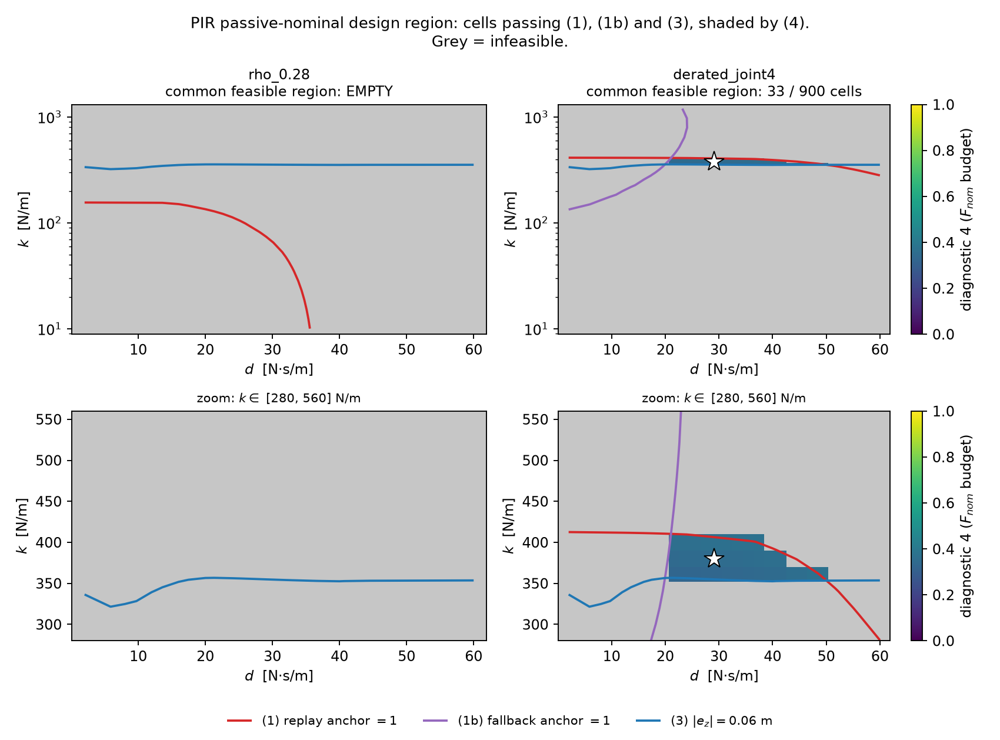

**Figure 1 — the design region.** Grey is infeasible. Left: the ρ = 0.28
envelope, empty everywhere. Right: `phri2`'s derated-joint-4 envelope, 33 of
900 cells, with the recommended operating point starred. The zoom row is not
decoration — the region is ~40 N/m tall inside a 1190 N/m sweep, which is why
a coarse grid reports it empty (§6.3). The three-way squeeze is visible in the
lower-right panel: row (3) bounds it from below (too soft and the fallback
leaves the box), row (1) from above (too stiff and the anchor overruns joint 4),
row (1b) from the left (too little damping and the fallback's overshoot
overruns joint 4). The note anticipated the first two tensions; the third is
the one it did not list.

| file | content |
|---|---|
| `pir_knot_scan_diag{1,1b,3,4}_{envelope}.png` | the four diagnostic maps, per envelope |
| `pir_knot_scan_overlay.png` | composite, full range and zoomed, with the recommended cell marked |
| `pir_knot_scan.json` | grid, all diagnostic arrays, `common_region_nonempty`, both recommendations |
| `pir_closed_loop_{scenario}_{envelope}.png/json` | §7: the merged controller in closed loop |
| `pir_e0_sweep.png/json` | §7.4–7.5: authorization vs tracking, both tightenings active |
| `pir_rootcause.png/json` | §8.1: every symptom swept against $K_0$ |
| `pir_fixes.png/json` | §8.3: candidate fixes scored on all four findings |
| `pir_pose_study.png/json` | §9.1–9.2: the pose screen and its two traps |
| `pir_knot_scan_pose_*` | §9.3: the full gate re-run at the better pose |
| `pir_closed_loop_pose_*` | §9.4: Task 2 re-run at the recommended pose |
| `pir_e0_sweep_pose_*` | §9.4: Task 3 re-run at the recommended pose |
| `pir_axis_tension.png/json` | §10: which axis fires where, aggregated over every run |
| `pir_rootcause_pose_*`, `pir_fixes_pose_*` | §8.4: §8 re-run at the recommended pose |
| `pir_joint_scan.png/json` | §10.5: the joint pose × $K_0$ scan and its box-allowance sensitivity |
| `pir_robustness.png/json` | §10.6: decision 3's two formulations across 10 seeds × 2 profiles |

---

## 6. Verification

A NO-GO on one envelope and a 33-cell GO on the other are both strong enough
claims to be attacked separately (`pir_verify.py`, `results/pir_verify.json`).

### 6.1 Check A — equilibrium without integration

Rows 1b and 3 are read off a settled simulation, and "settled" is a judgement
call for a lightly damped spring. Check A instead solves $\ddot q(q) = 0$
directly on MuJoCo's own forward dynamics — no time integration at all — and
compares. Across four cells the two methods agree to within **6.9 %** worst
case (1.2 % at the well-damped end), all root-finds converged, all simulations
flagged settled. The residual gap is the null-space posture spring, which
makes the settled configuration mildly path-dependent; it is smaller than the
7 % margin the recommended cell carries on row 3, but not by much, which is
part of why §7 calls that margin thin rather than adequate.

### 6.2 Check B — the fallback anchor does not depend on the gains

Sweeping $k$ over $[100, 1200]$ N/m at the root-found equilibrium:

| $k$ [N/m] | $\|e_z\|$ [m] | $k\,\|e_z\|$ [N] | joint-4 anchor [N·m] |
|---|---|---|---|
| 100 | 0.198 | 19.83 | 25.29 |
| 200 | 0.101 | 20.12 | 27.87 |
| 400 | 0.050 | 20.06 | 28.34 |
| 800 | 0.025 | 19.98 | 28.40 |
| 1200 | 0.017 | 19.95 | 28.39 |

$k\,|e_z|$ recovers the 20 N push to within 1 % across a 12× range of $k$,
confirming $K_0 e = F_h$ and therefore that the equilibrium anchor is a
property of the push and the pose, not of the gains. It converges to
~28.4 N·m — comfortably above the 24.36 N·m $\rho = 0.28$ cap and comfortably
below the 31.5 N·m derated-joint-4 cap. That single number is why the two
envelopes give opposite answers.

As a side result, the $k = 200$ row independently reproduces `phri2`'s own
reported figure that a pure $K_d = 200$ impedance gives 0.10 m of static
displacement against the 0.06 m bound.

### 6.3 Check C — grid refinement

Re-scanning $k \in [300, 500]$ × $d \in [8, 40]$ on a *linear* grid whose
points deliberately do not coincide with the main scan's:

| envelope | region | best worst-normalized use |
|---|---|---|
| `rho_0.28` | empty (0 / 99) | 1.244 |
| `derated_joint4` | **14 / 99** | 0.977 |

Two things follow. The `derated_joint4` verdict and its best cell are
reproduced independently (0.977 against the main scan's 0.977). And the
refinement is *necessary*: the original 24 × 16 grid reported
`derated_joint4` empty. The region is ~40 N/m tall inside a sweep spanning
1190 N/m, and a grid that samples it at two points misses it. Any re-run of
this gate at a different pose, push direction or envelope must re-densify
before trusting an empty answer.

### 6.4 Regression suite

`test_pir_knot_scan.py`, 12 tests, all passing. They pin the constants to
their sources, check the anchor arithmetic against the per-tick matrix
product, assert the zero-gain limit reduces the anchor to
$\tau_{\mathrm{base}}$, verify the $K_0 e = F_h$ relation on the plant, check
the averaging window exceeds the fallback spring's natural period, and assert
the published grid stays dense enough through the feasible band.

---

## 7. The merged controller, implemented

Task 1's gate was a *feasibility* argument; §7 of its first draft owed a
closed-loop measurement. `pir_controller.py` implements the merged rule of §3
and `run_pir_closed_loop.py` runs it on the FR3.

### 7.1 What the merge actually required

Three things changed relative to grafting the tank onto `phri2`, and all three
live in the QP:

1. **The nominal is closed-loop inside the horizon.** $F_{\mathrm{nom}}$ is
   state feedback, so the prediction runs on $A - BG_0$ with
   $G_0 = [K_0\ D_0]$. Freezing $F_{\mathrm{nom}}$ across the horizon would let
   the QP plan against a nominal its own plan invalidates.
2. **The torque rows became state-dependent.** In `phri2`,
   $\tau_k = \tau_{\mathrm{base}} + J_v^\top F_{\mathrm{cmd},k}$ is affine in
   the decision variable alone. Here
   $\tau_k = \tau_{\mathrm{base}} + J_v^\top(-G_0 x_k + F_{r,k})$, and $x_k$ is
   itself affine in every earlier residual, so each torque row carries the
   accumulated nominal reaction.
3. **The behaviour input and the disturbance model had to be split.** `phri2`
   has one force signal driving both $a_{id} = Cx + GF_h$ and the plant
   prediction, which is sound only when every external force is interaction
   force. Running under a disturbance, they are different signals. `control()`
   now takes `force_forecast` and `behaviour_forecast` separately, defaulting
   to equal — which recovers `phri2` exactly, and is asserted to. **This does
   not solve force misclassification**; deciding which measured force goes in
   which channel *is* that unsolved problem. It moves the assumption into a
   signature instead of hiding it in an equality.

One incidental gain: `phri2`'s QP has no principled infeasibility fallback and
drops to its clipped reactive law. Here $F_r = 0$ is exactly the $\alpha\to 0$
passive nominal the Task 1 gate certified, so an infeasible solve degrades to a
*certified* behaviour rather than an improvised one. (No solve was infeasible
in any run reported here: 0 / 300 per run.)

### 7.2 Rows (1) and (4), re-measured in closed loop

This is the debt the first draft recorded. At $K_0 = 380$ N/m,
$D_0 = 29.1$ N·s/m on `phri2`'s 20 N push:

| | replay estimate (Task 1) | merged closed loop | gap |
|---|---|---|---|
| row (1) anchor ratio | 0.9771 | **0.9762** | 0.09 % |
| row (4) budget ratio | 0.3478 | **0.3474** | 0.11 % |

The replay approximation holds. The gate's 2 % margin on row (1) survives, and
the GO verdict does not need revisiting on this scenario. A regression test
pins the two together at 1 % so the gate cannot silently drift from the
controller it gates.

### 7.3 Merged Lemma 1 and the four-term residual

Across every run in §7.4–7.5 (36 sweep points plus 8 closed-loop runs), with
the precondition holding, the conclusion held: $|\tau_\ell| \le \bar\tau$ at
every one of 6000 ticks, with $\alpha_\tau$ saturating the envelope exactly
($\max |\tau|/\bar\tau = 1.0000$) rather than overshooting it.

The four-term residual
$r = r_{\mathrm{reg}} + r_{\mathrm{con}} + r_{\mathrm{mod}} + r_{\mathrm{auth}}$
closes **to machine precision** ($4.4\times10^{-16}$) on every QP tick, with
$r_{\mathrm{con}}$ split into its plan-level and execution-level halves:

$$r_{\mathrm{con}} = \underbrace{a_{\mathrm{con}} - a_{\mathrm{unc}}}_{\text{QP, 50 Hz}} + \underbrace{\Lambda^{-1}(\alpha_\tau - 1)F_{r,k}}_{\text{servo, 1 kHz}}, \qquad r_{\mathrm{auth}} = \Lambda^{-1}(\alpha_E - 1)\,\bar F_{r,\ell}.$$

The closure is an identity, not a fit: the two servo terms telescope to
$\Lambda^{-1}(F_{r,\ell} - F_{r,k})$, which is exactly the gap between what the
QP proposed and what was applied. $r_{\mathrm{auth}}$ is identically zero
whenever authorization never fires — it measures intervention, it is not an
always-on correction.

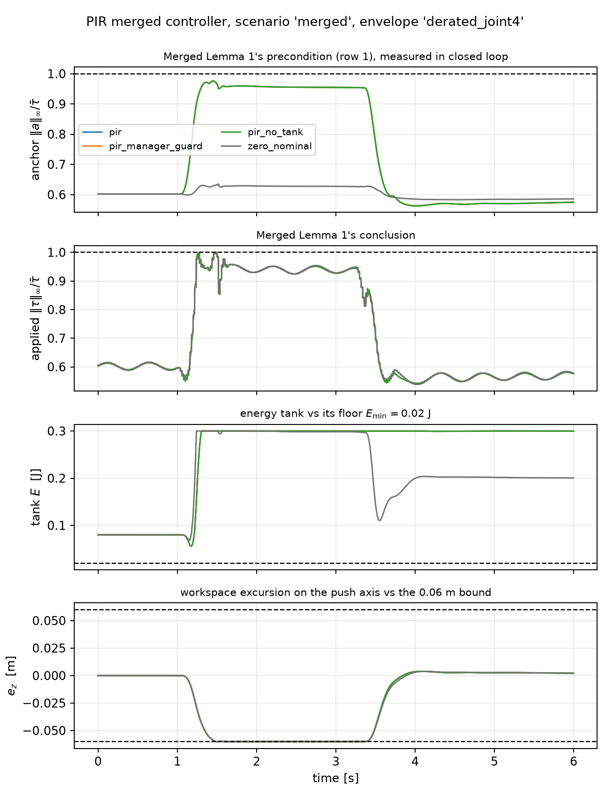

**Figure 2 — the merged controller in closed loop**, on the merged scenario at
the recommended operating point. Top: Lemma 1's precondition, the anchor ratio,
sitting at 0.976 for the three PIR variants (they coincide here because
authorization never fires at disturbance scale 1) against 0.635 for
`zero_nominal`. That gap *is* §7.6's headroom collapse. Second panel: the
conclusion — applied torque pinned at the envelope, never through it. Third:
the tank, comfortably above its floor in this scenario, which is exactly why
§7.4 has to stress it deliberately. Bottom: the workspace excursion, slightly
past the slack-relaxed 0.06 m box for every variant.

### 7.4 The passivity axis: `impedance_residual`'s result transfers

Neither source benchmark exercises both axes. `phri2`'s push is monotone and
largely dissipative: the nominal harvests $v^\top D_0 v$ faster than the
residual drains the tank, and $\alpha_E \equiv 1$ throughout. So the sweep runs
on a **merged scenario** — that push plus `impedance_residual`'s own rejectable
disturbance (0.9/1.4/1.9 Hz sinusoids and a 12 N pulse placed deliberately
between two 50 Hz manager ticks) — and sweeps $E_0$ toward its floor and the
disturbance amplitude upward. 36 points, three variants:

| variant | tank floor held | breached ticks | worst tank |
|---|---|---|---|
| `pir` (1 kHz re-authorization) | **12 / 12** | 0 | 0.0200 J = $E_{\min}$ |
| `pir_manager_guard` (20 ms, held) | 4 / 12 | 6 189 | −1.285 J |
| `pir_no_tank` | 4 / 12 | 13 050 | −28.43 J |

*(Re-measured after decision 0 made $\alpha_{\mathrm{nom}}$ the default, which
is why the breach counts are larger than the pre-decision-0 run: keeping the
torque envelope legal at 16× disturbance leaves more energy for the ledger to
have to account for. `pir` still holds the floor everywhere.)*

**`impedance_residual`'s central result transfers to the merged port.** Fast
re-authorization holds the floor in every stressed configuration — and holds it
*with equality*, $\min E = E_{\min}$ exactly, which is what the $\alpha_E$
construction guarantees. The manager-rate guard tracks it closely and breaches
anyway, in 8 of the 12 configurations where the tank is loaded at all. The
20 ms staleness is the whole difference.

Authorization goes from silent to active as either axis is loaded: 0 % → 1.9 %
of ticks as $E_0 \to E_{\min}$, and 0 % → **73.4 %** of ticks as the disturbance
scales 1 → 12. (That last figure counts any of the three scalings intervening,
so past 4× it is dominated by $\alpha_{\mathrm{nom}}$, decision 0's fix, doing
the work the anchor overrun used to do unchecked.)

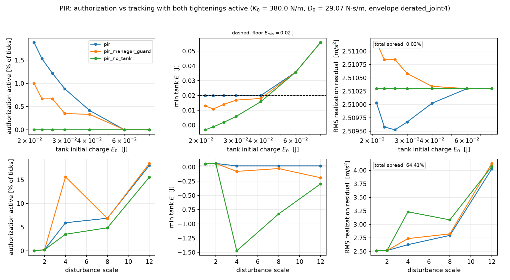

**Figure 3 — authorization vs tracking, both tightenings active.** Top row
sweeps the tank's initial charge toward its floor; bottom row sweeps the
disturbance amplitude. The middle column is the result: `pir` (blue) sits
*exactly* on $E_{\min}$, which is what the $\alpha_E$ construction guarantees;
`pir_manager_guard` (orange) dips below it to −1.29 J; `pir_no_tank` (green)
reaches −28.4 J. The right column carries its own spread annotation because matplotlib
autoscales it — on the $E_0$ axis the total variation is 0.03 %, i.e. flat
(§7.5), and only on the disturbance axis does a real trade appear.

### 7.5 The authorization-vs-tracking trade looks flat here

> **Corrected by §9.4.** This subsection originally concluded that the merged
> $E_0$ trade is *flatter* than `impedance_residual`'s, against the synthesis
> note's prediction that it would be steeper. That conclusion was a pose
> artifact. At the recommended pose the same sweep gives a **7.7 %** spread and
> the note's prediction is confirmed. The measurement below is correct at
> *this* pose; the generalisation from it was not.

The synthesis note predicts the $E_0$ curve gets steeper after the merge,
because the two tightenings compound in series. Here it is flat: over the whole
$E_0$ sweep, RMS realization residual varies by **0.03 %** (2.5095 →
2.5103 m/s²), against `impedance_residual`'s own 21.49 → 15.98 mm swing on its
unmerged nominal.

The reason is the §7.6 boundary. The passive nominal has already absorbed the
authority the tank would otherwise take away: de-authorizing a residual that is
16 % of the command costs almost nothing, because the other 84 % is a PD law
the tank has no say over. The passivity axis is *cheap* here precisely because
it is *weak* — and §9.4 shows that when the residual is given room, the cost
appears exactly as the note said it would.

On the disturbance axis, where the residual does matter, the trade appears even
at this pose: RMS spans 2.510 → 4.434 m/s² (77 %).

### 7.6 The nominal dominates the command, and eats the headroom

At the only $(K_0, D_0)$ the gate certifies:

| | `pir` | `zero_nominal` ($K_0 = D_0 = 0$) |
|---|---|---|
| $\|F_{\mathrm{nom}}\|$ RMS | 14.05 N | 0 N |
| $\|F_r\|$ RMS | 2.11 N | 13.48 N |
| residual's share of the command | **15.6 %** | 100 % |
| anchor headroom left for $F_r$ | **2.4 %** of the cap | 36.4 % |

The note's §7 predicted this qualitatively — "$K_0/D_0$ large ⇒ floor eats
budget, a *new* double-tightening." The measurement is worse than the phrasing
suggests. $K_0 = 380$ N/m is not a small passivity floor sitting under the
behaviour: it is **stiffer than the desired impedance** ($K_d = 200$ N/m), so
the residual's job is partly to make the arm *softer* than the floor. The
merged controller at its certified operating point is a stiff PD with a 16 %
predictive correction, and the residual's torque headroom has collapsed
**15-fold**, from 36.4 % of joint 4's cap to 2.4 %.

### 7.7 Where the guarantee breaks

> **Measured before decision 0, and fixed by it.** The table below is the
> controller *without* $\alpha_{\mathrm{nom}}$ — the variant now kept as
> `pir_no_nominal_auth`. It is what motivated §8.2's fix. The shipped default
> holds $\max|\tau|/\bar\tau = 1.0000$ at every scale tested, including the
> two that break here, so **the failure below is no longer the behaviour of the
> controller this document recommends**. It is retained because the precondition
> it exposes still fails at those scales — $\alpha_{\mathrm{nom}}$ keeps the
> envelope legal, it does not make the anchor feasible — and because §8.4 shows
> the fix is inert at the pose §9 recommends, so the failure mode is dormant
> rather than gone.

That 2.4 % headroom is what §1's fourth finding cashes out. Sweeping the
disturbance amplitude, without $\alpha_{\mathrm{nom}}$:

| disturbance scale | max anchor ratio | ticks with infeasible anchor | max $\|\tau\|/\bar\tau$ |
|---|---|---|---|
| 4 | 0.9888 | 0 / 6000 | 1.0000 |
| 8 | **1.0074** | 39 / 6000 | **1.0074** |
| 12 | **1.0629** | 558 / 6000 | **1.0629** |

Two things to read here. First, the applied-torque overrun **equals the anchor
overrun exactly** at both failing scales. That is not a coincidence: when the
precondition fails, $\alpha_\tau$ has already gone to zero and the fast layer
has *no remaining authority* — the overrun is entirely the nominal's, and
scaling the residual cannot touch it. Second, removing the tank as well changes
nothing (1.0074 at scale 8 either way), confirming this is a property of the
nominal and has nothing to do with the passivity axis.

So Merged Lemma 1 is sound and its precondition is doing real work: it is not a
formality to be discharged once at design time. `phri2` guarantees the torque
envelope unconditionally, because its QP owns the whole command. PIR guarantees
it *conditional on the anchor being feasible*, and the Task 1 gate certified
that condition against exactly one scenario. The condition does not survive an
8× disturbance. **This was the most important thing the implementation found**,
and it is a cost of the split the synthesis note did not anticipate — though
§8.2 fixes the consequence and §9 shows the pose largely removes the exposure,
so §10 rather than this section is what ends up changing the paper's claim.

---

## 8. Root cause, and what fixes it

Four findings is three too many if they share a cause. They do.

### 8.1 One constraint drives findings 1–3

Diagnostic 3 requires the $\alpha\to 0$ fallback to hold the whole 20 N push
inside 0.06 m, i.e. $K_0 \ge |F_h| / 0.06 = 333$ N/m. The behaviour the
controller is supposed to render has $K_d = 200$ N/m. **The gate therefore
forces the passivity floor to be stiffer than the behaviour it sits under**,
and everything else follows. Sweeping $K_0$ at fixed damping ratio
$\zeta = 0.35$ (`pir_rootcause.py`):

| $K_0$ [N/m] | fallback $\|e_z\|$ | (3) passes | anchor headroom | residual share | largest safe disturbance | $E_0$ trade |
|---|---|---|---|---|---|---|
| 100 | 236 mm | no | 26.4 % | 72.6 % | 12× | 0.0068 |
| 150 | 154 mm | no | 22.1 % | 59.4 % | 8× | 0.0071 |
| **200** = $K_d$ | 112 mm | no | 17.9 % | 46.4 % | 8× | 0.0125 |
| 250 | 88 mm | no | 13.7 % | 34.1 % | 8× | 0.0358 |
| 300 | 72 mm | no | 9.5 % | 23.1 % | 8× | 0.0057 |
| **380** = certified | 56 mm | **yes** | **2.4 %** | **17.1 %** | **4×** | **0.0020** |
| 460 | 46 mm | yes | **−1.2 %** | 39.1 % | **0×** | 0.0016 |
| 600 | 34 mm | yes | −5.3 % | 48.4 % | 0× | 0.0010 |

Every symptom is monotone in $K_0$, every one of them gets worse as $K_0$
rises, and diagnostic 3 is the only diagnostic that wants $K_0$ large. At
$K_0 = 460$ the headroom is already negative — the precondition fails at the
*nominal* disturbance. The certified band is thin from both sides.

**Is diagnostic 3's premise right?** It asks the passivity *floor* alone to
satisfy a workspace bound that the desired *behaviour* does not satisfy either:
`phri2`'s own $K_d = 200$ gives 0.10 m of static displacement against the
0.06 m bound (reproduced here at 112 mm, §6.2), and `phri2` meets the bound
through its **predictive layer**, not through its impedance. Requiring more of
the floor than of the behaviour is a defensible safety choice, but it is a
*choice*, not a physical constraint — and §8.3 prices it.

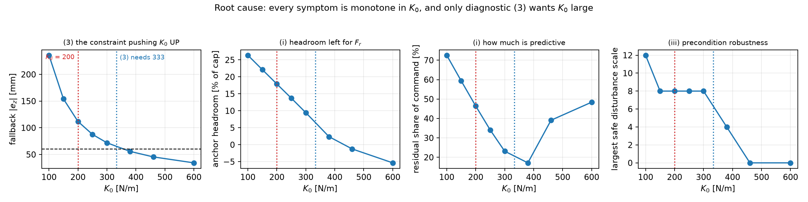

**Figure 4 — the root cause.** Red dotted line: the desired impedance's own
$K_d = 200$ N/m. Blue dotted line: the 333 N/m diagnostic 3 demands. The
certified operating point sits to the right of both, which is why the headroom
and the precondition robustness are near their worst there. Only the leftmost
panel improves as $K_0$ rises.

### 8.2 Finding 4 is separate, and is fixed outright

Finding 4 — the fast layer has no authority over the nominal — is not a
consequence of $K_0$. It is structural: $\alpha_\tau$ scales $F_r$ only. The
fix is to give the servo an $\alpha_{\mathrm{nom}}$ as well, the largest scale
keeping the anchor itself inside the box. Since $\alpha_{\mathrm{nom}} = 0$
recovers $\tau_{\mathrm{base}}$, **the torque guarantee becomes unconditional
whenever $\tau_{\mathrm{base}}$ alone fits** — a far weaker and checkable
condition (0.636 of the cap here) than "the anchor fits at every future tick".

It is not free, and the first attempt traded one guarantee for the other. A
time-varying spring gain is an energy term, and only one direction is
dangerous: *softening* releases stored energy (the storage function's
$\tfrac12\dot\alpha\,e^\top K_0 e$ term goes negative, which helps), while
*re-stiffening* is an injection — at fixed $e$ the robot suddenly pushes back
harder without the human having done the work to store it. Charging
re-stiffening to the tank and crediting softening nothing, unrestricted
$\alpha_{\mathrm{nom}}$ buys the torque envelope and **loses the tank floor**
(−1.06 J at 16×): a transient repeatedly re-buys stiffness the port has not
earned.

Forbidding the rise fixes it. With $\alpha_{\mathrm{nom}}$ **monotone
non-increasing**, both guarantees hold together out to 16× the source
disturbance — against 4× for the certified baseline. The cost is a floor that
does not recover its stiffness within an episode; a deployed system would reset
it per contact, which this benchmark does not exercise.

### 8.3 Candidates, scored on all four findings

`pir_fixes.py`, all on the merged scenario, all against the same probes:

| candidate | fallback | (3) | headroom | residual share | torque OK to | + tank floor to | $E_0$ trade | max $\|e_z\|$ at 12× |
|---|---|---|---|---|---|---|---|---|
| `certified` $K_0$=380 | 56 mm | ✓ | 2.4 % | 17.1 % | 4× | 4× | 0.0020 | 79 mm |
| `soft_nominal` $K_0$=$K_d$ | 110 mm | ✗ | 16.3 % | 46.0 % | 8× | 8× | 0.0070 | — |
| `anisotropic` | 56 mm | ✓ | 2.2 % | 20.0 % | **2×** | 2× | 0.0003 | — |
| `nominal_auth` | 56 mm | ✓ | 2.4 % | 17.1 % | **16×** | 6× | 0.0020 | — |
| **`nominal_auth_mono`** | 56 mm | ✓ | 2.4 % | 17.1 % | **16×** | **16×** | 0.0020 | — |
| `soft_plus_auth` | 110 mm | ✗ | 16.3 % | 46.0 % | 16× | 8× | 0.0070 | — |
| **`soft_plus_mono`** | 110 mm | ✗ | **16.3 %** | **46.0 %** | **16×** | **16×** | **0.0070** | **160 mm** |

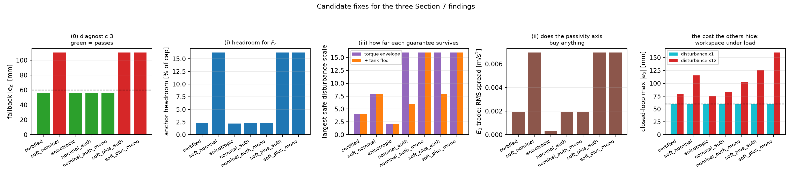

**Figure 5 — candidate fixes.** The rightmost panel is the one that changes the
recommendation: at nominal load every candidate holds the workspace box
identically, and only under a 12× disturbance does the soft nominal's real cost
appear. Without that panel `soft_nominal` looks free.

Three things to take from this.

**`nominal_auth_mono` is a pure win and should be adopted.** It quadruples the
range over which *both* guarantees survive, costs nothing on any other metric,
changes nothing at all while the anchor fits (asserted by test), and keeps
diagnostic 3. There is no argument against it in these measurements.

**The `anisotropic` refinement — the plan's own deferred "later refinement" —
does not work here, and slightly hurts.** Headroom falls to 2.2 % and the safe
disturbance range halves to 2×. The reason is visible in the trajectory: the
displacement is 8:1 dominated by the push axis (max $|e|$ =
[7.5, 0.3, 60.3] mm), so softening the off-axis gains barely reduces
$\|J_v^\top F_{\mathrm{nom}}\|_\infty$ while removing the off-axis restoring
force that was helping keep the arm near the pose. A negative result, but a
clean one: the obvious lever is the wrong lever.

**Lowering $K_0$ is not free, and the fallback bound is not the only thing it
buys.** At nominal load every candidate holds the box identically (60.2 mm),
which makes `soft_nominal` look costless. Under load it is not: at 12×
disturbance the certified nominal holds 79 mm while `soft_plus_mono` reaches
**160 mm**, and its RMS realization residual is worse too (5.60 vs
4.03 m/s²). So the real trade for findings 1–3 is not "56 mm vs 110 mm in a
fallback that may never happen" — it is **workspace containment under
disturbance**, which is a live property. That is a genuine engineering
decision, and it is the human's to make, not the scan's.

### 8.4 Re-run at the recommended pose: the fixes solve a problem the pose removes

§8.1–8.3 were measured at `phri2`'s pose. Re-run at the recommended one
(`pir_rootcause.py --pose`, `pir_fixes.py --pose`):

| $K_0$ | headroom (`phri2`) | headroom (rec.) | safe disturbance (`phri2`) | safe disturbance (rec.) |
|---|---|---|---|---|
| 100 | 26.4 % | 55.8 % | 12× | **12×** |
| 250 | 13.7 % | 52.4 % | 8× | **12×** |
| 380 | 2.4 % | 49.7 % | 4× | **12×** |
| 460 | −1.2 % | 47.5 % | **0×** | **12×** |
| 600 | −5.3 % | 46.5 % | **0×** | **12×** |

The headroom never drops below 46 % at any $K_0$, and the feasibility axis
never binds at any $K_0$ — the safe disturbance scale is pinned at the top of
the probe range throughout. The whole monotone-collapse story of §8.1 is a
property of a tight torque budget, and this pose does not have one.

The fix comparison collapses with it. All seven candidates of §8.3 now score
**identically at the ceiling**: both guarantees hold to 16×, no tank deficit,
and **$\alpha_{\mathrm{nom}}$ never fires for any of them**. Decision 0's fix,
which quadrupled the safe range at `phri2`'s pose, is entirely inert here.

That is not an argument against adopting it — insurance that never pays out in
the tested scenario is still the right thing to carry, and §8.2's failure mode
is real wherever the budget *is* tight. But it does mean **§8 is a diagnosis of
a configuration, not of the architecture**, and the paper should present it that
way. Two of §8's conclusions also need narrowing: the "passivity peaks at
intermediate $K_0$" shape inverts at this pose (§10.2), and `anisotropic`
stops being harmful — 47.9 % headroom against `certified`'s 45.7 %, and the
same 16× safe range, so at this pose it is merely useless rather than costly.

### 8.5 What this does and does not settle

Findings 1–3 are one problem with a known knob and a priced trade. Finding 4 is
solved. What remains open is the same thing §7.7 pointed at: even with
$\alpha_{\mathrm{nom}}$, the guarantee is "torque legal provided
$\tau_{\mathrm{base}}$ fits", and nothing here defends *that*. On this FR3 pose
$\tau_{\mathrm{base}}$ uses 0.636 of joint 4's cap with no control authority
applied at all, so the margin is real but finite, and it is a pose property —
which is why re-running the gate at a pose that does not load joint 4 remains
the highest-value untried experiment (§10).

---

## 9. The pose study: most of this was the scenario

Every number above comes from `phri2`'s nominal pose under its −z push. §8.4
flagged that the residual condition — $\tau_{\mathrm{base}}$ alone fitting the
envelope — is a *pose property*, and that re-running the gate elsewhere was the
highest-value untried experiment. It was.

### 9.1 Screening poses, and two traps

`pir_pose_study.py` screens 1863 in-limit poses (varying $q_2, q_4, q_6$; 1169
of them usable, i.e. end effector above the base plane and out in front) across
three push directions, on two cheap quantities: the gravity floor
$\max|g(q)|/\bar\tau$, and the fallback-anchor proxy $g(q) - J_v^\top F_h$,
which is what the anchor tends to as $K_0$ grows (§6.2).

**Trap 1: the proxy rewards poses that cannot render impedance.** Its first
pick, $(q_2,q_4,q_6) = (-0.20,-0.90,2.60)$, clears $\rho = 0.28$ with an anchor
ratio of 0.685 — and is near-singular. Its task-space inertia along the push
axis is **47.2 kg** against the neutral pose's 4.56 kg, and $\sigma_{\min}(J_v)$
falls from 0.256 to 0.080. The arm is *braced*, not better: at 47 kg of apparent
inertia the realization layer cannot render a 2 kg desired impedance in the
push direction at all. A pose is therefore only a candidate if it also keeps the
push direction controllable — $\Lambda_{\mathrm{axis}}$ within 2× of neutral and
$\sigma_{\min}$ at least 0.7× — and both thresholds are stored per pose so a
different line can be drawn without re-running.

**Trap 2: the static proxy is optimistic, sometimes by a factor of three.** The
gate uses $\max_t \|\tau_{\mathrm{base},t}\|_\infty/\bar\tau$ *along the
trajectory*, where $\tau_{\mathrm{base}}$ also carries Coriolis terms and the
null-space and orientation torques that become nonzero the moment $q$ leaves
$q_{\mathrm{null}}$. One shortlisted pose scored **0.470 statically and 1.287
along the trajectory**, with the binding joint moving from 4 to 5. That is the
other half of the lesson: relieving joint 4 can simply move the bottleneck to
joints 5–7, whose $\rho = 0.28$ caps are only 3.36 N·m. So the screen shortlists
and a replay decides.

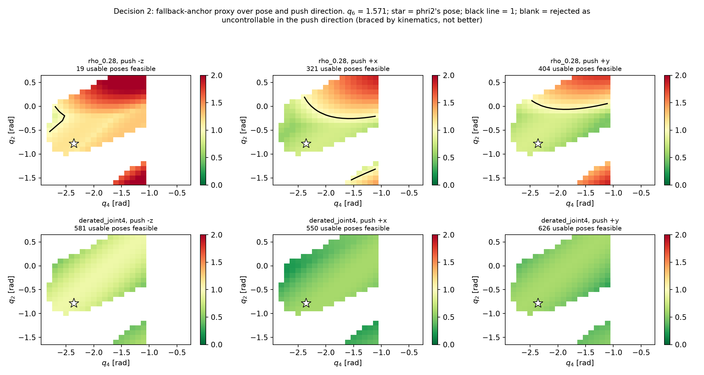

**Figure 6 — the pose screen.** Anchor proxy over $(q_2, q_4)$ at
$q_6 = 1.571$, per envelope and push direction. The star is `phri2`'s own pose.
Blank cells are rejected by the controllability guard — poses that resist the
push through kinematic structure rather than control, which the unguarded
screen preferred. Green is not yet a verdict: §9.1's second trap means these
still have to survive an along-trajectory replay.

### 9.2 $\rho = 0.28$ is reachable — but not by enough

**§5.1's "structurally infeasible" was too strong, and is corrected here.** It
is infeasible *at `phri2`'s pose and push direction*. Elsewhere it is not: at
$(q_2,q_4,q_6) = (-0.10,-2.70,1.571)$ under an $+x$ push, `phri2`'s own realized
torque peaks at **0.952** of the $\rho = 0.28$ cap — its published controller
runs inside `impedance_residual`'s envelope there. The gain-independence
argument of §6.2 stands; what was wrong was calling a scenario property a
structural one.

It still does not help the merge. The best along-trajectory floor found anywhere
in the shortlist is **0.870**, leaving ≤ 13 % of the cap for
$J_v^\top F_{\mathrm{nom}}$ — against the 36.4 % the neutral-pose derated
envelope offers, which supported only a 33-cell sliver. A passive nominal does
not fit in 13 %.

### 9.3 The derated envelope at a better pose: the actual result

Re-running the full gate at $(q_2,q_4,q_6) = (-1.30,-1.30,1.571)$, **keeping
`phri2`'s own −z push** so only one thing changes:

| | `phri2`'s pose | this pose |
|---|---|---|
| $\tau_{\mathrm{base}}$ floor | 0.636 | **0.433** |
| `phri2`'s own realized torque | 1.005 | **0.508** |
| cells passing row (1) | 577 / 900 | **900 / 900** |
| cells passing row (1b) | 702 / 900 | **900 / 900** |
| **common feasible region** | 33 cells | **481 cells** |
| most robust cell | $K_0$=380, $D_0$=29.1 | $K_0$=520, $D_0$=56.1 |
| worst normalized use there | 0.977 | **0.541** |

And in closed loop, at each pose's own recommended operating point, sweeping the
disturbance:

| disturbance | headroom (`phri2` pose) | headroom (this pose) | residual share | max $\|\tau\|/\bar\tau$ | max $\|e_z\|$ |
|---|---|---|---|---|---|
| 1× | 2.4 % | **45.7 %** | 17.1 % → **54.0 %** | 1.0000 → **0.532** | 60.2 → **51.5** mm |
| 8× | −16.8 % | **43.2 %** | 72.4 % → 86.7 % | 1.0000 → **0.533** | 108.0 → **58.9** mm |
| 16× | −55.5 % | **35.4 %** | 85.0 % → 90.7 % | 1.0000 → **0.619** | 164.3 → **59.2** mm |

Three things follow.

**Findings 1 and 3 are largely gone.** The residual is 54 % of the command
instead of 17 %, with 45.7 % of joint 4's cap behind it instead of 2.4 %.

**Finding 4 stops being stressed at all.** At 16× disturbance the anchor still
has 35 % headroom and the applied torque peaks at 0.62 of the cap — the
controller is not saturating, so Lemma 1's precondition is never in question.
Decision 0's $\alpha_{\mathrm{nom}}$ remains the right insurance (the negative
headroom entries in the `phri2`-pose column are exactly it absorbing an overrun
that would otherwise have been a violation), but at this pose it is not called on.

**It is better on the workspace too, not traded against it.** 59 mm at 16×
disturbance against 164 mm — inside the 0.06 m box where the certified point is
2.7× outside it. This is the opposite of the $K_0$ trade §8.3 priced, which
bought headroom *with* containment. **Decision 1 may therefore be moot**: the
pose change delivers what softening $K_0$ was being considered for, and improves
the thing softening $K_0$ would have cost.

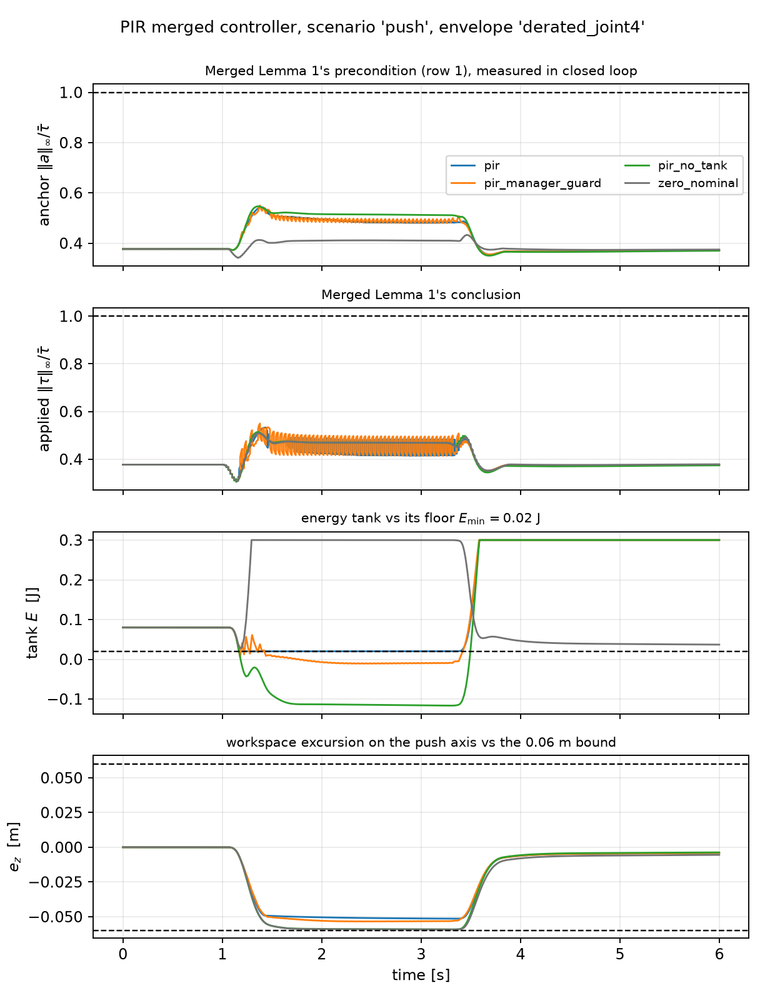

**Figure 7 — the merged controller at the recommended pose**, on `phri2`'s
plain 20 N push. The third panel is the one to read: `pir` (blue) rides
*exactly* on $E_{\min}$ for the whole push — it is under the dashed line, which
is the guarantee made visible — while `pir_manager_guard` (orange) sits below
the floor for roughly two seconds and `pir_no_tank` (green) plunges to
−0.117 J. `zero_nominal` (grey) saturates at $E_{\max}$ because with no nominal
its residual *is* the impedance and is purely dissipative. Compare the top two
panels with Figure 2: everything now runs at 0.4–0.55 of the envelope rather
than pinned against it.

### 9.4 Tasks 2 and 3 re-run at the recommended pose

Everything in §7 and §8 was measured at `phri2`'s pose. The merged paper should
report the pose it recommends, so both tasks were re-run at
$(q_2,q_4,q_6) = (-1.30,-1.30,1.571)$ with that pose's own operating point,
$K_0 = 520$ N/m, $D_0 = 56.1$ N·s/m.

**A bug surfaced first, and the four-term residual is what caught it.** The
realization QP and the 1 kHz servo each build $\tau_{\mathrm{base}}$, and the
QP was centring the null-space posture spring on `Q_NEUTRAL` while the servo
centred it on the actual pose — so the QP planned against a
$\tau_{\mathrm{base}}$ and a $d_{\mathrm{known}}$ the servo never applied. At
`Q_NEUTRAL` the two coincide and the bug is invisible; at the new pose the
closure went from $4\times10^{-16}$ to $8\times10^{-5}$. Fixed, closure back to
$1.3\times10^{-15}$, and a regression test now pins it at both poses. This is
the second time the closure identity has caught something no other diagnostic
would have.

**Task 2 — the merged controller.** On `phri2`'s plain 20 N push:

| | `phri2` pose | recommended pose |
|---|---|---|
| row (1), replay → closed loop | 0.9771 → 0.9762 | 0.5411 → **0.5432** |
| anchor headroom | 2.4 % | **45.7 %** |
| residual share of command | 15.6 % | **53.5 %** |
| max $\|\tau\|/\bar\tau$ | 1.0000 | **0.5330** |
| authorization active | 0.6 % of ticks | **29.3 %** |
| $\min \alpha_E$ | 1.0000 | **0.0006** |
| $r_{\mathrm{auth}}$ RMS | 0.0000 | **1.387** m/s² |
| max excursion | 60.4 mm | **51.4 mm** |

**The passivity axis is now exercised by `phri2`'s own benchmark.** §7.4 had to
borrow `impedance_residual`'s oscillatory disturbance to make the tank do
anything, and concluded that neither source benchmark stresses both axes. At
the recommended pose that is no longer true: on the plain push, authorization
fires on 29 % of ticks, $\alpha_E$ reaches 0.0006, and `pir_manager_guard`
breaches the floor for **2 039 ticks** while `pir_no_tank` reaches −0.117 J.
One scenario, both axes, no borrowed disturbance — which is what the merged
paper needs.

**Task 3 — the authorization-vs-tracking trade, and a correction.** The
$E_0$ sweep at the recommended pose:

| | `phri2` pose | recommended pose |
|---|---|---|
| $E_0$ trade, RMS spread | 0.03 % | **7.66 %** |
| authorization active over the sweep | 0.0–1.9 % | **30.1–33.9 %** |
| `pir` floor held | 12 / 12 | **12 / 12** |
| `pir_manager_guard` floor held | 4 / 12 | **1 / 12** (21 138 ticks) |
| `pir_no_tank` floor held | 4 / 12 | **1 / 12** (25 525 ticks) |
| tank's cost vs no tank at $E_0 = 0.08$ | +0.0 % | **+38.4 %** RMS |

So **§7.5's "flatter, not steeper" was a pose artifact and is corrected**: the
synthesis note's prediction was right. Give the residual room and the passivity
axis costs what the note said it would — 7.7 % across the $E_0$ sweep, and
38 % against running with no tank at all. It is no longer cheap-because-weak;
it is doing real work and charging real money for it. The fast-vs-manager-rate
result also gets stronger, holding across the *entire* $E_0$ range rather than
only its bottom end.

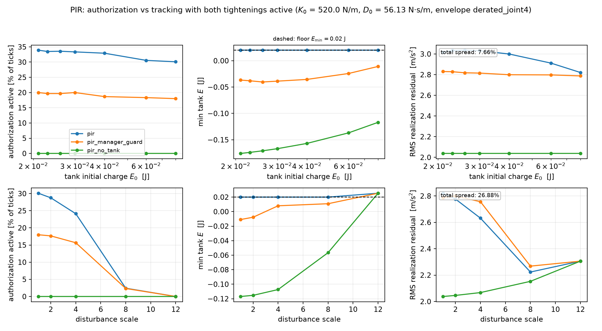

**Figure 8 — authorization vs tracking at the recommended pose.** Against
Figure 3, the middle column now shows `pir` holding $E_{\min}$ across the whole
sweep while both baselines breach everywhere, and the right column carries a
7.7 % spread instead of 0.03 % — a real trade rather than a flat line.

One counter-intuitive detail, stated because it is not obvious: authorization
becomes *less* active as the disturbance grows (30.1 % → 0.0 % at 12×), the
opposite of the `phri2` pose. The tank harvests $\alpha_{\mathrm{nom}} v^\top
D_0 v$, which grows quadratically with the disturbance-driven velocity, while
the residual's debit $F_r^\top v$ grows linearly — so a large disturbance fills
the tank faster than it drains it. The stressing case here is the *nominal*
scenario, not the extreme one.

### 9.5 What this does not settle

The pose was chosen by a screen tuned on one scenario, and only $q_2, q_4, q_6$
were varied. Nothing here says it is optimal, or that it is a pose a real task
would want the robot in — it is a better *test* pose, and whether the
application permits it is a question this study cannot answer. The two guard
thresholds are judgement calls. And the whole comparison is still one seed of
one disturbance profile on one arm in simulation.

---

## 10. The tension between the two axes

PIR's name rests on realizability having *two* axes — feasibility, reported by
$r_{\mathrm{con}}$, and passivity, reported by $r_{\mathrm{auth}}$ — and the
synthesis note is explicit that without the second axis the whole thing is a
rebrand of constrained-MPC impedance. So the question that decides the framing
is not whether each axis works. It is whether there is an operating point where
**both are load-bearing at once and the controller is well behaved**.

On the evidence of the runs collected up to §10.4, there is not; §10.5 then
scans pose and $K_0$ jointly and finds exactly one candidate, whose status
depends on how the workspace box is read. `pir_axis_tension.py` aggregates
every closed-loop run and sweep point in `results/` and classifies each by
which authorization actually fired.

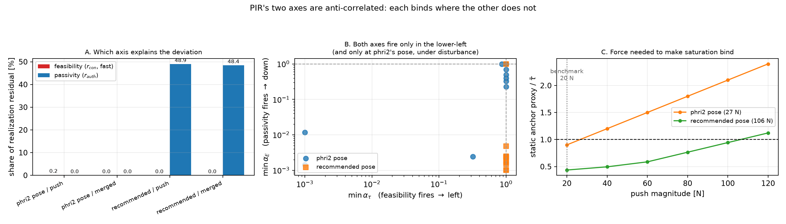

**Figure 9 — each axis binds where the other does not.**

### 10.1 Each axis is inert where the other is strong

Each axis's contribution is reported against $|a_{id}|$, the behaviour the
controller is trying to render — the same denominator §10.5 uses, so the two
are comparable. (Normalising by the *net* realization residual would not be a
share of anything: the four terms sum to the net but oppose one another, so a
single term can exceed it.)

| run | $\min\alpha_\tau$ | $\min\alpha_E$ | $r_{\mathrm{con}}/\|a_{id}\|$ | $r_{\mathrm{auth}}/\|a_{id}\|$ | headroom |
|---|---|---|---|---|---|
| `phri2` pose / push | 0.8504 | **1.0000** | 0.2 % | **0.0 %** | 2.4 % |
| `phri2` pose / merged | **1.0000** | **1.0000** | 0.0 % | **0.0 %** | 2.4 % |
| recommended / push | **1.0000** | 0.0006 | **0.0 %** | 46.3 % | 45.7 % |
| recommended / merged | **1.0000** | 0.0010 | **0.0 %** | 45.8 % | 45.7 % |

At the recommended pose the passivity axis removes **46 %** of the intended
behaviour and the feasibility axis contributes **nothing** — $\alpha_\tau$ stays
at 1.0 across all 12 sweep points there, so the fast torque projection never
once intervenes. At `phri2`'s pose the situation inverts: $\alpha_\tau$ fires
and $r_{\mathrm{auth}}$ is *exactly* zero.

Across all 24 sweep points, **4 have both axes firing** — and all four are at
`phri2`'s pose under 4–12× disturbance, which is precisely the regime §9.3
showed to be badly behaved (negative headroom, 103–108 mm excursion against a
60 mm box). The one well-conditioned dual-axis point, $E_0 = 0.026$ at nominal
disturbance, has $\alpha_\tau = 0.9999$ — the feasibility axis is technically
firing and doing nothing.

### 10.2 Why — and one place where I over-generalised again

Both authorizations act on the **same object**, the residual $F_r$, through the
**same** torque budget. When that budget is tight they compete: a nominal stiff
enough for saturation to bind squeezes the residual (17 % of the command at
$K_0 = 380$, `phri2` pose), and a small residual does little port work, so the
tank never drains.

The $K_0$ sweep at `phri2`'s pose shows exactly that:

| $K_0$ | headroom | residual share | feasibility: safe disturbance | passivity: $E_0$ trade |
|---|---|---|---|---|
| 100 | 26.4 % | 72.6 % | 12× | 0.0068 |
| 200 | 17.9 % | 46.4 % | 8× | 0.0125 |
| **250** | 13.7 % | 34.1 % | 8× | **0.0358** ← strongest here |
| 380 | 2.4 % | 17.1 % | 4× | 0.0020 |
| 600 | −5.3 % | 48.4 % | **0×** | 0.0010 |

**I first wrote that up as a structural law — passivity peaks at intermediate
$K_0$, feasibility binds monotonically — and the re-run at the recommended pose
(§8.4) contradicts it**, which is the same over-generalisation §11.0 catalogues,
committed while writing the section that catalogues it. At the recommended pose
the headroom never falls below 46 % at *any* $K_0$, the feasibility axis never
binds at any $K_0$, and the $E_0$ trade *rises* with $K_0$ (0.021 up to
$K_0 = 380$, then 0.32 at 460) instead of peaking in the middle.

What survives is narrower and still sufficient:

- **The competition is real only when the torque budget is tight.** With ample
  headroom a stiff nominal does *not* squeeze the residual — at the recommended
  pose $K_0 = 460$ still leaves the residual 50 % of the command — so the two
  axes decouple. But they decouple into a regime where feasibility never binds
  at all, which is not a dual-axis regime either.
- **The axis-firing evidence is pose-robust and is what §10.1 rests on**, since
  it is measured directly rather than inferred: $\alpha_\tau$ never once fires
  across 12 sweep points at the recommended pose, and $r_{\mathrm{auth}}$ is
  exactly zero across the headline runs at `phri2`'s.
- **Only a large disturbance loads both at once**, because it raises velocity
  (draining the tank) and the anchor (loading the envelope) together. That is
  why all four dual-axis points are high-disturbance ones.

So the conclusion of §10.1 stands — no well-behaved dual-axis operating point
exists in the data — but the tidy mechanism I reached for does not, and §10.5's
joint scan is the way to find out which story is right.

### 10.3 The recommended pose optimises away PIR's own feasibility half

Panel C quantifies it. Taking the static anchor proxy of §9.1 — which is
*optimistic* about feasibility, so these are lower bounds:

| pose | $\tau_{\mathrm{base}}$ floor | push needed for the anchor to reach $\bar\tau$ |
|---|---|---|
| `phri2` | 0.602 | **27 N** |
| recommended | 0.377 | **106 N** |

The benchmark push is 20 N, which is already a firm two-handed shove. At the
recommended pose you would need roughly **five times** that before saturation
became the binding constraint — outside the range a human interaction produces.

So the pose that makes the passive-nominal split work is a pose where the
saturation story PIR inherits from `phri2` does not arise. That is an
uncomfortable sentence and it belongs in the paper, not in a footnote.

### 10.4 What this means for the framing

It does **not** mean the second axis is unearned. It means the claim has to be
stated as what the evidence supports, which is a *stronger* claim than "both
axes always bind":

> The value of a two-axis certificate is not that both axes bind together. It
> is that **you cannot tell in advance which one will bind.** This study
> changes one FR3 joint angle — a change a practitioner would consider
> innocuous, and which *improves* every behavioural metric — and the binding
> axis flips from feasibility to passivity. A single-axis certificate is
> silent after that flip: at the recommended pose `phri2`'s $r_{\mathrm{con}}$
> reports zero while half the realization deviation is energy authorization,
> and at `phri2`'s pose `impedance_residual`'s tank reports zero while the
> torque projection is the only thing intervening.

That is what the four-term residual buys, and it is demonstrable on the data
already collected. The honest presentation is two case studies — a saturation
case at `phri2`'s pose and a passivity case at the recommended one — with §10.2
as the explanation for why one experiment cannot be both.

### 10.5 The joint scan: one candidate, and it hangs on a judgement call

Pose and $K_0$ had only ever been swept separately, so the two sweeps could
have been cutting across a diagonal ridge neither resolved.
`pir_joint_scan.py` scans them jointly: a pose family interpolating in joint
space between `phri2`'s pose ($\lambda = 0$) and the recommended one
($\lambda = 1$), crossed with $K_0 \in [150, 600]$ and disturbance
$\in \{1\times, 4\times\}$ — 96 cells, with $D_0$ set from a fixed damping
ratio against each pose's own task-space inertia so $K_0$ is the only gain
varying.

"Load-bearing" is deliberately stricter than "fired once": an axis counts only
if its residual term removes at least 2 % of the intended behaviour $|a_{id}|$.
(Reported as a *ratio*, not a share — under a 4× disturbance the QP's residual
fights something much larger than $a_{id}$, so the ratio legitimately exceeds
1. An earlier version of this script normalised by the *net* realization
residual, which is not a share at all: the four terms sum to the net but oppose
one another, and it produced "shares" of 468 %.)

**Result: 41 cells are well behaved, 5 are dual-axis, and the intersection is
empty at the headline box allowance.** In every one of the 41 well-behaved
cells $r_{\mathrm{con}}$ is *identically zero* — even in the three with under
5 % anchor headroom, where $\alpha_\tau$ still never fires because the tight
budget has squeezed the residual small enough to fit in what is left. That is
§10.2's surviving mechanism, confirmed on a grid rather than inferred from two
points.

All 5 dual-axis cells sit at $\lambda = 0$ — `phri2`'s own pose — under 4×
disturbance. And they fail "well behaved" for a reason worth stating precisely:
**not because the certificate breaks.** Lemma 1's precondition holds, its
conclusion holds, the tank floor holds, and $\alpha_{\mathrm{nom}}$ never
fires in any of them. They fail on **workspace containment** — 69.5 to
134.7 mm against the 0.06 m box.

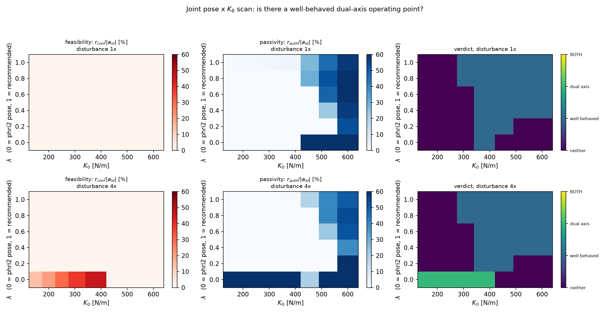

**Figure 10 — the joint pose × $K_0$ scan.** Left column: the feasibility axis,
which has colour only along the bottom edge ($\lambda = 0$, `phri2`'s pose).
Middle: the passivity axis, concentrated at high $K_0$ and high $\lambda$. The
two never light up together anywhere the verdict panel (right) calls well
behaved — no cell is marked "BOTH". The one candidate of the next subsection is
at $\lambda = 0$, $K_0 = 380$, and it is classified here as dual-axis but not
well behaved, because the 10 % box allowance this figure uses excludes it.

#### The candidate

That makes the verdict turn on how much overshoot of a **slack-relaxed** box
counts as a violation, which is a judgement call the scan should not make
silently:

| box allowance | dual-axis *and* well behaved |
|---|---|
| 1.00× – 1.15× | **0** |
| 1.20× – 1.30× | **1** — $\lambda = 0$, $K_0 = 380$, 4× disturbance |

At a 20 % allowance exactly one cell qualifies, and it is a striking one:
**`phri2`'s own pose at the originally certified operating point**,
$(K_0, D_0) = (380, 29.07)$ — the point this whole study started from — under
4× the source disturbance:

| | |
|---|---|
| $r_{\mathrm{con}} / \|a_{id}\|$ | **45.6 %** |
| $r_{\mathrm{auth}} / \|a_{id}\|$ | **95.3 %** |
| $\min\alpha_\tau$ / $\min\alpha_E$ | **0.320** / **0.0024** |
| $\alpha_{\mathrm{nom}}$ | 1.0 (decision 0's fix not needed) |
| anchor headroom | +1.1 % |
| Lemma 1 precondition / conclusion | hold / hold |
| tank floor | holds |
| fallback $\|e_z\|$ (diagnostic 3) | 55.8 mm ✓ |
| excursion | **69.5 mm**, 16 % over the box |

Both axes carrying 46 % and 95 % of the intended behaviour, both $\alpha$'s
deep into intervention, and every certificate intact. If `phri2`'s box is read
as what it is in its own QP — slack-relaxed, a preference under model mismatch
rather than an actuator limit — this is the dual-axis demonstration the paper
needs, and §10.1's "no such point" becomes "exactly one, and it is the obvious
one".

**This promotes a question that was already on the owed list to a decisive
one.** §12 has carried "resolve whether the 0.06 m bound is hard or
slack-relaxed" since the Task 1 gate, where it decided a 33-cell versus 6-cell
region. It now also decides whether PIR's central claim has a supporting
experiment. That convergence is not a coincidence — both are asking the same
thing, whether the workspace box is a specification or a preference.

#### What it does not buy

One cell, at 4× the source disturbance, 16 % outside the nominal box, at one
seed on one arm. It is an existence proof, not an operating recommendation —
and note that it is *not* the pose §9 recommends. The honest reading is that
PIR's two axes can be made simultaneously load-bearing, but only by running the
arm harder than either source paper does, at the pose with the tight torque
budget, and accepting an excursion the recommended pose avoids.

---

### 10.6 Both formulations, tested across seeds

§12's decision 3 offered two ways to state the claim, and both rested on a
single disturbance seed — (b) on a single cell at a single seed.
`pir_robustness.py` re-runs both across 10 seeds × 2 disturbance profiles (with
and without `rejectable_force`'s between-manager-tick pulse, the component
`impedance_residual` added specifically to defeat a slow guard). 60 runs.

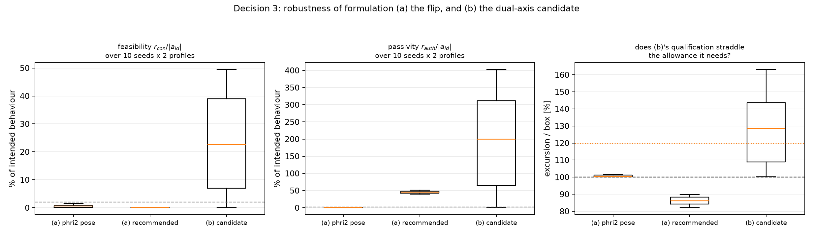

**Figure 11 — decision 3 under resampling.**

#### (a) The flip survives, 20/20 — with one correction to how it is stated

| | `phri2` pose | recommended pose |
|---|---|---|
| $r_{\mathrm{auth}}/\|a_{id}\|$ | **exactly 0** in 20/20 | **39.8 – 50.6 %** in 20/20 |
| $r_{\mathrm{con}}/\|a_{id}\|$ | 0.00 – 1.51 % | **exactly 0** in 20/20 |
| classification | neither axis load-bearing, 20/20 | passivity-only, 20/20 |

The assignment never swaps. But the strict load-bearing threshold exposes
something §10.4's wording glosses: at 1× disturbance the feasibility axis
**never reaches 2 % of the intended behaviour at either pose** — it fires
($\alpha_\tau$ ranges 0.77–1.00 at `phri2`'s pose) but what it removes is
under 1.5 %. So the robust statement is not "the load moves from one axis to
the other". It is:

> The passivity axis goes from **exactly zero** to **40–51 %** of the intended
> behaviour, and the feasibility axis from small-but-nonzero to **exactly
> zero**, on a joint-angle change that improves every behavioural metric. What
> flips is **which axis is capable of carrying load at all**.

That is still the claim §10.4 wants and it is now 20/20 rather than 1/1. It is
weaker than "the axes exchange the load", and the paper should say the weaker
thing.

#### (b) The exhibit does not survive as stated

| | result |
|---|---|
| dual-axis **and** every certificate intact | **5 / 20** |
| Lemma 1 precondition holds | **10 / 20** |
| Lemma 1 conclusion holds | 20 / 20 |
| tank floor holds | 20 / 20 |
| excursion, all runs | 100 – 163 % of the box |
| excursion, runs that qualify | 111 – 120 % |

§10.5's cell was seed 0 with the pulse — one of the lucky draws. Resampled,
the candidate is dual-axis in 15 of 20 runs but keeps **all** its certificates
in only 5, and the failure is always the same one: **Lemma 1's precondition**,
which holds in exactly half the runs. (The conclusion and the tank floor never
fail — $\alpha_{\mathrm{nom}}$ and the fast re-authorization do their jobs
every time. That is a real result in itself, and it is decision 0's fix earning
its place.)

The pattern in the failures is §10's anti-correlation appearing *within a
single cell*: the runs with the largest $r_{\mathrm{auth}}$ (122–403 %) and the
largest excursions (137–163 %) are exactly the runs where the precondition
breaks. Loading both axes harder does not get you a better exhibit; it gets you
a broken anchor.

**So (b) is not a one-off fluke — it recurs at three distinct seeds — but it is
a minority outcome (25 %) that always sits outside the nominal box (111–120 %
even when it qualifies).** It is not something to build a paper's central claim
on. §12's decision 3 resolves to **(a), with (b) demoted to a remark**: that a
dual-axis regime exists at all is worth one sentence and a pointer to the data;
it is not the exhibit.

---

## 11. What this does not show

### 11.0 A pattern in what turned out to be wrong

Seven conclusions in this document were later overturned or narrowed by a
subsequent experiment, and the pattern is worth stating because it bears on how
much anything here should be trusted:

| conclusion | fate |
|---|---|
| $\rho = 0.28$ is *structurally* infeasible (§5.1) | ✗ pose-specific (§9.2) |
| the $E_0$ trade is *flatter*, not steeper (§7.5) | ✗ pose artifact (§9.4) |
| neither source benchmark stresses both axes (§7.4) | ✗ pose artifact (§9.4) |
| the nominal dominates the command, 84 % (§7.6) | ✗ pose artifact, → 46 % (§9.4) |
| the split makes a hard guarantee conditional (§7.7) | ✓ true, but fixable (§8.2) and inert at the good pose (§8.4) |
| anisotropic gains do not help *and slightly hurt* (§8.3) | ~ the "hurt" is pose-specific; useless but harmless at the good pose (§8.4) |
| passivity peaks at intermediate $K_0$ (§10.2, first draft) | ✗ inverts at the good pose — committed *while writing this table* |

Five of seven were properties of **one FR3 configuration**, not of the
architecture — and in each case the erroneous generalisation was made from a
carefully measured, internally consistent experiment. The measurements were
right; the scope claimed for them was not. **Nothing in this line should be
claimed without a pose sweep** — a rule I restated in §10.2 and then broke in
the next paragraph, which is the most honest evidence available for how strong
the pull toward the tidy generalisation is. The two bugs that the four-term
residual's closure check caught (§8.2, §9.4) suggest the same about any
diagnostic that cannot be checked against an identity.

- **~~The merged controller is not implemented.~~** Discharged in §7.2: the
  replay estimate and the merged closed loop agree to 0.1 % on both rows, and a
  regression test now pins them together.
- **~~The anchor's feasibility does not survive a larger scenario.~~** Fixed in
  §8.2 by `nominal_auth_mono`, which holds both guarantees to 16×. What is
  *not* fixed is the condition underneath it: everything still assumes
  $\tau_{\mathrm{base}}$ alone fits the envelope, which is a property of the
  pose and is not defended anywhere.
- **The fix's cost is not fully characterised.** `nominal_auth_mono` ratchets
  the floor's stiffness down and never recovers it within a run. A 6 s
  benchmark does not show what that does over minutes of interaction, and the
  per-contact reset a deployed system would need is not implemented or tested.
- **The $K_0$ trade is priced on one disturbance profile.** §8.3's workspace
  numbers at 12× come from `impedance_residual`'s own rejectable force scaled
  up, at one seed. That is a stress test, not a distribution.
- **The fallback leaves the workspace box in transient.** 62.2 mm peak against
  a 60 mm bound. `phri2`'s box is slack-relaxed rather than hard, so this is
  not a constraint violation in its formulation — but it means the
  $\alpha\to 0$ guarantee is "settles inside the box", not "stays inside it".
  If the bound is to be read as hard, the region is 6 cells, not 33, and the
  recommended cell is outside it.
- **One pose, one push direction, isotropic gains.** The whole gate is
  evaluated at `phri2`'s nominal hold pose under a $-z$ push, with
  $K_0 = k I$, $D_0 = d I$. Joint 4 is the binding joint in every single cell,
  and it is binding largely because of an 18.96 N·m bias torque at that
  specific configuration. An anisotropic $(K_0, D_0)$ — stiffer along the push
  axis, softer elsewhere — is the obvious first lever if the region needs
  widening, and the note explicitly defers it. A different pose could move the
  verdict in either direction.
- **Recursive feasibility is untouched**, in both source papers and here. The
  combined torque-envelope + energy-floor + workspace-slack feasibility
  question is harder jointly than separately and cannot be self-certified.
- **The force-misclassification pillar is untouched.** The tank meters
  $F_r^\top v$; if $F_h$ leaks into $\hat d$, or $F_e$ is folded into the
  disturbance, the power sign is wrong and every certificate here stays green
  while the arm pushes a mislabelled wall. **No green cell in this document
  implies anything about that pillar.**
- **Double tightening is not measured.** `phri2`'s horizon-wide torque
  tightening and `impedance_residual`'s tank tightening compound in series.
  That curve is Task 3 and is expected to get steeper after the merge.
- Simulation only, translational only, affine memoryless behaviour class.

---

## 12. Decision gate

The synthesis note's §13.3 put the decision gate right after Task 1. The work
ran well past that, because each result changed what the next question was;
what follows is where it actually stops.

`common_region_nonempty == true` under `phri2`'s derated-joint-4 envelope, the
merged controller is implemented, Merged Lemma 1 holds in closed loop and the
four-term residual closes exactly. What is left is not a coding decision.

§8, §9 and §10 have each changed what is being decided. Finding 4 is fixed and
adopted; findings 1–3 turned out to be largely the pose; and §10 has moved the
open question from the design to the **framing**. Two decisions are settled and
two are open.

**Decision 0 — adopt `nominal_auth_mono`? SETTLED, adopted.** It quadruples the
range over which both guarantees survive, is provably inert while the anchor
fits, and costs nothing measurable; §8.4 later showed it is inert at the
recommended pose too, which makes it insurance rather than a load-bearing part.
The one reservation is §11's: its stiffness ratchet is untested beyond a 6 s
run, so it needs a per-contact reset before hardware.

**Decision 3 — how is the two-axis claim stated? SETTLED by §10.6:
formulation (a), with (b) demoted to a remark.** Both candidates were resampled
across 10 seeds × 2 disturbance profiles:

- **(a) The flip — survives 20/20.** The passivity axis goes from exactly zero
  at `phri2`'s pose to 40–51 % of the intended behaviour at the recommended
  one, and the feasibility axis from small-but-nonzero to exactly zero, on a
  joint-angle change that improves every behavioural metric. One correction
  §10.6 forces: at 1× disturbance the feasibility axis never reaches the
  load-bearing threshold at *either* pose, so the claim is "**which axis can
  carry load at all** flips", not "the axes exchange the load". Say the weaker
  thing.
- **(b) The dual-axis exhibit — does not survive as stated.** §10.5's cell was
  a lucky seed. Resampled, it is dual-axis in 15/20 runs but keeps all its
  certificates in **5/20**, always failing on Lemma 1's precondition, and even
  when it qualifies it sits 111–120 % outside the box. It recurs at three
  distinct seeds so it is not noise, but a 25 % outcome is not a central
  claim's evidence.

This also **retires the box question as a framing blocker.** It still matters
for the Task 1 region size, but the exhibit it would have licensed does not
survive resampling, so the framing no longer waits on it.

**Decision 1 — how much workspace containment under disturbance is the
predictive layer's authority worth?** *Probably moot now.* This was the real
form of findings 1–3: $K_0 = K_d = 200$ buys 6.8× the anchor headroom and 2.7×
the residual share, and pays with 160 mm of excursion at 12× disturbance
against 79 mm. §9.3 gets 19× the headroom and 3.2× the residual share from the
pose instead, and *improves* the excursion to 59 mm. Unless the application
pins the pose, take the pose and leave $K_0$ alone. Still worth a human's eye,
because "the application pins the pose" is exactly the kind of constraint this
study cannot see.

**Decision 2 — which envelope does the merged paper claim? SETTLED by §9:**
`phri2`'s derated-joint-4 envelope, at a pose that does not load joint 4.
$\rho = 0.28$ is reachable (§9.2 corrects §5.1's over-claim) but leaves at best
13 % of the cap for the nominal, which is not enough for the split. For the
record, the three options as they stood before §9 ran:

1. **Write the merge against `phri2`'s derated-joint-4 envelope.**
   $(K_0, D_0) = (380, 29.1)$, region of 33 cells, margins of 2–7 %. Honest,
   and the source benchmark actually runs there. Costs: the tank's numbers
   from `impedance_residual` were measured under $\rho = 0.28$ and would have
   to be re-derived, and the margins are thin enough that §7's first bullet
   could consume them.
2. **Keep $\rho = 0.28$ and abandon the passive-nominal split**, retreating to
   "dissipativity directly on the realized port, no nominal" — a different and
   harder design, and a separate planning decision. This looked *forced* when
   §5.1 read its result as structural; §9.2 withdrew that, so it was never
   forced — only expensive.
3. **Change the scenario** — a different nominal pose, a lower push magnitude,
   or a push direction that does not load joint 4 — and re-run this gate.
   Cheap to try (the scan is ~19 min on 4 cores) and it attacks the actual
   binding quantity, which is an 18.96 N·m bias torque at one configuration
   rather than anything about impedance.

Option 3 is what §9 ran, and it won: the pose relieves findings 1, 3 and 4 at
once and improves containment rather than trading it. Option 1 is therefore the
recommendation, *at the §9.3 pose rather than `phri2`'s*. Option 2 is not
forced — the passive-nominal split is viable, so there is no reason to retreat
to dissipativity-on-the-realized-port.

A tension that decision 3 has now dissolved rather than resolved: decision 2
recommends the §9.3 pose while §10.5's dual-axis cell lives at `phri2`'s, so
formulation (b) would have had the paper recommending one operating point and
demonstrating its central claim at another. §10.6 demoted (b), so the question
no longer arises — but it is recorded because it is the kind of thing that
would have been easy to gloss.

### Owed before any claim

- [x] ~~Decision 0: adopt `nominal_auth_mono`~~ — adopted; it is the
      controller's default, with `pir_no_nominal_auth` kept as the ablation.
- [x] ~~Decision 2: which envelope~~ — §9. Derated-joint-4, at the §9.3 pose.
- [ ] **Human:** decision 3 (the framing, §10.4) — now the highest-stakes one.
- [ ] **Human:** decision 1, which §9.3 suggests is moot unless the application
      pins the pose.
- [x] ~~Root-cause the three Section 7 findings~~ — §8.1. One constraint,
      monotone in $K_0$.
- [x] ~~Fix the precondition failure~~ — §8.2, `nominal_auth_mono`. Both
      guarantees to 16×.
- [x] ~~Try anisotropic $(K_0, D_0)$~~ — §8.3. It does not help here and
      slightly hurts; the displacement is 8:1 push-axis dominated.
- [x] ~~Re-run the gate at a pose that does not load joint 4~~ — §9.3.
      481 cells against 33, and 45.7 % headroom against 2.4 %.
- [x] ~~Re-run Tasks 2 and 3 at the §9.3 pose~~ — §9.4. Both axes are now
      exercised by `phri2`'s own benchmark, and §7.5's "flatter" conclusion is
      corrected: the trade is 7.7 %, as the synthesis note predicted.
- [ ] Re-run §8's root-cause and fix comparison at the recommended pose too.
      They are diagnoses of a problem the pose largely removes, so they are
      still correct as history, but the numbers a paper quotes should be the
      recommended pose's.
- [ ] Search poses properly rather than on a $q_2, q_4, q_6$ grid screened by
      one scenario, and check whether the recommended pose is one a real task
      would accept.
- [x] ~~Joint pose × $K_0$ scan looking for a well-behaved dual-axis operating
      point~~ — §10.5. 96 cells; one candidate, conditional on the box reading.
- [x] ~~Promote §10.5's candidate to a proper case study — repeat it across
      seeds and disturbance profiles~~ — §10.6. It does not survive: 5/20 on
      all certificates, and the 16 % excursion was a mid-range draw of a
      100–163 % spread. Demoted to a remark.
- [ ] The one thing §10.6 leaves open: the precondition fails in 10/20 runs at
      the candidate cell while the *conclusion* never does. That gap is
      $\alpha_{\mathrm{nom}}$ working, and it means "precondition violated" and
      "envelope violated" have come apart. Merged Lemma 1 should be restated to
      say what is guaranteed when the precondition fails but
      $\alpha_{\mathrm{nom}}$ is active — the proof currently has no such case.
- [x] ~~Implement the merged controller and re-measure rows 1 and 4 in its own
      closed loop~~ — §7.1–7.2. Replay and closed loop agree to 0.1 %.
- [x] ~~Task 3: re-sweep the authorization-vs-tracking curve ($E_0$) with both
      tightenings active~~ — §7.4–7.5. The trade is **flatter**, not steeper,
      and §7.5 says why that is a bad sign rather than a good one.
- [ ] **Task 2, the proof:** write merged Lemma 1 (per-joint $\alpha_\tau$
      closed form, $\alpha_\tau\!\cdot\!\alpha_E$ on-segment lemma) and merged
      Proposition 1 at submittable granularity. The implementation supplies the
      operating point and confirms both halves empirically; the write-up must
      state the precondition as a **standing hypothesis that can fail at run
      time** (§7.7), not as a design-time check.
- [x] ~~Decide what the controller does when the precondition fails~~ — §8.2.
      Folding the nominal into the authorization loop works, and the passivity
      cost it first appeared to carry is removed by making
      $\alpha_{\mathrm{nom}}$ monotone. The escalation route back into
      `certified-realizability` is still the answer for the residual condition
      §8.4 names ($\tau_{\mathrm{base}}$ itself), which no local fix defends.
- [ ] Re-run the Task 1 gate at a pose/push direction that does not load
      joint 4, and check whether the headroom problem is FR3-pose-specific.
- [ ] Implement and test the per-contact reset `nominal_auth_mono` needs, and
      characterise the ratchet over runs longer than 6 s.
- [ ] **Resolve whether the 0.06 m bound is hard or slack-relaxed.** Back to
      being a Task 1 question only — it decides a 33-cell versus 6-cell region.
      §10.5 briefly made it decisive for the framing too; §10.6 retired that,
      because the exhibit it would have licensed does not survive resampling.
- [ ] Explicitly disclaim the force-misclassification pillar in whatever is
      written. §7.1's channel split makes the assumption visible; it does not
      discharge it.

---

## 13. Reproducing

```bash
cd simulation
python3 pir_knot_scan.py                     # ~19 min on 4 cores  (Task 1 gate)
python3 pir_knot_scan.py --rescore           # re-derive verdicts/figures from stored maps
python3 pir_verify.py                        # ~3 min              (gate verification)
python3 run_pir_closed_loop.py --scenario push     # ~35 s          (Section 7.2, 7.6)
python3 run_pir_closed_loop.py --scenario merged   # ~35 s          (Section 7.3, 7.4)
python3 pir_e0_sweep.py                      # ~6 min              (Section 7.4, 7.5)
python3 pir_rootcause.py                     # ~4 min              (Section 8.1)
python3 pir_fixes.py                         # ~5 min              (Section 8.3)
python3 pir_pose_study.py                    # ~4 min              (Section 9.1, 9.2)
python3 pir_knot_scan.py --pose -1.30 -1.30 1.571 \
        --tag pose_q2m13_q4m13               # ~19 min             (Section 9.3)
POSE="--pose -1.30 -1.30 1.571 --k0 520.0 --d0 56.13 --tag pose_q2m13_q4m13"
python3 run_pir_closed_loop.py $POSE --scenario push     # (Section 9.4)
python3 run_pir_closed_loop.py $POSE --scenario merged   # (Section 9.4)
python3 pir_e0_sweep.py $POSE                # ~25 min             (Section 9.4)
python3 pir_rootcause.py --pose -1.30 -1.30 1.571 --tag pose_q2m13_q4m13
python3 pir_fixes.py --pose -1.30 -1.30 1.571 --k0 520.0 --d0 56.13 \
        --tag pose_q2m13_q4m13               # ~9 min              (Section 8)
python3 pir_axis_tension.py                  # seconds; reads results/ (Section 10)
python3 pir_joint_scan.py                    # ~8 min              (Section 10.5)
python3 pir_robustness.py                    # ~10 min             (Section 10.6)
python3 -m pytest test_pir_knot_scan.py test_pir_controller.py -q
```

MuJoCo mesh assets are gitignored repo-wide and must be fetched from MuJoCo
Menagerie into `../simulation/models/franka_fr3/assets/`. Pinned dependency
versions are in `../impedance/simulation/requirements.txt`; `mujoco==3.10.0`
matters, since 3.13 renamed `MjData.qM` and `fr3_mujoco.py` reads it.
