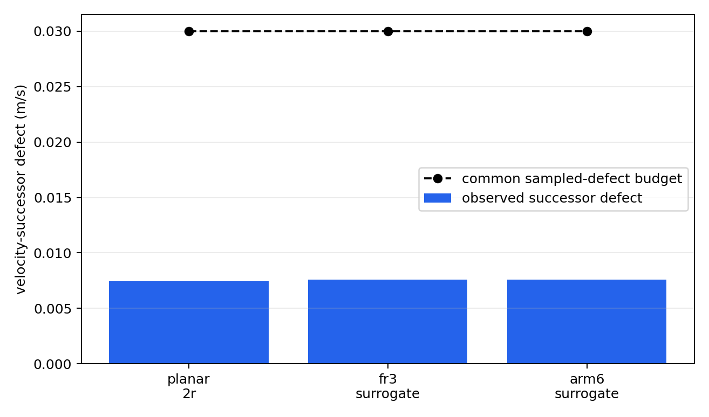

# A Conditional Certificate-Transfer Interface for Predictive Saturation Management of Fast Robot Controllers

**Anonymous submission**

## Abstract

Fast robot controllers are commonly protected from actuator saturation by clipping their requested torque. Although clipping enforces actuator bounds, it can silently destroy the closed-loop behavior that the controller was designed or trained to produce. This paper presents a two-rate predictive realization architecture that anticipates this loss of realizability without replacing the nominal high-rate controller. A proportional--derivative, impedance, reinforcement-learning, neural-network, or behavior-conditioned controller continues to execute at \(1~\mathrm{kHz}\), while a \(50~\mathrm{Hz}\) model-predictive manager selects an acceleration sequence close to the nominal request and constrains it inside a robot-specific, uncertainty-tightened actuator-feasible set. We represent this set as a configuration-dependent task-acceleration zonotope and log a directional-authority indicator that exposes loss of authority hidden by scalar utilization. The theoretical result gives sufficient conditions under which a robust certificate stated in common behavior coordinates transfers to a physical robot: realization uncertainty must fit inside the available actuator margin, and the resulting successor defect must fit inside the abstract certificate margin. A deterministic study comprising 108 cases evaluates five controller interfaces, three realization-map surrogates, eight stress scenarios, and six ablation families. Full-horizon enforcement removes a \(3.594~\mathrm{Nm}\) future violation missed by a first-step constraint. A sampled cross-realization audit applies one common \(0.03~\mathrm{m/s}\) audit threshold to all three realization maps, whose observed defects remain below \(0.00759~\mathrm{m/s}\). The method prevents violations in slow-saturation, directional-authority-collapse, and near-boundary braking scenarios. Abrupt disturbances and severe model or preview mismatch exceed the sampled audit conditions, explicitly identifying the boundary of the result. The study supports a conditional certificate-transfer interface and predictive saturation management in reduced-order simulation; it does not experimentally instantiate the abstract robust-invariance certificate or establish universal policy safety or hard real-time hardware performance.

**Index Terms—** actuator saturation, model predictive control, physical interaction control, constraint management, control refinement, robot control architecture.

---

# I. Introduction

Robot control software increasingly combines high-rate feedback with lower-rate prediction. The fast layer may be a conventional proportional--derivative (PD) controller, an impedance controller, or a learned policy. Its purpose is to react to sensor feedback with low latency. A slower layer can reason over a horizon, but embedding every nominal controller inside a new robot-specific model-predictive controller sacrifices the modularity that makes the fast layer useful.

These fast controllers can approach saturation through different channels. Before command limiting, a fixed-gain PD law \(\tau\propto k_p(q_{\mathrm{goal}}-q)-k_d\dot q\) maps a sufficiently large tracking error to a large actuator request. An impedance law introduces interaction force through \(M_d\ddot e=-K_de-D_d\dot e+F_h\), so contact can increase the requested acceleration even when tracking error is modest. The implementation studied here imposes a common acceleration bound on every nominal interface, but this does not guarantee torque feasibility after configuration-dependent realization.

The same distinction applies to bounded learned policies. The \(\tanh\)-squashed policy used in Section VI bounds its requested acceleration, but the required torque is \(\tau=\tau_{\mathrm{base}}(x)+H_r(x)v\); a fixed bound on \(v\) does not imply a configuration-independent bound on \(\tau\). A neural policy fitted to impedance demonstrations can reproduce the same force-dependent requests without exposing interpretable stiffness and damping parameters. An upstream learned or language-conditioned module may likewise propose a motion primitive without representing the actuator geometry of the executing robot. These observations motivate a common realization interface, not a claim that every learned behavior is certifiable.

The shared consequence is an acceleration request that the current robot cannot realize in its current configuration. We therefore treat saturation management as an interface problem. Controller-specific measures remain useful, but the robot-aware realization layer developed here anticipates the common physical failure without requiring its predictive optimization to be reformulated for each upstream controller.

Formally, let a nominal controller of any of these kinds request

\[
\tau_k^0=\pi_\theta(s_k),
\]

where \(s_k\) is the controller observation and \(\pi_\theta\) may be analytic or learned. A conventional implementation applies

\[
\tau_k^{\mathrm{app}}
=
\operatorname{proj}_{\mathcal T_r}(\tau_k^0),
\qquad
\mathcal T_r
=
\{\tau:\tau_{\min,r}\le \tau\le\tau_{\max,r}\}.
\]

Projection protects the actuator command but changes the acceleration generated by the robot. After projection, the robot is no longer realizing the nominal PD, impedance, or learned closed-loop dynamics. This distinction is especially consequential in physical interaction control, where the requested acceleration determines apparent compliance and disturbance response.

We study whether prediction can preserve the nominal fast controller while correcting its requested dynamics before the actuator command becomes unrealizable. The proposed architecture separates two responsibilities. A behavior layer specifies the nominal local dynamics at \(1~\mathrm{kHz}\). A predictive realization manager, executing at \(50~\mathrm{Hz}\), checks whether those dynamics can be produced by the current robot over a finite horizon and computes a minimum correction when required. A final high-rate projection remains necessary for disturbances that arrive between predictive updates.

Feedback linearization to a double-integrator-like behavior model is classical [1], [2]. Likewise, reference governors, predictive safety filters, anti-windup control, and model-predictive constraint handling are established ideas [3]--[7]. The contribution is therefore not another claim of universal prediction. The central question is instead:

> When can a behavior-level certificate be reused across different nominal controllers and different robots, despite configuration-dependent actuator saturation?

The answer requires preserving, rather than hiding, the robot-specific realization geometry. The common behavior dynamics provide a reusable location for prediction and certification, while the actuator-feasible acceleration set and uncertainty bounds remain specific to each robot.

The contributions are:

1. a two-rate architecture that retains an existing \(1~\mathrm{kHz}\) controller and uses slower MPC only to anticipate and correct loss of actuator realizability;
2. a robot-dependent acceleration-zonotope representation and a directional-authority indicator logged at every predictive update, exposing failures hidden by scalar torque utilization;
3. a conditional certificate-transfer theorem that separates a reusable abstract certificate from robot-specific actuator and successor-error tests; and
4. a reproducible 108-case simulation study evaluating controller substitution, sampled cross-realization refinement, horizon-wide constraints, uncertainty tightening, final high-rate projection, and failure outside the tested operating region.

The experiments are reduced-order and intentionally include negative cases. They establish the mechanism and its logical limits rather than hardware-level universality.

---

# II. Related Work

Impedance control specifies a desired dynamic relation between motion and interaction force [1], while operational-space control maps task accelerations or wrenches to joint torque [2]. Both rely on sufficient actuator authority. Direct clipping preserves torque bounds but changes the realized dynamics. Anti-windup methods explicitly address saturation-induced performance and stability degradation [6], [7], but are commonly designed around a particular closed-loop controller and often react to saturation rather than forecasting a configuration-dependent loss of task authority.

Model-reference adaptive impedance control instead asks the robot to reproduce a prescribed impedance model despite uncertain physical dynamics [11]. This is close to our behavior-coordinate viewpoint, but it does not by itself provide finite-horizon actuator-constraint management. The present work retains the fast interaction controller and alters its requested task acceleration before hard clipping is predicted. The final projection is not removed; it remains a last-resort actuator guard.

Reference and command governors modify a reference supplied to a pre-stabilized system so that predicted constraints remain satisfied [3]. Predictive safety filters similarly modify nominal actions using a predictive model and a recoverable terminal condition [5]. Robot-specific MPC can incorporate full nonlinear dynamics and actuator constraints directly. These approaches establish that predictive constraint management is valuable; the present work does not claim otherwise.

Recent interaction-control work combines MPC with impedance adaptation in several ways. Roveda *et al.* optimize impedance setpoints and damping using learned interaction dynamics [12]; Haninger *et al.* jointly optimize trajectory and impedance using Gaussian-process task models [13]; Anand *et al.* use a learned Cartesian impedance model inside MPC to adapt variable-impedance parameters across manipulation tasks [14]; and Xue *et al.* combine model-predictive variable impedance control with environment estimation, passivity, and safety-oriented mode switching [15]. In these methods, impedance parameters or trajectories are optimization variables. Our manager instead treats the upstream controller as fixed and selects a physically realizable task-acceleration sequence close to its request.

This difference does not make the proposed optimizer categorically separate from a reference governor or predictive safety filter. Either architecture could implement the realization manager. The contribution lies in the behavior--realization contract and the sufficient transfer condition, not in assigning a new name to constrained MPC. Unlike predictive safety filters with a verified terminal safe set [16], the present simulation enforces finite-horizon state and actuator constraints but does not establish recursive feasibility.

Control barrier functions provide a natural high-rate mechanism for enforcing state inequalities [4]. They are useful as the final projection in the proposed architecture, but an instantaneous constraint may intervene only after the state has approached a region from which actuator authority is insufficient. Our predictive layer instead evaluates future realization geometry and finite-horizon running constraints; the present implementation does not use a terminal recoverability condition.

The theoretical lineage is approximate simulation and control refinement [8], [9]. An interface maps an abstract input to a concrete input while bounding the mismatch between abstract and concrete successors. Contract-based design similarly separates assumptions about a component from the guarantees it delivers [10]. We specialize that logic to actuator-limited robot realization: the refinement defect is constructed from a tightened actuator set, a torque-realization error bound, and an abstract successor-error bound. This makes certificate transfer conditional and falsifiable.

---

# III. Problem Formulation

Consider a torque-controlled robot \(r\),

\[
M_r(q)\ddot q+h_r(q,\dot q)
=
\tau+J_r(q)^\top F_h,
\]

where \(M_r(q)\succ0\), \(h_r\) collects modeled bias terms, \(F_h\) is an interaction wrench, and \(\tau\in\mathcal T_r\).

The actuator set is the box

\[
\mathcal T_r
=
\{\tau:\tau_{\min,r}\le\tau\le\tau_{\max,r}\},
\]

with both inequalities interpreted componentwise.

The architecture requires only that the fast controller expose

\[
\mathcal I_\theta(s_k,\xi_k)
\mapsto
\left(\tau_k^0,\mathcal P_{\theta,k},\Sigma_{\theta,k}\right).
\]

Here \(\tau_k^0\) is the current nominal command, \(\mathcal P_{\theta,k}\) is an optional preview operator, and \(\Sigma_{\theta,k}\) bounds preview uncertainty. An analytic PD or impedance controller can be evaluated along predicted states. A learned policy may be queried on predicted observations. If no validated preview is available, zero-order hold or a learned predictor may be used, but its error must enter \(\Sigma_{\theta,k}\). A black-box controller with neither query access nor bounded preview error is outside the certificate.

Let

\[
z=
\begin{bmatrix}
e^\top & \dot e^\top
\end{bmatrix}^{\top}
\]

denote a task-error state. Over a local operating region, the requested behavior can be written

\[
\ddot e=v+d_r,
\]

where \(v\in\mathbb R^d\) is the requested task acceleration and \(d_r\) contains matched interaction and modeling effects. Unmatched discretization, coupling, and force errors will be retained later as a set-valued successor defect.

At the manager period \(T_s\), the abstract predictor is

\[
z_{\ell+1}=Az_\ell+B(v_\ell+d_\ell),
\]

\[
A=
\begin{bmatrix}
I&T_sI\\
0&I
\end{bmatrix},
\qquad
B=
\begin{bmatrix}
\frac{1}{2}T_s^2I\\
T_sI
\end{bmatrix}.
\]

This model is a common interface, not the claimed novelty.

Let \(\tau_{\mathrm{base},r}(x)\) include bias compensation and every secondary command that consumes actuator authority, including orientation and null-space torque. A local realization map is

\[
\tau
=
\tau_{\mathrm{base},r}(x)+H_r(x)v,
\]

with, for example,

\[
H_r(x)=J_r(q)^\top\Lambda_r(q),
\qquad
\Lambda_r(q)=\left(J_rM_r^{-1}J_r^\top\right)^{-1}.
\]

The acceleration request is realizable only if

\[
v\in\mathcal A_r(x)
=
\left\{
v:
\tau_{\min,r}
\le
\tau_{\mathrm{base},r}(x)+H_r(x)v
\le
\tau_{\max,r}
\right\}.
\]

Equivalently, if local task acceleration is \(a=b_r(x)+G_r(x)\tau\), the actuator box maps to the zonotope

\[
\mathcal Z_r(x)
=
b_r(x)+G_r(x)\tau_c
+G_r(x)\operatorname{diag}(\Delta\tau)[-1,1]^{n_r},
\]

where

\[
\tau_c=\frac{\tau_{\max,r}+\tau_{\min,r}}{2},
\qquad
\Delta\tau=\frac{\tau_{\max,r}-\tau_{\min,r}}{2}.
\]

For a full-dimensional \(d\)-dimensional zonotope with \(n_r\) generators in general position, every choice of \(d-1\) generators determines a facet normal and a pair of opposing supporting facets. Hence the number of facets is \(2\binom{n_r}{d-1}\) (and no larger in degenerate cases). Its support function in direction \(y\) is the support of its center plus the sum of the absolute projected generators, so directional authority can be evaluated without enumerating all \(2^{n_r}\) box vertices.

Thus the behavior dynamics can share coordinates, but their feasible set cannot be robot-independent.

Given an arbitrary nominal controller that supplies \(v^0\) or an equivalent torque command, determine a correction \(\Delta v\) such that:

1. \(v=v^0+\Delta v\) remains close to the nominal requested behavior;
2. the uncertain physical realization remains inside \(\mathcal T_r\) over the prediction horizon;
3. the predicted state satisfies the running workspace and speed constraints; and
4. the robot-specific realization can be tested against sufficient conditions for transferring an independently established abstract certificate.

---

# IV. Predictive Realization Manager

The nominal controller, state-dependent realization map, command-rate limiter, and final actuator projection execute every \(T_f=1~\mathrm{ms}\). The predictive manager executes every \(T_s=20~\mathrm{ms}\). Let \(v_{i|\ell}\) be the complete acceleration request, rather than a correction variable. The implemented manager rolls out the nominal controller, evaluates the realization map along that nominal rollout, and solves

\[
\begin{aligned}
\min_{v_{0:N-1}}
\quad&
\sum_{i=0}^{N-1}
\Big(
\|v_{i|\ell}-v^0_{i|\ell}\|_{W_v}^2
+\|v_{i|\ell}-v_{i-1|\ell}\|_{W_\Delta}^2
\Big)
\\
\mathrm{s.t.}\quad&
z_{i+1|\ell}
=
Az_{i|\ell}
+Bv_{i|\ell},
\\
&
v_{i|\ell}
\in
\mathcal A_r^{\mathrm{tight}}(\hat x^0_{i|\ell}),
\quad i=0,\ldots,N-1,
\\
&
z_{i+1|\ell}\in\mathcal X,
\\
&
\|v_{i|\ell}\|_\infty\le a_{\max},
\qquad
\|v_{i|\ell}-v_{i-1|\ell}\|_\infty
\le \dot a_{\max}T_s .
\end{aligned}
\]

Here \(\hat x^0_{i|\ell}\) is the state on the fixed nominal rollout used to assemble the QP. The state and acceleration bounds are hard; the implementation contains neither slack variables nor a separately constructed terminal invariant set. The objective trades nominal-command fidelity against acceleration variation, so it may make a small intervention even when the nominal sequence is feasible. Define the first correction as

\[
\Delta v_\ell=v_{0|\ell}-v^0_{0|\ell}.
\]

If the QP solver reports infeasibility, the implementation projects the first nominal acceleration onto the current tightened torque and one-step state polytope and tiles that reactive command over the stored sequence. If this instantaneous polytope is itself empty, it returns zero acceleration. The final high-rate torque projection remains active in either case. This fallback supplies a deterministic bounded command but does not recover horizon feasibility or satisfy the transfer conditions.

The fast loop applies

\[
\tau_k
=
\tau_k^0
+H_r(x_k)\Delta v_k
+\tau_k^{\mathrm{final}},
\]

where \(H_r(x_k)\) is recomputed from the current state. The slow loop therefore publishes a behavior correction, not a cached full torque.

Let \(\hat\tau_r(x,v)\) be the manager's predicted pre-projection torque. Suppose a verified componentwise error bound satisfies

\[
\tau_r^{\mathrm{pre}}(x,v)
\in
\hat\tau_r(x,v)
\oplus
\mathcal D_{\tau,r}(x,v),
\]

\[
\mathcal D_{\tau,r}(x,v)
\subseteq
\{\delta\tau:|\delta\tau|\le\bar\delta_{\tau,r}(x,v)\}.
\]

The tightened request set is

\[
\mathcal A_r^{\mathrm{tight}}(x)
=
\left\{
v:
\hat\tau_r(x,v)\oplus\mathcal D_{\tau,r}(x,v)
\subseteq\mathcal T_r
\right\},
\]

or, componentwise,

\[
\tau_{\min,r}+\bar\delta_{\tau,r}
\le
\hat\tau_r(x,v)
\le
\tau_{\max,r}-\bar\delta_{\tau,r}.
\]

The set must include state-estimation error, interpolation, secondary torque, torque-rate limiting, and any other implementation effect that can change the pre-projection torque.

For predicted torque \(\tau_{i|\ell}\), define normalized saturation margin

\[
\mu_{i|\ell}
=
\min_j
\left\{
\frac{\tau_{\max,j}-\tau_{j,i|\ell}}
{\tau_{\max,j}-\tau_{\min,j}},
\frac{\tau_{j,i|\ell}-\tau_{\min,j}}
{\tau_{\max,j}-\tau_{\min,j}}
\right\}.
\]

The minimum horizon margin is

\[
\mu_\ell^{\min}
=
\min_{i=0,\ldots,N-1}\mu_{i|\ell}.
\]

Scalar utilization does not reveal whether the robot retains authority in the direction required to reject an interaction force. Given current acceleration \(a_c\) and unit direction \(d\), define

\[
\alpha_r^+(x,a_c,d)
=
\max_{\alpha\ge0}
\left\{
\alpha:
a_c+\alpha d\in\mathcal Z_r(x)
\right\}.
\]

A small \(\alpha_r^+\) indicates directional authority collapse even if unused torque remains in other directions.

The implemented manager also reports finite-horizon QP feasibility. This is a useful recoverability diagnostic, but it is not membership in a certified viability kernel because no terminal invariant set or backup policy is constructed. Section VI therefore uses the term *near-boundary braking stress case* rather than point of no return.

---

# V. Conditional Certificate Transfer

Let the abstract corrected behavior satisfy

\[
z_{\ell+1}=F(z_\ell,\kappa(z_\ell)),
\]

and let

\[
\mathcal S=\{z:V(z)\le c\}
\]

be robustly invariant for an error set \(\mathcal E_\star\):

\[
F(z,\kappa(z))\oplus\mathcal E_\star
\subseteq\mathcal S,
\qquad
\forall z\in\mathcal S.
\]

For robot \(r\), let \(\Pi_r(x)=z\) be the abstraction map and \(f_r^d\) its sampled physical dynamics. When no torque projection occurs, suppose the successor mismatch is bounded by

\[
\Pi_r\!\left(f_r^d(x,\tau_r^{\mathrm{pre}},F_h)\right)
-F\!\left(\Pi_r(x),v\right)
\in
\mathcal D_{z,r}(x,v,F_h).
\]

The set \(\mathcal D_{z,r}\) may include discretization, interaction-force, state-estimation, interpolation, and secondary-channel errors.

**Theorem 1 (Conditional realizability-margin certificate transfer).**  
Let \(\mathcal S\) satisfy the robust invariance condition above. For robot \(r\), consider an operating region \(\mathcal X_r\) with \(\Pi_r(\mathcal X_r)\subseteq\mathcal S\). Suppose that for every \(x\in\mathcal X_r\), every admissible interaction wrench, and \(v=\kappa(\Pi_r(x))\):

\[
\tau_r^{\mathrm{pre}}(x,v)
\in
\hat\tau_r(x,v)\oplus\mathcal D_{\tau,r}(x,v),
\tag{1}
\]

\[
\hat\tau_r(x,v)\oplus\mathcal D_{\tau,r}(x,v)
\subseteq\mathcal T_r,
\tag{2}
\]

\[
\mathcal D_{z,r}(x,v,F_h)
\subseteq\mathcal E_\star.
\tag{3}
\]

Assume all implementation effects are included in (1)--(3), \(x_0\in\mathcal X_r\), and the physical successor remains in \(\mathcal X_r\) whenever its abstraction remains in \(\mathcal S\). Then actuator projection is inactive and

\[
\Pi_r\!\left(f_r^d(x,\tau_r^{\mathrm{app}},F_h)\right)
\in
F\!\left(\Pi_r(x),v\right)\oplus\mathcal E_\star.
\]

Consequently,

\[
\Pi_r(x_k)\in\mathcal S
\qquad
\forall k\ge0
\]

while the operating-region assumptions hold.

**Proof.** Conditions (1)--(2) imply \(\tau_r^{\mathrm{pre}}\in\mathcal T_r\); hence projection is the identity and \(\tau_r^{\mathrm{app}}=\tau_r^{\mathrm{pre}}\). Condition (3) then places the concrete successor inside the robust abstract successor set. Robust invariance of \(\mathcal S\) and induction from \(x_0\in\mathcal X_r\) give the result. \(\square\)

The region-persistence clause is an explicit conditional assumption, not a consequence of the implemented finite-horizon QP. A recursively feasible terminal set or certified backup policy would be one way to establish it. Without such a construction, Theorem 1 certifies the abstraction only while the physical trajectory remains inside the verified operating region.

The theorem does not make feasibility universal. Each robot must verify \(\Pi_r\), \(\hat\tau_r\), \(\mathcal D_{\tau,r}\), \(\mathcal D_{z,r}\), and \(\mathcal X_r\). What transfers is the abstract object

\[
\left(F,\kappa,\mathcal S,\mathcal E_\star\right).
\]

A directly testable norm specialization is

\[
\bar\eta_{\mathrm{disc}}
+\bar\eta_{\mathrm{hold}}
+\bar\eta_{\mathrm{sec}}
+L_F\bar\delta_F
+L_\tau\bar\delta_\tau
\le
\bar\epsilon_\star,
\]

where \(L_F\) bounds the one-step abstraction defect induced by force-model error and \(L_\tau\) bounds the defect induced by torque-realization error in the selected norm, together with

\[
\min_j
\left\{
\hat\tau_j-\tau_{\min,j},
\tau_{\max,j}-\hat\tau_j
\right\}
\ge
\|\bar\delta_\tau\|_\infty.
\]

The first inequality requires the certificate radius to dominate the successor defect; the second requires actuator margin to dominate torque-realization uncertainty.

If clipping becomes active, let

\[
\mathcal C_{\tau,r}(x,v)
=
\left\{
\operatorname{proj}_{\mathcal T_r}(\tau)-\tau:
\tau\in\hat\tau_r(x,v)\oplus\mathcal D_{\tau,r}(x,v)
\right\}.
\]

Here \(\mathcal L_r(x)\) is a verified linear or set-valued one-sample sensitivity operator that maps a torque-projection residual into the resulting abstraction-space successor perturbation. Its induced norm is bounded by the scalar gain \(L_\tau\) used above.

Transfer can then hold only if the enlarged defect

\[
\mathcal D_{z,r}
\oplus
\mathcal L_r(x)\mathcal C_{\tau,r}
\subseteq
\mathcal E_\star.
\]

The experiments use the more transparent no-clipping branch of Theorem 1. When the request leaves the tightened set, the final projection protects the actuator but no longer implies preservation of the requested behavior certificate.

---

# VI. Experiments

## A. Protocol

The deterministic benchmark uses a two-dimensional interaction task. The fast controller and final projection execute at \(1~\mathrm{kHz}\); the manager executes at \(50~\mathrm{Hz}\) with horizon \(N=12\). Three configuration-dependent realization maps are evaluated: a planar 2R map, an FR3-inspired surrogate, and a six-axis-arm surrogate. The latter two reproduce different actuator geometries and limits but are not manufacturer-accurate rigid-body models.

The same behavior dynamics, predictive objective, and sampled audit threshold

\[
\epsilon_{\mathrm{audit}}
=
0.03~\mathrm{m/s}
\]

are used throughout. This scalar is an empirical acceptance threshold for the observed norm \(\|d_z\|_2\); it is deliberately not denoted by the certified set \(\mathcal E_\star\) of Section V. The simulation does not construct \(V\), \(\mathcal S\), or a workspace-wide proof of robust invariance. The fast-controller interfaces are PD, impedance, a small policy trained by deterministic evolution strategy, a fixed-feature neural policy fitted to impedance demonstrations, and an AI-conditioned motion primitive executed by a PD servo. The final two learned cases test the command/preview interface; they are not evidence of semantic AI safety or improved policy quality.

The 108 cases comprise 40 scenario cases, 30 controller-interface cases, 24 cross-realization cases, and 14 ablations. The 40 scenario cases are eight scenarios evaluated with five channels: four realization architectures—direct clipping, a reactive \(1~\mathrm{kHz}\) projection, a scalar reference governor followed by the same reactive projection, and the proposed horizon-wide correction with final actuator projection—plus one nominal diagnostic without torque projection. The stress scenarios are no saturation, slow saturation, sudden disturbance, directional authority collapse, near-boundary braking, model mismatch, preview mismatch, and a dedicated horizon-ramp scenario used only for the horizon-constraint ablation of Section VI.E.

We report pre-projection torque excess, applied torque excess, workspace excess, behavior-realization RMSE, warning lead time, directional authority, sampled successor defects, and computation time. For a two-dimensional residual \(r_k\), RMSE is the pooled component-wise quantity

\[
\operatorname{RMSE}_{\mathrm{comp}}
=
\sqrt{\frac{1}{2K}\sum_{k=1}^{K}\|r_k\|_2^2}.
\]

The successor defect in Table III is instead the maximum vector norm and is not directly comparable with the component-wise RMSE. Applied torque remains within its box whenever the final projection is active; zero pre-projection excess is one sampled check for the no-clipping branch of Theorem 1, not proof of the abstract robust-invariance premise.

## B. Anticipatory saturation management

{width=70%}

Fig. 1 shows the directional-authority stress case. Direct clipping exceeds the actuator-feasible request set and the workspace bound. The predictive methods intervene earlier, but the vector correction preserves the workspace constraint while retaining a visible intervention residual.

{width=70%}

Fig. 2 shows the near-boundary braking case, which starts with an outward velocity close to the position boundary under a shrinking torque budget. Direct clipping lets the position overshoot the boundary and settle outside it. The reactive projection, reference governor plus projection, and proposed manager all arrest the position at the boundary. Because the experiment does not compute a viability kernel or terminal invariant set, it supports only finite-horizon constraint handling in this stress case.

{width=95%}

Fig. 3 summarizes the method-level trends, while Table I reports the clipping and proposed results. The proposed manager preserves the no-saturation behavior and prevents workspace violations in the slow-saturation, directional-collapse, and near-boundary braking scenarios. Warning precedes the limiting event by \(0.912\), \(0.939\), and \(0.566~\mathrm{s}\), respectively. The reactive projection and reference governor plus projection also satisfy the sampled constraints in these three cases. For slow saturation their warning leads are \(0.419\) and \(0.395~\mathrm{s}\), and for directional collapse they are \(0.340\) and \(0.306~\mathrm{s}\); the proposed vector-horizon manager therefore provides earlier intervention in those two scenarios, but not in the near-boundary braking case, where all three methods warn at approximately \(0.57~\mathrm{s}\).

| Scenario | Method | Pre-proj. excess (Nm) | Workspace excess (mm) | Lead (s) | Refinement |
|---|---|---:|---:|---:|---:|
| No saturation | Clipping | 0.000 | 0.000 | -- | Yes |
|  | Proposed | 0.000 | 0.000 | -- | Yes |
| Slow saturation | Clipping | 0.000 | 78.970 | -- | No |
|  | Proposed | 0.000 | 0.001 | 0.912 | Yes |
| Sudden disturbance | Clipping | 7.208 | 0.000 | -- | No |
|  | Proposed | 11.976 | 0.000 | 0.084 | No |
| Directional collapse | Clipping | 0.693 | 103.914 | -- | No |
|  | Proposed | 0.000 | 0.003 | 0.939 | Yes |
| Near-boundary braking | Clipping | 0.000 | 52.537 | -- | No |
|  | Proposed | 0.000 | 0.011 | 0.566 | Yes |
| Model mismatch | Clipping | 12.665 | 190.434 | -- | No |
|  | Proposed | 1.981 | 193.599 | 0.558 | No |
| Preview mismatch | Clipping | 19.917 | 190.191 | -- | No |
|  | Proposed | 4.409 | 344.246 | 0.790 | No |

: Scenario results.

The negative cases are not merely inconclusive. Under preview mismatch, the proposed correction acts on a force forecast that misses the sign change inside the horizon, increasing workspace excess from \(190.191~\mathrm{mm}\) with clipping to \(344.246~\mathrm{mm}\). Under model mismatch it is also slightly worse, \(193.599\) versus \(190.434~\mathrm{mm}\). The sampled refinement checks reject both cases, correctly indicating that the anticipatory correction is not trustworthy there.

The sudden-disturbance result illustrates why the slow manager cannot be the only protection layer. The wrench changes without advance information, while the implemented preview holds the measured wrench constant over the horizon; the resulting correction can therefore be misaligned with the short impulse and raises pre-projection excess from \(7.208\) to \(11.976~\mathrm{Nm}\). The final projection keeps the applied actuator command inside its box, but the pre-projection request is infeasible and the sampled successor defect exceeds \(\mathcal E_\star\). These results identify operating conditions for which Theorem 1 cannot be invoked.

## C. Controller-interface substitution

{width=95%}

As illustrated in Fig. 4, the manager formulation and weights are unchanged across controller interfaces. Under no saturation, correction RMSE is below \(0.01~\mathrm{m/s^2}\) for four of the five controllers. The small evolution-strategy policy is the exception, with correction RMSE \(\approx1.01~\mathrm{m/s^2}\). Its limited training set does not cover the test trajectory symmetrically, and the learned policy retains a positive-\(y\) command bias. This is an observed generalization error rather than evidence of a specific failure of the evolution-strategy algorithm. The manager holds the state inside the workspace box, but is compensating for a biased interface rather than remaining inactive.

Under slow saturation, realization RMSE is nearly equal to correction RMSE for every proposed-controller case (for example, \(0.732\) versus \(0.726~\mathrm{m/s^2}\) for PD). The reported residual is therefore almost entirely the manager's deliberate intervention, not unmodeled tracking error. Clipping appears to have a smaller realization RMSE because it follows the nominal request instead of enforcing the workspace constraint; in the impedance case that apparent fidelity accompanies \(78.970~\mathrm{mm}\) of workspace violation, whereas the proposed manager leaves \(0.001~\mathrm{mm}\). All five proposed cases satisfy the sampled refinement checks (Table II). The results demonstrate substitution at the command/preview interface; they do not certify an arbitrary learned policy whose preview error is unbounded.

| Interface | Realization RMSE (\(\mathrm{m/s^2}\)) | Correction RMSE (\(\mathrm{m/s^2}\)) | Lead (s) | Excess (mm) |
|---|---:|---:|---:|---:|
| PD | 0.732 | 0.726 | 0.991 | 0.001 |
| Impedance | 1.064 | 1.060 | 0.912 | 0.001 |
| Trained policy | 0.652 | 0.652 | 1.207 | 0.016 |
| Fitted neural policy | 0.655 | 0.649 | 1.016 | 0.001 |
| AI-conditioned proxy | 0.835 | 0.830 | 0.959 | 0.006 |

: Controller substitution under slow saturation.

## D. Sampled refinement audit across realization maps

{width=88%}

The behavior model, predictive objective, and \(0.03~\mathrm{m/s}\) empirical defect budget remain unchanged across the three realization maps. Only \(\hat\tau_r\), the actuator box, and the sampled \(\mathcal D_{\tau,r}\) and \(\mathcal D_{z,r}\) checks change. As shown in Fig. 5 and Table III, every observed successor defect is below \(0.00759~\mathrm{m/s}\), leaving more than \(0.0224~\mathrm{m/s}\) of the common budget unused.

| Realization map | Max. defect (m/s) | Unused budget (m/s) | Min. bound slack (Nm) |
|---|---:|---:|---:|
| Planar 2R | 0.007456 | 0.022544 | 0.002525 |
| FR3-inspired surrogate | 0.007586 | 0.022414 | \(8.82\times10^{-6}\) |
| Six-axis-arm surrogate | 0.007586 | 0.022414 | \(9.97\times10^{-5}\) |

: Sampled cross-realization refinement audit.

The last column is not remaining actuator authority. It is the smallest sampled containment residual \(\bar\delta_{\tau,j}-|\tau_j^{\mathrm{pre}}-\hat\tau_j|\). For the cross-realization cases, the componentwise bounds use

\[
\bar\delta_\tau
=
0.03\,\mathbf 1_{n_r}
+0.008\max\!\left(|H_r(0,0)|,0.25\right)
\left|v-\frac{F_h}{m_r}\right|,
\]

where the maximum is elementwise. These bounds range from \(0.0300\) to \(0.0917~\mathrm{Nm}\) over the sampled audit. The near-zero FR3 and six-axis residuals mean that the deterministic injected errors nearly attain their envelopes; they do not mean that the tightening is zero. The minimum planned actuator margins are \(0.233\), \(0.679\), and \(0.741~\mathrm{Nm}\) for the planar, FR3-inspired, and six-axis maps, respectively. Thus error-bound containment is the tight numerical check, while actuator authority is not binding on these sampled trajectories. Because the injected errors are constructed from the same envelopes, this is a consistency audit rather than independent validation of \(\mathcal D_{\tau,r}\).

This is a sampled-trajectory audit, not an analytic whole-workspace proof or an experimental proof of robust invariance. It demonstrates that the same numerical defect budget can be checked against multiple robot-specific realization maps. A full certificate-transfer experiment would additionally require an independently verified \((F,\kappa,\mathcal S,\mathcal E_\star)\).

## E. Ablations and computation

{width=95%}

Fig. 6 summarizes the ablations. Constraining all predicted moves eliminates planned torque excess in the horizon-ramp case. Constraining only the first move preserves the currently applied command but leaves a \(3.594~\mathrm{Nm}\) future violation and produces \(31.192~\mathrm{mm}\) workspace excess. This result directly verifies the predictive-horizon constraint requirement.

Removing uncertainty tightening creates \(0.0848~\mathrm{Nm}\) pre-projection excess. The final projection hides that excess at the applied actuator channel but does not restore the no-clipping refinement condition. Conversely, disabling the final projection under sudden disturbance produces \(10.538~\mathrm{Nm}\) applied excess, confirming that prediction and high-rate protection have distinct responsibilities.

The preview and implementation ablations also identify non-results. Zero-force preview increases workspace excess from \(344.25\) to \(874.06~\mathrm{mm}\), but no preview option restores viability in the severe mismatch case. In this reduced-order model, recomputing the fast realization map does not outperform cached torque, and updating the realization map is numerically indistinguishable from freezing it. Benefits from these mechanisms therefore remain to be demonstrated on nonlinear rigid-body systems.

In the final regenerated run, the manager's median-of-run-medians is \(1.938~\mathrm{ms}\), and its worst observed maximum is \(13.899~\mathrm{ms}\), below its \(20~\mathrm{ms}\) period. The fast path has a median-of-run-medians of \(122.1~\mu\mathrm{s}\) and a worst observed maximum of \(550.2~\mu\mathrm{s}\). All recorded calls met their nominal periods on this run, but non-real-time Python measurements establish typical throughput, not hard real-time execution.

---

# VII. Discussion

The experiments support a narrower conclusion than “one safety controller works for every robot.” The predictive optimization statement and empirical defect budget remain unchanged across the implemented controller interfaces and realization maps. Physical feasibility does not transfer automatically: each robot must reconstruct and verify its actuator-feasible set and its refinement-error bounds.

This distinction also clarifies the relation to a reference governor or predictive safety filter. Those architectures can adopt the same behavior coordinates. What separation adds is an explicit proof boundary: a reusable behavior certificate on one side and a checkable robot-specific realization contract on the other. In the present study only the realization side is sampled. If the torque uncertainty exceeds the available margin, or the successor defect exceeds \(\mathcal E_\star\), transfer is rejected rather than implicitly assumed.

The final high-rate projection is essential but should not be confused with behavior preservation. It enforces the actuator box after an unexpected disturbance, while Theorem 1 states when projection remains inactive and the requested closed-loop behavior is actually realized. The mismatch experiments show that these two properties can diverge.

For model-based physical AI, the architecture provides a runtime boundary between behavior generation and physical realization. Learned, diffusion-based, or language-conditioned modules may propose behavior, while the realization model evaluates what the current robot can execute. This contract does not certify the semantics or intent of an AI-generated command; it certifies only the modeled physical refinement inside the verified operating region.

Several limitations remain. First, the robot substitutions are reduced-order actuator-geometry surrogates rather than full rigid-body or hardware systems. Second, the reported error sets are sampled along experiment trajectories rather than certified over a continuous workspace. Third, the benchmark does not instantiate the robust-invariance premise of Theorem 1; the terms “refinement check” and “defect budget” are therefore used for the experimental results. Fourth, the benchmark omits orientation, redundant null-space tasks, sensor delay, contact transitions, state-estimation uncertainty, human-participant validation, and a passivity or dissipativity certificate. Fifth, the reference-governor baseline includes a reactive projection and is an architecture-level comparator, not a reproduction of every established governor design. Its scalar command parameterization is especially restrictive in the directional-collapse case; a directional or vector reference governor would be expected to narrow the reported lead-time difference. Finally, the theorem's region-persistence clause and recursive feasibility are the same unresolved gap at different levels: discharging that assumption and defining a certified point of no return require a formally constructed terminal invariant set or backup policy. Finite-horizon running constraints alone do not imply global recoverability.

---

# VIII. Conclusion

This paper introduced a predictive realization architecture for actuator-limited fast robot controllers. The nominal controller remains at \(1~\mathrm{kHz}\), while a slower MPC layer forecasts robot-specific loss of realizability and modifies the requested acceleration before clipping. The proposed separation does not make actuator feasibility universal. It identifies which theoretical object may be reused—an independently established abstract behavior certificate—and which objects must be verified again—the realization map, actuator margin, uncertainty bounds, and operating region.

Across 108 deterministic reduced-order cases, full-horizon correction detects a future violation missed by a first-step constraint and accepts five nominal-controller interfaces. A sampled refinement audit applies the same successor-defect budget across three realization maps. Slow saturation, directional authority collapse, and near-boundary braking violations are prevented within the tested region. Abrupt disturbance and severe mismatch expose cases where the sampled transfer conditions fail and only the final actuator projection remains available.

Future work will replace the surrogate maps with full rigid-body systems, certify uncertainty sets over continuous workspaces, construct terminal invariant sets, and evaluate the architecture in a real-time hardware loop. These steps are necessary before claiming hardware-level certificate transfer or interaction safety.

---

# References

[1] N. Hogan, “Impedance Control: An Approach to Manipulation—Part I: Theory,” *Journal of Dynamic Systems, Measurement, and Control*, vol. 107, no. 1, pp. 1--7, 1985, doi: 10.1115/1.3140702.

[2] O. Khatib, “A Unified Approach for Motion and Force Control of Robot Manipulators: The Operational Space Formulation,” *IEEE Journal on Robotics and Automation*, vol. 3, no. 1, pp. 43--53, 1987, doi: 10.1109/JRA.1987.1087068.

[3] E. Garone, S. Di Cairano, and I. Kolmanovsky, “Reference and Command Governors for Systems with Constraints: A Survey on Theory and Applications,” *Automatica*, vol. 75, pp. 306--328, 2017, doi: 10.1016/j.automatica.2016.08.013.

[4] A. D. Ames, S. Coogan, M. Egerstedt, G. Notomista, K. Sreenath, and P. Tabuada, “Control Barrier Functions: Theory and Applications,” in *Proceedings of the European Control Conference*, pp. 3420--3431, 2019, doi: 10.23919/ECC.2019.8796030.

[5] K. P. Wabersich and M. N. Zeilinger, “Linear Model Predictive Safety Certification for Learning-Based Control,” in *Proceedings of the IEEE Conference on Decision and Control*, 2018.

[6] Y.-Y. Cao, Z. Lin, and D. G. Ward, “An Anti-Windup Approach to Enlarging Domain of Attraction for Linear Systems Subject to Actuator Saturation,” *IEEE Transactions on Automatic Control*, vol. 47, no. 1, pp. 140--145, 2002, doi: 10.1109/9.981734.

[7] Y.-Y. Cao, Z. Lin, and D. G. Ward, “Anti-Windup Design of Output Tracking Systems Subject to Actuator Saturation and Constant Disturbances,” *Automatica*, vol. 40, no. 7, pp. 1221--1228, 2004, doi: 10.1016/j.automatica.2004.02.012.

[8] A. Girard and G. J. Pappas, “Approximation Metrics for Discrete and Continuous Systems,” *IEEE Transactions on Automatic Control*, vol. 52, no. 5, pp. 782--798, 2007.

[9] A. Girard and G. J. Pappas, “Hierarchical Control System Design Using Approximate Simulation,” *Automatica*, vol. 45, no. 2, pp. 566--571, 2009.

[10] P. Nuzzo, J. B. Finn, A. Iannopollo, and A. Sangiovanni-Vincentelli, “Contract-Based Design of Control Protocols for Safety-Critical Cyber-Physical Systems,” in *Proceedings of the Design, Automation and Test in Europe Conference and Exhibition*, 2014.

[11] M. Sharifi, H. Salarieh, S. Behzadipour, and M. Tavakoli, “Nonlinear Model Reference Adaptive Impedance Control for Human--Robot Interactions,” *Control Engineering Practice*, vol. 32, pp. 9--27, 2014, doi: 10.1016/j.conengprac.2014.07.001.

[12] L. Roveda, S. Haghshenas, M. Caimmi, N. Pedrocchi, and L. M. Tosatti, “Q-Learning-Based Model Predictive Variable Impedance Control for Physical Human--Robot Collaboration,” *Artificial Intelligence*, vol. 312, art. 103771, 2022, doi: 10.1016/j.artint.2022.103771.

[13] K. Haninger, M. Radke, A. Vick, and J. Krüger, “Model Predictive Impedance Control with Gaussian Processes for Human and Environment Interaction,” *Robotics and Autonomous Systems*, vol. 165, art. 104431, 2023, doi: 10.1016/j.robot.2023.104431.

[14] A. S. Anand, S. D. S. Mohan, and B. Thananjeyan, “Model-Based Variable Impedance Learning Control for Robotic Manipulation,” *Robotics and Autonomous Systems*, vol. 170, art. 104531, 2023, doi: 10.1016/j.robot.2023.104531.

[15] T. Xue, N. Tsagarakis, and G. Xin, “Model Predictive Variable Impedance Control Towards Safe Robotic Interaction in Unknown Disturbance-Rich Environments,” *Robotics and Autonomous Systems*, vol. 189, art. 104961, 2025, doi: 10.1016/j.robot.2025.104961.

[16] K. P. Wabersich and M. N. Zeilinger, “A Predictive Safety Filter for Learning-Based Control of Constrained Nonlinear Dynamical Systems,” *Automatica*, vol. 129, art. 109597, 2021, doi: 10.1016/j.automatica.2021.109597.
