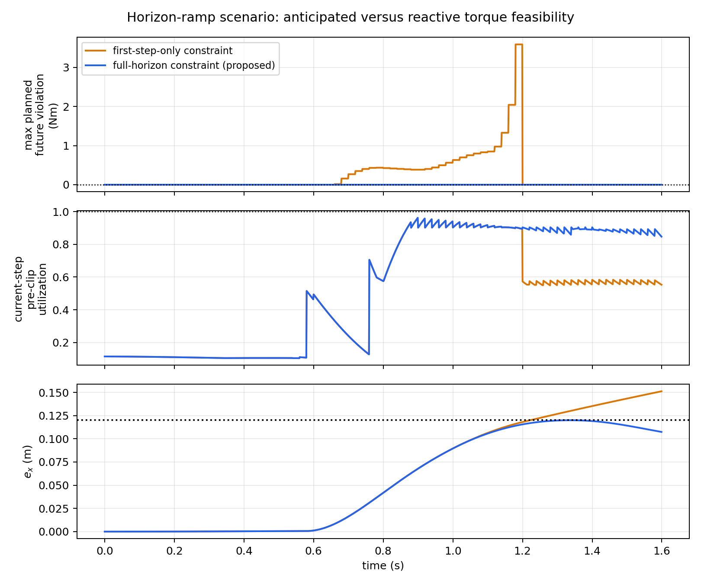
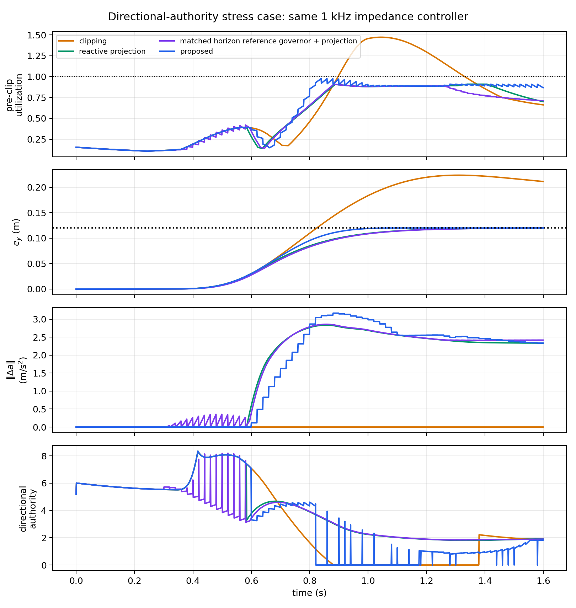
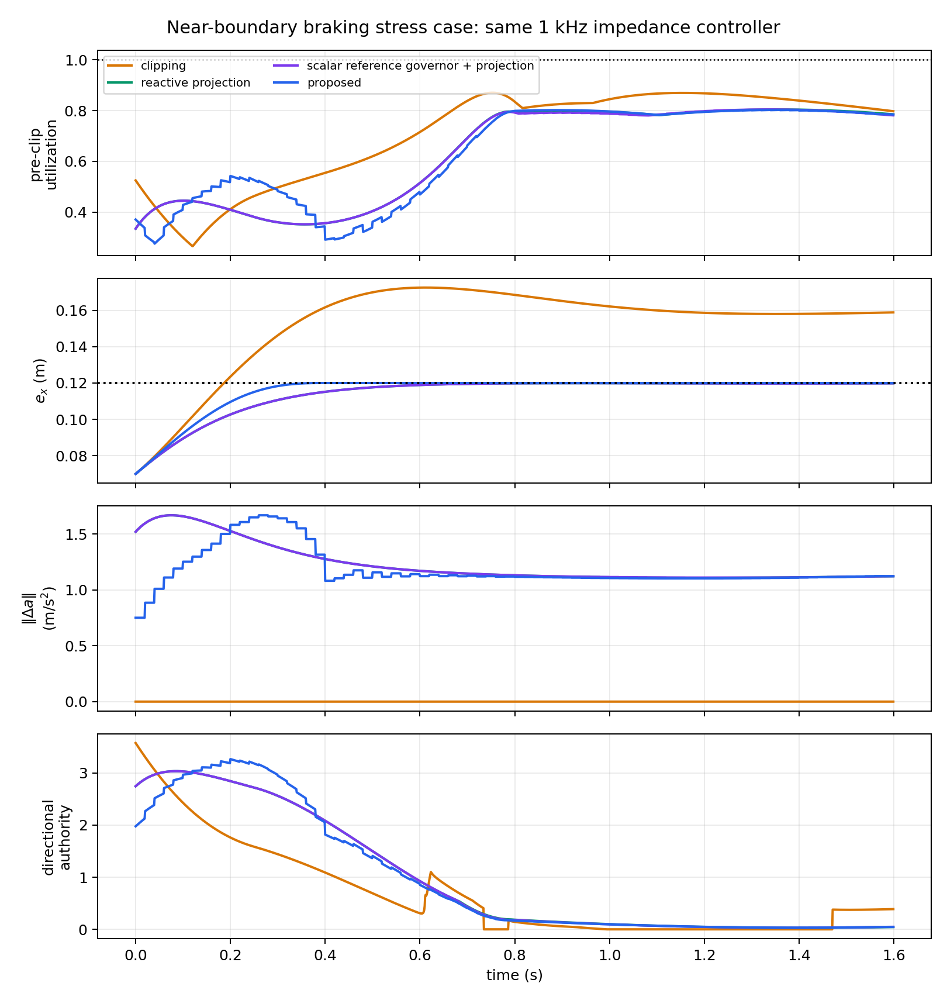
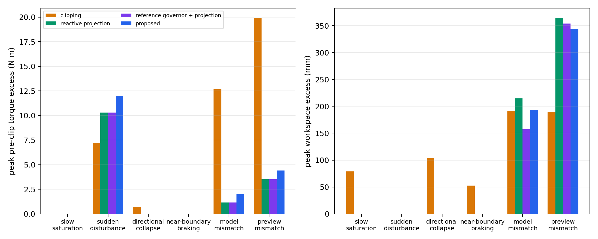
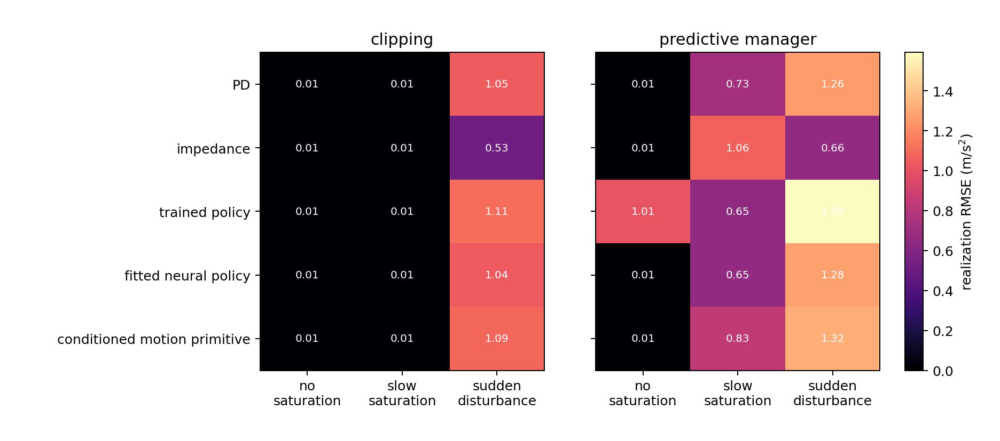
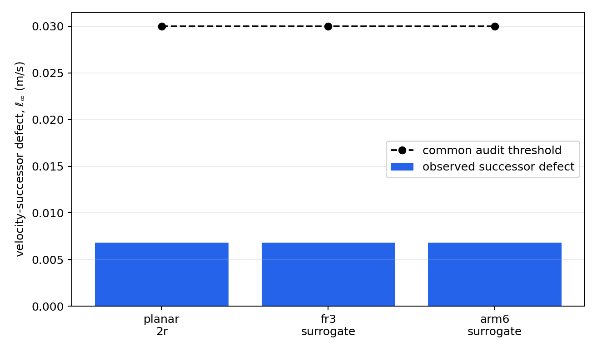
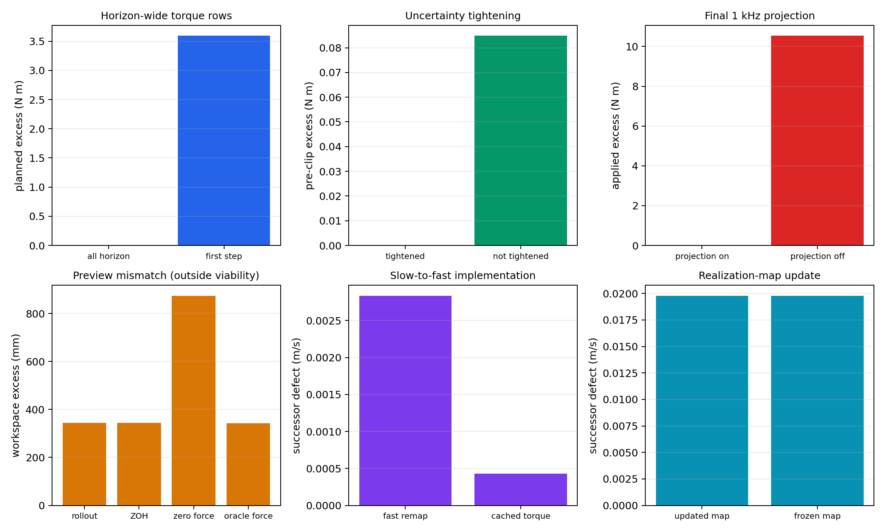

# Predictive Saturation Management with Conditional Certificate Transfer

**Anonymous submission**

## Abstract

When a fast robot controller asks for more torque than the actuators can deliver, clipping keeps the actuators legal but silently breaks the behavior it was designed for. This paper keeps the fast controller and adds a slower layer: the nominal controller --- PD, impedance, RL, neural, or conditioned --- runs unchanged at \(1~\mathrm{kHz}\), while a \(50~\mathrm{Hz}\) manager checks whether its request stays inside a robot-specific, uncertainty-tightened feasible set, applies a minimum-cost correction that keeps the predicted request inside that uncertainty-tightened realizability set, and reports directional-authority loss. A theorem gives conditions under which a velocity certificate transfers to a robot: the manager's torque prediction must be accurate, that prediction widened by its error bound must fit the actuator margin, and one-step velocity error must fit the certificate margin. A minimal instance of the certified action set and the tightened predicted-torque condition are enforced directly in the QP by construction; the realization-accuracy conditions remain robot-specific assumptions checked only by sampled audit. A deterministic benchmark matrix spans five controller interfaces, three realization maps, eight stress scenarios, and targeted ablations. Full-horizon enforcement removes a predicted \(3.587~\mathrm{Nm}\) future torque violation a first-step check misses; a cross-realization audit keeps all defects below \(0.0077~\mathrm{m/s}\) against a \(0.03~\mathrm{m/s}\) budget. It prevents violations under slow saturation, directional collapse, and near-boundary braking; disturbance and severe mismatch instead exceed the audit conditions. Only a velocity-restricted certificate is instantiated, not universal safety, a workspace-wide proof, or real-time performance.

**Index Terms—** physical interaction, actuator saturation, predictive constraint management, control refinement.

---

# I. Introduction

A fast controller computes a torque request \(\tau^0\) and the hardware applies

\[
\tau^{\mathrm{app}}
=
\operatorname{clip}\left(\tau^0,\ \tau_{\min},\ \tau_{\max}\right),
\]

that is, each joint's torque is pushed back to its nearest limit whenever the request exceeds it. The clip protects the actuator. It does not protect the behavior. Once the clip is active, the acceleration the robot produces is not the acceleration the controller asked for, so the robot is no longer running the PD, impedance, or learned law that was designed or trained. Nothing in the loop announces this. The controller keeps issuing requests, the actuators keep saturating, and the realized closed-loop dynamics silently drift away from the intended ones. In physical interaction this matters directly, because the requested acceleration is what sets apparent compliance and disturbance response.

Different controllers reach this state through different routes. A fixed-gain PD law gets there through a large tracking error. An impedance law \(M_d\ddot e=-K_de-D_d\dot e+F_h\) gets there through contact force, even when tracking error is small. A \(\tanh\)-squashed learned policy bounds its requested *acceleration*, but the torque that acceleration implies depends on the configuration, so a bound on the request is not a bound on the torque. An upstream language- or diffusion-conditioned module may propose a motion primitive with no representation of the executing robot's actuator limits at all. The route differs; the failure is the same.

Keep the fast controller. Add a slower layer that looks ahead.

> The nominal controller runs unchanged at \(1~\mathrm{kHz}\). A \(50~\mathrm{Hz}\) manager rolls it forward over a short horizon, predicts whether the torque it is about to request will leave the feasible set, and if so applies a minimum-cost correction to the *requested acceleration* that keeps the request realizable — before hard clipping is required.

The manager does not choose the task, does not replace the controller, and does not run at servo rate. Its only job is to keep the request physically producible while staying as close as possible to what the controller asked for. A final high-rate projection stays in place for disturbances that arrive between manager updates; prediction and last-resort protection are separate responsibilities, and Section VII shows they can be needed at different moments.

A one-step check answers "is the command legal right now?" That is not the same question as "will the controller be able to stay legal?" Position and velocity carry forward, so keeping a *future* step legal generally requires bending the acceleration *before* that step arrives. A constraint applied only to the currently applied command therefore permits a trajectory that walks into an infeasible future. Fig. 1 isolates exactly this: constraining every predicted move eliminates the planned torque excess in the horizon-ramp case, while constraining only the first move leaves a \(3.587~\mathrm{Nm}\) future violation and \(31.180~\mathrm{mm}\) of workspace excess. Anticipation is not a refinement of reactive limiting; it is a different constraint.

Feedback linearization to a double-integrator-like behavior model is classical [1], [2]. Reference governors, predictive safety filters, anti-windup control, and model-predictive constraint handling are established [3]–[7]. We claim none of them. The double integrator here is a convenient shared interface, not a contribution.

The question we do ask is this:

> How can future configuration-dependent loss of actuator realizability be anticipated without replacing the nominal interaction controller, and under what conditions does the resulting correction preserve a behavior-level certificate?

Anticipation is the primary problem; certificate transfer is the conditional, supporting result that tells us when the correction can be trusted. Answering the second half requires *preserving* the robot-specific geometry rather than hiding it: the behavior dynamics give a shared place to predict and certify, while the feasible set and the uncertainty bounds stay robot-specific. Section VI turns that split into three checkable conditions.

**Contributions.**

1. A two-rate architecture that retains an existing \(1~\mathrm{kHz}\) controller and uses slower MPC only to anticipate and correct loss of actuator realizability.
2. A robot-dependent feasible-acceleration set and a directional-authority indicator logged at every predictive update, exposing failures hidden by scalar torque utilization.
3. A conditional certificate-transfer theorem, stated as three checkable conditions, separating a reusable velocity-certified action set from robot-specific actuator and model-error tests, together with a minimal constructive instance of that set enforced directly inside the QP.
4. A reproducible 111-case simulation study (parameters in Appendix A, code released alongside this paper) covering controller substitution, a sampled cross-realization interface audit, horizon-wide constraints, uncertainty tightening, the final high-rate projection, the enforced velocity certificate, and failure outside the tested operating region.

The experiments are reduced-order and intentionally include negative cases. They establish the mechanism and its logical limits, not hardware-level universality.

**Three words, used consistently.**

- **Correction** — the change the manager makes to the requested acceleration, written \(\Delta a\). This is the action.
- **Authority** — how much acceleration remains available in a given direction, written \(\alpha^+\). This is a reported indicator, not a control action.
- **Refinement** — the condition (Section VI) under which the real robot's one-step behavior stays inside the model's predicted set. This is the proof-level name for what the correction is doing.

**Notation.** Everything in the paper uses the following symbols. All vector inequalities are componentwise (joint by joint).

| Symbol | Meaning in words | Units |
|---|---|---|
| \(\tau^0\) | torque the fast controller asks for | Nm |
| \(\tau^{\mathrm{pre}}\) | torque that would be sent *before* any clipping | Nm |
| \(\tau^{\mathrm{app}}\) | torque actually applied, after clipping | Nm |
| \(\hat\tau\) | the manager's *prediction* of \(\tau^{\mathrm{pre}}\) | Nm |
| \(\tau_{\min},\tau_{\max}\) | actuator limits | Nm |
| \(\tau_{\mathrm{base}}\) | torque already spoken for: gravity, Coriolis, orientation, null-space | Nm |
| \(r_\tau(x)\) | interface-consistency residual between \(\tau^0\) and \(a^0\) | Nm |
| \(a\) | requested task acceleration (the decision variable) | m/s² |
| \(a^{0}\) | acceleration the nominal controller asks for | m/s² |
| \(\Delta a=a-a^{0}\) | the correction the manager applies | m/s² |
| \(a_{-1}\) | acceleration actually published at the end of the previous manager update | m/s² |
| \(e,\dot e\) | task position and velocity error | m, m/s |
| \(z=[e;\dot e]\) | task-error state | — |
| \(\mathcal X\) | running workspace-and-speed box on \(z\) | — |
| \(H(x)\) | maps a requested acceleration to the torque it costs | Nm·s²/m |
| \(\mathcal A(x)\) | accelerations that are interface-realizable — legal through \(H(x)\) and \(\tau_{\mathrm{base}}(x)\) — at this configuration | m/s² |
| \(\mathcal A^{\mathrm{tight}}(x)\) | same set, shrunk by the uncertainty margin | m/s² |
| \(\bar\delta_\tau\) | how far the real torque can differ from the prediction | Nm |
| \(\alpha^{+}\) | remaining acceleration authority in a given direction | m/s² |
| \(\mu\) | fraction of the torque range still unused (0 = at the limit) | — |
| \(\mathcal S_v=\{y:\|y\|_\infty\le v_{\max}\}\) | the certified velocity region | — |
| \(\epsilon_v\) | certificate margin: the one-step velocity error the certificate tolerates | m/s |
| \(\mathcal K_v(y)\) | the certified action set: requests from \(y\) that stay inside \(\mathcal S_v\) after up to \(\epsilon_v\) of error | m/s² |
| \(N=12\) | prediction horizon length | steps |
| \(\Delta t=20~\mathrm{ms}\) | manager period | s |
| \(T_f=1~\mathrm{ms}\) | fast-loop period | s |

Two set operations appear in Section VI only, and both have a plain reading: \(\mathcal X\oplus\mathcal Y\) means "any point of \(\mathcal X\) plus any point of \(\mathcal Y\)" (worst case over both), and \(\mathcal X\subseteq\mathcal Y\) means "\(\mathcal X\) fits inside \(\mathcal Y\)."

---

# II. How the Method Works

This section walks through the loop once, before any of it is formalized.

**Fast loop, every \(T_f=1~\mathrm{ms}\), regardless of which controller is in use.** Evaluate the nominal controller to get \(\tau^0\). Add the latest correction published by the manager, converted to torque at the *current* configuration:
   \[
   \tau^{\mathrm{pre}}=\underbrace{\tau^0}_{\text{controller}}+\underbrace{H(x)\,\Delta a}_{\text{manager's correction}},
   \]
then apply the final high-rate projection, the last-resort guard,
   \[
   \tau^{\mathrm{app}}=\operatorname{clip}\left(\tau^{\mathrm{pre}},\ \tau_{\min},\ \tau_{\max}\right),
   \]
which is what is sent to the robot.

**Slow loop, every \(\Delta t=20~\mathrm{ms}\).** The manager publishes a correction in *acceleration*, not a cached torque; \(H(x)\) is recomputed every millisecond, so configuration drift between manager updates does not turn a stale plan into an artificial disturbance. Each update:

1. Roll the nominal controller forward \(N=12\) steps to get the requested accelerations \(a^0_0,\dots,a^0_{N-1}\) and the predicted states.
2. At each predicted state, build the set of accelerations the robot can actually realize, shrunk by the uncertainty margin.
3. Solve one small QP for the acceleration sequence closest to the nominal request that stays inside those sets, inside the workspace box, and inside the velocity-certificate set of Section VI.
4. Publish the first-step correction \(\Delta a\); log the margin and directional authority.

If the nominal rollout is already feasible everywhere, the QP returns the nominal request and the correction is zero — the manager is inactive during ordinary operation.

**Where the anticipation lives.** There is no separate "saturation detector." Along the nominal rollout the predicted torque is \(\hat\tau=\tau_{\mathrm{base}}+H a^{0}\); when that torque enters the tightened boundary layer at any step of the horizon, the corresponding constraint becomes active and the QP is forced to move. The tightening is what makes the constraint bite *early*; the forward propagation of position and velocity is what turns a future activation into a present correction.

---

# III. Related Work

Impedance control specifies a desired dynamic relation between motion and interaction force [1]; operational-space control maps task accelerations or wrenches to joint torque [2]. Both presuppose sufficient actuator authority. Direct clipping preserves torque bounds but changes the realized dynamics. Anti-windup methods address saturation-induced performance and stability degradation directly [6], [7], but are typically designed around a particular closed-loop controller and react to saturation rather than forecasting a configuration-dependent loss of task authority.

Model-reference adaptive impedance control asks the robot to reproduce a prescribed impedance model despite uncertain dynamics [11]. This is close to our behavior-coordinate viewpoint but does not by itself provide finite-horizon actuator-constraint management. We instead retain the fast interaction controller and alter its requested acceleration before clipping is predicted; the final projection is kept as a last-resort guard.

Reference and command governors modify a reference supplied to a pre-stabilized system so predicted constraints remain satisfied [3]. Predictive safety filters modify nominal actions using a predictive model and a recoverable terminal condition [5]. Robot-specific MPC can incorporate full nonlinear dynamics and actuator constraints directly. These establish that predictive constraint management is valuable; we do not claim otherwise.

Recent interaction-control work combines MPC with impedance adaptation. Roveda *et al.* optimize impedance setpoints and damping using learned interaction dynamics [12]; Haninger *et al.* jointly optimize trajectory and impedance with Gaussian-process task models [13]; Anand *et al.* place a learned Cartesian impedance model inside MPC to adapt variable-impedance parameters [14]; Xue *et al.* combine model-predictive variable impedance with environment estimation, passivity, and safety-oriented mode switching [15]. In all of these, impedance parameters or trajectories are optimization variables. Our manager treats the upstream controller as fixed and selects a physically realizable acceleration sequence close to its request.

This does not make the optimizer categorically distinct from a reference governor or predictive safety filter — either architecture could implement the manager. The contribution is the behavior–realization split and the sufficient transfer condition, not a new name for constrained MPC. Unlike predictive safety filters with a verified terminal safe set [16], the present implementation enforces finite-horizon state and actuator constraints but does not establish recursive feasibility.

Control barrier functions are a natural high-rate mechanism for state inequalities [4] and are useful as the final projection here, but an instantaneous constraint may act only after the state has reached a region where authority is already insufficient. Our predictive layer evaluates future feasibility over a horizon; the present implementation uses no terminal recoverability condition.

The theoretical lineage of Section VI is approximate simulation and control refinement [8], [9], where an interface maps an abstract input to a concrete one while bounding the resulting mismatch, and contract-based design [10], which separates a component's assumptions from its guarantees. We specialize that logic to actuator-limited robot realization: the mismatch is built from a tightened actuator set, a torque-prediction error bound, and a one-step model-error bound. That is what makes the transfer conditional and falsifiable rather than assumed.

---

# IV. What "Realizable" Means for a Given Robot

For a torque-controlled robot,

\[
M(q)\ddot q+h(q,\dot q)=\tau+J(q)^\top F_h,
\]

with \(M(q)\succ0\), \(h\) the modeled gravity/Coriolis/friction terms, and \(F_h\) the interaction wrench. Actuator limits are the box \(\tau_{\min}\le\tau\le\tau_{\max}\).

The architecture asks only three things of the fast controller: its **current command** \(\tau^0\); an optional **preview**, i.e. the ability to be evaluated along a predicted trajectory; and a **bound on how wrong that preview can be**. An analytic PD or impedance law can be evaluated along predicted states directly. A learned policy can be queried on predicted observations. If no validated preview exists, zero-order hold or a learned predictor may be used, but the resulting error must be included in the bound. A black-box controller with neither query access nor a bounded preview error lies outside the certificate.

With task-error state \(z=[e;\dot e]\), the requested behavior over a local operating region is

\[
\ddot e=a+d,
\]

*in words:* what the error actually does equals the requested acceleration plus a disturbance \(d\) that enters through the same channel (contact force, model error). Errors that do **not** enter through that channel — discretization, cross-coupling — are not absorbed here; they are carried explicitly as a one-step model error in Section VI.

Over one manager period this integrates to the constant-acceleration update

\[
e^{+}=e+\Delta t\,\dot e+\tfrac12(\Delta t)^2(a+d),
\qquad
\dot e^{+}=\dot e+\Delta t\,(a+d),
\]

which is the standard \(z^{+}=Az+B(a+d)\) double integrator. It is a shared interface, not a claimed novelty.

Realizing a requested acceleration \(a\) costs torque. Some torque is already spoken for — gravity, Coriolis, the orientation channel, null-space damping — and we collect all of it in \(\tau_{\mathrm{base}}(x)\). \(\tau_{\mathrm{base}}(x)\) and \(H(x)\) carry no explicit \(F_h\) term of their own; the interaction wrench enters the realized torque only if a controller's own request \(a\) is a function of \(F_h\) (e.g. the impedance law of Section I, \(a^0=M_d^{-1}(-K_de-D_d\dot e+F_h)\)), in which case \(H(x)a\) converts that already-\(F_h\)-dependent request to torque like any other. This is a separate bookkeeping question from the disturbance \(d\) of Eq. (IV's \(\ddot e=a+d\)) above, which instead measures how far the *realized* one-step acceleration departs from whatever \(a\) was requested — the two are not alternate places to put the same term. What remains is proportional to the request:

\[
\tau=\tau_{\mathrm{base}}(x)+H(x)\,a,
\qquad
H(x)=J(q)^\top\Lambda(q),
\quad
\Lambda=\left(JM^{-1}J^\top\right)^{-1}.
\]

We assume \(J(q)\) has full row rank throughout the verified operating region and that \(JM^{-1}J^\top\) is uniformly nonsingular there, \(\lambda_{\min}(JM^{-1}J^\top)\ge\underline\lambda>0\); configurations violating this condition lie outside the certificate. A damped operational-space inverse may be used in implementation near such configurations, but its acceleration-realization defect must then be folded into \(\bar\delta_\tau\) (torque domain) or the one-step model-error bound (velocity domain) rather than assumed away.

*In words:* \(H(x)\) is the price, in joint torque, of one unit of task acceleration at this configuration. A request is realizable only if that price fits in the remaining budget:

\[
\tau_{\min}\ \le\ \tau_{\mathrm{base}}(x)+H(x)\,a\ \le\ \tau_{\max}.
\tag{IV.1}
\]

Call the set of \(a\) satisfying (IV.1) the **feasible request set** \(\mathcal A(x)\). This is the object that cannot be made robot-independent: it moves with the configuration through both \(H(x)\) and \(\tau_{\mathrm{base}}(x)\), and removing that dependence would remove exactly the geometry that causes saturation.

**Interface consistency.** The fast loop applies \(\tau^{\mathrm{pre}}=\tau^0+H(x)\Delta a\) (Section II), while the manager predicts torque along a candidate request through \(\tau_{\mathrm{base}}(x)+H(x)a\) (above). These agree only if the controller's own command is the one its own acceleration request would produce through the same map, \(\tau^0=\tau_{\mathrm{base}}(x)+H(x)a^0\). In general a controller instead supplies

\[
\tau^0=\tau_{\mathrm{base}}(x)+H(x)a^0+r_\tau(x),
\qquad
|r_\tau(x)|\le\bar r_\tau,
\]

where \(r_\tau\) is an interface-consistency residual: whatever part of the controller's raw torque command is not attributable to its own stated acceleration request through \(H(x)\). This residual must be folded into \(\tau_{\mathrm{base}}(x)\) if it is a fixed, configuration-dependent offset the controller computes independently (for example, its own gravity compensation), covered by the tightening bound \(\bar\delta_\tau\) below if it is small and bounded, or else treated as an explicit interface violation that puts the controller outside the certificate. The five interfaces evaluated in Section VII are constructed to expose \(a^0\) directly, so \(r_\tau\equiv0\) for them by design; an opaque controller that only exposes raw torque is not automatically compatible without first verifying this residual is bounded.

Condition (IV.1) is a set of parallel slabs in \(a\), one pair per joint, so \(\mathcal A(x)\) is already a polytope in acceleration space. A complementary picture asks the same question in reverse: the set of accelerations the robot can produce with *some* legal torque is the forward image of the torque box, a **zonotope** \(\mathcal Z(x)\) — a centered box stretched and skewed by the robot's Jacobian and inertia. \(\mathcal Z(x)\) coincides with \(\mathcal A(x)\) exactly when the torque-to-acceleration map has no null-space or secondary-torque allocation choice to make; in general it is a geometric reinterpretation of the same feasibility question, not a literally identical set, and only \(\mathcal A(x)\) (via its tightened form below) is what the optimizer actually uses.

Two practical consequences follow, and only these are used later.

- **It is not a ball.** Authority is direction-dependent. The robot can have plenty of torque left overall and still be nearly unable to accelerate along one particular direction.
- **It is cheap to probe.** Directional authority is evaluated directly from the half-space representation of \(\mathcal A^{\mathrm{tight}}(x)\), as defined in Section V.B; no vertex enumeration is required.

The manager predicts \(\hat\tau\); the torque that would actually be sent, \(\tau^{\mathrm{pre}}\), differs from it. Suppose that difference is bounded joint by joint:

\[
\left|\tau^{\mathrm{pre}}-\hat\tau\right|\ \le\ \bar\delta_\tau.
\tag{IV.2}
\]

Then it is not enough for the *prediction* to sit inside the box; the prediction plus its error must. So the manager enforces the **tightened** condition

\[
\tau_{\min}+\bar\delta_\tau\ \le\ \hat\tau\ \le\ \tau_{\max}-\bar\delta_\tau,
\tag{IV.3}
\]

and we write \(\mathcal A^{\mathrm{tight}}(x)\) for the accelerations satisfying it. Equation (IV.3) is the whole tightening mechanism: a boundary layer of width \(\bar\delta_\tau\) inside each actuator limit. It is what makes the constraint act *before* the physical limit rather than at it, and Section VII.E shows what happens when it is removed.

The bound \(\bar\delta_\tau\) must cover state-estimation error, interpolation between manager updates, secondary torque, torque-rate limiting, and any other implementation effect that can move the pre-clip torque.

**Problem statement.** Given a nominal controller supplying \(a^{0}\), find a correction \(\Delta a\) such that:

1. \(a=a^{0}+\Delta a\) stays close to the nominal request;
2. the realized torque stays inside the actuator box over the horizon, allowing for uncertainty;
3. the predicted state satisfies running workspace and speed constraints; and
4. the result can be tested against sufficient conditions for transferring an independently established behavior certificate.

---

# V. The Predictive Correction and What the Manager Reports

## A. The predictive correction

The nominal controller, the map \(H(x)\), the rate limiter, and the final projection run every \(1~\mathrm{ms}\); the manager runs every \(20~\mathrm{ms}\). Within one manager update we write \(a_i\) for the request at horizon step \(i=0,\dots,N-1\) and \(a^0_i\) for what the nominal controller would ask there; the manager-update index is suppressed since everything below lives inside a single update. At \(i=0\), \(a_{-1}\) denotes the acceleration actually published at the end of the *previous* manager update — the real cross-update value, not that update's uncorrected nominal — so the rate constraint and smoothing term below bound genuine step-to-step change.

The decision variable is the *complete* request \(a_i\), not the correction — the constraints are physical conditions on the actual request, and the correction is read off afterwards:

\[
\begin{aligned}
\min_{a_0,\dots,a_{N-1}}\quad
&\sum_{i=0}^{N-1}
\Big(
\underbrace{\|a_i-a^0_i\|^2_{W}}_{\text{stay close to the controller}}
+\underbrace{\|a_i-a_{i-1}\|^2_{W_\Delta}}_{\text{stay smooth}}
\Big)\\[2pt]
\text{subject to, for each }i:\quad
& e_{i+1}=e_i+\Delta t\,\dot e_i+\tfrac12(\Delta t)^2a_i,
\qquad
\dot e_{i+1}=\dot e_i+\Delta t\,a_i,
&&\text{(prediction)}\\
& \tau_{\min}+\bar\delta_\tau\le\tau_{\mathrm{base}}(\hat x_i)+H(\hat x_i)\,a_i\le\tau_{\max}-\bar\delta_\tau,
&&\text{(realizable)}\\
& |\dot e_i+\Delta t\,a_i|\le v_{\max}-\epsilon_v,
&&\text{(velocity certificate)}\\
& z_{i+1}\in\mathcal X,
&&\text{(workspace/speed)}\\
& \|a_i\|_\infty\le a_{\max},
\quad
\|a_i-a_{i-1}\|_\infty\le\dot a_{\max}\Delta t.
&&\text{(actuation rate)}
\end{aligned}
\]

Every constraint is linear in \(a_i\) and the cost is convex quadratic, so this is a small dense QP. Here \(\hat x_i\) is the state on the fixed nominal rollout used to assemble it, and \(\mathcal X=\{z:|e|\le\mathrm{pos}_{\max},\,|\dot e|\le v_{\max}\}\) is the running workspace-and-speed box on the task-error state \(z=[e;\dot e]\). The velocity-certificate row is the set \(\mathcal K_v\) of Section VI, written out: it replaces the ordinary predicted-speed bound \(v_{\max}\) inside \(\mathcal X\) with the tighter \(v_{\max}-\epsilon_v\) for one manager step ahead. State, acceleration, certificate, and rate bounds are all hard; there are no slack variables and no separately constructed terminal invariant set.

The published correction is the first-step gap:

\[
\Delta a=a_0-a^0_0.
\]

**Interpretation.** Before solving, the manager checks the nominal rollout \(a^0_0,\dots,a^0_{N-1}\) against every constraint above. If it already satisfies all of them, that rollout is returned unchanged and \(\Delta a=0\) — the smoothing term never gets a chance to perturb an already-feasible request. The QP is solved only when this check fails, and then \(\Delta a\) is the minimum-cost adjustment that pulls the request back onto the boundary of the feasible set: the cost jointly penalizes deviation from the nominal behavior and variation of the corrected request, so the result is minimal with respect to that composite quadratic objective, not to either term alone, and accounts for the whole horizon rather than the current step alone. This explicit bypass matters: an earlier version of this manager instead let the QP run unconditionally, and its smoothing term would nudge an already-feasible request slightly, triggering intervention (and the reported warning lead) a little early. The numbers in Section VII already reflect the bypass.

The QP is assembled *along the nominal rollout*: \(H\) and \(\tau_{\mathrm{base}}\) are evaluated at predicted nominal states, which keeps each realizable-set constraint a fixed set of linear inequalities and the program convex. The price is direct: if the rollout is wrong — whether from preview mismatch or simply because the QP's own correction moves the trajectory away from the nominal one — the feasible geometry is built at the wrong configurations, and the true future torque \(\tau_{\mathrm{base}}(x_i^\star)+H(x_i^\star)a_i\) can differ from what the constraint checked, \(\tau_{\mathrm{base}}(\hat x_i^0)+H(\hat x_i^0)a_i\). This is a torque-domain error, so it belongs to \(\bar\delta_\tau\) and condition (T1) of Section VI, not to the velocity-domain certificate margin \(\epsilon_v\) of condition (T3) — the two bounds are not interchangeable. No explicit bound on this geometry-drift term is constructed here; it is one of the effects \(\bar\delta_\tau\) is required to cover (Section IV), checked only empirically through T1 in the experiments (Section VII), most visibly in the preview-mismatch failure of Section VII.B. The horizon constraint should accordingly be read as certifying torque feasibility along the frozen nominal realization geometry, not as an unconditional guarantee at the states the correction actually produces.

If the solver reports infeasibility, the implementation projects the first nominal acceleration onto the current tightened torque and one-step state polytope and tiles that reactive command over the stored sequence; if that instantaneous polytope is empty, it returns zero acceleration. The final high-rate projection remains active either way. This fallback gives a deterministic bounded command but does **not** recover horizon feasibility and does **not** satisfy the transfer conditions — trajectories containing fallback steps must not be read as horizon-MPC behavior.

## B. What the manager reports

For each joint, the fraction of its torque range still unused; the reported margin is the worst joint:

\[
\mu=\min_j\ \min\left\{
\frac{\tau_{\max,j}-\tau_j}{\tau_{\max,j}-\tau_{\min,j}},\ \
\frac{\tau_j-\tau_{\min,j}}{\tau_{\max,j}-\tau_{\min,j}}
\right\}.
\]

So \(\mu>0\) means every joint is strictly inside its limits, \(\mu=0\) means some joint is exactly at a limit, and \(\mu<0\) means the request is not realizable. Over the horizon we report the smallest value.

Scalar margin does not reveal whether the robot can still accelerate *in the direction it needs to*. Given a *feasible* current acceleration \(a_c\in\mathcal A^{\mathrm{tight}}(x)\) and a unit direction \(y\), the remaining authority along \(y\) is how far one can move before leaving the tightened feasible set — not the untightened set \(\mathcal Z(x)\) of Section IV, so the indicator counts the same uncertainty margin the optimizer already enforces:

\[
\alpha^{+}(x,a_c,y)=\max\left\{\alpha\ge0:\ a_c+\alpha y\in\mathcal A^{\mathrm{tight}}(x)\right\}.
\]

\(\mathcal A^{\mathrm{tight}}(x)\) is a polytope defined by one tightened slab per actuator, \(\{a:l_j\le h_j(x)^\top a\le u_j\}\), where \(h_j(x)^\top\) is the \(j\)-th row of \(H(x)\). For a robot with more actuators than task dimensions this need not coincide with \(\mathcal Z(x)\) — the two are the same set only when the torque-to-acceleration map has no null-space or secondary-torque allocation choice to make, as noted in Section IV — and \(\mathcal A^{\mathrm{tight}}(x)\) need not itself be an affine image of a box. Neither property is required for \(\alpha^+\): it is still a closed-form evaluation and not a search, directly from the halfspace form \(\{v:Av\le b\}\) of \(\mathcal A^{\mathrm{tight}}(x)\), which any polytope in this representation admits: \(\alpha^{+}=\min_{j:(Ay)_j>0}(b_j-(Aa_c)_j)/(Ay)_j\), the point where the ray from \(a_c\) along \(y\) first leaves the set. If the current request is already outside \(\mathcal A^{\mathrm{tight}}(x)\), the manager reports \(\alpha^{+}=0\) by convention rather than apply this formula, which is meaningful only from a feasible starting point. A small \(\alpha^{+}\) is **directional authority collapse**: the robot may retain plenty of unused torque overall and still be unable to resist a push along \(y\). This is the failure a single utilization number hides.

The manager also reports whether its horizon problem is feasible. This is a useful recoverability diagnostic, but it is **not** membership in a certified viability kernel, because no terminal invariant set or backup policy is constructed. Section VII therefore uses the term *near-boundary braking stress case* rather than *point of no return*.

---

# VI. Conditional Certificate Transfer

Sections IV–VI describe one robot. This section asks what survives when the robot changes.

## A. The setup in words

Suppose someone has already proved something about the *behavior* — for instance, that velocity never leaves a set \(\mathcal S_v\), provided each step's request comes from some *acceptable* set of actions rather than one fixed policy, and the one-step model error stays within a margin \(\epsilon_v\). Call that the **certificate**. It says nothing about any particular robot, and it deliberately does not pin down a single control law: different robots, or the same robot at different moments, may need to pick different members of that acceptable set, and that is not a failure of the certificate — it is why the set is the reusable object, not any one policy built on top of it.

Now put a real robot underneath. Three things can go wrong:

1. the manager's torque prediction \(\hat\tau\) may be wrong;
2. the resulting torque may not fit in the actuator box, so clipping activates and the robot stops doing what was requested;
3. even without clipping, the real robot's one-step velocity may differ from the double-integrator prediction by more than the certificate tolerates.

Theorem 1 says: rule out all three, for whatever request the manager actually picked from the acceptable set, and the certificate carries over unchanged.

## B. The certified action set, and why velocity only

Let \(y=\dot e\) be the task velocity and \(F_v(y,a)=y+\Delta t\,a\) its one-step update (the velocity half of the double integrator in Section IV). Define the certified region

\[
\mathcal S_v=\{y:\|y\|_\infty\le v_{\max}\},
\qquad
\mathcal E_v=\{d:\|d\|_\infty\le\epsilon_v\},
\]

and, at every \(y\in\mathcal S_v\), the **certified action set**

\[
\mathcal K_v(y)=\left\{a:\|F_v(y,a)\|_\infty\le v_{\max}-\epsilon_v\right\}.
\]

*In words:* \(\mathcal K_v(y)\) is every request that keeps next step's velocity inside the certified region even after absorbing a one-step model error of size up to \(\epsilon_v\). Position is deliberately left out of the certificate — it stays a plain running constraint in \(\mathcal X\) — because velocity is the only quantity this benchmark actually measures and audits a one-step mismatch for (Section VII.D); tightening position too would not be backed by a measured quantity.

\(\mathcal K_v\) is never empty on \(\mathcal S_v\): decelerating at the actuator limit removes \(\epsilon_v\) of speed using an acceleration of only \(\epsilon_v/\Delta t=1.5~\mathrm{m/s^2}\), well under the \(12~\mathrm{m/s^2}\) bound, so a legal request back into the tighter band always exists, including when several velocity components sit on the boundary at once. This is nonemptiness of \(\mathcal K_v(y)\) alone, in the abstract velocity model; its intersection with the robot-specific tightened torque set \(\mathcal A^{\mathrm{tight}}(x)\) and the rate and state constraints may still be empty, which is exactly what the reactive fallback of Section V.A exists to handle, and does happen in the experiments of Section VII.

## C. The theorem

Write \(\Pi(x)=y=\dot e\) for the map from the physical state to the task velocity the certificate is stated in, and let \(f^d(x,\tau,F_h)\) denote the one-step physical dynamics: the state the robot actually reaches, one manager period later, after applying torque \(\tau\) under wrench \(F_h\) from state \(x\).

**Theorem 1 (One-step conditional velocity-certificate transfer).**
Suppose the physical state \(x\) lies in a verified operating region, \(\Pi(x)\in\mathcal S_v\), and the request \(a\) satisfies \(a\in\mathcal K_v(\Pi(x))\) — any such \(a\), not one distinguished policy. If:

**(T1) Prediction accuracy.** The torque that would be sent is within the stated bound of the manager's prediction,
\[
\left|\tau^{\mathrm{pre}}-\hat\tau\right|\le\bar\delta_\tau.
\]

**(T2) Actuator-margin test.** The prediction, widened by that bound, still fits inside the actuator box,
\[
\tau_{\min}+\bar\delta_\tau\ \le\ \hat\tau\ \le\ \tau_{\max}-\bar\delta_\tau .
\]

**(T3) Certificate-margin test.** The one-step velocity mismatch between the real robot and the double-integrator prediction fits inside the certificate margin,
\[
\left\|\Pi\!\left(f^d(x,\tau^{\mathrm{pre}},F_h)\right)-F_v\!\left(\Pi(x),a\right)\right\|_\infty\ \le\ \epsilon_v .
\]

then clipping does not activate during the considered transition, \(\tau^{\mathrm{app}}=\tau^{\mathrm{pre}}\), and the physical successor stays in the certified region,

\[
\Pi\!\left(f^d(x,\tau^{\mathrm{app}},F_h)\right)\in\mathcal S_v .
\]

**Proof.** (T1) and (T2) together give \(\tau_{\min}\le\tau^{\mathrm{pre}}\le\tau_{\max}\), so the clip is inactive and the applied torque equals the requested one. (T3) places the real one-step successor inside \(F_v(\Pi(x),a)\oplus\mathcal E_v\), which lies in \(\mathcal S_v\) directly from the definition of \(\mathcal K_v\) — no separate assumption about which policy generated \(a\) is needed. \(\square\)

**Reading it.** (T2) is an *actuator* test — is there room for the uncertainty? (T3) is a *certificate* test — is the model good enough? (T1) is what links the manager's arithmetic to the physical torque. The two tests are independent: a robot can have ample torque margin but a poor model, or an excellent model and no torque left.

**Remark (minimal constructive instantiation).** The QP of Section V.A enforces \(a_i\in\mathcal A^{\mathrm{tight}}(\hat x_i)\cap\mathcal K_v(\dot e_i)\) directly, so a feasible solution satisfies both by construction rather than by a check applied afterward. \(\mathcal K_v\) is deliberately the simplest nonempty instance of a certified action set — chosen to show the transfer condition can be enforced inside a linear QP without a general nonlinear-programming solver, not offered as the most informative certificate for this problem. The margin \(\epsilon_v=0.03~\mathrm{m/s}\) is the same number used, retrospectively, as the audit threshold in Section VII.D; that is a deliberate choice tying the prospectively enforced bound to the number the experiments already check, not a general requirement of the theorem.

**Remark (general set form).** Stating (T1)–(T3) with sets rather than norms — \(\tau^{\mathrm{pre}}\in\hat\tau\oplus\mathcal D_\tau\), \(\hat\tau\oplus\mathcal D_\tau\subseteq\mathcal T\) (the actuator box \(\tau_{\min}\le\tau\le\tau_{\max}\)), and \(\mathcal D_v\subseteq\mathcal E_v\) — gives the same result with possibly less conservatism, and is the form in which the approximate-simulation literature [8], [9] writes such conditions. The norm version above is what the experiments check. A fuller certificate could similarly cover position, not only velocity: a box-shaped position region keeps the membership test linear, exactly like the velocity row already in the QP (Section V.A), since the position update is itself affine in \(a\); a curved region — ellipsoidal or otherwise coupling position and velocity — would instead require a quadratic or general nonlinear membership test. Either way, that generalization is future work, not something this benchmark constructs or claims.

**Repeated application and the region-persistence clause.** Theorem 1 is a one-step statement. If its hypotheses hold again at the next update, and the one after that, then by induction the velocity stays in \(\mathcal S_v\) across all of them — this is what a receding-horizon controller does, solve once, apply one step, solve again — but that repetition is not recursive feasibility or a terminal-invariance guarantee: it only says the *same* one-step argument keeps working, not that it always will. The assumption that the state remains in that verified operating region is likewise an explicit conditional, not a consequence of the implemented finite-horizon QP. A recursively feasible terminal set or certified backup policy would be one way to discharge it. Without such a construction, Theorem 1 certifies the behavior only while the trajectory stays inside the verified operating region and only for as many steps as its hypotheses are re-checked.

## D. What actually transfers

The theorem does not make feasibility universal. For each new robot one must still supply \(\Pi\), \(\hat\tau\), the bound \(\bar\delta_\tau\), the mismatch bound, and the operating region itself. What transfers unchanged is the certificate itself — the behavior model, the certified action set \(\mathcal K_v\), the set \(\mathcal S_v\), and the margin \(\epsilon_v\).

Condition (T3) can be decomposed into the individual error sources, which is how it is checked in practice:

\[
\underbrace{\bar\eta_{\mathrm{disc}}}_{\text{discretization}}
+\underbrace{\bar\eta_{\mathrm{hold}}}_{\text{zero-order hold}}
+\underbrace{\bar\eta_{\mathrm{sec}}}_{\text{secondary channels}}
+\underbrace{L_F\bar\delta_F}_{\text{force-model error}}
+\underbrace{L_\tau\bar\delta_\tau}_{\text{torque error}}
\ \le\ \epsilon_v ,
\]

where \(L_F\) and \(L_\tau\) convert a force-model error and a torque error into the resulting one-step velocity error.

## E. If clipping does occur

If (T2) fails, the applied torque is the clipped one and the requested acceleration is not realized. The gap is

\[
\tau^{\mathrm{app}}-\tau^{\mathrm{pre}}
=\operatorname{clip}(\tau^{\mathrm{pre}})-\tau^{\mathrm{pre}},
\]

which perturbs the one-step successor by at most \(L_\tau\) times its size. Transfer can then hold only if the *enlarged* mismatch — the original one plus this clipping term — still fits inside \(\epsilon_v\). The experiments use the cleaner no-clipping branch. Once the request leaves the tightened set, the final projection protects the actuator but no longer implies preservation of the requested behavior.

---

# VII. Experiments

## A. Protocol

The benchmark is deterministic and uses a two-dimensional interaction task. The fast controller and final projection run at \(1~\mathrm{kHz}\); the manager runs at \(50~\mathrm{Hz}\) with horizon \(N=12\). Three configuration-dependent realization maps are evaluated: a planar 2R map, an FR3-inspired surrogate, and a six-axis-arm surrogate. The latter two reproduce different actuator geometries and limits but are not manufacturer-accurate rigid-body models.

The behavior model, predictive objective, and audit threshold \(\epsilon_{\mathrm{audit}}=0.03~\mathrm{m/s}\) are held fixed throughout. This scalar is both the design radius \(\epsilon_v\) of Section VI prospectively enforced inside the QP and the numerical threshold used to check the observed one-step velocity mismatch retrospectively, so it appears twice for two different reasons: once as a constraint, once as an audit. The simulation constructs and enforces the velocity certificate \((\mathcal S_v,\mathcal K_v,\epsilon_v)\); it does not construct a position-aware or workspace-wide certificate, nor prove the operating region is left invariant indefinitely.

The five fast-controller interfaces are PD, impedance, a small policy trained by deterministic evolution strategy, a fixed-feature neural policy fitted to impedance demonstrations, and a conditioned motion primitive executed by a PD servo. The last two test the command/preview interface only; they are not evidence of semantic AI safety or of improved policy quality.

The 111 cases comprise 40 scenario cases, 30 controller-interface cases, 24 cross-realization cases, and 17 ablations grouped into eight families. The 40 scenario cases are eight scenarios evaluated with five channels: four architectures — direct clipping, a reactive \(1~\mathrm{kHz}\) projection, a scalar reference governor followed by the same reactive projection, and the proposed horizon-wide correction with final projection — plus one nominal diagnostic without torque projection. The stress scenarios are no saturation, slow saturation, sudden disturbance, directional authority collapse, near-boundary braking, model mismatch, preview mismatch, and a horizon-ramp scenario reported directly as Fig. 1 and used for the constraint-width ablation of Section VII.E. A ninth scenario, starting inside \(\mathcal S_v\) near its tightened boundary, is used only for the velocity-certificate ablation and enters neither the scenario nor the cross-realization matrices.

Reported quantities are pre-clip torque excess, applied torque excess, workspace excess, behavior-realization RMSE, warning lead time, directional authority, observed one-step mismatch, and computation time. For a two-dimensional residual \(r_k\), RMSE is the pooled component-wise value \(\sqrt{\frac{1}{2K}\sum_k\|r_k\|_2^2}\). The mismatch in Table III is instead a maximum vector norm and is not directly comparable with it. Applied torque remains inside its box whenever the final projection is active; zero pre-clip excess is one sampled check of condition (T2), not proof of the certificate premise.

## B. Anticipatory saturation management

{width=85%}

Fig. 1 is the clearest direct evidence for why anticipation is a different constraint from reactive limiting, not a refinement of it, and is reported here as a main result rather than only as the ablation of Section VII.E. The scenario steps a goal at \(t=0.58~\mathrm{s}\) and then shrinks the actuator budget at \(t=0.76~\mathrm{s}\), so a command that is safe when issued becomes unsafe before it is executed. The top panel plots the manager's own predicted maximum future torque violation across the horizon: for the full-horizon constraint (blue) it stays at exactly zero throughout, while for the first-step-only constraint (orange) it is already positive by \(t\approx0.68~\mathrm{s}\), \(0.08~\mathrm{s}\) before the budget actually drops at \(t=0.76~\mathrm{s}\). That \(0.08~\mathrm{s}\) is the genuine lead: with \(N=12\) and \(\Delta t=20~\mathrm{ms}\) a single solve looks at most \(N\Delta t=0.24~\mathrm{s}\) ahead, so it cannot and does not see the event half a second in advance. What follows \(t\approx0.76~\mathrm{s}\) is not further foresight but the *consequence* playing out: with no horizon constraint bending the request early, the first-step-only variant's rollout violation keeps compounding step by step as the trajectory drifts, reaching \(3.587~\mathrm{Nm}\) by \(t\approx1.18~\mathrm{s}\) — the gap between detection and this peak measures how long the uncorrected drift takes to fully develop, not how far ahead the manager could see. The middle panel shows the two variants tracking the same, unremarkable current-step pre-clip utilization (well below the actuator limit, dotted line at 1.0) until the budget actually drops and the trajectories diverge; neither curve reaches the limit in the plotted window, so no clipping occurs at the current step for either variant — the failure the top panel exposes is a future-step infeasibility that a first-step check is structurally blind to, not a present clip it fails to catch. The bottom panel shows the consequence: the first-step-only trajectory overshoots the position limit and keeps drifting outward (\(31.180~\mathrm{mm}\) of workspace excess), while the full-horizon trajectory turns back at the boundary.

{width=70%}

Fig. 2 shows the directional-authority stress case. Direct clipping exceeds both the feasible request set and the workspace bound. The predictive methods intervene earlier, and the vector correction preserves the workspace constraint while leaving a visible intervention residual.

{width=70%}

Fig. 3 shows near-boundary braking: an outward velocity close to the position boundary under a shrinking torque budget. Direct clipping overshoots the boundary and settles outside it. The reactive projection, scalar reference governor plus projection, and proposed manager all arrest the position at the boundary. Because no viability kernel or terminal invariant set is computed, this supports finite-horizon constraint handling only.

{width=95%}

Fig. 4 summarizes method-level trends and Table I reports clipping and proposed results. Unlike the horizon-ramp scenario of Fig. 1, none of these seven remaining main scenarios is built to isolate the anticipation mechanism specifically, which is why the lead-time differences below are modest — that isolated demonstration is the job of Fig. 1, not of this table. The manager preserves the no-saturation behavior and prevents workspace violations under slow saturation, directional collapse, and near-boundary braking, with warning preceding the limiting event by \(0.412\), \(0.339\), and \(0.566~\mathrm{s}\). The reactive projection and scalar reference governor plus projection also satisfy the sampled constraints in these three cases; their warning leads are \(0.419\) and \(0.395~\mathrm{s}\) for slow saturation and \(0.340\) and \(0.306~\mathrm{s}\) for directional collapse. Because the manager now only intervenes once the nominal rollout actually violates a constraint (Section V.A), this lead time falls *between* the two baselines rather than exceeding both, and the remaining differences across all three methods are at most a few tens of milliseconds. Warnings themselves can only land on the \(\Delta t=20~\mathrm{ms}\) manager grid, and no single horizon solve looks past \(N\Delta t=0.24~\mathrm{s}\) (Section VII.B); differences of a handful of milliseconds are well inside that resolution floor, so they should be read as noise around the grid, not as a ranking of anticipation quality — this is a descriptive comparison against the implemented *scalar* governor, not evidence of superiority over directional or vector reference governors. In near-boundary braking all three warn at approximately \(0.57~\mathrm{s}\).

| Scenario | Pre-clip C/P (Nm) | Workspace C/P (mm) | Lead (s) | QP feasible | Audit |
|---|---:|---:|---:|---:|---:|
| No saturation | 0.000 / 0.000 | 0.000 / 0.000 | -- | 100% | Yes |
| Slow saturation | 0.000 / 0.000 | 78.970 / 0.001 | 0.412 | 100% | Yes |
| Sudden disturbance | 7.208 / 11.976 | 0.000 / 0.000 | 0.084 | 92.5% | No |
| Directional collapse | 0.693 / 0.000 | 103.914 / 0.003 | 0.339 | 100% | Yes |
| Near-boundary braking | 0.000 / 0.000 | 52.537 / 0.011 | 0.566 | 100% | Yes |
| Model mismatch | 12.665 / 1.981 | 190.434 / 193.598 | 0.558 | 45.0% | No |
| Preview mismatch | 19.917 / 4.409 | 190.191 / 344.116 | 0.170 | 40.0% | No |

Table I. Scenario results. C/P denotes clipping/proposed.

QP feasibility is the fraction of \(50~\mathrm{Hz}\) updates whose horizon problem is feasible. It is 100% in the four successful stress cases but only \(74/80\), \(36/80\), and \(32/80\) updates under sudden disturbance, model mismatch, and preview mismatch — fallback fractions of \(7.5\%\), \(55\%\), and \(60\%\), with two, one, and one switches between the two modes. Infeasible updates use the reactive fallback of Section V.A, which does not enforce the velocity certificate, so those "proposed" trajectories are not horizon-MPC behavior throughout and QP feasibility is a mode statistic rather than a certificate-valid fraction. In the first two of these cases, the peak pre-clip torque excess (\(11.976\) and \(1.981~\mathrm{Nm}\)) occurs only during fallback; preview mismatch has \(0.085~\mathrm{Nm}\) excess while the horizon problem is feasible and \(4.409~\mathrm{Nm}\) during fallback, and the peak workspace excess in both mismatch cases likewise occurs during fallback.

**The negative cases are results, not omissions.** Under preview mismatch the correction acts on a force forecast that misses a sign change inside the horizon, and workspace excess rises from \(190.191~\mathrm{mm}\) under clipping to \(344.116~\mathrm{mm}\) — the proposed method is substantially *worse* than doing nothing. Under model mismatch it is slightly worse as well, \(193.598\) versus \(190.434~\mathrm{mm}\). This is the expected consequence of Section V.A: the feasible geometry is assembled along a wrong rollout, so the correction is computed against the wrong set and steers the state further out. The audit rejects both cases, which is precisely what it is for — the anticipatory correction is not trustworthy there, and the check says so rather than the method degrading silently.

**Sudden disturbance shows why the slow layer cannot stand alone.** The wrench changes with no advance information while the implemented preview holds the measured wrench constant over the horizon, so the correction can be misaligned with a short impulse and pre-clip excess rises from \(7.208\) to \(11.976~\mathrm{Nm}\). The final projection keeps the applied command inside its box, but the pre-clip request is infeasible and the observed mismatch exceeds \(\epsilon_{\mathrm{audit}}\). These are operating conditions in which Theorem 1 cannot be invoked.

## C. Controller-interface substitution

{width=95%}

As shown in Fig. 5, the manager formulation and weights are unchanged across interfaces. Under no saturation, correction RMSE is below \(0.01~\mathrm{m/s^2}\) for four of five controllers. The small evolution-strategy policy is the exception at \(\approx1.01~\mathrm{m/s^2}\): its limited training set does not cover the test trajectory symmetrically and it retains a positive-\(y\) command bias. This is an observed generalization error, not a specific failure of the evolution-strategy algorithm. The manager holds the state inside the workspace box but is compensating for a biased interface rather than remaining inactive. The case is kept as an interface stress test — the architecture is not intended to repair behavior-policy quality, though its running constraints may incidentally reject a biased request.

**Reading Table II correctly.** Under slow saturation, realization RMSE is nearly equal to correction RMSE for every proposed case (\(0.732\) versus \(0.726~\mathrm{m/s^2}\) for PD). The reported residual is therefore almost entirely the manager's *deliberate* intervention, not unmodeled tracking error. Clipping shows a smaller realization RMSE only because it follows the nominal request instead of enforcing the workspace constraint; in the impedance case that apparent fidelity comes with \(78.970~\mathrm{mm}\) of workspace violation, against \(0.001~\mathrm{mm}\) for the proposed manager. All five proposed cases pass the audit. These results demonstrate substitution at the command/preview interface; they do not certify an arbitrary learned policy whose preview error is unbounded.

| Interface | Realization RMSE (\(\mathrm{m/s^2}\)) | Correction RMSE (\(\mathrm{m/s^2}\)) | Lead (s) | Excess (mm) |
|---|---:|---:|---:|---:|
| PD | 0.732 | 0.726 | 0.371 | 0.001 |
| Impedance | 1.064 | 1.060 | 0.412 | 0.001 |
| Trained policy | 0.652 | 0.652 | 1.207 | 0.016 |
| Fitted neural policy | 0.655 | 0.649 | 0.356 | 0.001 |
| Conditioned motion primitive | 0.835 | 0.830 | 0.359 | 0.006 |

Table II. Controller substitution under slow saturation.

## D. Sampled interface audit across realization maps

{width=88%}

The behavior model, predictive objective, and \(0.03~\mathrm{m/s}\) audit threshold are unchanged across the three realization maps; only \(\hat\tau\), the actuator box, and the observed torque- and mismatch checks change. Every observed mismatch is below \(0.0077~\mathrm{m/s}\), leaving more than \(0.0223~\mathrm{m/s}\) of the audit allowance unused.

| Realization map | Max. observed (m/s) | Unused audit (m/s) | Min. bound slack (Nm) |
|---|---:|---:|---:|
| Planar 2R | 0.007456 | 0.022544 | 0.002523 |
| FR3-inspired surrogate | 0.007696 | 0.022304 | \(8.66\times10^{-6}\) |
| Six-axis-arm surrogate | 0.007696 | 0.022304 | \(9.96\times10^{-5}\) |

Table III. Sampled cross-realization interface audit.

**The two slacks are different quantities, and the tight one is the last column.** The last column is *not* remaining actuator authority; it is the smallest observed slack in condition (T1), i.e. \(\bar\delta_\tau-|\tau^{\mathrm{pre}}-\hat\tau|\) at its worst joint. For the cross-realization cases the per-joint bound is

\[
\bar\delta_\tau^{(j)}
=\underbrace{0.03}_{\text{Nm, base-torque term}}
+\ 0.008\sum_{k}\max\!\left(\left|H_0\right|_{jk},\,0.25~\mathrm{Nm\,s^2/m}\right)\left|a_k-\frac{F_{h,k}}{m}\right|,
\]

where \(H_0=H(x_0)\) is \(H(x)\) evaluated once at the robot's home configuration (not the \((0,0)\) matrix entry), the floor \(0.25~\mathrm{Nm\,s^2/m}\) is applied elementwise to \(|H_0|\) before summing, and the sum runs over all task-acceleration components \(k\) for each joint \(j\) — a matrix–vector product, \(\bar\delta_\tau=b+0.008\max(|H_0|,0.25)\,|a-F_h/m|\) with \(b=0.03\cdot\mathbf 1\), not an independent per-joint scalar rule. This ranges from \(0.0300\) to \(0.0926~\mathrm{Nm}\) over the audit. The near-zero FR3 and six-axis slacks mean the deterministic injected errors nearly attain their envelopes; they do **not** mean the tightening is zero. The minimum planned actuator margins — the slack in condition (T2) — are \(0.233\), \(0.679\), and \(0.741~\mathrm{Nm}\) for the planar, FR3-inspired, and six-axis maps. So (T1) containment is the numerically tight check here, while (T2) actuator authority is not binding on these sampled trajectories; the comfortable \(0.0223~\mathrm{m/s}\) of unused audit allowance describes the non-binding side. Because the injected errors are constructed from the same envelopes, this is a consistency audit rather than independent validation of \(\bar\delta_\tau\). This construction also has a visible consequence in Table III: the FR3-inspired and six-axis surrogates report bit-identical max. observed mismatch (\(0.007696~\mathrm{m/s}\)) and unused audit (\(0.022304~\mathrm{m/s}\)) despite different joint counts and torque limits. Two structurally different maps producing the same observed number to six figures is itself evidence that the observed value is dominated by the shared, map-independent injected-error envelope rather than by anything map-specific — a further reason to read this table as a consistency check on the checking mechanism, not as evidence the mechanism discriminates between realization maps.

This is a sampled-trajectory interface audit — not independent uncertainty validation, not an analytic whole-workspace proof, and not an experimental proof of invariance. It shows only that the same numerical threshold and checking mechanism apply across multiple robot-specific maps, and that the velocity certificate constructed in Section VI is nonvacuous under all three. A full certificate-transfer experiment would additionally require independently identified uncertainty bounds verified over a continuous workspace, not only along these sampled trajectories.

## E. Ablations and computation

{width=95%}

**Horizon width.** Fig. 1 already reports this comparison directly: constraining every predicted move eliminates planned torque excess in the horizon-ramp case, while constraining only the first move preserves the currently applied command but leaves a \(3.587~\mathrm{Nm}\) future violation and \(31.180~\mathrm{mm}\) workspace excess. This ablation isolates the same mechanism numerically — it is the direct verification of the anticipation argument from Section I.

**Tightening.** Removing the \(\bar\delta_\tau\) boundary layer creates \(0.0848~\mathrm{Nm}\) pre-clip excess. The final projection hides that excess at the applied channel but does not restore condition (T2).

**Final projection.** Disabling it under sudden disturbance produces \(10.538~\mathrm{Nm}\) applied excess, confirming that prediction and high-rate protection have distinct responsibilities.

**Rate smoothing.** Removing the smooth-request term from the objective leaves correction RMSE under slow saturation numerically unchanged (\(1.0603~\mathrm{m/s^2}\) without it versus \(1.0604~\mathrm{m/s^2}\) with it). With the bypass of Section V.A already confining intervention to genuinely infeasible steps, the smoothing term's only remaining job is to shape the solution during those already-required interventions, and this gradually ramping scenario does not exercise that distinction; a more abrupt correction might.

**The velocity certificate, isolated.** The eight scenarios above never come close enough to the tightened velocity bound to exercise \(\mathcal K_v\) — consistent with the \(0.0223~\mathrm{m/s}\) of unused audit allowance in Section VII.D. The ninth, dedicated scenario starts at \(v_0=0.565~\mathrm{m/s}\), just inside the tightened bound \(v_{\max}-\epsilon_v=0.570~\mathrm{m/s}\), with an outward command that keeps pulling further. With \(\mathcal K_v\) enforced, peak speed stays at \(0.5678~\mathrm{m/s}\); with it removed, the same trajectory reaches \(0.5968~\mathrm{m/s}\), toward the untightened \(0.600~\mathrm{m/s}\) limit. Both stay inside \(\mathcal S_v\) — the point is not an unconstrained blow-up, but that the certificate visibly reserves the \(0.03~\mathrm{m/s}\) margin it is supposed to reserve, exactly when the scenario is built to make it matter.

**Non-results, reported as such.** Zero-force preview increases workspace excess from \(344.116\) to \(873.921~\mathrm{mm}\), but no preview option restores viability in the severe mismatch case. In this reduced-order model, recomputing the fast map does not outperform cached torque, and updating it is numerically indistinguishable from freezing it. Benefits from these mechanisms remain to be demonstrated on nonlinear rigid-body systems.

**Rate is not the fix for sudden disturbance.** Raising the manager rate from \(50\) to \(100~\mathrm{Hz}\) would shorten the interval over which an obsolete correction is held, but it would not predict an unannounced wrench change or repair an incorrect force model. Addressing that limitation needs both timing and information improvements — event-triggered re-solving, bounded disturbance observers, or preview uncertainty propagated into the horizon — while retaining the \(1~\mathrm{kHz}\) final projection.

**Computation.** In the frozen final run the manager's median-of-run-medians is \(1.817~\mathrm{ms}\) with worst observed maximum \(13.649~\mathrm{ms}\), below its \(20~\mathrm{ms}\) period. The fast path has median-of-run-medians \(124.8~\mu\mathrm{s}\) but worst observed maximum \(6.194~\mathrm{ms}\), exceeding its \(1~\mathrm{ms}\) nominal period on this run. This scheduling outlier's severity varies across regenerated runs and is characteristic of the non-real-time Python implementation; these measurements establish typical throughput, not hard real-time execution. This overrun is not a purely cosmetic timing statistic: the sudden-disturbance limitation of Section VII.B rests on the \(1~\mathrm{kHz}\) final projection reliably catching events between manager updates, and a fast-path stall of \(6.194~\mathrm{ms}\) is a multi-cycle hole in exactly that guard. Whether these scheduling outliers coincide with the injected disturbance events specifically has not been checked here — doing so would need per-step timing correlated against the disturbance timeline, which the current logs do not retain — so the sudden-disturbance failure mode should conservatively be read as bounded by both an information gap (Section VII.E, "rate is not the fix") and unquantified scheduling variance, not by the information gap alone.

---

# VIII. Discussion

The experiments support a narrower conclusion than "one safety controller works for every robot." The predictive optimization statement and the empirical audit threshold remain unchanged across the implemented controller interfaces and realization maps. Physical feasibility does not transfer automatically: each robot must reconstruct and verify its feasible set and its error bounds.

This also clarifies the relation to a reference governor or predictive safety filter. Those architectures can adopt the same behavior coordinates. What the separation adds is an explicit proof boundary — a reusable behavior certificate on one side, a checkable robot-specific realization contract on the other. In the present study the velocity certificate \((\mathcal S_v,\mathcal K_v,\epsilon_v)\) is concretely constructed and enforced, but the physical containment it also requires — that the real one-step mismatch actually stays inside \(\epsilon_v\) — is only sampled along experiment trajectories, not independently identified over the workspace. If torque uncertainty exceeds the available margin, or an observed mismatch exceeds \(\epsilon_{\mathrm{audit}}\), the audit rejects the case. That rejection is evidence of a failed sampled check, not a workspace-wide proof.

The final high-rate projection is essential but should not be confused with behavior preservation. It enforces the actuator box after an unexpected disturbance, whereas Theorem 1 states when clipping remains inactive for a given transition — whenever (T1)–(T3) are re-established at the corresponding update — and the requested closed-loop behavior is actually realized. The mismatch experiments show these two properties diverging.

For model-based physical AI, the architecture provides a runtime boundary between behavior generation and physical realization: learned, diffusion-based, or language-conditioned modules may propose behavior while the realization model evaluates what the current robot can execute. This contract does not certify the semantics or intent of an AI-generated command; it certifies only the modeled physical refinement inside the verified operating region.

**Limitations.**

1. The robot substitutions are reduced-order actuator-geometry surrogates, not full rigid-body or hardware systems.
2. Reported errors are observations along experiment trajectories, not certified bounds over a continuous workspace.
3. Only the abstract side of Theorem 1's premise is concretely instantiated: \(\mathcal S_v\), \(\mathcal K_v\), and \(\epsilon_v\) are constructed and enforced for velocity alone, in one 2-D reduced-order model. The physical containment that robust invariance also requires — that the real one-step mismatch actually stays inside \(\epsilon_v\) everywhere, not just along these sampled trajectories — is not established; "audit threshold" and "observed mismatch" are therefore kept distinct from the theoretical margin.
4. The benchmark omits orientation, redundant null-space tasks, sensor delay, contact transitions, state-estimation uncertainty, and human-participant validation.
5. The reference-governor baseline includes a reactive projection and is an architecture-level comparator, not a reproduction of every established governor design. Its scalar command parameterization is especially restrictive in the directional-collapse case; a directional or vector reference governor would be expected to narrow the reported lead-time difference.
6. Every reported case is a single deterministic trajectory per scenario, controller, and realization map. The study does not sweep disturbance magnitude, timing, or sensor noise, so reported margins are point estimates rather than statistically characterized safety margins.
7. The theorem's region-persistence clause and recursive feasibility are the same unresolved gap at two levels. Discharging that assumption and defining a certified point of no return require a formally constructed terminal invariant set or backup policy; finite-horizon running constraints alone do not imply global recoverability.

---

# IX. Conclusion

This paper introduced a predictive realization architecture for actuator-limited fast robot controllers. The nominal controller stays at \(1~\mathrm{kHz}\); a slower MPC layer forecasts robot-specific loss of realizability and modifies the requested acceleration before clipping is required. The separation does not make actuator feasibility universal. It identifies which object may be reused — a certified action set stated in behavior coordinates — and which must be verified again — the realization map, the actuator margin, the uncertainty bounds, and the operating region. A minimal, deliberately simple instance of that certified action set is enforced inside the QP itself, so the theorem's key hypothesis holds by construction rather than by a check applied afterward; it is an existence witness for that kind of enforcement, not the definitive form the certificate should take.

Across 111 deterministic reduced-order cases, full-horizon correction detects a future violation missed by a first-step constraint and accepts five nominal-controller interfaces. A sampled interface audit applies the same mismatch threshold across three realization maps. Slow saturation, directional authority collapse, and near-boundary braking violations are prevented within the tested region. Abrupt disturbance and severe mismatch expose cases where the audit fails, the QP frequently becomes infeasible, and only the reactive fallback plus final projection remain. A dedicated ablation confirms the certified action set changes the manager's output when it binds, while leaving the eight main stress scenarios unaffected — consistent with the certificate margin going largely unused in those cases.

Future work will replace the surrogate maps with full rigid-body systems, certify uncertainty bounds over continuous workspaces, construct terminal invariant sets, and evaluate the architecture in a real-time hardware loop. Within the present model, two gaps remain open even on the reduced-order benchmark: the QP holds each \(a_i\) fixed for the full \(\Delta t\) it labels, so it does not bound the intra-step drift of the fast controller's own re-evaluated request — what the sudden-disturbance failure mode exposes, not a lack of force compensation; and \(\mathcal K_v\) itself covers only the one-step velocity block, not position, and was built for one 2-D reduced-order model rather than derived from a workspace-wide invariance proof. These steps are necessary before claiming hardware-level certificate transfer or interaction safety.

---

# Appendix A: Benchmark Parameters

This appendix lists the constants needed to reproduce the numbers in Section VII; the full realization-map functions \(H(x)\), \(\tau_{\mathrm{base}}(x)\), the learned-policy weights, the per-scenario timelines, and the 17-ablation ledger are in the released simulation code, not reproduced here in full.

**Shared constants** (`BenchmarkConfig`, `simulation/saturation_benchmark.py`): fast period \(T_f=1~\mathrm{ms}\), manager period \(\Delta t=20~\mathrm{ms}\), horizon \(N=12\), episode duration \(1.6~\mathrm{s}\), workspace box \(\mathrm{pos}_{\max}=0.12~\mathrm{m}\), speed box \(v_{\max}=0.60~\mathrm{m/s}\), acceleration bound \(a_{\max}=12.0~\mathrm{m/s^2}\), acceleration rate bound \(\dot a_{\max}=120.0~\mathrm{m/s^2/s}\), certificate/audit margin \(\epsilon_v=\epsilon_{\mathrm{audit}}=0.03~\mathrm{m/s}\), cost weights \(W=1.0\cdot I\), \(W_\Delta=0.025\cdot I\), OSQP tolerance \(10^{-5}\).

**Realization maps** (torque limits in Nm, mass in kg): planar 2R — 2 joints, limits \([9.0,7.5]\), mass \(2.2\); FR3-inspired surrogate — 7 joints, limits \([16.0,13.0,12.0,15.0,6.0,6.0,4.5]\), mass \(3.0\); six-axis-arm surrogate — 6 joints, limits \([12.0,10.0,9.0,8.5,5.5,4.5]\), mass \(2.6\). The interaction-error bound \(\bar\delta_\tau\) uses base term \(0.03~\mathrm{Nm}\) per joint and the \(H\)-dependent term of Section VII.D, with \(H_0=H(x)\) evaluated once at each map's zero-state configuration.

**Baseline architectures.** Reactive \(1~\mathrm{kHz}\) projection: exact Euclidean projection onto the intersection of the current-step tightened torque halfspaces and a relative-degree-two box control-barrier-function halfspace set with decay rate \(\lambda=8\) (`reactive_state_halfspaces`), i.e. position rows \(\mp a\le\pm2\lambda v+\lambda^2(\mathrm{pos}_{\max}\mp p)\) and speed rows \(\mp a\le\lambda(v_{\max}\mp v)\). Scalar reference governor: at each manager tick, finds the largest scalar \(\alpha\in[0,1]\) such that following \(\alpha\) of the way from the current state toward the goal keeps the resulting request inside the same tightened torque and state halfspaces (`governor_scale`), then hands the \(\alpha\)-scaled request to the same reactive projection above — so the governor differs from plain reactive projection only in using a single scalar authority over the whole request rather than an independent per-direction one.

**Controller interfaces.** PD and impedance are closed-form analytic laws. The trained policy is a small \(\tanh\)-squashed single-hidden-layer network fit by a deterministic evolution strategy. The fitted neural policy is an 18-unit \(\tanh\) hidden layer with a linear output head, least-squares fit to impedance-law demonstrations (`saturation_benchmark.py`, `RLPolicyController`/neural-controller fit). The conditioned motion primitive is a PD servo tracking a primitive-conditioned reference.

The complete configuration — including the ablation-family definitions, scenario force/goal timelines, and the deterministic RNG seeds — is fixed in `simulation/saturation_benchmark.py` and `simulation/run_all_experiments.py`, whose output (`results/all_experiment_metrics.json`) is checked into the same repository as this paper and was diffed against a clean regeneration to confirm determinism.

---

# References

[1] N. Hogan, "Impedance Control: An Approach to Manipulation—Part I: Theory," *Journal of Dynamic Systems, Measurement, and Control*, vol. 107, no. 1, pp. 1–7, 1985, doi: 10.1115/1.3140702.

[2] O. Khatib, "A Unified Approach for Motion and Force Control of Robot Manipulators: The Operational Space Formulation," *IEEE Journal on Robotics and Automation*, vol. 3, no. 1, pp. 43–53, 1987, doi: 10.1109/JRA.1987.1087068.

[3] E. Garone, S. Di Cairano, and I. Kolmanovsky, "Reference and Command Governors for Systems with Constraints: A Survey on Theory and Applications," *Automatica*, vol. 75, pp. 306–328, 2017, doi: 10.1016/j.automatica.2016.08.013.

[4] A. D. Ames, S. Coogan, M. Egerstedt, G. Notomista, K. Sreenath, and P. Tabuada, "Control Barrier Functions: Theory and Applications," in *Proceedings of the European Control Conference*, pp. 3420–3431, 2019, doi: 10.23919/ECC.2019.8796030.

[5] K. P. Wabersich and M. N. Zeilinger, "Linear Model Predictive Safety Certification for Learning-Based Control," in *Proceedings of the IEEE Conference on Decision and Control*, 2018.

[6] Y.-Y. Cao, Z. Lin, and D. G. Ward, "An Anti-Windup Approach to Enlarging Domain of Attraction for Linear Systems Subject to Actuator Saturation," *IEEE Transactions on Automatic Control*, vol. 47, no. 1, pp. 140–145, 2002, doi: 10.1109/9.981734.

[7] Y.-Y. Cao, Z. Lin, and D. G. Ward, "Anti-Windup Design of Output Tracking Systems Subject to Actuator Saturation and Constant Disturbances," *Automatica*, vol. 40, no. 7, pp. 1221–1228, 2004, doi: 10.1016/j.automatica.2004.02.012.

[8] A. Girard and G. J. Pappas, "Approximation Metrics for Discrete and Continuous Systems," *IEEE Transactions on Automatic Control*, vol. 52, no. 5, pp. 782–798, 2007.

[9] A. Girard and G. J. Pappas, "Hierarchical Control System Design Using Approximate Simulation," *Automatica*, vol. 45, no. 2, pp. 566–571, 2009.

[10] P. Nuzzo, J. B. Finn, A. Iannopollo, and A. Sangiovanni-Vincentelli, "Contract-Based Design of Control Protocols for Safety-Critical Cyber-Physical Systems," in *Proceedings of the Design, Automation and Test in Europe Conference and Exhibition*, 2014.

[11] M. Sharifi, H. Salarieh, S. Behzadipour, and M. Tavakoli, "Nonlinear Model Reference Adaptive Impedance Control for Human–Robot Interactions," *Control Engineering Practice*, vol. 32, pp. 9–27, 2014, doi: 10.1016/j.conengprac.2014.07.001.

[12] L. Roveda, A. Testa, A. A. Shahid, F. Braghin, and D. Piga, "Q-Learning-Based Model Predictive Variable Impedance Control for Physical Human–Robot Collaboration," *Artificial Intelligence*, vol. 312, art. 103771, 2022, doi: 10.1016/j.artint.2022.103771.

[13] K. Haninger, C. Hegeler, and L. Peternel, "Model Predictive Impedance Control with Gaussian Processes for Human and Environment Interaction," *Robotics and Autonomous Systems*, vol. 165, art. 104431, 2023, doi: 10.1016/j.robot.2023.104431.

[14] A. S. Anand, J. T. Gravdahl, and F. J. Abu-Dakka, "Model-Based Variable Impedance Learning Control for Robotic Manipulation," *Robotics and Autonomous Systems*, vol. 170, art. 104531, 2023, doi: 10.1016/j.robot.2023.104531.

[15] J. Xue, W. Liang, Y. Wu, and T. H. Lee, "Model Predictive Variable Impedance Control Towards Safe Robotic Interaction in Unknown Disturbance-Rich Environments," *Robotics and Autonomous Systems*, vol. 189, art. 104961, 2025, doi: 10.1016/j.robot.2025.104961.

[16] K. P. Wabersich and M. N. Zeilinger, "A Predictive Safety Filter for Learning-Based Control of Constrained Nonlinear Dynamical Systems," *Automatica*, vol. 129, art. 109597, 2021, doi: 10.1016/j.automatica.2021.109597.
